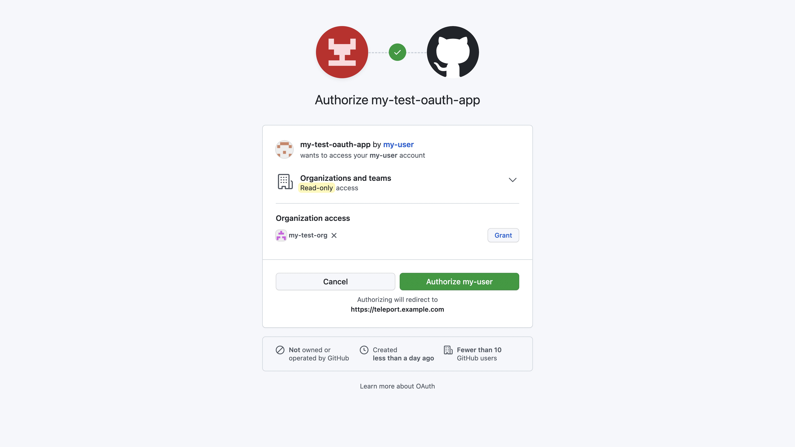

Use `tsh git ls` to view a list of GitHub organizations you have access to:
```code
$ tsh git ls
Type   Organization  Username Protocols  URL
------ ------------- -------- ---------- --------------------------------
GitHub my-github-org my-user  SSH, HTTPS https://github.com/my-github-org
```

Teleport requires your GitHub identity to impersonate you. If you haven't
provided it yet, run the following command:
```code
$ tsh git login
  If browser window does not open automatically, open it by clicking on the link:
   http://127.0.0.1:55555/some-id
  Logged in as GitHub user "my-user".

  You can now use Git over SSH:
    tsh git clone git@github.com:my-github-org/<repo>.git

  You can now use Git over HTTPS:
    tsh git clone https://github.com/my-github-org/<repo>.git

  You can now use the GitHub CLI:
    tsh gh -- api /user
```

This command opens a browser, prompting you to authenticate with GitHub via the
OAuth app:


To clone a repository using SSH:
```code
$ tsh git clone git@github.com:my-github-org/my-repo.git
```

To clone a repository using HTTPS:
```code
$ tsh git clone https://github.com/my-github-org/my-repo.git
```

To use the GitHub CLI through Teleport:
```code
$ tsh gh -- api /user
$ tsh gh -- issue list -R my-github-org/my-repo
$ tsh gh -- pr create -R my-github-org/my-repo --title "My PR" --body "Description"
```

To configure an existing Git repository with Teleport, go to the repository and
run:
```code
$ tsh git config update
```

Once the repo is cloned or configured, you can use `git` commands as normal:
```code
$ cd my-repo
$ git fetch
```

To revoke your stored GitHub credentials:
```code
$ tsh git logout
```

This removes your local git certificate and optionally revokes the stored
GitHub credentials on the Teleport server. You will need to run `tsh git login`
again to re-authorize.

<Admonition type="note">
The GitHub OAuth flow and Git repository configuration are one-time setups and
don't need to be repeated. If your Teleport session expires, `tsh` will prompt
you to re-login to Teleport, but your GitHub credentials remain valid.
</Admonition>
