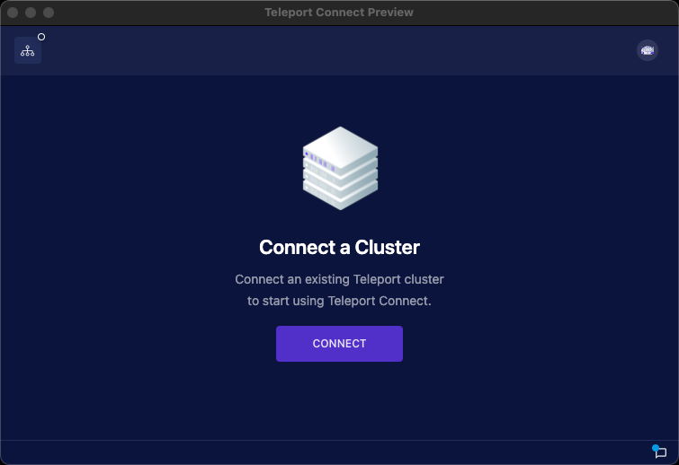
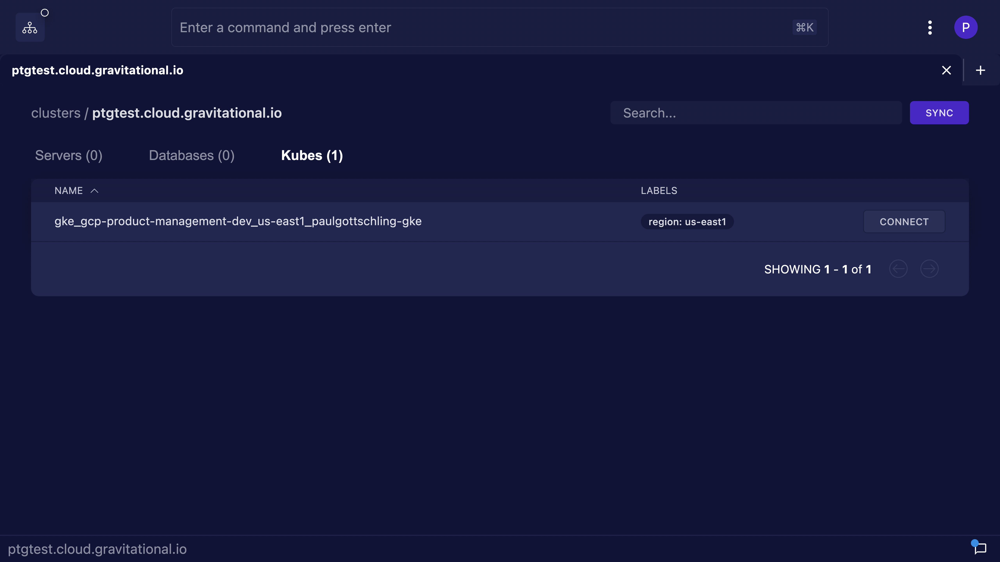
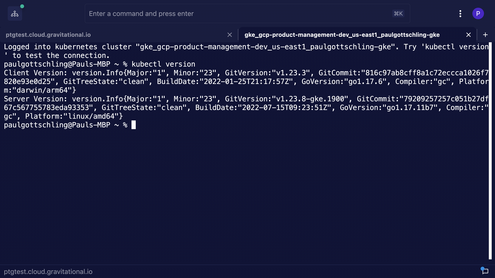
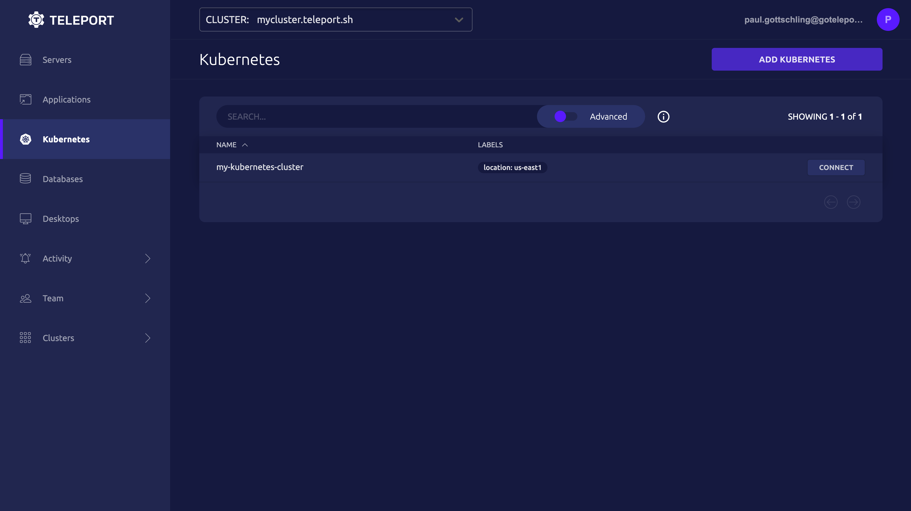
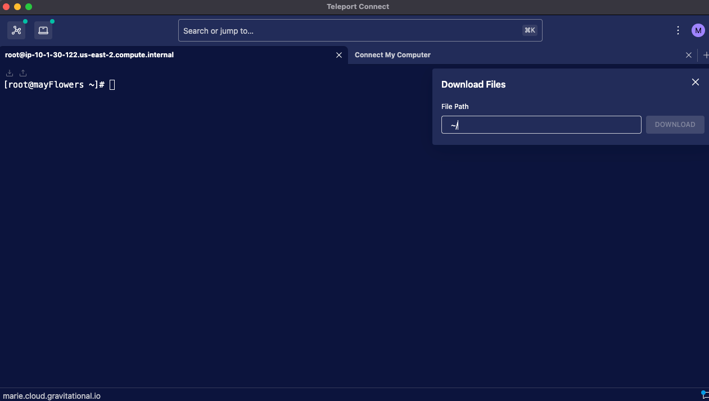
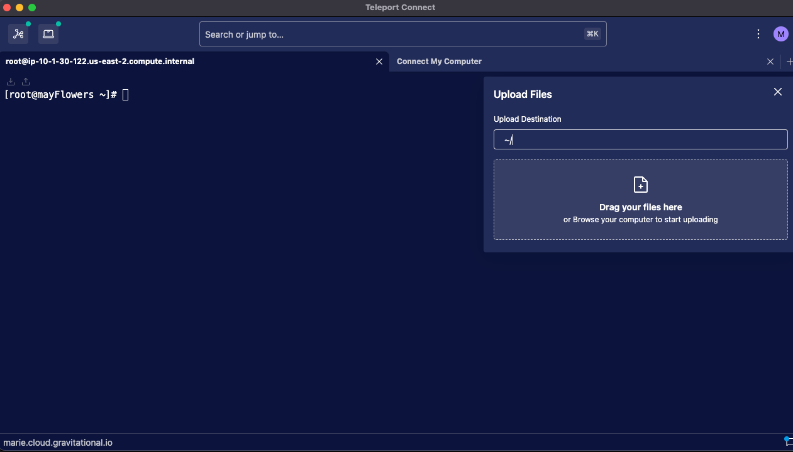
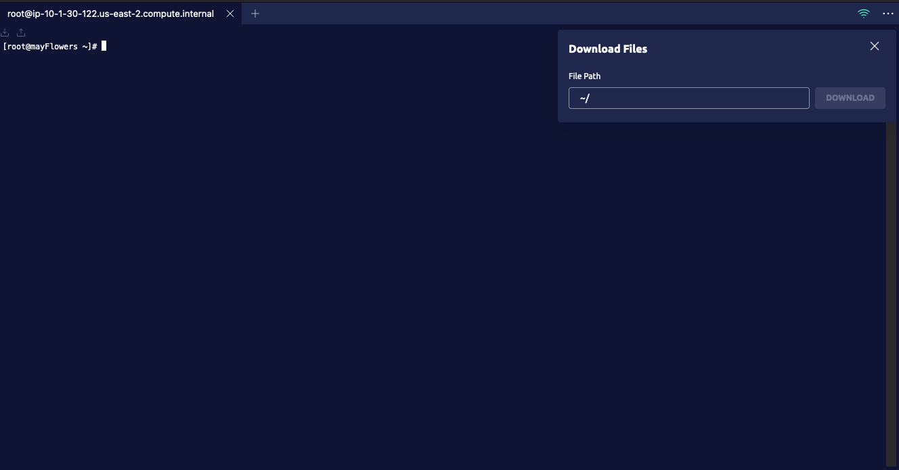
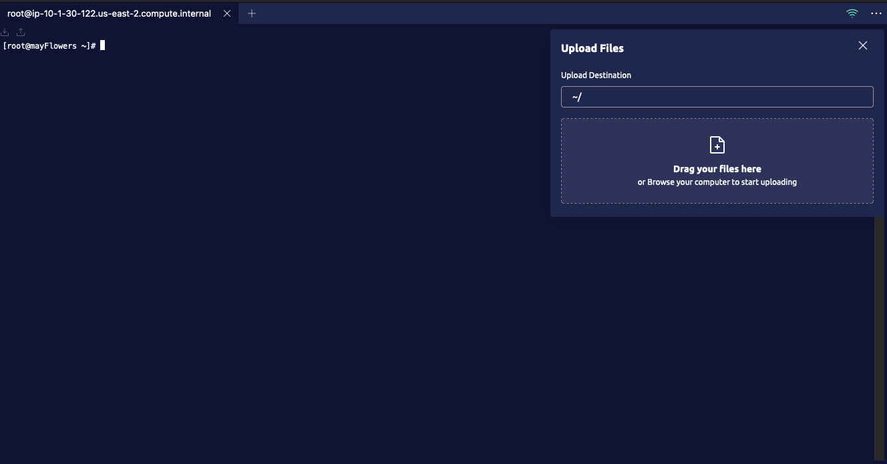
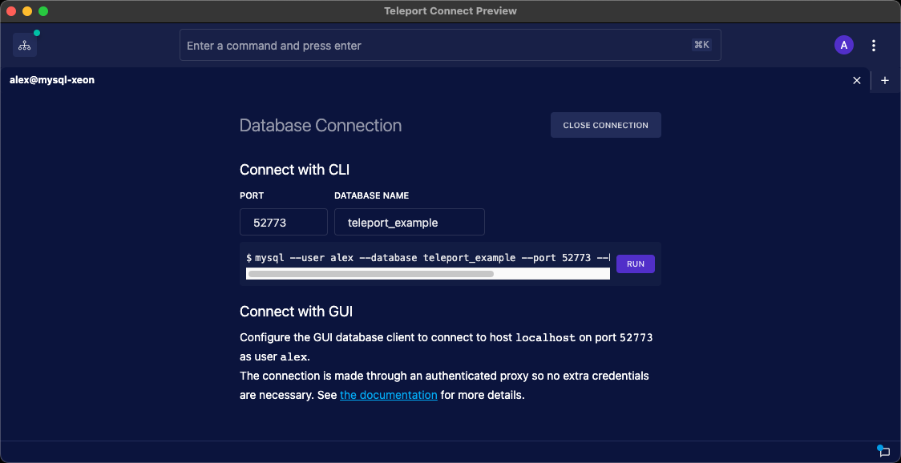

This guide covers the basics of authenticating to Teleport and
accessing resources. It's written for end-users of resources protected by
Teleport, and includes links to more detailed documentation at the end.

## Client tools

### tsh

`tsh` lets you authenticate to Teleport and list and connect to resources. After
[downloading](https://goteleport.com/download/) and installing `tsh`, sign in to
your Teleport cluster:

<Tabs>
<TabItem label="Local user">

Authenticate to Teleport as a local user with `tsh login` by assigning <Var
name="user"/> to your Teleport username and <Var name="teleport.example.com" />
to the domain name of your Teleport cluster:

```code
$ tsh login --proxy=<Var name="teleport.example.com" description="Your Teleport Proxy Service or Teleport Cloud tenant address"/> --user=<Var name="user" description="Your Teleport username"/>
Enter password for Teleport user alice:
Tap any security key
> Profile URL:        https://teleport.example.com:443
  Logged in as:       alice
  Cluster:            example.com
  Roles:              access, requester
  Logins:             ubuntu, ec2-user
  Kubernetes:         enabled
  Valid until:        2022-11-01 22:37:05 -0500 CDT [valid for 12h0m0s]
  Extensions:         permit-agent-forwarding, permit-port-forwarding, permit-pty, private-key-policy
```

</TabItem>
<TabItem label="Single sign-on user">

Authenticate to Teleport as a single sign-on (SSO) user by running `tsh login`
and assigning <Var name="your-idp-connector" /> to the name of your
authentication connector, if implemented by your administrators:

```code
$ tsh login --proxy=<Var name="teleport.example.com"/> --auth=<Var name="your-idp-connector" description="Your Identity Provider connection name, if implemented by your administrators"/>
If browser window does not open automatically, open it by clicking on the link:
 http://127.0.0.1:49927/1d80e257-ec61-4ed2-9403-784f8d35b2fe
> Profile URL:        https://teleport.example.com:443
  Logged in as:       user@example.com
  Cluster:            example.com
  Roles:              access, requester
  Logins:             ubuntu, ec2-user
  Kubernetes:         enabled
  Valid until:        2022-11-01 22:37:05 -0500 CDT [valid for 12h0m0s]
  Extensions:         permit-agent-forwarding, permit-port-forwarding, permit-pty, private-key-policy
```

Depending on how Teleport was configured for your network, you may not need
the additional flags `--auth`. Your administrator should provide the details
required for your particular use case.

</TabItem>
</Tabs>

### Teleport Connect

The Teleport Connect app provides all the same access to resources as `tsh` in
a friendly graphic user interface. After [downloading](https://goteleport.com/download/)
and installing Teleport Connect, you can log in and initiate sessions for
server and database access within a single window.

1. Click **CONNECT** to connect to the Teleport cluster:

   

1. Provide the address of your Teleport Cluster (e.g.
   `https://example.teleport.sh`) and click **NEXT**.

1. Teleport Connect will ask you for your username, password, and MFA.

   If Teleport is integrated with an external Identity Provider (**IdP**), you might be
   prompted to authenticate with that service in a browser window.

1. Browse and connect to all the resources your user is permitted to access:

   

### Web UI

Teleport provides a web interface for users to interact with Teleport, e.g., by
accessing resources or creating Access Requests. This is usually found at the
same URL used to connect to Teleport with (e.g.  `https://example.teleport.sh`),
but you should confirm the Web UI URL with the team that manages your Teleport
deployment.

The Web UI provides similar access to resources as Teleport Connect, and
additional access to to Request and Activity logs for users with the right
permissions.

## Protocols

### Server access (`ssh`)

<Tabs>
<TabItem label="tsh">

`tsh ls` lists the servers you have access to through Teleport:

```code
$ tsh ls
Node Name           Address         Labels
------------------- --------------- ----------------------------
server1.example.com 192.0.2.24:3022 access=servers,hostname=server1
server2.example.com 192.0.2.32:3022 access=servers,hostname=server2
```

To connect to a server:

```code
$ tsh ssh ubuntu@server1.example.com
ubuntu@server1:~$
```

</TabItem>
<TabItem label="Teleport Connect">

Under the **Servers** tab, click **CONNECT** next to the server you want to
access. Select or type in a username available to your Teleport user.

In a new tab, Teleport Connect will initiate the connection and provide a
terminal environment.

</TabItem>
<TabItem label="Web UI">

From the <Icon name="server" size="sm" inline/> **Servers** menu, the Teleport
Web UI will list all servers your user has permission to access. The **CONNECT**
button will open a new tab with a terminal emulator to provide access to that server.

</TabItem>
</Tabs>

### Kubernetes access (`kubectl`)

<Tabs>
<TabItem label="tsh">

To see the Kubernetes clusters that you can access via Teleport, run the
following command:

```code
$ tsh kube ls
 Kube Cluster Name Labels                      Selected
 ----------------- --------------------------- --------
 mycluster         env=dev
```

To log in to the cluster, run the following command, changing `mycluster` to the
name of a Kubernetes cluster as it was listed in `tsh kube ls`:

```code
$ tsh kube login mycluster
Logged into kubernetes cluster "mycluster". Try 'kubectl version' to test the
connection.
```

When you log in to your Teleport cluster via `tsh kube login`, `tsh` updates
your kubeconfig to point to your chosen Kubernetes cluster. You can then run
`kubectl` commands against your cluster.

</TabItem>
<TabItem label="Teleport Connect">

After logging in to a cluster in Teleport Connect, click the **Kubes** tab to
see a list of Kubernetes clusters you can access.



Next to your chosen cluster, click **Connect**. Teleport Connect will
open a terminal in a new tab and authenticate to the cluster. You can then run
`kubectl` commands to interact with the cluster.


</TabItem>
<TabItem label="Web UI">

In the Teleport Web UI, click the <Icon name="kubernetes" size="sm" inline/>
**Kubernetes** tab. You will see a list of Kubernetes clusters your Teleport
user is authorized to connect to.



Find your chosen cluster and click **Connect**. You will see a modal window that
lists the commands you can execute in your terminal to connect to the cluster
via Teleport.


</TabItem>
</Tabs>

### Transferring files

<Tabs>
<TabItem label="tsh scp">

`tsh scp` will let you transfer files to servers behind Teleport:

```code
$ tsh scp some-file.ext server.example.com:
some-file.ext   7% |███████                | (25/342 MB, 2.9 MB/s) [9s:1m48s]
```
</TabItem>
<TabItem label="Teleport Connect">

Teleport Connect allows you to transfer files to a remote server and runs on macOS, Linux and Windows. You can use the arrows in the top-left corner of an active SSH session to upload and download files:



You can upload files from systems using drag and drop:



</TabItem>
<TabItem label="Web UI">

You can use the arrows in the top-left corner of the Web UI to download files:



Or you can upload using drag and drop:



</TabItem>
</Tabs>

### Database access

<Tabs>
<TabItem label="tsh">

`tsh db ls` will list the databases available to your user:

```code
$ tsh db ls
Name                                               Description Allowed Users   Labels  Connect
-----------------------------------------------    ----------- --------------- ------- -------------------------
myelastic                                                      [alice elastic] env=dev
mysql-server1 (user: alice, db: teleport_example)              [alice elastic] env=dev tsh db connect mysql-server1
```

To connect to a database server through `tsh`, you'll need a local client for
that database. For example, to connect to a MySQL or MariaDB database, you'll
need the [MySQL CLI](https://dev.mysql.com/doc/refman/8.0/en/mysql.html) client:

```code
$ tsh db connect --db-user=alice --db-name=teleport_example mysql-server1
```

In this example, `teleport_example` is a pre-existing database on the MySQL server:

```sql
SHOW DATABASES;
+--------------------+
| Database           |
+--------------------+
| information_schema |
| mysql              |
| performance_schema |
| teleport_example   |
+--------------------+
4 rows in set (0.09 sec)
```

For other connection types, or to connect a graphic database client, you can
create a local tunnel to point your software to:

```code
$ tsh proxy db myelastic --db-user=alice --tunnel
Started authenticated tunnel for the Elasticsearch database "myelastic" in cluster "example.come" on 192.0.2.58:52669.

Use one of the following commands to connect to the database:

  * interactive SQL connection:

  $ elasticsearch-sql-cli http://localhost:52669/

  * run single request with curl:

  $ curl http://localhost:52669/

Database certificate renewed: valid until 2022-11-02T06:11:50Z [valid for 9h55m0s]
```

</TabItem>
<TabItem label="Teleport Connect">

In the **Databases** tab, select the database you want to access and click
**CONNECT**. Select or type in a username available to your Teleport user.

Teleport Connect will open a tunneled connection to the database. You can copy
the port number and connect with a GUI app at `localhost`, or click **RUN** to
initiate a CLI connection inside Teleport Connect:



</TabItem>
<TabItem label="Web UI">

The Teleport Web UI cannot provide direct connections to databases, but it will
list those that are accessible to your user under <Icon name="database" size="sm" inline/>
**Databases** and provide `tsh` commands to connect from your local terminal environment.

</TabItem>
</Tabs>

### Desktop access

Desktop access is available through the Teleport Web UI.

1. In your browser, navigate to your Teleport cluster (for example,
`https://example.teleport.sh`).
1. From the menu on the right, select <Icon name="desktop" inline size="sm"/> **Desktops**.
1. Next to the desktop you want to access, click **CONNECT**. Select
or type in a username available to your Teleport user.
1. Teleport will open a new browser tab or window and begin the RDP session.
Note that you may need to wait a moment for Teleport to log you in as the specified user.

## Next steps

This guide covers the basic installation and access of Teleport for end users,
but the rest of the Connect your Client section provides more detailed information.

- `tsh` is the CLI tool for accessing resources through Teleport. With it,
you can authenticate to Teleport, list available services, and connect to them
either directly or through proxy tunnels.

  Learn more about it from [Using the tsh Command Line Tool](./tsh.mdx).

- Teleport Connect is a graphic utility for connecting to resources through
  Teleport. You use it to connect to servers, databases, and Kubernetes
  clusters. See [Using Teleport Connect](./teleport-connect.mdx).

- [Access Teleport-protected databases with GUI clients](./gui-clients.mdx):
  Details how to connect many popular database GUI clients through Teleport.
