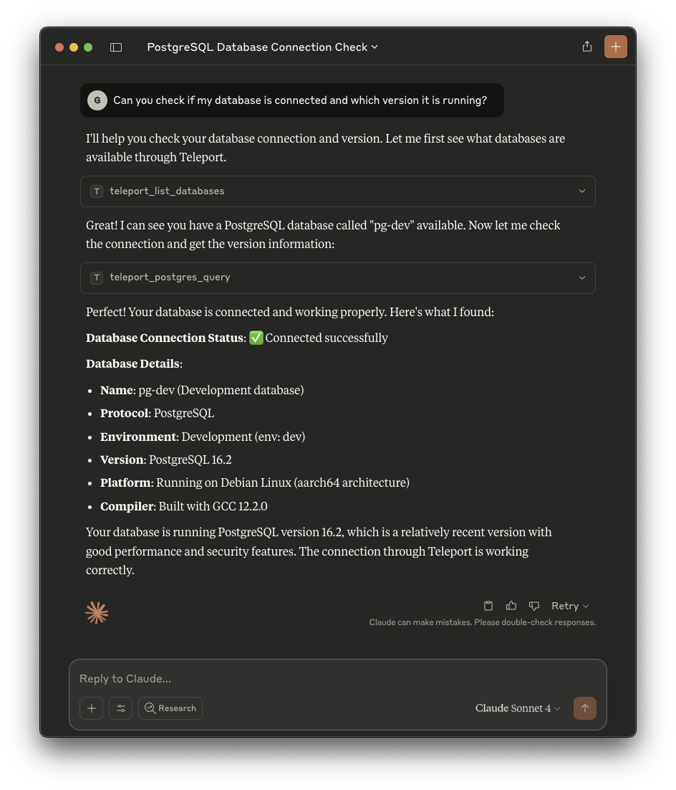

This guide explains how to expose your **PostgreSQL** Teleport databases as MCP servers.

### Prerequisites

(!docs/pages/includes/edition-prereqs-tabs.mdx!)

- Teleport Database Service with a PostgreSQL database enrolled. See our [guides](../../enroll-resources/database-access/database-access.mdx)
  for options on how to set up Database Access for PostgreSQL databases, such as
  the [AWS RDS PostgreSQL](../../enroll-resources/database-access/enroll-aws-databases/rds.mdx)
  and [self-hosted PostgreSQL](../../enroll-resources/database-access/enroll-self-hosted-databases/postgres-self-hosted.mdx) guides.

### Security considerations

Since language models can execute any query on your database, we advise creating
a database user with only the permissions you want the models to have. Setting
up a user with read-only permissions will help prevent accidental changes to
your database.

### Step 1/2. Installation

First, sign in into your Teleport cluster using `tsh login`:

```code
$ tsh login --proxy=<Var name="teleport.example.com:443" /> --user=myuser@example.com
```

Only databases that you have access can be exposed as MCP servers. You can
retrieve the list of databases and their connection options using `tsh db ls`:
  
```code
$ tsh db ls
# Name            Description          Allowed Users Labels 
# --------------- -------------------- ------------- -------
# postgres-dev    Development database [* postgres]  env=dev
# postgres-prod   Production database  [readonly]    env=prod
```

Each database you want accessible through MCP must be configured separately.
This is done using the `tsh mcp db config` command. Like `tsh db connect`, this
command requires you to select the database user and database name that the MCP
connections will use.

This command can either generate a configuration file (using the `mcpServers`
format) for manual MCP client updates or automatically update the MCP client
configuration.

<Tabs>
<TabItem label="Claude Desktop">
`tsh` can automatically update the Claude Desktop MCP configuration file to
include Teleport's configuration:

```code
$ tsh mcp db config --db-user=postgres --db-name=employees --client-config=claude postgres-dev
Added database "postgres-dev" on the client configuration at:
/path/to/Claude/claude_desktop_config.json

Teleport database access MCP server is named "teleport-databases" in this configuration.

You may need to restart your client to reload these new configurations.
```

You can also provide a custom path for your Claude Desktop MCPs configuration:
```code
$ tsh mcp db config --db-user=postgres --db-name=employees --config-client=/path/to/config.json postgres-dev
```

After updating the configuration, you need to restart the Claude Desktop app
before using the newly added MCPs.
</TabItem>

<TabItem label="Cursor">
`tsh` can automatically update the Global Cursor MCP servers to include
Teleport's configuration:

```code
$ tsh mcp db config --db-user=postgres --db-name=employees --client-config=cursor postgres-dev
Added database "postgres-dev" on the client configuration at:
/your/home/path/.cursor/mcp.json

Teleport database access MCP server is named "teleport-databases" in this configuration.

You may need to restart your client to reload these new configurations.
```

You can also update a Cursor project MCP servers by providing the path to the
file:
```code
$ tsh mcp db config --db-user=postgres --db-name=employees --config-client=/path/to/project/.cursor/mcp.json postgres-dev
```
</TabItem>


<TabItem label="VS Code">
Currently, `tsh` doesn't support generating the configuration for VS Code.
However, you can still use the config command to create the command and update
it to match VS Code format.

First, generate the configuration example for your database:

```code
$ tsh mcp db config --db-user=postgres --db-name=employees postgres-dev
Here is a sample JSON configuration for launching Teleport MCP servers:
{
  "mcpServers": {
    "teleport-databases": {
      "command": "/path/to/tsh",
      "args": [
        "mcp",
        "db",
        "start",
        "teleport://clusters/teleport.example.com/databases/postgres-dev?dbName=employees&dbUser=postgres"
      ]
    }
  }
}

If you already have an entry for "teleport-databases" server, add the following database resource URI to the command arguments list:
teleport://clusters/teleport.example.com/databases/postgres-dev?dbName=employees&dbUser=postgres
```

With that, you can access your MCP server configuration within your project,
usually found at `/path/to/project/.vscode/mcp.json`, and copy the
`teleport-databases` server definition.

```diff
{
  "mcp": {
    "servers": {
+     "teleport-databases": {
+       "command": "/path/to/tsh",
+       "args": [
+         "mcp",
+         "db",
+         "start",
+         "teleport://clusters/teleport.example.com/databases/postgres-dev?dbName=employees&dbUser=postgres"
+       ]
+     }
    }
  }
}
```

If you already have a `tsh` command, you can copy the URI it generates and add
it to your arguments list.

```diff
{
  "mcp": {
    "servers": {
      "teleport-databases": {
        "command": "/path/to/tsh",
        "args": [
          "mcp",
          "db",
          "start",
          "teleport://clusters/teleport.example.com/databases/postgres-prod?dbName=prod&dbUser=readonly",
+         "teleport://clusters/teleport.example.com/databases/postgres-dev?dbName=employees&dbUser=postgres"
        ]
      }
    }
  }
}
```
</TabItem>

<TabItem label="Others">
Currently, `tsh` only supports generating the `mcpServers` format and some
client-specific formats. Running the config command without any specific options
will output the configuration used to start Teleport's STDIO MCP server. You can
use this as a base and modify it to suit your MCP client needs.

```code
$ tsh mcp db config --db-user=postgres --db-name=employees postgres-dev
Here is a sample JSON configuration for launching Teleport MCP servers:
{
  "mcpServers": {
    "teleport-databases": {
      "command": "/path/to/tsh",
      "args": [
        "mcp",
        "db",
        "start",
        "teleport://clusters/teleport.example.com/databases/postgres-dev?dbName=employees&dbUser=postgres"
      ]
    }
  }
}

If you already have an entry for "teleport-databases" server, add the following database resource URI to the command arguments list:
teleport://clusters/teleport.example.com/databases/postgres-dev?dbName=employees&dbUser=postgres
```
</TabItem>
</Tabs>

### Step 2/2. Usage

After configuring your MCP client, the following tools will be available:

- `teleport_list_databases`: Lists database resources accessible with Teleport tools.
- `teleport_postgres_query` (PostgreSQL databases only): Executes SQL queries on a specified database through Teleport.

Additionally, the served databases are available as MCP resources. You can
attach them to the conversation to provide extra context. Behavior may vary
among MCP clients.

You can now use these tools to execute queries on your databases. Here is an
example of testing the connection and retrieving the database version using
Claude Desktop:



### Troubleshooting

#### Empty list of databases or missing `teleport_postgres_query` tool

This occurs if the MCP server command (`tsh mcp db start`) has an invalid list
of databases or options. Make sure the database URI list is correct. You can
generate it using the `tsh mcp db config` command.

In this case, you'll still be able to see and call `teleport_list_databases`,
which will provide instructions on how to proceed.

#### Expired `tsh` session

There must be a valid `tsh` session during the MCP server startup, or it won't
start.

If your session expires while the MCP server is running, the next tool calls
will fail. You need to run `tsh login` again and retry the failed requests. In
such cases, you don't have to restart the MCP client or the MCP server.

#### Access denied errors

If, while executing queries, you receive access denied responses, verify that
your user has permission to access the configured database. You can confirm by
running `tsh db connect` before starting your MCP server.

For example, if you configured your database with:

```code
$ tsh mcp db config --db-user=postgres --db-name=employees postgres-dev
```

You must be able to test your access by running:

```code
$ tsh db connect --db-user=postgres --db-name=employees postgres-dev
```
