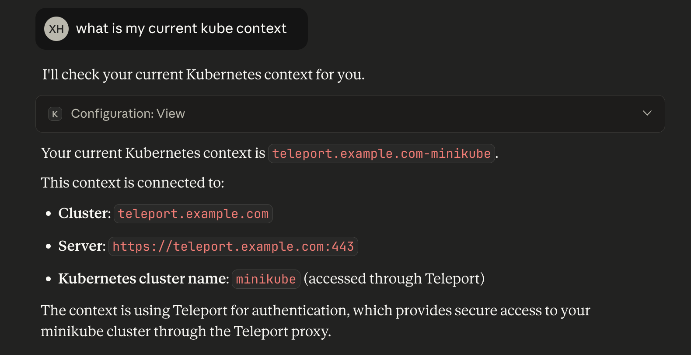

This guide explains how to connect to Teleport Kubernetes Clusters with MCP clients.

{/* lint ignore page-structure remark-lint */}

## Prerequisites

(!docs/pages/includes/edition-prereqs-tabs.mdx clients="\`tsh\` client"!)
- Kubernetes Clusters enrolled with Teleport. See our [guides](../../enroll-resources/kubernetes-access/getting-started.mdx).

## Step 1/2. Configure MCP clients

First, sign in into your Teleport cluster using `tsh login`:

```code
$ tsh login --proxy=<Var name="teleport.example.com:443" /> --user=myuser@example.com
```

To list Kubernetes clusters available for you to access:
```code
$ tsh kube ls
Kube Cluster Name Labels  Selected
----------------- ------- --------
minikube          env=dev *
```

Now log in to your Kubernetes cluster, replacing <Var name="minikube" /> with your our Kubernetes cluster name:
```code
$ tsh kube login <Var name="minikube" />
Logged into Kubernetes cluster "minikube". Try 'kubectl version' to test the connection.
```
This command also updates your default Kubernetes config.

Next, configure your MCP clients to use the
[`kubernetes-mcp-server`](https://github.com/containers/kubernetes-mcp-server)
MCP server.

<Tabs>
<TabItem label="Claude Desktop">

Open your `claude_desktop_config.json` and add the MCP server to the list of
mcpServers:

```json
{
  "mcpServers": {
    "kubernetes": {
      "command": "npx",
      "args": [
        "-y",
        "kubernetes-mcp-server@latest"
      ]
    }
  }
}
```
</TabItem>

<TabItem label="Cursor">

You can install the extension by editing the `mcp.json` file:
```json
{
  "mcpServers": {
    "kubernetes-mcp-server": {
      "command": "npx",
      "args": ["-y", "kubernetes-mcp-server@latest"]
    }
  }
}
```

</TabItem>

<TabItem label="VS Code / VS Code Insiders">

You can install the extension by running the following command:
```code
# For VS Code
code --add-mcp '{"name":"kubernetes","command":"npx","args":["kubernetes-mcp-server@latest"]}'
# For VS Code Insiders
code-insiders --add-mcp '{"name":"kubernetes","command":"npx","args":["kubernetes-mcp-server@latest"]}'
```
</TabItem>
</Tabs>

## Step 2/2. Access Teleport-protected resources over MCP

After configuring your MCP client, you will find Kubernetes and Helms tools from
`kubernetes-mcp-server`.

You can now use these tools to interact with your Kubernetes clusters via
Teleport in your MCP clients:




## Teleport behind TLS-terminating load balancers

If your Teleport cluster is behind a TLS-terminating load balancer or reverse
proxy, you can start a local proxy with `tsh`:
```code
$ tsh proxy kube -p 8888
```

Copy the `KUBECONFIG` path from the output of the command, and add it with the
`--kubeconfig` flag in your MCP client configuration. For example:
```json
{
  "mcpServers": {
    "kubernetes-mcp-server": {
      "command": "npx",
      "args": ["-y", "kubernetes-mcp-server@latest", "--kubeconfig", "/path/to/your/tsh/localproxy-8888-kubeconfig"]
    }
  }
}
```

Alternatively, you can use [Teleport Connect](../teleport-clients/teleport-connect.mdx) to run
the local proxy to your Kubernetes cluster. You can find the `KUBECONFIG` path
from the terminal in Teleport Connect:
```code
$ echo $KUBECONFIG
/path/to/your/minikube-kubeconfig
```
