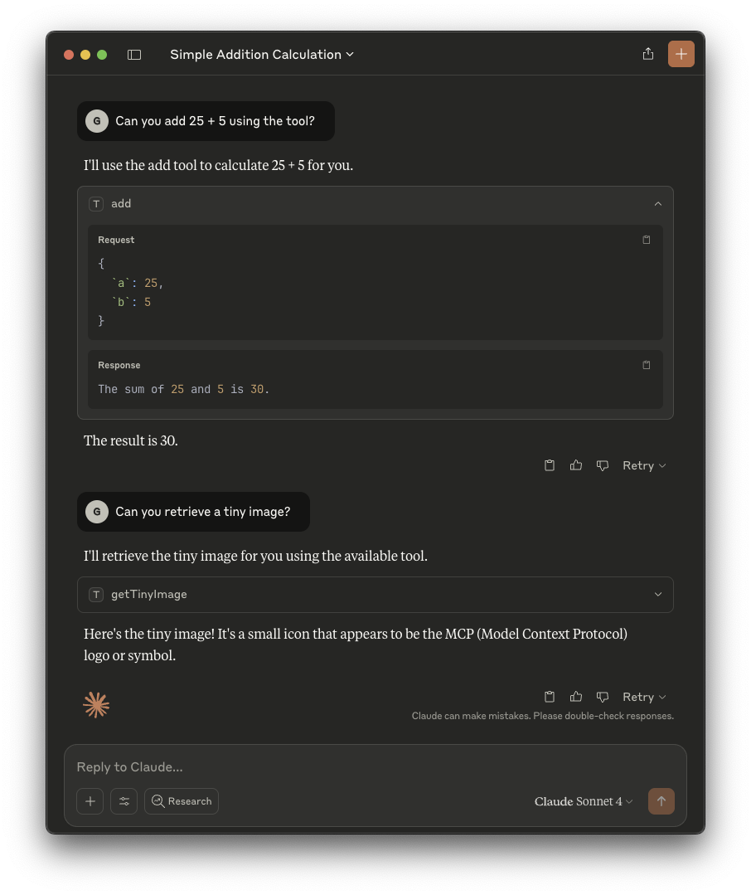

This guide explains how to configure MCP clients to access MCP servers served by
Teleport.

### Prerequisites

(!docs/pages/includes/edition-prereqs-tabs.mdx edition="Teleport (v18.1.0 or higher)" clients="\`tsh\` client"!)

- Teleport MCP Access configured.

  <details open>
  <summary>Configure MCP Access</summary>

  - [Quick-start with demo MCP server](../../enroll-resources/mcp-access/getting-started.mdx).
  - [MCP Access with Stdio MCP Server](../../enroll-resources/mcp-access/stdio.mdx)
  </details>
  
### Step 1/2. Installation

First, sign in into your Teleport cluster using `tsh login`, assigning 
<Var name="teleport.example.com" /> to the web address of the Teleport Proxy
Service in your cluster:

```code
$ tsh login --proxy=<Var name="teleport.example.com" /> --user=myuser@example.com
```

You can now list the available MCP servers that you can use:

```code
$ tsh mcp ls
Name           Description                                Type  Labels
-------------- ------------------------------------------ ----- --------------------
fs             Filesystem MCP Server                      stdio env=prod
mcp-everything This MCP server attempts to exercise al... stdio env=dev,sandbox=true
```

The MCP client configuration can be created using the `tsh mcp config` command.
You can choose which servers to configure by using the `--labels` flag to filter
by labels or by specifying `--all`, which will configure all MCP servers you have
access to.

This command can either generate a configuration file (using the `mcpServers`
format) for manual MCP client updates or automatically update the MCP client
configuration.

<Tabs>
<TabItem label="Claude Desktop">
`tsh` can automatically update the Claude Desktop MCP configuration file to
include Teleport's configuration:

```code
$ tsh mcp config --all --client-config=claude
Found MCP servers:
fs
mcp-everything

Updated client configuration at:
~/Library/Application Support/Claude/claude_desktop_config.json

Teleport MCP servers will be prefixed with "teleport-mcp-" in this
configuration.

You may need to restart your client to reload these new configurations. If you
encounter a "disconnected" error when tsh session expires, you may also need to
restart your client after logging in a new tsh session.
```

You can also provide a custom path for your Claude Desktop MCPs configuration:
```code
$ tsh mcp config --all --config-client=/path/to/config.json
```

After updating the configuration, you need to restart the Claude Desktop app
before using the newly added MCPs.
</TabItem>

<TabItem label="Cursor">
`tsh` can automatically update the Global Cursor MCP servers to include
Teleport's configuration:

```code
$ tsh mcp config --all --config-client=cursor
Found MCP servers:
fs
mcp-everything

Updated client configuration at:
/your/home/path/.cursor/mcp.json

Teleport MCP servers will be prefixed with "teleport-mcp-" in this
configuration.

You may need to restart your client to reload these new configurations. If you
encounter a "disconnected" error when tsh session expires, you may also need to
restart your client after logging in a new tsh session.
```

You can also update a Cursor project MCP servers by providing the path to the
file:
```code
$ tsh mcp config --all --config-client=/path/to/project/.cursor/mcp.json
```
</TabItem>

<TabItem label="Others">
Currently, `tsh` only supports generating the `mcpServers` format and some
client-specific formats. Running the config command without any specific options
will output configuration used to start Teleport's STDIO MCP server. You can use
this as a base and modify it to suit your MCP client needs.

```code
$ tsh mcp config --all
Found MCP servers:
fs
mcp-everything

Here is a sample JSON configuration for launching Teleport MCP servers:
{
  "mcpServers": {
    "teleport-mcp-fs": {
      "command": "tsh",
      "args": ["mcp", "connect", "fs"]
    },
    "teleport-mcp-mcp-everything": {
      "command": "tsh",
      "args": ["mcp", "connect", "mcp-everything"]
    }
  }
}
```
</TabItem>
</Tabs>

### Step 2/2. Usage

After configuring your MCP client, the MCP tools and resources should be
available.

You can now use the MCP servers as usual. Here is an example of using the
`mcp-everything` server through Teleport with Claude Desktop:



### Troubleshooting

#### Server is running but it has an empty list of tools

Besides accessing the MCP servers, you also need permissions for the MCP tools
they provide. You can see which tools are available for you by running
`tsh mcp ls -v`.

If you're missing tool permissions, reach out to your Teleport administrator to
have them properly configured.

#### Expired `tsh` session

There must be a valid `tsh` session during the MCP server startup, or it won't
start.

If your session expires while the MCP server is running, the next tool calls
will fail. You need to run `tsh login` again and retry the failed requests. In
such cases, you don't have to restart the MCP client or the MCP server.

### `tsh mcp` commands not found

If you're encountering an error like this when running the `tsh mcp` commands
family:

```
ERROR: expected command but got "mcp"
```

This is caused by using an outdated version of `tsh`. The earliest version that
includes the MCP commands is `18.1.0`, so you need to make sure you’re running
at least this version. You can check your `tsh` version by running
`tsh version`.

### `tsh mcp ls` returns an empty list of servers

Make sure your Teleport cluster has MCP access resources available and the
correct permissions to reach them. [See our guides for enrollment instructions.](../../enroll-resources/mcp-access/mcp-access.mdx)
