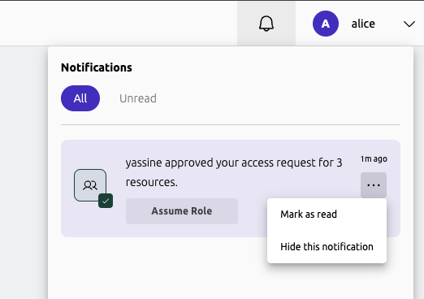

Teleport's notification system allows users to be notified of various events, updates, and warnings in real time.

This guide explains how to interact with notifications in the Web UI and how cluster administrators can create custom notifications for their users.

## Interacting with notifications in the Web UI

In the Web UI, you can list all your notifications by clicking on the bell icon in the top right of the navigation bar.

Clicking on a notification will redirect you to the relevant page, or in the case of a custom notification generated by an administrator, open a dialog containing its text content.
You can mark the notification as read to acknowledge it, or hide it to have it never be shown to you again.

Some notifications may include quick action buttons which allow you perform actions directly from the notification, such as assuming granted roles from an approved access request notification.



## Creating and managing notifications

Cluster administrators with `create` permissions for the `notification` resource can create and manage custom notifications using the `tctl notifications` command. These notifications
contain custom text content and can be configured to target either all users, a specific user, or users with certain roles.

Please note that custom notifications are stored in the backend in plaintext, and should therefore not include any sensitive information or be used for security-critical purposes.

### Examples

```code
# Create a notification for a specific user.
# Only user alice will see this notification.
$ tctl notifications create --user=alice --title="Upcoming Database Maintenance" \
  --content="We will be conducting a database upgrade tomorrow at 2AM UTC"

# Create a notification for users with the `engineer` role that expires in 2 days
$ tctl notifications create --roles=engineer --title="Reminder" \
  --content="Please use access requests to request access to production servers" --ttl=2d

# List notifications.
$ tctl notifications ls
ID                                   Created             Expires             Title                Labels
------------------------------------ ------------------- ------------------- -------------------- ------
0194d8b2-5a38-7858-88fe-5fcee3ff1ceb 06 Feb 25 00:39 UTC 08 Mar 25 00:39 UTC Example notification

# Delete a notification.
$ tctl notifications rm 3b8eb3d6-da9a-5353-aece-cbc885ecbf73
```

For more detailed information on this family of commands, please refer to the [CLI Reference](../reference/cli/tctl.mdx#tctl-notifications-create).
