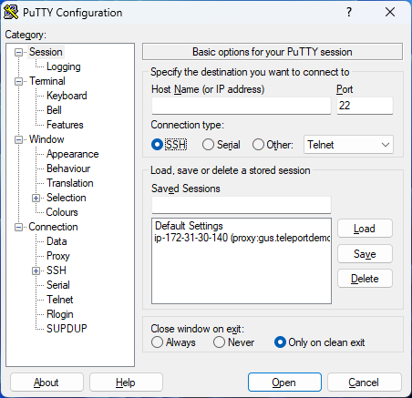
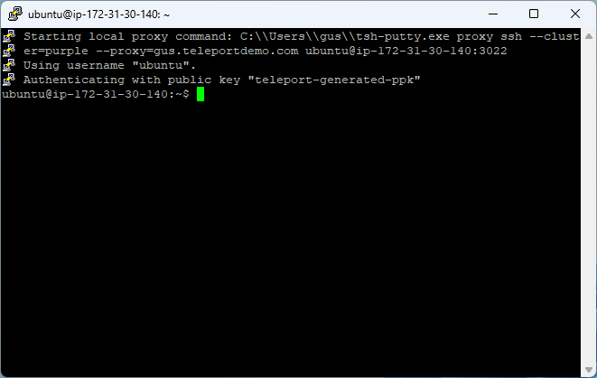
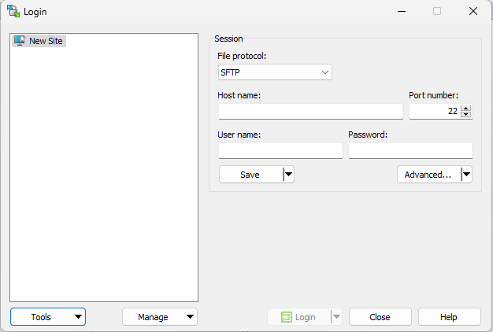
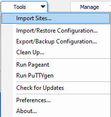
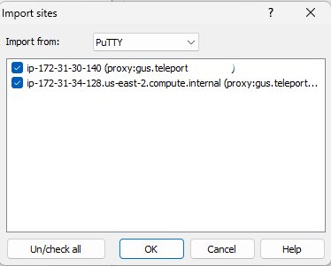
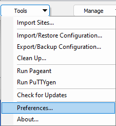
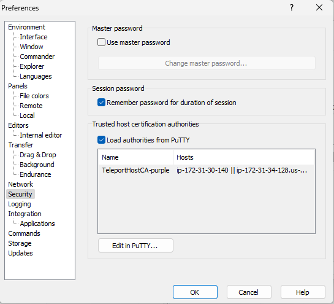
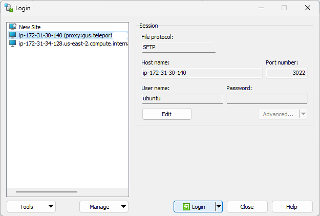

This guide will show you how to use the Teleport client tool `tsh` to add saved sessions for use
with [PuTTY](https://www.putty.org/), and then how to use PuTTY as a client to connect to SSH nodes.

It will also show you how to optionally use these saved sessions with [WinSCP](https://winscp.net) to transfer
files from SSH nodes using SFTP.

You will learn how to:

- Generate saved PuTTY sessions for SSH nodes attached to a Teleport cluster.
- Log in to an interactive shell using these saved PuTTY sessions.
- (optional) Import a saved PuTTY session into WinSCP, then start an SFTP session to transfer files from an SSH node.

## Prerequisites

- A client machine running Windows 10 or higher. You can only use `tsh` to save PuTTY sessions on Windows.

- The Teleport `tsh.exe` client, version 14.0.3 or higher. To download the `tsh.exe` client, run the following command:

  ```code
  $ curl.exe -O https://cdn.teleport.dev/teleport-v(=teleport.version=)-windows-amd64-bin.zip
  ```

  You should then unzip the archive and move `tsh.exe` to your `%PATH%`.

  <Admonition type="note">
    Do not place `tsh.exe` in the `System32` directory, as this can cause issues when using WinSCP.
    You should use `%SystemRoot%` (e.g. `C:\Windows`) instead, which is already included in `%PATH%`.

    If you do not have administrator rights on the Windows system you're using, you can use `%USERPROFILE%`
    (e.g. `C:\Users\<username>`) instead - but note that you will not be able to run `tsh` commands globally
    from the command line unless you are in the same directory as `tsh.exe`.
  </Admonition>

- PuTTY for Windows version 0.78 or higher. You can download the latest version of PuTTY from the [PuTTY download page](https://www.chiark.greenend.org.uk/~sgtatham/putty/latest.html).

- (optional) WinSCP for Windows version 6.2 or higher. You can download the latest version of WinSCP from the [WinSCP download page](https://winscp.net/eng/download.php)

## Summary

To add saved sessions to PuTTY:

<Tabs>
<TabItem scope={["oss","enterprise"]} label="Self-Hosted">

1. Sign into a Teleport cluster using the `tsh login` command:

```code
$ tsh login --proxy=teleport.example.com
```

This command retrieves your user certificates and saves them in a local file in the `%USERPROFILE%/.tsh` directory.

2. List SSH nodes that the user can connect to inside the cluster:

```code
$ tsh ls
Node Name                           Address        Labels
----------------------------------- -------------- ----------------------------
ip-172-31-30-140                    127.0.0.1:3022 company=acmecorp,env=aws,...
ip-172-31-34-128.us-east-2.compu... ⟵ Tunnel      access=open,enhanced_reco...
ip-172-31-8-63                      172.31.8.63:22 type=openssh
```

3. Add a saved session for a specific login on a specific node to the Windows registry.

For example, you can add a saved session for the login `ubuntu` on the node `ip-172-31-30-140` to the Windows
registry by running the following command:

```code
$ tsh puttyconfig ubuntu@ip-172-31-30-140
Added PuTTY session for ubuntu@ip-172-31-30-140 [proxy:teleport.example.com]
```

If you don't provide a login to this command, your local Windows username is used instead.

If you are adding a session for a registered OpenSSH node within your cluster (added with
[`teleport join openssh`](../enroll-resources/server-access/openssh/openssh-agentless.mdx)), you must specify the `sshd` port
(usually 22) when adding a session with `tsh puttyconfig`:

```code
$ tsh puttyconfig --port 22 ubuntu@ip-172-31-8-63
Added PuTTY session for ubuntu@ip-172-31-8-63 [proxy:teleport.example.com]
```

You can also use `tsh puttyconfig user@host:22` if you prefer.

</TabItem>
<TabItem scope={["cloud"]} label="Teleport Enterprise Cloud">

1. Sign into a Teleport cluster using the `tsh login` command:

```code
$ tsh login --proxy=mytenant.teleport.sh
```

This command retrieves your user certificates and saves them in a local file in the `%USERPROFILE%/.tsh` directory.

2. List SSH nodes that the user can connect to inside the cluster:

```
$ tsh ls
Node Name                           Address        Labels
----------------------------------- -------------- ----------------------------
ip-172-31-30-140                    ⟵ Tunnel      company=acmecorp,env=aws,...
ip-172-31-34-128.us-east-2.compu... ⟵ Tunnel      access=open,enhanced_reco...
```

3. Add a saved session for a specific login on a specific node to the Windows registry.

For example, you can add a saved session for the login `ubuntu` on the node `ip-172-31-30-140` to the Windows
registry by running the following command:

```code
$ tsh puttyconfig ubuntu@ip-172-31-30-140
Added PuTTY session for ubuntu@ip-172-31-30-140 [proxy:mytenant.teleport.sh]
```

If you don't provide a login to this command, your local Windows username is used instead.

</TabItem>


</Tabs>

## Use a saved session to connect with PuTTY

1. Start PuTTY to see the saved sessions available for your cluster.

<Figure width="452" height="437" caption="Main PuTTY window">

</Figure>

2. Double-click a session to connect to the host through Teleport.

<Figure width="661" height="418" caption="PuTTY console">

</Figure>

After you connect to the host, Teleport generates an audit log entry for the session's start,
and appears in the list of "Active Sessions" within Teleport.

You can run `teleport status` inside the session to verify that it is connected through
the Teleport proxy and to output the session's UUID for tracking purposes.
If session recording is enabled for your cluster, you can also view a
recording of the session after you stop the session and disconnect from the host.


## Leaf clusters

To list available leaf clusters, run the following command:

```code
$ tsh clusters
Cluster Name         Status Cluster Type Labels Selected
-----------------    ------ ------------ ------ --------
teleport.example.com online root                *
example.teleport.sh  online leaf
```

You can access a leaf cluster in a PuTTY session by adding the `--leaf <leaf cluster name>` parameter to the `tsh puttyconfig` command.

For example, if your leaf cluster is named `example.teleport.sh` and your node is called `ip-172-31-34-128.us-east-2.compute.internal`,
you can add a PuTTY session for the login `ec2-user` using the following command:

```code
$ tsh puttyconfig --leaf example.teleport.sh ec2-user@ip-172-31-34-128.us-east-2.compute.internal
Added PuTTY session for ec2-user@ip-172-31-34-128.us-east-2.compute.internal [leaf:example.teleport.sh,proxy:teleport.example.com]
```


## Session naming

Sessions are named using the following schema:

Root clusters: `<login>@<hostname> [proxy:<proxy address>]`

Leaf clusters: `<login>@<hostname> [leaf:<leaf cluster name>,proxy:<proxy address>]`


## Using WinSCP to transfer files over SFTP

You can import a saved session from PuTTY to WinSCP, which allows you to connect to an SSH node
transfer files to and from it.

1. Start WinSCP.

If you don't see the Site Manager "Login" dialog appear with a list of sessions to connect to when WinSCP starts,
click the **Tabs** menu, choose **Sites**, then **Site Manager...** to show it.

<Figure width="626" height="422" caption="WinSCP Site Manager window">

</Figure>

2. Click the **Tools** button at the bottom left, and choose **Import Sites**.

<Figure width="226" height="237" caption="Click 'Tools', then choose 'Import Sites...'">

</Figure>

3. Check the box next to any saved PuTTY sessions that you wish to import into WinSCP for use, then click the "OK" button.

If you don't see sessions matching the hosts that you want to connect to, close this box and run `tsh puttyconfig <user>@<host>`
from a terminal [as described above](#summary) to add the sessions, then repeat this step.

<Figure width="374" height="301" caption="Choose PuTTY sessions to import and click OK">

</Figure>

4. To tell WinSCP it should trust and load saved Host CAs from PuTTY, click **Tools** again at the bottom left,
then choose **Preferences...**

<Admonition type="tip" title="Skip remaining steps if you've done this before">
  You can skip steps 4 and 5 if you've completed the process as this user on this PC before.
</Admonition>

<Figure width="226" height="245" caption="Click 'Tools', then choose 'Preferences...'">

</Figure>

5. Click the **Security** section at the left, then check the **Load authorities from PuTTY** checkbox under
the *Trusted host certification authorities* section and click **OK** to exit.

<Figure width="545" height="495" caption="Click 'Security', Check 'Load authorities from PuTTY' then click OK">

</Figure>

6. Choose the host to connect to from the list at the left-hand side and click **Login**. You can also start the session
by double clicking on its name if you like.

<Figure width="625" height="422" caption="Choose the host from the list and click Login">

</Figure>

Uploading or downloading files using WinSCP through Teleport will generate audit events.


## Frequently asked questions

### Do I need administrator rights on my machine to run `tsh puttyconfig`?

No, `tsh` only makes changes to the `HKEY_CURRENT_USER` registry key.

### Can I add saved PuTTY sessions for all users on a machine?

No, sessions are only added for the current user. You can export the sessions for another user to import using the
registry export method described below.

### Can I export my saved PuTTY sessions to another machine?

Yes, use the Registry Editor to export the `HKEY_CURRENT_USER\Software\SimonTatham\PuTTY` registry key to a file
and import this file on another machine. Note that you will need admin rights to run Registry Editor.

### Can I change the font size, window size, or other preference for my saved PuTTY sessions?

After a session has been added, you can make changes to it in the PuTTY UI by clicking the session name in the
"Saved sessions" list, then clicking **Load**. Make all the necessary changes, then choose the session again and click **Save**.

### If I re-run `tsh puttyconfig` for a given host, will it overwrite any custom changes I've made to the saved session?

Teleport only modifies the configuration parameters that it relies on, like the proxy name, proxy command, hostname, username,
port, and so on. Any changes to font size, window size, and other parameters are left untouched.

### Can I use other graphical clients like MobaXterm or SecureCRT?

Only PuTTY support is implemented at present. Most other graphical clients do not fully support the use of both SSH user
certificates and SSH host certificates for authentication which is a requirement to use Teleport.

Please contact the authors of those clients if you wish to see support for Teleport sessions added.

### Can I use forks of PuTTY like KiTTY or Solar PuTTY?

If the fork uses PuTTY 0.78 or higher as its base, it may work. However, the Teleport team only tests stock versions of PuTTY
and cannot provide support for forked versions.

### Can I use my saved Teleport PuTTY sessions with WinSCP?

Yes, WinSCP version 6.2 and higher support validation using SSH host certificates which is needed to connect using Teleport.

### Can I use an alternative Teleport authentication method (`tsh login --auth`) with saved sessions?

No, PuTTY calls `tsh proxy ssh` which uses the default authentication method configured for the Teleport cluster.

For more information about Teleport authentication, see [Authentication options](../reference/access-controls/authentication.mdx).

Advanced users can use the Registry Editor to modify the PuTTY proxy command themselves under the `ProxyTelnetCommand`
key. Note that if you re-run `tsh puttyconfig` for the given hostname, this command is overwritten.


## Troubleshooting

### WinSCP shows `Server unexpectedly closed network connection` or `Error 232: The pipe is being closed` when connecting

This error is usually caused when the `tsh.exe` application is incorrectly placed in the `C:\Windows\System32` directory. This
triggers a bug in WinSCP which causes the path to `tsh.exe` to be erroneously replaced at runtime, leading to a connection
failure. This bug does not seem to affect PuTTY sessions.

Here are two locations where `tsh.exe` can be stored which are not affected by this bug:
- `%SystemRoot%` (e.g. `C:\Windows` - requires administrator privileges, and is included in `%PATH%` by default)
- `%USERPROFILE` (e.g. `C:\Users\<username>` - does not require administrator privileges)

To fix this issue, follow these steps:
1. Place the `tsh.exe` application into a different directory, as detailed above.
1. Re-run `tsh puttyconfig` for each PuTTY session in order to replace the configured path to `tsh.exe` inside the session.
1. Delete each saved session inside WinSCP.
1. Re-import saved PuTTY sessions into WinSCP by following the process detailed in steps 2-3 above.

### `proxy: ERROR: access denied to <user> connecting to <proxy>`

You have provided an incorrect login username to the `tsh puttyconfig` command. Re-run the command with a login username
that your Teleport user/role has permissions to use. Check the logins listed under the `logins` role specification or user trait.

If you can log in successfully with `tsh ssh`, you should be able to use the name login/hostname with `tsh puttyconfig`.

### `Connect failed [ssh: handshake failed: ssh: unable to authenticate, attempted methods [none publickey], no supported methods remain]`

You have provided an incorrect login username to the `tsh puttyconfig` command when attempting to connect to an OpenSSH server.
Re-run the command with a login username that your Teleport user/role has permissions to use. Check the logins listed under the
`logins` role specification or user trait.

If you can log in successfully with `tsh ssh`, you should be able to use the name login/hostname with `tsh puttyconfig`.

### `proxy: ERROR: ssh: subsystem request failed`

The Teleport proxy is unable to connect to the given host/port provided in the saved session. This may mean that the node is
offline. Check that the node is visible in `tsh ls` and that you can connect to it with `tsh ssh login@hostname`. If this is
successful, check the Teleport proxy logs for more detailed errors.

If the node is running OpenSSH rather than Teleport, you must make sure to specify the `sshd` port when adding the session,
for example using `tsh puttyconfig --port 22 user@host` or `tsh puttyconfig user@host:22`.

### `proxy: direct dialing to nodes not found in inventory is not supported`

This error usually means that you registered an agentless OpenSSH host (i.e. a host running sshd) without also providing the
port while running `tsh puttyconfig`. Try re-adding the host with the correct port (22 in this example) by using
`tsh puttyconfig --port 22 user@host`.

If you still get this error after fixing the port, make sure that the host you are trying to connect to appears in the output
of `tsh ls`. Hostnames which do not appear in the output of `tsh ls` are unavailable for connection.

### `Unable to use certificate file "C:\Users\<username>\.tsh\keys\<proxy>\<user>-ssh\<cluster>-cert.pub" (unable to open file)`

You are not logged into Teleport correctly. Run `tsh login --proxy=<proxy hostname>` to get valid certificates before
trying to start a PuTTY saved session.

Note that if you are using a saved session for a leaf cluster using a root cluster's proxy, you must log into the root cluster
itself to be able to start a session against the leaf cluster.

### `ERROR: No proxy address specified, missed --proxy flag?`

You do not have valid `tsh` credentials locally. Run `tsh login --proxy=<proxy hostname>` to log in first, or provide the `--proxy`
parameter when running `tsh puttyconfig`.

{/* lint ignore no-heading-punctuation remark-lint */}
### `ERROR: validity string for TeleportHostCA-<cluster_name>...`

Any errors related to the validity string are caused by invalid formatting in the PuTTY registry key which holds the list of hostnames
that should be trusted for a given host CA. Invalid formatting is generally caused by manual editing of host CA records in the
PuTTY GUI or Registry Editor - this should never be necessary and is strongly discouraged.

To fix this error, load PuTTY and go to SSH -> Host Keys -> Configure Host CAs at the left hand side. Select the matching
`TeleportHostCA-<cluster_name>` host CA record from the error and click **Load**. You can manually fix the entry under "Valid hosts this
key is trusted to certify" - the format must follow `<hostname> || <hostname> || ...` - or you can click the **Delete** button.

Note that deleting a host CA record will mean you then need to re-run `tsh puttyconfig` for every Teleport SSH service in that cluster
that you want to be able to access via PuTTY, even if the saved sessions still exist.

If this error appears during normal day-to-day operation, this is a bug and should be reported via [GitHub](https://github.com/gravitational/teleport/issues/new/choose).


## Uninstalling tsh

To remove `tsh` and associated user data see
[Uninstalling Teleport](../admin-guides/management/admin/uninstall-teleport.mdx).

## Further reading
- [CLI Reference](../reference/cli/tsh.mdx#tsh-puttyconfig).


