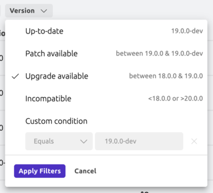

The Teleport Web UI is a web-based visual interface from which you can access resources,
view active sessions and recordings, create and review Access Requests,
manage users and roles, and more.

This page serves a reference on Web UI features and their usage.

## Joining an active session

The Teleport Web UI allows you to list and join active SSH sessions using a web-based terminal.

You can view the active SSH sessions that you are allowed to list by clicking **Active Sessions** in the navigation sidebar.

From the active sessions list, click **Join** and select a participant mode to join the session:

- **As an Observer** with read-only access to the session. You can view output but cannot control the session in any way nor
  send any input.
- **As a Peer** to collaborate in the session. You can view output and send input.
- **As a Moderator** with permission to watch, pause, or terminate the session. You can view output and forcefully terminate
  or pause the session at any time, but can't send input. Moderated sessions are an enterprise-only feature.


You must have the `join_sessions` allow policy in a role you've been assigned to join sessions in any participant mode.
For information about how to configure the `join_sessions` allow policy and participant modes for a role, see
[Configure an allow policy](../../zero-trust-access/authentication/joining-sessions.mdx).

## Idle timeout

After you log in, the Teleport Web UI checks every 30 seconds if your session is inactive. If so, it
logs you out. A session is considered inactive if more than 10 minutes have passed since you last
interacted with any Web UI browser tab, either through keyboard input or mouse movement and clicks.

To change the default idle timeout of 10 minutes, ask your cluster admin to adjust the
`web_idle_timeout` setting in the Auth Service configuration.

Use `tctl` to edit the `cluster_networking_config` value:

```code
$ tctl edit cluster_networking_config
```

Change the value of `spec.web_idle_timeout`:

```yaml
kind: cluster_networking_config
metadata:
  ...
spec:
  ...
  web_idle_timeout: 10m0s
  ...
version: v2
```

After you save and exit the editor, `tctl` will update the resource:

```text
cluster networking configuration has been updated
```

## Starting a database session

Starting from version `17.1`, users can establish database sessions using the
Teleport Web UI. Support for database sessions in the Web UI was later expanded to include CockroachDB in `18.1.5` and MySQL/MariaDB databases in `18.2.0`.

To start a new session, locate your database in the resources list and click
"Connect".


For supported databases, the dialog will present the option to start
the session in your browser.


After clicking on the "Connect in the browser" button, a new tab will open with
a form. Teleport will pre-fill this form based on your permissions, but you can
adjust the options as needed.


If your user has wildcard permissions (*), you can type custom values into the
form fields. This allows flexibility in selecting specific databases or
credentials.


Once you've filled in the session details, click the "Connect" button. Your
session will start, and a terminal interface will appear in the browser.

The browser-based terminal allows you to execute queries and interact with your
database. Follow the on-screen instructions to see available commands and
limitations.


<Admonition type="note" title="Database CLI compatibility">
  While the terminal interface provided in the Teleport Web UI is designed to
  resemble popular database CLIs such as `psql`, it is a custom implementation
  with some differences and limitations:
  - **Feature Set:** Not all features available in popular CLI tools are implemented.
    For instance, scripting capabilities, query cancellation, or informational
    commands like `\d` or `\dt` from `psql` are currently not supported.
  - **Error Handling:** Error messages and diagnostics might differ from what
    users are accustomed to.

  These distinctions are designed to maintain a lightweight and secure interface
  directly in your browser. For more complex operations, you may prefer
  accessing your database from your terminal using `tsh` and your preferred
  tool.

  Future updates may expand functionality or address feedback based on user
  needs and supported databases.
</Admonition>

## Instance inventory

The Instance Inventory page lists all connected instances and bot instances in your cluster, allowing you to
see details about them and identify instances running outdated versions of Teleport.

To access the page, navigate to **Zero Trust Access** > **Instance Inventory**. Your user must have the `instance.list` and
`instance.read` permissions to view instances, and the `bot_instance.list` and `bot_instance.read` permissions to view bot instances.


<Admonition type="note">
  Changes to the inventory, such as newly connected or updated instances, may
  take up to 20 minutes to appear.
</Admonition>

### Table columns

The table contains the following columns:

| Column         | Description                                                                                                                                                                                      |
| -------------- | ------------------------------------------------------------------------------------------------------------------------------------------------------------------------------------------------ |
| Host/Bot Name  | The hostname for an instance (a Teleport process running one or more services) or the bot name for a bot instance (a running Machine ID bot). The instance ID below can be clicked to be copied. |
| Version        | The version of Teleport running on the instance.                                                                                                                                                 |
| Type           | Whether this is an instance or a bot instance.                                                                                                                                                   |
| Services       | The services running on the instance. For a bot instance, this information will be found in the Bot Instances dashboard.                                                                         |
| Upgrader       | The external upgrader configured for the instance, if any.                                                                                                                                       |
| Upgrader Group | The updater group the instance belongs to, if any.                                                                                                                                               |

### Searching and filtering

Filter controls can be used to filter by various criteria like type, services, upgrader, and version. To filter by version,
you can either select one of the preset options or use your own custom condition.



The basic search can match for hostname, bot name, and instance ID. For more fine-tuned filtering, you can toggle **Advanced** mode and enter a predicate query.

| Example query                              | Description                                                       |
| ------------------------------------------ | ----------------------------------------------------------------- |
| `version == "18.2.0"`                      | Running Teleport version 18.2.0                                   |
| `older_than(version, "18.0.0")`            | Running a Teleport version older than 18.0.0                      |
| `newer_than(version, "17.0.0")`            | Running a Teleport version newer than 17.0.0                      |
| `between(version, "17.0.0", "18.0.0")`     | Running a Teleport version 17.0.0 or newer, and older than 18.0.0 |
| `spec.updater_group == "prod"`             | In the "prod" updater group                                       |
| `spec.external_upgrader == "kube-updater"` | Using the Kubernetes upgrader                                     |

You can combine queries with `&&` (and) or `||` (or), for example: `older_than(version, "18.0.0") && spec.updater_group == "prod"`.
