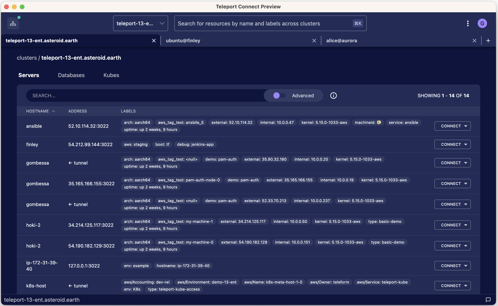
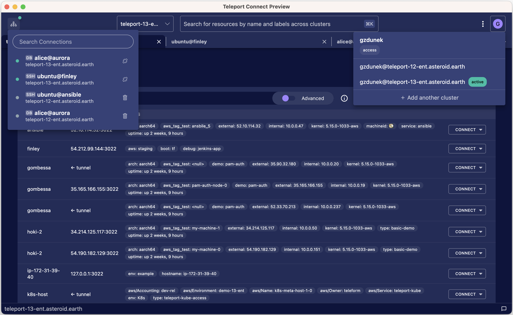

Teleport Connect provides easy and secure access to SSH servers, databases, and Kubernetes clusters,
with support for other resources coming in the future.



## Installation & upgrade

Head over to the [Downloads](https://goteleport.com/download/) page to download the most recent
version. Teleport Connect supports macOS, Linux, and Windows.

<Tabs>
<TabItem label="macOS">
Double-click the downloaded `.dmg` file and drag the Teleport Connect icon to the Applications folder.

To upgrade Teleport Connect to a newer version, drag the new version to the Applications folder.
</TabItem>
<TabItem label="Linux">
Download the DEB (Debian-based distros) or RPM (RHEL-based distros) package and install it using
your package manager. Repeat the process for in-place upgrades.

You can also download the project as a `tar.gz` file to extract and run it in place:

```code
$ tar -xf  teleport-(=teleport.version=)-linux-*.tar.gz
```
</TabItem>
<TabItem label="Windows">
Download and run the installer `.exe` file. It will install and open Teleport Connect without
further user input.

Repeat the process with newer versions to upgrade.

A silent installation can be performed by running the installer with the `/S` flag. This will hide
the progress bar and skip the launch of the app after the installation is complete.

```code
$ "Teleport Connect Setup-(=teleport.version=).exe" /S
```
</TabItem>
</Tabs>

## User interface



The top bar of Teleport Connect consists of:

- The **profile selector** (the top right), which allows you to switch between profiles on different
  Teleport clusters as well as log in or out of the clusters.
- The **connection list** (the top left) showing recent connections, allowing you to seamlessly switch
  between them.
- The **command bar** (in the middle), which launches any command you input in a new terminal tab.
- The **cluster selector** (to the left of the command bar), which shows up only if you have set up
  Trusted Clusters and there are leaf clusters connected to the root cluster. It lets you browse
  leaf cluster resources. It also changes which cluster the commands in the command bar are going to target.

The **status bar** at the bottom displays **cluster breadcrumbs** in the bottom left, indicating
which cluster the current tab is bound to, and the **Share Feedback** button in the bottom right.

## Connecting to an SSH server

1. Open a tab with cluster resources by clicking on the plus symbol at the right end of the tab bar.
   You can also press <span style="white-space: nowrap;">`Ctrl/Cmd + T`</span> to achieve the same result.
1. Look for the SSH server you want to connect to and click the Connect button to the right.
1. Select or enter the SSH user you wish to log in as and press `Enter`.

A new tab will open with a shell session on the chosen server.

Alternatively, you can type `tsh ssh` into the command bar in the Teleport Connect window, and the autocompletion will help
you connect to a server.

## Connecting to a Kubernetes cluster

1. Open a tab with cluster resources by clicking on the plus symbol at the right end of the tab bar.
   You can also press <span style="white-space: nowrap;">`Ctrl/Cmd + T`</span> to achieve the same result.
1. Select the Kubes section.
1. Look for the cluster you wish to connect to and click the Connect button to the right.

A new local terminal tab will open which is preconfigured with the `$KUBECONFIG` environment variable
pointing to a configuration for the specified cluster. Any tools that you have installed that respect
the `$KUBECONFIG` environment variable (`kubectl`, `helm`, etc.) will work without additional configuration.
To identify the path to this config for use in other tools, run `echo $KUBECONFIG`.

## Connecting to a database

1. Open a tab with cluster resources by clicking on the plus symbol at the end of the tab bar. You
  can also press <span style="white-space: nowrap;">`Ctrl/Cmd + T`</span> to achieve the same result.
1. Select the Databases section.
1. Look for the database server you wish to connect to and click the Connect button to the right.
1. Select or enter the database user you wish to use and press `Enter`.

A new tab will open with a new connection established between your device and the database server.

This connection will remain active until you click the Close Connection button or close Teleport
Connect. The port number will persist between app restarts—you can set up your favorite client
without worrying about the port suddenly changing.

### With a GUI client

To connect with a GUI client, follow the instructions in the database connection tab under the
Connect with GUI section.

### With a CLI client

The database connection tab shows the command that can be used to connect to the database. You can
modify the database name of the connection and then click the Run button to open a new terminal tab
with that command executed.

## Connecting to multiple clusters

Teleport Connect allows you to log in to multiple clusters at the same time. After logging in to
your first cluster, open the profile selector at the top right and click the *+Add another cluster*
button. You can switch between active profiles in multiple ways:

1. Click at the profile selector button at the top right.
1. Open the profile selector with a shortcut (<span style="white-space: nowrap;">`Ctrl/Cmd + I`</span>).
1. Select a connection from the connection list at the top to automatically switch to the right profile.

At the moment Teleport Connect supports only one user per cluster. To log in as a different user,
log out of the cluster first.

## Restarting and reconnecting

Before closing, Teleport Connect will remember the tabs that you had open at the end of the session.
Next time you open the app, Connect will ask you if you want to reopen those tabs. If you agree,
Connect will restore connections to all resources that were active before you closed the app.

When restoring terminal tabs, Teleport Connect doesn't attempt to re-execute commands that were in
progress when the app was closed. It will only restore the working directory for those tabs.

## Using tsh outside of Teleport Connect

Teleport Connect ships with its own bundled version of tsh. Teleport Connect will always use this
version of tsh for any actions performed within the app.

Teleport Connect makes tsh available to use in your terminal of choice as well. Please note that at
the moment tsh and Teleport Connect operate on different sets of profiles, as Teleport Connect sets
a custom home location through [the `TELEPORT_HOME` environment
variable](../reference/cli.mdx#tsh-environment-variables). For example, logging in to a new cluster
through tsh will not make that cluster show up in Teleport Connect.


<Tabs>
<TabItem label="macOS">
To add tsh to `PATH`, execute `tsh install` from the command bar in Teleport Connect. This will
symlink tsh to `/usr/local/bin`. You can remove the symlink with `tsh uninstall`.

If you used the tsh macOS .pkg installer before, this will overwrite the symlink made by that installer.
</TabItem>
<TabItem label="Linux">
During installation, Teleport Connect automatically adds a symlink to tsh under
`/usr/local/bin/tsh`, unless you have already installed the `teleport` package, which also creates
that symlink.
</TabItem>
<TabItem label="Windows">
During installation, Teleport Connect automatically adds the `resources\bin` folder from the
installation directory to the `Path` user environment variable.
</TabItem>
</Tabs>

## Troubleshooting

Logging out of a cluster, closing the app and logging in again resets all app state related to that
cluster. This can help if you encounter a bug which renders the user interface partially unusable.
It might also help if you have issues with connecting to an active cluster that don't happen in the
Web UI.

<Tabs>
<TabItem label="macOS">
To force the app to log you out of all clusters, close the app and remove the `~/Library/Application
Support/Teleport Connect/tsh` folder. Removing the file `~/Library/Application
Support/Teleport Connect/app_state.json` will clear all remembered tabs and connections.
</TabItem>
<TabItem label="Linux">
To force the app to log you out of all clusters, close the app and remove the `~/.config/Teleport
Connect/tsh` folder. Removing the file `/.config/Teleport Connect/app_state.json` will clear
all remembered tabs and connections.
</TabItem>
<TabItem label="Windows">
To force the app to log you out of all clusters, close the app and remove the
`C:\Users\%UserName%\AppData\Roaming\Teleport Connect\tsh` folder. Removing the file
`C:\Users\%UserName%\AppData\Roaming\Teleport Connect\app_state.json` will clear all remembered tabs
and connections.
</TabItem>
</Tabs>

### Submitting an issue

To submit an issue, click the Submit Feedback button at the bottom right (the speech bubble symbol)
and follow the *Submit a Bug* link.

<Tabs>
<TabItem label="macOS">
Be sure to attach logs, which can be found under `~/Library/Application Support/Teleport Connect/logs`.
The version of the app can be found in the app menu under the About Teleport Connect menu item.
</TabItem>
<TabItem label="Linux">
Be sure to attach logs, which can be found under `~/.config/Teleport Connect/logs`. The app version
can be found by pressing `Alt` to access the app menu, then -> Help -> About Teleport Connect.
</TabItem>
<TabItem label="Windows">
Be sure to attach logs, which can be found under `C:\Users\%UserName%\AppData\Roaming\Teleport Connect\logs`.
You may need to adjust File Explorer to [view hidden files and folders](https://support.microsoft.com/en-us/search?query=how%20to%20view%20hidden%20files%20in%20windows%2010).
The app version can be found by pressing `Alt` to access the app menu -> Help -> About Teleport Connect.
</TabItem>
</Tabs>

### Updating local shell environment

Teleport Connect updates and caches the local shell environment on app restart and not when starting
a new shell session. If you add new environment variables to your shell startup files, Connect will
see them only after you restart the app.

### Skipping TLS certificate verification

You can open Teleport Connect in insecure mode, which skips TLS certificate verification when
talking to a Teleport Proxy Service. This is useful in [test environments with self-signed
certificates](../management/admin/self-signed-certs.mdx) or for demo purposes. We do not recommend
using this mode in production.

<Tabs>
<TabItem label="macOS">
To launch the app in insecure mode, open a terminal first. From there you can launch the app in one
of two ways:

```code
# Using macOS open utility:
$ open -a "Teleport Connect" --args --insecure

# Passing the flag to the executable directly:
$ /Applications/Teleport\ Connect.app/Contents/MacOS/Teleport\ Connect --insecure
```
</TabItem>
<TabItem label="Linux">
From a terminal, open Teleport Connect with the `--insecure` flag:

```code
$ teleport-connect --insecure
````
</TabItem>
<TabItem label="Windows">
From the Command Prompt, open Teleport Connect with the `--insecure` flag:

```code
$ "%LocalAppData%\Programs\teleport-connect\Teleport Connect.exe" --insecure
````
</TabItem>
</Tabs>

## Uninstalling Teleport Connect

<Tabs>
<TabItem label="macOS">

Remove Teleport Connect for MacOS from the Applications directory with this command:

```code
$ sudo rm -f /Applications/Teleport\ Connect.app
```

To remove the local user data directory:

```code
$ rm -rf ~/Library/Application\ Support/Teleport\ Connect
```

</TabItem>
<TabItem label="Windows">

(!docs/pages/includes/uninstall-teleport-connect-windows.mdx!)

To remove the local user data directory:

```powershell
$ rmdir /s /q "%APPDATA%\Teleport Connect"
```

</TabItem>
<TabItem label="Linux">

For DEB installations uninstall Teleport Connect using APT:

```code
$ sudo apt remove teleport-connect
```

For RPM installations uninstall Teleport Connect using YUM:

```code
$ sudo yum remove teleport-connect
```

Installs based on a tarball should remove the
`teleport-connect` directory and any copied/linked executables.

</TabItem>
</Tabs>
