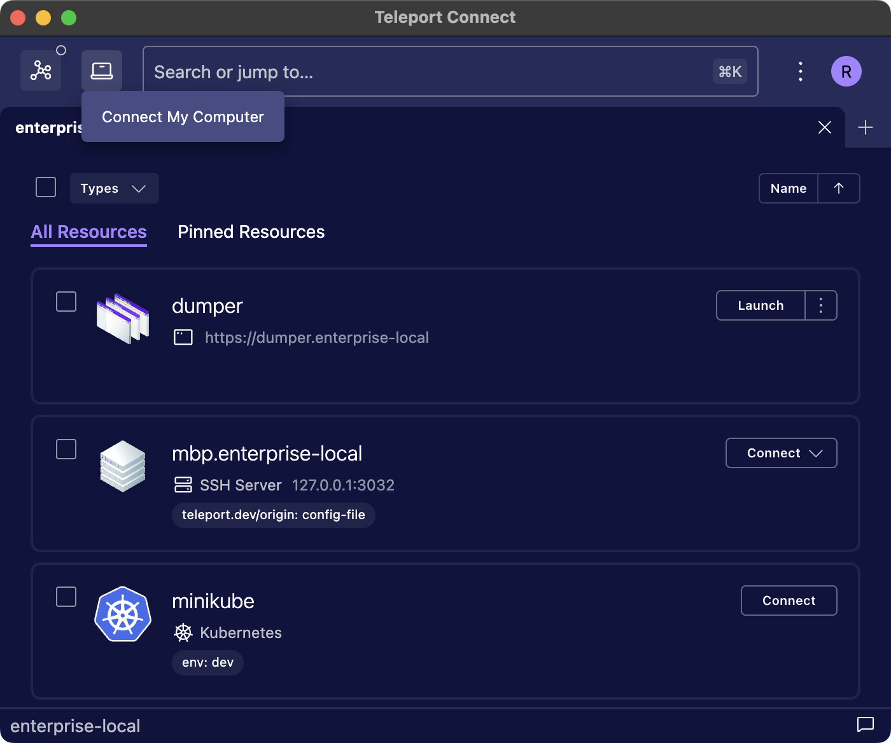
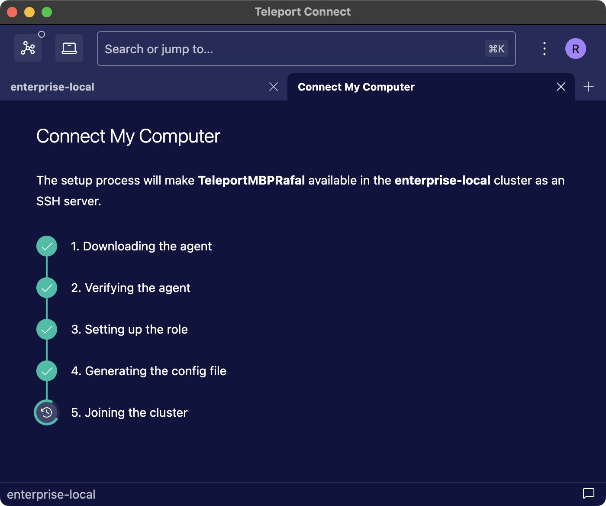
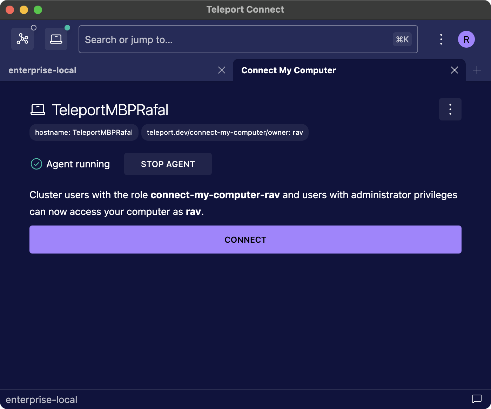

Teleport Connect provides easy and secure access to SSH servers, databases, applications, and
Kubernetes clusters.


## Installation & upgrade

Head over to the [Downloads](https://goteleport.com/download/) page to download the most recent
version. Teleport Connect supports macOS, Linux, and Windows.

<Tabs>
<TabItem label="macOS">
Double-click the downloaded `.dmg` file and drag the Teleport Connect icon to the Applications folder.

To upgrade Teleport Connect to a newer version, drag the new version to the Applications folder.
</TabItem>
<TabItem label="Linux">
Download the DEB (Debian-based distros) or RPM (RHEL-based distros) package and install it using
your package manager. Repeat the process for in-place upgrades.

You can also download the project as a `tar.gz` file to extract and run it in place:

```code
$ tar -xf  teleport-connect-(=teleport.version=)-linux-*.tar.gz
```
</TabItem>
<TabItem label="Windows">
Download and run the installer `.exe` file. It will install and open Teleport Connect without
further user input.

The installer requires Administrator privileges and if you run the installer as
a regular user it will automatically prompt for admin rights.
If you run the installer as an admistrator (start cmd.exe with "Run as administrator")
then the prompt will not be necessary.

Repeat the process with newer versions to upgrade.

A silent installation can be performed by running the installer as an
administrator with the `/S` flag. This will hide the progress bar and skip the
launch of the app after the installation is complete.

```code
$ "Teleport Connect Setup-(=teleport.version=).exe" /S
```

In version 17.3.0+ Connect is installed per-machine.
In older versions Connect was installed only for the user running the installer.
When upgrading to 17.3.0+ from an older version, the installer will
automatically handle the migration to a per-machine installation.

</TabItem>
</Tabs>

## User interface


The top bar of Teleport Connect consists of:

- The **profile selector** (the top right), which allows you to switch between profiles on different
  Teleport clusters as well as log in or out of the clusters.
- The **connection list** (the top left) showing recent connections, allowing you to seamlessly switch
  between them.
- The **search bar** (in the middle), which allows you to search for resources across clusters.
- The **cluster selector** (to the left of the search bar), which shows up only if you have set up
  trusted clusters and there are leaf clusters connected to the root cluster. It lets you browse
  leaf cluster resources. Also, the "Open new terminal" action will bind new terminal tabs to the selected cluster.
- The **additional actions menu** (to the left of the profile selector), containing options such as
  opening a config file or creating an access request in an Enterprise cluster.

The **status bar** at the bottom displays **cluster breadcrumbs** in the bottom left, indicating
which cluster the current tab is bound to, and the **Share Feedback** button in the bottom right.

## Connecting to an SSH server

1. Open a tab with cluster resources by clicking on the plus symbol at the right end of the tab bar.
   You can also press `Ctrl+Shift+T/Cmd+T` to achieve the same result.
1. Look for the SSH server you want to connect to and click the Connect button.
1. Select or enter the SSH user you wish to log in as and press `Enter`.

A new tab will open with a shell session on the chosen server.

Alternatively, you can look for the server in the search bar and press `Enter` to connect to it.

## Opening a local terminal

To open a terminal with a local shell session, either select "Open new terminal" from the additional
actions menu or press `` Ctrl+Shift+` ``.

Any tsh command executed within the tab targets the current cluster. Teleport Connect accomplishes
this by setting the environment variables `TELEPORT_PROXY` and `TELEPORT_CLUSTER` for the session.
Additionally, Teleport Connect prepends the `PATH` environment variable in the session with the
directory containing the tsh binary, even if [tsh is not globally available](#using-tsh-outside-of-teleport-connect).

When using [trusted clusters](../admin-guides/management/admin/trustedclusters.mdx), the cluster selector allows
you to determine which cluster the shell session will be bound to. The selected cluster will be
reflected in both the tab title and the status bar.

### Changing the terminal shell

By default, Teleport Connect launches the user shell on macOS/Linux and PowerShell on Windows.
To switch to a different shell, right-click on a terminal tab (either a local terminal or a Kubernetes session).
From the menu, choose a predefined shell (on Windows) or provide the path to a custom shell.

The selected shell will be used only for that tab unless you choose to set it as the default.


The configuration is stored under `terminal.shell` and `terminal.customShell` config properties.
For more details, refer to the [Configuration](#configuration) section.

## Connecting to a Kubernetes cluster

1. Open a tab with cluster resources by clicking on the plus symbol at the right end of the tab bar.
   You can also press `Ctrl+Shift+T/Cmd+T` to achieve the same result.
1. Look for the cluster you wish to connect to and click the Connect button.

Alternatively, you can look for the cluster in the search bar and press `Enter`
to connect to it.

A new local terminal tab will open which is preconfigured with the `KUBECONFIG`
environment variable pointing to a configuration for the specified cluster. Any
tools that respect the `KUBECONFIG` environment variable (`kubectl`, `helm`,
etc.) will work without additional configuration. To identify the path to this
config for use in other tools, inspect the value of the `KUBECONFIG`
environment variable.

The value of the `KUBECONFIG` environment variable will persist between app
restarts, but this configuration file will not be available or usable when the
Kubernetes cluster is removed from the connection list in the top left, or when
Teleport Connect is closed.

## Connecting to a database

1. Open a tab with cluster resources by clicking on the plus symbol at the end of the tab bar. You
  can also press `Ctrl+Shift+T/Cmd+T` to achieve the same result.
1. Look for the database server you wish to connect to and click the Connect button.
1. Select or enter the database user you wish to use and press `Enter`.

A new tab will open with a new connection established between your device and the database server.

Alternatively, you can look for the database in the search bar and press `Enter` to connect to it.

This connection will remain active until you click the Close Connection button or close Teleport
Connect. The port number will persist between app restarts—you can set up your favorite client
without worrying about the port suddenly changing.

### With a GUI client

To connect with a GUI client, follow the instructions in the database connection tab under the
Connect with GUI section.

### With a CLI client

The database connection tab shows the command that can be used to connect to the database. You can
modify the database name of the connection and then click the Run button to open a new terminal tab
with that command executed.

## Connecting to an application

Teleport Connect supports launching applications in the browser, as well as creating
authenticated tunnels for web and TCP applications.

When it comes to [cloud APIs secured with Application Access](../enroll-resources/application-access/cloud-apis/cloud-apis.mdx),
Teleport Connect supports launching the AWS console in the browser, but other CLI applications can
be used only through tsh in [a local terminal tab](#opening-a-local-terminal).

### Launching an application in the browser

Teleport Connect can open a web app in the browser. As browsers and Teleport Connect do not share
authentication data, you will have to log in to the Web UI before accessing an app.

1. Open a tab with cluster resources by clicking on the plus symbol at the end of the tab bar. You
  can also press `Ctrl+Shift+T/Cmd+T` to achieve the same result.
1. Look for the application you wish to open and click the Launch button (web apps and AWS console)
   or the Login button (SAML apps).

Alternatively, you can look for the application in the search bar and press `Enter` to launch it in
the browser.

### Connecting to TCP apps with VNet on macOS and Windows

VNet is a virtual network emulation tool available in Teleport Connect. It enables any program on
your computer to connect to TCP applications protected by Teleport, with no extra changes required
to the program itself. It removes the need to manually create tunnels for TCP applications.

This is the recommended way of connecting to TCP apps.

1. Log in to your Teleport cluster.
1. To start VNet, open the connection list in the top left and click the connect icon to the right of
   VNet.
1. Now access any of your TCP apps over its regular public address.

VNet automatically authenticates the connection with your user certificate. See [Using
VNet](vnet.mdx) for more details.

### Creating an authenticated tunnel

Teleport Connect can set up an authenticated tunnel on a random port on your device. All connections
made to that tunnel will be authenticated with your credentials.

Use this method if you want to access an HTTP API that was added to Teleport as a web app (its
address starts with `https://`), if you don't have administrator rights to your device, or if VNet
is not yet available on your system.

1. Open a tab with cluster resources by clicking on the plus symbol at the end of the tab bar. You
  can also press `Ctrl+Shift+T/Cmd+T` to achieve the same result.
1. Look for the application you wish to connect to.
  - For TCP applications, click the Connect button.
    - On macOS and Windows, click the three dots instead and select "Connect to local port".
  - For web applications, click the three dots next to the Launch button and select "Set up
    connection".

Alternatively, on Linux you can look for a TCP application in the search bar and
press `Enter` to set up a connection to it.

A new tab will open with a new connection established between your device and the application.

This connection will remain active until you click the Close Connection button or close Teleport
Connect. The port number will persist between app restarts—you can set up your favorite client
without worrying about the port suddenly changing.

The application connection tab shows an example command that can be used to query the application.
Requests sent under the displayed address will be proxied through an authenticated tunnel to the
application.

## Connecting to multiple clusters

Teleport Connect allows you to log in to multiple clusters at the same time. After logging in to
your first cluster, open the profile selector at the top right and click the *+Add another cluster*
button. You can switch between active profiles in multiple ways:

1. Click at the profile selector button at the top right.
1. Open the profile selector with a shortcut (`Ctrl+Shift+I/Cmd+I`).
1. Select a connection from the connection list at the top to automatically switch to the right profile.

At the moment Teleport Connect supports only one user per cluster. To log in as a different user,
log out of the cluster first.

## Restarting and reconnecting

Before closing, Teleport Connect will remember the tabs that you had open at the end of the session.
Next time you open the app, Connect will ask you if you want to reopen those tabs. If you agree,
Connect will restore connections to all resources that were active before you closed the app.

When restoring terminal tabs, Teleport Connect doesn't attempt to re-execute commands that were in
progress when the app was closed. It will only restore the working directory for those tabs.

## Connect My Computer

Connect My Computer makes it possible to add your personal machine to a Teleport cluster in just a
couple of clicks.

It is the easiest way to add a computer to the cluster, whether you're exploring the capabilities of
Teleport or want your computer to be available in a Teleport-powered home lab.

Connect My Computer sets up a Teleport agent managed completely by Teleport Connect, without having
to use the terminal to get the job done and without the need for tools like `systemctl` to control
the lifecycle of the agent.

### Prerequisites

(!docs/pages/connect-your-client/includes/connect-my-computer-prerequisites.mdx!)
{/* The permission to read and update users is needed during setup but not for regular usage,
that's why it's not listed in the partial. */}
- Permissions to read and update user objects in the backend (verbs `read` and `update` for [the
  `user` resource](../reference/access-controls/roles.mdx)).
- Permissions to read, update, and create roles in the backend (verbs `read`, `update`, and `create`
  for [the `role` resource](../reference/access-controls/roles.mdx)).

The agent runs as the current system user, not as root. Some features are thus not available, such
as logging in as other system users or [host user creation](../enroll-resources/server-access/guides/host-user-creation.mdx).

### Setup and usage

To begin the setup, click on the laptop icon in the top left and select "Connect My Computer". The
new tab will guide you through an interaction-free setup. Click "Connect" to start the setup.



The setup creates a new role in the cluster which grants access to your device as the current system
user. The role is then added to your user object.

<Admonition type="warning">
The role is responsible merely for granting SSH access as your system user to the node managed by
Connect My Computer. The node is subject to RBAC like any other SSH node in the cluster.

In practice it means that users with administrative privileges can craft another role which grants
access to the node or simply assign the Connect My Computer role to themselves.

We recommend using Connect My Computer only in scenarios where no other user could plausibly gain
access to the node, such as when exploring a Teleport cluster as its only user or in a home lab.
</Admonition>

Next, the setup downloads a Teleport agent for your platform and runs `teleport node configure`
pointed at the current cluster. Once that is done, Connect My Computer starts the agent and waits
for it to show up in the cluster as an SSH node.



After the agent joins the cluster, the tab transitions to showing the status of the agent. From
here, you can connect to the node made available by the agent, stop and start the agent, as well as
completely remove it. Manually logging out of the cluster will remove the agent as well.



Your computer will be shared while Teleport Connect is open. To stop sharing, close Teleport Connect
or stop the agent through the Connect My Computer tab. Sharing will resume on app restart, unless
you stop the agent before exiting. The agent stops immediately if Teleport Connect unexpectedly
crashes.

### Agent maintenance

The version of the agent downloaded by Teleport Connect always matches the version of Teleport
Connect. After upgrading Teleport Connect, Connect My Computer is going to automatically attempt to
download a matching agent version before launching the agent.

Connect My Computer always stores just a single version of the agent on disk.

<Tabs>
<TabItem label="macOS">
The agent is stored at `~/Library/Caches/Teleport Connect/teleport/teleport`.
</TabItem>
<TabItem label="Linux">
The agent is stored at `~/.cache/Teleport Connect/teleport/teleport` by default. The path respects
`$XDG_CACHE_HOME`.
</TabItem>
</Tabs>

### Troubleshooting Connect My Computer

#### Accessing agent logs

After the setup is done, open the Connect My Computer tab and from the three dots menu within the
tab choose "Open agent logs directory".

<Tabs>
  <TabItem label="macOS">
    The logs are stored at <code>~/Library/Application Support/Teleport Connect/agents/&lt;cluster&gt;/logs</code>.
  </TabItem>
  <TabItem label="Linux">
    The logs are stored at <code>~/.config/Teleport Connect/agents/&lt;cluster&gt;/logs</code>.
  </TabItem>
</Tabs>

#### The Connect My Computer icon is not visible in the top bar

The icon is visible only if your setup satisfies the following requirements:

(!docs/pages/connect-your-client/includes/connect-my-computer-prerequisites.mdx!)

#### The Connect My Computer tab says that the agent is running, but the computer is not visible in the cluster

Click "Connect" in the Connect My Computer tab. If the error message in the new tab says "access
denied", it likely means that there's a role assigned to your cluster user which denies access to
the Connect My Computer node, either by denying the specific login or access to the node itself
through fields like `node_labels`. To resolve this problem, inspect the role list in the Management
section of the Web UI. First, check what roles are assigned to your user object and then inspect
each role. Look for a role with broad `deny` rules.

If the error message mentions a node or a tunnel not being found, it means that while the cluster
has a cached view of the agent, the agent did not join the cluster just yet. Wait for a couple of
seconds and try connecting to the node again. If the problem persists, check [the agent logs](#accessing-agent-logs).

#### Connect My Computer does not work after changing system username

The system username that was in use at the time of configuring Connect My Computer is persisted in
the Connect My Computer role for the given cluster user. To regain access to the Connect My Computer
node, add the new system username under the `logins` section of the role. The role can be identified
by its name following the format `connect-my-computer-<name of cluster user>`.

Another solution is to [restart the setup](#restarting-the-setup).

#### The agent cannot join the cluster and the logs say the token has expired or was not found

In that scenario, the agent emits logs like these when starting up:

```text
INFO [PROC:1]    Joining the cluster with a secure token. pid:54364.1 service/connect.go:460
INFO [AUTH]      Attempting registration via proxy server. auth/register.go:279
ERRO [PROC:1]    Can not join the cluster as node, the token expired or not found. Regenerate the token and try again. pid:54364.1 service/connect.go:106
```

During the setup, Connect My Computer creates [a join token](../enroll-resources/agents/join-services-to-your-cluster/join-token.mdx)
that is valid for up to five minutes. If the logs say that the token has expired, it most likely
means that the initial attempt to join the cluster has failed and you started another one after more
than five minutes.

To resolve this problem, remove the agent and [perform the setup again](#restarting-the-setup).

#### Restarting the setup

Since Teleport nodes are completely stateless, in case of problems with starting the agent or
joining the cluster you may attempt to run the setup again. Either click "Retry" if the setup has
failed or choose "Remove agent" from the three dots menu within the Connect My Computer tab after
the agent was successfully configured.

#### Preventing user access to Connect My Computer

If you wish to prevent cluster users from using Connect My Computer, make sure they don't have
permissions to create new join tokens. This is controlled by the `create` verb for the `token`
resource. Either deny this permission explicitly or do not grant it in the first place. See [Access
Controls Reference Documentation](../reference/access-controls/roles.mdx) for more
details. Denying this permission will hide the icon in the top bar.

Users who already set up agents will still be able to manage those agents, even after the denying
them permissions to create join tokens. This is to ensure that a malicious admin is not able to make
a user set up an agent and then lock the user out of removing the agent.

To instantly revoke access to agents that have already joined the cluster, look for nodes labeled
with the `teleport.dev/connect-my-computer/owner` label and then [place
locks](../admin-guides/access-controls/guides/locking.mdx) on those nodes.

```code
$ tctl nodes ls -v --query='labels["teleport.dev/connect-my-computer/owner"] != ""'
$ tctl lock --server-id=SERVER_UUID --message="Using Connect My Computer is forbidden"
```

## Using tsh outside of Teleport Connect

Teleport Connect ships with its own bundled version of tsh. Teleport Connect will always use this
version of tsh for any actions performed within the app.

Teleport Connect makes tsh available to use in your terminal of choice as well. Please note that at
the moment tsh and Teleport Connect operate on different sets of profiles, as Teleport Connect sets
a custom home location through [the `TELEPORT_HOME` environment
variable](../reference/cli/tsh.mdx#tsh-environment-variables). For example, logging in to a new cluster
through tsh will not make that cluster show up in Teleport Connect.

<Tabs>
<TabItem label="macOS">
To add tsh to `PATH`, open the additional actions menu and select "Install tsh in PATH". This will
symlink tsh to `/usr/local/bin`. You can remove the symlink by selecting "Remove tsh from PATH".

If you used the tsh macOS .pkg installer before, this will overwrite the symlink made by that installer.
</TabItem>
<TabItem label="Linux">
During installation, Teleport Connect automatically adds a symlink to tsh under
`/usr/local/bin/tsh`, unless you have already installed the `teleport` package, which also creates
that symlink.
</TabItem>
<TabItem label="Windows">
During installation, Teleport Connect automatically adds the `resources\bin` folder from the
installation directory to the `Path` user environment variable.
</TabItem>
</Tabs>

## Hardware key support

Teleport Connect supports authenticating with hardware-based keys.
Keys are generated and stored directly on a hardware device, providing greater security than storing
them on a file system. For more details, see [Hardware Key Support guide](../admin-guides/access-controls/guides/hardware-key-support.mdx).

<Admonition type="note" title="PIV support">
  Hardware key support requires users to use a PIV-compatible hardware key.
  Currently, this feature is only guaranteed to support YubiKey series 5+.
</Admonition>

To log in with a hardware key, your role or cluster configuration must enable it.
Once enforced, Teleport Connect will require you to keep the hardware key plugged in and may also prompt for a tap and/or PIV PIN:


When logging in for the first time, you’ll be prompted to log in again immediately.

If your key is set to the default PIV PIN, you may be prompted to change it at this step.
Entering a default or empty PIN will open a dialog to update it.

## Configuration

Teleport Connect can be configured by editing the `app_config.json` file, which it creates on first launch.
To open the config file, select "Open config file" from the additional actions menu.
The file will open in your default editor.

<Admonition
  type="note"
  title="Note"
>
  Any changes to the config file will take effect at the next launch.
</Admonition>

Below is the list of the supported config properties.

| Property                      | Default                                                                                                              | Description                                                                                                |
|-------------------------------|----------------------------------------------------------------------------------------------------------------------|------------------------------------------------------------------------------------------------------------|
| `theme`                       | `system`                                                                                                             | Color theme for the app. Available modes: `light`, `dark`, `system`.                                       |
| `terminal.fontFamily`         | `Menlo, Monaco, monospace` on macOS `Consolas, monospace` on Windows `'Droid Sans Mono', monospace` on Linux | Font family for the terminal.                                                                              |
| `terminal.fontSize`           | `15`                                                                                                                 | Font size for the terminal.                                                                                |
| `terminal.windowsBackend` | `auto` | `auto` uses modern [ConPTY](https://devblogs.microsoft.com/commandline/windows-command-line-introducing-the-windows-pseudo-console-conpty/) system if available, which requires Windows 10 (19H1) or above. Set to `winpty` to use winpty even if ConPTY is available. |
| `terminal.shell` | Default user shell on macOS/Linux, `pwsh.exe`/`powershell.exe` on Windows | A default terminal shell. Can be set to `custom` to take the shell path from `terminal.customShell`. It is best to configure it through UI (right click on a terminal tab > Default Shell). |
| `terminal.customShell` |  | Path to the custom shell that is used when `terminal.shell` is set to `custom`. It is best to configure it through UI (right click on a terminal tab > Custom Shell…). |
| `terminal.rightClick`         | `menu` on macOS/Linux `copyPaste` on Windows | `paste` pastes clipboard content, `copyPaste` copies if text is selected, otherwise pastes, `menu` shows context menu.                                                         |
| `terminal.copyOnSelect`       | `false` | Automatically copies selected text to the clipboard.                                                                                                                                                                      |
| `usageReporting.enabled`      | `false`                                                                                                              | Enables collecting anonymous usage data (see [Telemetry](#telemetry)).                                     |
| `keymap.tab1` - `keymap.tab9` | `Command+1` - `Command+9` on macOS   `Ctrl+1` - `Ctrl+9` on Windows `Alt+1` - `Alt+9` on Linux               | Shortcut to open tab 1–9.                                                                                  |
| `keymap.closeTab`             | `Command+W` on macOS `Ctrl+Shift+W` on Windows/Linux                                                             | Shortcut to close a tab.                                                                                   |
| `keymap.newTab`               | `Command+T` on macOS `Ctrl+Shift+T` on Windows/Linux                                                             | Shortcut to open a new tab.                                                                                |
| `keymap.newTerminalTab`       | `` Control+Shift+` `` on macOS `` Ctrl+Shift+` `` on Windows/Linux                                               | Shortcut to open a new terminal tab.                                                                       |
| `keymap.terminalCopy`         | `Command+C` on macOS `Ctrl+Shift+C` on Windows/Linux                                                             | Shortcut to copy text in the terminal.                                                                     |
| `keymap.terminalPaste`        | `Command+V` on macOS `Ctrl+Shift+V` on Windows/Linux                                                             | Shortcut to paste text in the terminal.                                                                    |
| `keymap.terminalSearch`       | `Command+F` on macOS `Ctrl+Shift+F` on Windows/Linux                                                             | Shortcut to open a search field in the terminal.                                                           |
| `keymap.previousTab`          | `Control+Shift+Tab` on macOS `Ctrl+Shift+Tab` on Windows/Linux                                                   | Shortcut to go to the previous tab.                                                                        |
| `keymap.nextTab`              | `Control+Tab` on macOS `Ctrl+Tab` on Windows/Linux                                                               | Shortcut to go to the next tab.                                                                            |
| `keymap.openConnections`      | `Command+P` on macOS `Ctrl+Shift+P` on Windows/Linux                                                             | Shortcut to open the connection list.                                                                      |
| `keymap.openClusters`         | `Command+E` on macOS `Ctrl+Shift+E` on Windows/Linux                                                             | Shortcut to open the cluster selector.                                                                     |
| `keymap.openProfiles`         | `Command+I` on macOS `Ctrl+Shift+I` on Windows/Linux                                                             | Shortcut to open the profile selector.                                                                     |
| `keymap.openSearchBar`        | `Command+K` on macOS `Ctrl+Shift+K` on Windows/Linux                                                             | Shortcut to open the search bar.                                                                           |
| `headless.skipConfirm`        | `false`                                                                                                              | Skips the confirmation prompt for Headless WebAuthn approval and instead prompts for WebAuthn immediately. |
| `ssh.noResume`                | `false`                                                                                                              | Disables SSH connection resumption.                                                                        |
| `ssh.forwardAgent`            | `false`                                                                                                              | Enables agent forwarding.                                                                                  |
| `sshAgent.addKeysToAgent`     | `auto`                                                                                                               | Controls how keys are added to a local SSH agent. "auto" adds the keys only if the agent supports SSH certificates, "no" never attempts to add them, "yes" always attempts to add them, "only" always attempts to add the keys to the agent but it does not save them on disk. |

<Admonition
  type="note"
  title="Note"
>
  The additional `$schema` property present in the config file allows text editors to provide autocompletion.
  It should not be modified.
</Admonition>

### Configuring keyboard shortcuts

A valid shortcut contains at least one modifier and a single key code, for example `Shift+Tab`.
Function keys such as `F1` do not require a modifier.
Modifiers and a key code must be combined by the `+` character.

Available modifiers:

- `Control`, `Option`, `Shift`, `Command` on macOS.
- `Ctrl`, `Alt`, `Shift` on Windows and Linux.

Available key codes:
- `0` to `9`
- `A` to `Z`
- `F1` to `F24`
- `,`, `.`, `/`, `\`, `` ` ``, `-`, `=`, `;`, `'`, `[`, `]`
- `Space`, `Tab`, `CapsLock`, `NumLock`, `ScrollLock`, `Backspace`, `Delete`, `Insert`, `Enter`, `Up`, `Down`, `Left`, `Right`, `Home`, `End`, `PageUp`, `PageDown`, `Escape`, `IntlBackslash`

## Telemetry

(!docs/pages/includes/teleport-connect-telemetry.mdx!)

### Disabling telemetry

If you initially agreed to share telemetry data, but now want to opt out, you need to set `usageReporting.enabled` in the config to `false` (see [Configuration](#configuration)):
```json
"usageReporting.enabled": false
```

The changes will take effect at the next launch.

## Troubleshooting

Resetting the app state might help with UI crashes caused by Teleport Connect getting into an
abnormal state. This might happen after downgrading Teleport Connect or performing substantial
server-side changes. Those UI crashes typically manifest as a blank window or an Internal Error
alert.

To reset the state related to a particular cluster:

1. Log out of the cluster.
1. Close Teleport Connect.
1. Open Teleport Connect, then log back in to the cluster.

To completely wipe all app state:

1. Close Teleport Connect.
1. Remove the internal `tsh` folder and the `app_state.json` file to log out of all clusters and
   clear all remembered tabs and connections.

<Tabs>
<TabItem label="macOS">
```code
$ rm -rf ~/Library/Application\ Support/Teleport\ Connect/{tsh,app_state.json}
```
</TabItem>
<TabItem label="Linux">
```code
$ rm -rf ~/.config/Teleport\ Connect/{tsh,app_state.json}
```
</TabItem>
<TabItem label="Windows">
```code
$ rmdir /s /q C:\Users\%UserName%\AppData\Roaming\"Teleport Connect"\tsh
$ del C:\Users\%UserName%\AppData\Roaming\"Teleport Connect"\app_state.json
```
</TabItem>
</Tabs>

### Submitting an issue

To submit an issue, click the Submit Feedback button at the bottom right (the speech bubble symbol)
and follow the *Submit a Bug* link.

<Tabs>
<TabItem label="macOS">
Be sure to attach logs, which can be found in the app menu under Help -> Open Logs Directory. The
logs are stored in `~/Library/Application Support/Teleport Connect/logs`.

The app version can be found in the app menu under Teleport Connect -> About Teleport Connect.

To get more detailed logs, run Teleport Connect with the `--connect-debug` flag:

(!docs/pages/connect-your-client/includes/launch-connect-with-flags-macos.mdx flags="--connect-debug"!)
</TabItem>
<TabItem label="Linux">
Be sure to attach logs, which can be found by pressing `Alt` to access the app menu, then Help ->
Open Logs Directory. The logs are stored in `~/.config/Teleport Connect/logs`.

The app version can be found under Help -> About Teleport Connect.

To get more detailed logs, run Teleport Connect with the `--connect-debug` flag:

```code
$ teleport-connect --connect-debug
````
</TabItem>
<TabItem label="Windows">
Be sure to attach logs, which can be found by pressing `Alt` to access the app menu, then Help ->
Open Logs Directory. The logs are stored in `C:\Users\%UserName%\AppData\Roaming\Teleport
Connect\logs`.
You may need to adjust File Explorer to [view hidden files and folders](https://support.microsoft.com/en-us/search?query=how%20to%20view%20hidden%20files%20in%20windows%2010).

The app version can be found under Help -> About Teleport Connect.

To get more detailed logs, open Teleport Connect from the Command Prompt with the `--connect-debug` flag:

```code
$ "%PROGRAMFILES%\Teleport Connect\Teleport Connect.exe" --connect-debug
````
</TabItem>
</Tabs>

### Updating local shell environment

Teleport Connect updates and caches the local shell environment on app restart and not when starting
a new shell session. If you add new environment variables to your shell startup files, Connect will
see them only after you restart the app.

### Skipping TLS certificate verification

You can open Teleport Connect in insecure mode, which skips TLS certificate verification when
talking to a Teleport Proxy Service. This is useful in [test environments with self-signed
certificates](../admin-guides/management/admin/self-signed-certs.mdx) or for demo purposes. We do not recommend
using this mode in production.

<Tabs>
<TabItem label="macOS">
To launch the app in insecure mode, open a terminal first. From there you can launch the app in one
of two ways:

(!docs/pages/connect-your-client/includes/launch-connect-with-flags-macos.mdx flags="--insecure"!)

</TabItem>
<TabItem label="Linux">
From a terminal, open Teleport Connect with the `--insecure` flag:

```code
$ teleport-connect --insecure
````
</TabItem>
<TabItem label="Windows">
From the Command Prompt, open Teleport Connect with the `--insecure` flag:

```code
$ "%PROGRAMFILES%\Teleport Connect\Teleport Connect.exe" --insecure
````
</TabItem>
</Tabs>

## Uninstalling Teleport Connect

<Tabs>
<TabItem label="macOS">

Remove Teleport Connect for macOS from the Applications directory with this command:

```code
$ sudo rm -rf /Applications/Teleport\ Connect.app
```

To remove the local user data directory:

```code
$ rm -rf ~/Library/Application\ Support/Teleport\ Connect
```

</TabItem>
<TabItem label="Windows">

(!docs/pages/includes/uninstall-teleport-connect-windows.mdx!)

To remove the local user data directory:

```powershell
$ rmdir /s /q "%APPDATA%\Teleport Connect"
```

</TabItem>
<TabItem label="Linux">

For DEB installations uninstall Teleport Connect using APT:

```code
$ sudo apt remove teleport-connect
```

For RPM installations uninstall Teleport Connect using YUM:

```code
$ sudo yum remove teleport-connect
```

Installs based on a tarball should remove the
`teleport-connect` directory and any copied/linked executables.

</TabItem>
</Tabs>
