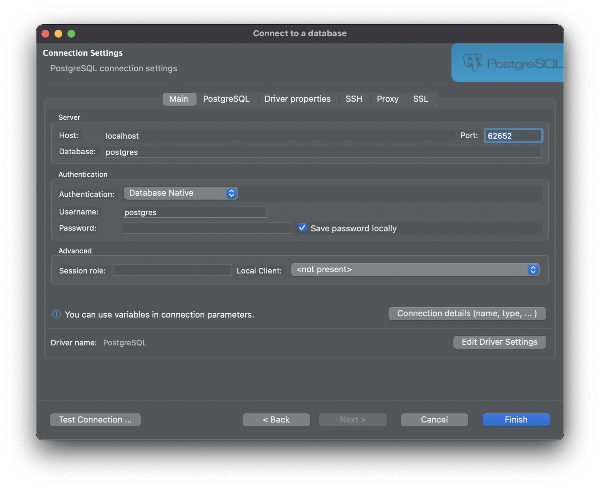

This guide describes how to configure popular graphical database clients to work with Teleport Database Access.

If you are using Teleport Connect to access your database, you can follow the instructions in the app to connect your GUI client. See [Using Teleport Connect](../teleport-clients/teleport-connect.mdx#connecting-to-a-database).

## Prerequisites

- A running Teleport cluster. If you want to get started with Teleport, [sign up](https://goteleport.com/signup) for a free trial or [set up a demo environment](../../get-started/deploy-community.mdx).
- The `tsh` client tool. Visit [Installation](../../installation/installation.mdx) for instructions on downloading `tsh`. See the [Using Teleport Connect](../teleport-clients/teleport-connect.mdx) guide for a graphical desktop client that includes `tsh`.
- The Teleport Database Service configured to access a database. See one of our [guides](../../enroll-resources/database-access/guides/guides.mdx) for how to set up the Teleport Database Service for your database.

To check that you can connect to your Teleport cluster, sign in with `tsh login`. For example:

```code
$ tsh login --proxy=teleport.example.com --user=myuser@example.com
```

<Checkpoint
  title="Verify cluster login"
  description="Run tsh status. Success looks like: your logged-in user, the cluster name, and a non-expired Valid until time."
>
- Run:
  ```bash
  tsh status
  ```
- If you see **Access denied**:
  - Confirm you used the correct `--proxy` and `--user`.
  - Confirm your user exists and can authenticate to the cluster (SSO connector, MFA requirements, etc.).
- If you see **connection refused / timeout**:
  - Confirm the Proxy Service is reachable at the proxy address and port (often `443`).
  - Check firewalls/security groups/DNS.
- If you see **certificate / TLS errors**:
  - Confirm the proxy TLS certificate is valid for the hostname.
  - Avoid `--insecure` except for temporary testing in non-production.

</Checkpoint>

## How GUI clients access Teleport-protected databases

In a typical setup, end users connect to a **local proxy** started by `tsh` (or Teleport Connect). The GUI client connects to that local proxy on `localhost`, and `tsh` authenticates to Teleport using your user certificates and forwards traffic through the Teleport Proxy Service to the Teleport Database Service.

Depending on whether **TLS routing** is enabled, database traffic is either multiplexed through the Proxy Service (commonly on `443`) or sent to a protocol-specific port on the Proxy.

### Choose a connection mode

Use one of these modes to connect a GUI client:

| Mode | Best for | GUI cert setup needed? | Notes |
|------|----------|-------------------------|------|
| **Authenticated tunnel (recommended)** `tsh proxy db --tunnel` (or Teleport Connect) | Most users and most GUIs | **No** | GUI connects to `localhost:<port>`; do not add client certs in the GUI. |
| **Local proxy with mTLS files** `tsh proxy db` | GUIs that require explicit mTLS config | **Yes** | GUI uses CA/cert/key paths printed by `tsh`. |
| **Direct to Proxy (no TLS routing / protocol port)** | Self-hosted legacy setups | **Yes** | Only applicable when TLS routing is disabled; you connect to a database-specific Proxy port. |

To access a Teleport-protected database with a GUI client, you will need to retrieve connection information to pass to your client.

Determine the database to access by listing databases you can connect to:

```code
$ tsh db ls
# Name
# -------------------
# database-name
```

Replace <Var name="database-name" /> with the name of the database you want to connect to.

<Checkpoint
  title="Verify database visibility"
  description="Run tsh db ls. Success looks like: the database you want appears in the list."
>
- Run:
  ```bash
  tsh db ls
  ```
- If no databases are listed:
  - Confirm the Database Service is running and has registered databases in the cluster.
  - If you use leaf clusters, try:
    ```bash
    tsh db ls --all
    ```
- If the database exists but does not appear for you:
  - Your role may restrict access via `db_names`, `db_labels`, or `db_users`.
  - Ask your administrator to confirm your role allows the database and at least one database user.
- If the database name errors (not found):
  - Confirm the database resource name matches exactly.

</Checkpoint>

## Authenticated tunnel (recommended)

To start the local authenticated tunnel, run:

```code
$ tsh proxy db --tunnel <Var name="database-name" />
Started authenticated tunnel for database "<Var name="database-name" />" in cluster "<Var name="cluster-name" />" on 127.0.0.1:62652.
```

Starting the local database proxy with the `--tunnel` flag creates an authenticated tunnel that you can use to connect to your database.

You can optionally specify the database user and database name (for engines that support it):

```code
$ tsh proxy db --db-user=my-database-user --db-name=my-database --tunnel <Var name="database-name" />
```

Now, connect your GUI client to the address the command returns (for example, `127.0.0.1:62652`).

<Checkpoint
  title="Verify tunnel is running"
  description="Success looks like: a Started authenticated tunnel message with a localhost address + port. Keep the terminal open—closing it ends the tunnel."
>
- If you see **Access denied**:
  - Your role may not allow the `--db-user` or `--db-name` you specified.
  - Try without overrides, or confirm allowed values with:
    ```bash
    tsh db login <database-name>
    ```
- If you see **Port already in use**:
  - Re-run and let `tsh` pick a new port, or set one explicitly:
    ```bash
    tsh proxy db --tunnel --port 54321 <database-name>
    ```
- If your GUI client cannot connect to localhost:
  - Try both `localhost` and `127.0.0.1` (some clients prefer one or the other).
  - Ensure you used the exact port shown.
- If you see **certificate expired**:
  - Refresh your login and restart the tunnel:
    ```bash
    tsh login --proxy=... --user=...
    tsh proxy db --tunnel <database-name>
    ```

</Checkpoint>

## Local proxy with mTLS files

Use the `tsh proxy db` command to start a local proxy and print the CA, certificate, and key paths your GUI client can use for mTLS.

Run a command similar to the following:

```code
$ tsh proxy db <Var name="database-name" />
Started DB proxy on 127.0.0.1:61740

Use following credentials to connect to the "<Var name="database-name" />" proxy:
  ca_file=/Users/alice/.tsh/keys/teleport.example.com/certs.pem
  cert_file=/Users/alice/.tsh/keys/teleport.example.com/alice-db/root/<Var name="database-name" />-x509.pem
  key_file=/Users/alice/.tsh/keys/teleport.example.com/alice
```

Use the displayed local proxy host/port and credential paths when configuring your GUI client. If `localhost` does not work, use `127.0.0.1`.

<Checkpoint
  title="Verify proxy and credential files"
  description="Success looks like: the proxy prints ca_file, cert_file, and key_file paths, and all three files exist and are readable by your GUI app."
>
- Verify the files exist:
  ```bash
  ls -la <ca_file> <cert_file> <key_file>
  ```
- If the files do not exist:
  - Generate DB credentials, then restart the proxy:
    ```bash
    tsh db login <database-name>
    tsh proxy db <database-name>
    ```
- If your GUI app cannot read the files (common on macOS sandboxed apps):
  - Copy them to a user-accessible location (for example `/tmp/teleport-db/`) and update the GUI paths.
- If you see **certificate verify failed**:
  - Confirm the GUI is using the `ca_file` path (Teleport CA), not a system CA bundle.
- If you see **private key mismatch**:
  - Cert and key must come from the same session. Restart `tsh proxy db` and re-copy the paths.

</Checkpoint>

## Direct to Proxy when TLS routing is disabled (self-hosted)

This method applies when your self-hosted Proxy Service is configured **without TLS routing**, and the Proxy exposes **protocol-specific ports** for database traffic. In this configuration, GUI clients connect to the Proxy address on a database protocol port and authenticate with mTLS.

To view connection info and local credential file paths:

```code
# View configuration for the database you're logged in to.
$ tsh db config
# View configuration for a specific database when you're logged into multiple.
$ tsh db config <Var name="database-name" />
```

Example output:

```text
Name:      example
Host:      teleport.example.com
Port:      5432
User:      postgres
Database:  postgres
CA:        /Users/alice/.tsh/keys/teleport.example.com/certs.pem
Cert:      /Users/alice/.tsh/keys/teleport.example.com/alice-db/root/example-x509.pem
Key:       /Users/alice/.tsh/keys/teleport.example.com/alice
```

Use `Host`, `Port`, and the `CA`, `Cert`, and `Key` paths in GUI clients that support mutual TLS.

<Checkpoint
  title="Verify direct-to-proxy configuration"
  description="Success looks like: tsh db config shows a Proxy Host, a protocol-specific Port (not 3080), and CA/Cert/Key paths."
>
- If you see **Not logged into database**:
  ```bash
  tsh db login <database-name>
  tsh db config <database-name>
  ```
- If the port looks like the web/proxy port (for example `3080`) or TLS routing is enabled:
  - Use **Authenticated tunnel** or **Local proxy with mTLS files** instead.
- If connections time out:
  - Verify your network allows connections to the Proxy on the database protocol port.
  - Confirm the Proxy is actually listening on that port in your cluster configuration.

</Checkpoint>

## MongoDB Compass

[Compass](https://www.mongodb.com/products/compass) is the official MongoDB graphical client.

On the "New Connection" panel, click on "Fill in connection fields individually".


On the "Hostname" tab, enter the hostname and port of the proxy you will use (see [Choose a connection mode](./gui-clients.mdx#choose-a-connection-mode)). Leave "Authentication" as None.


On the "More Options" tab, configure TLS:

- For **Authenticated tunnel**: you typically do **not** need to configure client certificates in Compass. If TLS options cause errors, try disabling TLS for the localhost connection.
- For **Local proxy with mTLS files**: set SSL to "Client and Server Validation" and set the CA, client certificate, and key to the paths printed by `tsh proxy db`.


The following fields must correspond to paths printed by `tsh proxy db`:

|Field|Path|
|---|---|
|Certificate Authority|`ca_file`|
|Client Certificate|`cert_file`|
|Client Private Key|`key_file`|

Click "Connect".

<Checkpoint
  title="Troubleshoot MongoDB Compass"
  description="Success looks like: Compass connects and you can browse databases/collections."
>
- If you see **certificate verify failed / TLS errors**:
  - For mTLS mode, confirm all certificate paths are correct and readable.
  - For tunnel mode, try disabling TLS options for the localhost connection (do not add client certs).
- If you see **authentication failed**:
  - In tunnel/local-proxy modes, leave Compass authentication as None unless your MongoDB requires its own auth.
- If the connection hangs or times out:
  - Confirm `tsh proxy db ...` is still running and you’re using the correct local port.

</Checkpoint>

## MySQL DBeaver

Right-click in the "Database Navigator" menu and select Create > Connection:


Select the MySQL driver and click "Next":


In "Connection Settings", set Host to `localhost` and Port to the one returned by the tunnel/proxy command:


Set the username to your database user (must be permitted by your Teleport role). If DBeaver requires a password, use an empty or placeholder value.


If using the **Authenticated tunnel**, configure the driver to avoid local auth where possible (behavior varies by driver version).


<Checkpoint
  title="Troubleshoot MySQL DBeaver"
  description="Success looks like: DBeaver connects and shows your schema."
>
- If you see **Access denied for user**:
  - Confirm the username is a permitted database user (Teleport role `db_users`).
  - If the driver insists on password auth, try an empty password or placeholder value.
- If you see **connection refused**:
  - Confirm the tunnel/proxy is running and the port matches.
  - Try both `localhost` and `127.0.0.1`.
- If you see **TLS/SSL errors** while using `--tunnel`:
  - Do not enable additional SSL settings for the localhost connection; the tunnel already secures the remote leg.

</Checkpoint>

## MySQL Workbench

[MySQL Workbench](https://www.mysql.com/products/workbench/) is a GUI application for MySQL administration and SQL development.

In "Setup New Connection", fill out connection name, hostname, port, and username.


If you are using **Local proxy with mTLS files**, configure the "SSL" tab with CA, certificate, and key paths printed by `tsh proxy db`.


Optionally, click "Test Connection".


<Checkpoint
  title="Troubleshoot MySQL Workbench"
  description="Success looks like: Test Connection succeeds and the connection can be saved."
>
- If you see **SSL connection error**:
  - Confirm "Use SSL" mode and file paths match the `ca_file`, `cert_file`, and `key_file` printed by `tsh proxy db`.
- On macOS, if Workbench can’t read certificate files:
  - Copy certs to a location the app can read (for example `/tmp/teleport-db/`) and update paths.
- If you see **authentication plugin** errors:
  - Ensure you’re not configuring password authentication when using Teleport mTLS/tunnel modes.
- If the connection succeeds but you cannot see expected databases:
  - Your Teleport role may restrict `db_names`, or you may need to specify `--db-name` when starting the tunnel for engines that support it.

</Checkpoint>

## NoSQL Workbench (DynamoDB)

From the NoSQL Workbench launch screen, click **Launch** next to **Amazon DynamoDB**.
From the left menu select **Operation builder**, then **+ Add connection**.
Choose the **DynamoDB local** tab, and point to your proxy endpoint (for example `localhost:62652`).


<Checkpoint
  title="Troubleshoot NoSQL Workbench (DynamoDB)"
  description="Success looks like: you can browse tables and run operations."
>
- If you see **Unable to connect**:
  - Confirm the authenticated tunnel is running (`tsh proxy db --tunnel`) and the port matches.
- If you see **credential/signature** errors:
  - Do not enter AWS credentials for the localhost connection when Teleport provides auth via the tunnel.
  - If your environment requires AWS creds regardless, confirm the Teleport DynamoDB integration mode in your cluster configuration.

</Checkpoint>

## SQL Server with Azure Data Studio

In Azure Data Studio, create a connection using your proxy endpoint, for example `localhost,62652`.
On Windows, `127.0.0.1,62652` may work better than `localhost,62652` if `localhost` resolves to IPv6.

Create a connection with these settings:

|Connection Detail|Value|
|---|---|
|Server|`host`,`port` of proxy endpoint|
|Authentication Type|SQL Login|
|Password|empty (or placeholder if required)|
|Encrypt|`False`|


<Checkpoint
  title="Troubleshoot Azure Data Studio (SQL Server)"
  description="Success looks like: Connect succeeds and Object Explorer shows your databases."
>
- If you see **Login failed**:
  - Use SQL Login with an empty (or placeholder) password and the correct database username.
- If you see **certificate/trust errors**:
  - Set Encrypt to `False` for the localhost connection when using the Teleport tunnel.
- If you can’t connect to localhost:
  - Try `127.0.0.1,PORT` (comma separator, not colon).

</Checkpoint>

## PostgreSQL DBeaver

Connect using your tunnel endpoint (for example `127.0.0.1:62652`).

Use "Database native" authentication with an empty password:



<Checkpoint
  title="Troubleshoot PostgreSQL DBeaver"
  description="Success looks like: Test connection succeeds."
>
- If you see **password authentication failed**:
  - Ensure you selected the correct auth mode and left the password empty (or set a placeholder if the driver requires it).
- If you see **connection refused**:
  - Confirm the tunnel is running and the port matches.
- If you see **SSL warnings**:
  - For the localhost tunnel connection, SSL settings may be unnecessary; Teleport secures the remote leg.

</Checkpoint>

## PostgreSQL pgAdmin 4

[pgAdmin 4](https://www.pgadmin.org/) is a popular graphical client for PostgreSQL.

Create a new server and fill in host/port/user/database from your proxy/tunnel info.


If using **Local proxy with mTLS files**, set SSL Mode and provide CA/cert/key paths.


|Field|Path|
|---|---|
|Client certificate|`cert_file`|
|Client certificate key|`key_file`|
|Root certificate|`ca_file`|

<Checkpoint
  title="Troubleshoot pgAdmin 4"
  description="Success looks like: pgAdmin connects and the server appears under Servers."
>
- If you see **certificate verify failed**:
  - Confirm SSL Mode and file paths match the `tsh proxy db` output.
- If pgAdmin prompts for a password:
  - Leave it empty (or enter a placeholder if required by the UI).
- If you see **connection refused**:
  - Confirm `tsh proxy db ...` is still running and the port matches.
- On macOS, if pgAdmin can’t read certificate files:
  - Copy them to a user-accessible location and update paths.

</Checkpoint>

## Microsoft SQL Server Management Studio

Connect using your proxy endpoint, e.g. `localhost,62652`. On Windows, `127.0.0.1,62652` may work better.

Use:

|Connection Detail|Value|
|---|---|
|Server type|Database Engine|
|Server name|`host`,`port` of proxy endpoint|
|Authentication|SQL Server Authentication|
|Password|empty (or placeholder if required)|
|Encryption|do not enable for localhost tunnel|


<Checkpoint
  title="Troubleshoot SQL Server Management Studio"
  description="Success looks like: Connect succeeds and Object Explorer populates."
>
- If you see **Login failed**:
  - Use SQL Server Authentication with an empty/placeholder password and correct username.
- If you see **connection established then error**:
  - Disable encryption for the localhost connection when using the Teleport tunnel.
- If you can’t connect to localhost:
  - Try `127.0.0.1,PORT` (comma separator, not colon).

</Checkpoint>

## Redis Insight

<Admonition type="note">
  Teleport's Redis Insight integration only supports Redis standalone instances.
</Admonition>

Start a local proxy to your Redis instance:

```bash
tsh proxy db <Var name="redis-db-name" /> --db-user=<Var name="redis-username" />
```

In Redis Insight click `ADD REDIS DATABASE` → `Add Database Manually`. Use `127.0.0.1` as the Host and the port printed by `tsh`.

Check `Use TLS` and `Verify TLS Certificates`. Copy/paste the contents of the files returned by `tsh proxy db` into their corresponding fields:

|Field|Path|
|---|---|
|CA Certificate|`ca_file`|
|Client Certificate|`cert_file`|
|Private Key|`key_file`|

<Checkpoint
  title="Troubleshoot Redis Insight"
  description="Success looks like: the database is added and you can browse keys."
>
- If you see **certificate verify failed**:
  - Ensure TLS + Verify are enabled and the pasted cert/key include the `-----BEGIN` / `-----END` lines.
- If you see **NOAUTH Authentication required**:
  - Your Redis deployment requires Redis credentials/ACLs (separate from Teleport auth). Provide the Redis username/password if your Redis server enforces them.
- If the connection times out:
  - Confirm `tsh proxy db ...` is still running and the port matches.
  - Try `127.0.0.1` instead of `localhost`.

</Checkpoint>

## Snowflake: DBeaver

Snowflake works only in authenticated tunnel mode. Start a tunnel:

```bash
tsh proxy db --tunnel --port 2000 snowflake
```

Configure DBeaver with Host `localhost`, Port `2000`, Username matching `--db-user`, and any placeholder Password (ignored by Teleport but required by the UI).

In driver properties set:
- `account` to any non-empty value (required by the driver UI)
- `ssl` to `off` (disables TLS only for the localhost hop; Teleport still encrypts the remote connection)

<Checkpoint
  title="Troubleshoot Snowflake DBeaver"
  description="Success looks like: Test Connection succeeds."
>
- If you see **Account must be specified**:
  - Set `account` to any non-empty value in driver properties.
- If you see **SSL/TLS handshake errors**:
  - Set `ssl=off` for the localhost hop.
- If the UI insists on a password:
  - Enter any placeholder value; Teleport ignores it for the actual connection.

</Checkpoint>

## Snowflake: JetBrains (IntelliJ, GoLand, DataGrip, PyCharm)

Snowflake works only in authenticated tunnel mode. Start a tunnel:

```bash
tsh proxy db --tunnel --port 2000 snowflake
```

Configure Host `localhost`, Port `2000`, Username matching `--db-user`, and any placeholder Password.

In Advanced properties set:
- `account` to any non-empty value
- `ssl=off`

<Checkpoint
  title="Troubleshoot Snowflake JetBrains"
  description="Success looks like: Test Connection succeeds."
>
- If prompted to download drivers:
  - Allow the IDE to download the Snowflake JDBC driver. Configure IDE proxy settings if behind a firewall.
- If you see **account property** errors:
  - Set `account` to any non-empty value.
- If you see **SSL handshake** errors:
  - Add `ssl=off` for the localhost hop.

</Checkpoint>

## SQL Server DataGrip

Use your proxy endpoint (for example `localhost:4242` in your environment). Choose "User & Password" and keep Password empty.

<Checkpoint
  title="Troubleshoot SQL Server DataGrip"
  description="Success looks like: the datasource is created and queries run successfully."
>
- If you see **Login failed**:
  - Ensure the correct username and an empty/placeholder password (as required by the UI).
- If you see **TCP/IP connection failed**:
  - Confirm the tunnel is running and the port matches.
- If you see **SSL/encryption errors**:
  - Disable encryption/SSL for the localhost connection when using the Teleport tunnel.

</Checkpoint>

## SQL Server DBeaver

Use your proxy endpoint (for example `localhost:62652`). Use SQL Server Authentication and keep Password empty (or placeholder if required).

<Checkpoint
  title="Troubleshoot SQL Server DBeaver"
  description="Success looks like: DBeaver connects and lists schemas/tables."
>
- If you see **Login failed**:
  - Use SQL Server Authentication with the correct username and empty/placeholder password.
- If you see **driver errors**:
  - Allow DBeaver to download the SQL Server JDBC driver (Microsoft driver recommended).
- If you see **connection refused**:
  - Confirm the tunnel is running and try `127.0.0.1` instead of `localhost`.

</Checkpoint>

## Cloud Spanner DataGrip

(!docs/pages/includes/database-access/gui-clients/spanner-local-proxy.mdx!)

Create a datasource from the JDBC URL output by `tsh proxy db`.

(!docs/pages/includes/database-access/gui-clients/spanner-reuse-port-note.mdx!)

<Checkpoint
  title="Troubleshoot Cloud Spanner DataGrip"
  description="Success looks like: Test connection succeeds."
>
- If "No auth" is unavailable:
  - Ensure you selected the Cloud Spanner driver and update DataGrip if needed.
- If you see **PERMISSION_DENIED**:
  - Confirm the Database Service’s GCP identity has Spanner IAM permissions.
- If the JDBC URL errors:
  - Copy it exactly from `tsh proxy db` output.

</Checkpoint>

## Cloud Spanner DBeaver

(!docs/pages/includes/database-access/gui-clients/spanner-local-proxy.mdx!)

Follow the steps to configure a custom driver and paste the JDBC URL from `tsh proxy db`.

(!docs/pages/includes/database-access/gui-clients/spanner-reuse-port-note.mdx!)

<Checkpoint
  title="Troubleshoot Cloud Spanner DBeaver"
  description="Success looks like: the datasource appears and queries run."
>
- If the custom driver doesn’t appear:
  - Close/reopen Driver Manager and confirm the URL template includes `usePlainText=true`.
- If you see **Driver class not found**:
  - Allow DBeaver to download dependencies.
- If you see **invalid project/instance/database** errors:
  - Confirm `tsh proxy db` targeted the correct resource and the JDBC URL was copied exactly.

</Checkpoint>

## Oracle graphical clients

Oracle works only in authenticated tunnel mode. Start a tunnel:

```bash
tsh proxy db --tunnel --port 11555 --db-user=<user> --db-name=<db-name> oracle
```

<Admonition type="tip">
You can choose any available local port. Leaving `--port` empty lets `tsh` pick a random one.
</Admonition>

Teleport supports TCP and TCPS modes. Different clients prefer different modes.

<Admonition type="warning">
Teleport versions earlier than 17.2.0 support only a limited range of clients and only offer TCPS mode. `tsh` will detect this and warn you. We recommend updating Teleport to access full client support and additional connection options.
</Admonition>

### Oracle SQL Developer (standalone)

Configure a connection using "Custom JDBC" and paste the JDBC URL output by `tsh proxy db`.

<Checkpoint
  title="Troubleshoot Oracle SQL Developer"
  description="Success looks like: Test shows Status: Success."
>
- If you see **Invalid username/password**:
  - Leave password empty. Username should match `--db-user`.
- If you see **IO Error / Unknown host**:
  - Copy the JDBC URL exactly from `tsh proxy db` output.
- If you see **Network Adapter could not establish connection**:
  - Confirm the tunnel is still running and the port matches.

</Checkpoint>

### Oracle SQL Developer (VS Code extension)

Install the extension from [VS Code Marketplace](https://marketplace.visualstudio.com/items?itemName=Oracle.sql-developer).

<Tabs>
<TabItem label="TCP">

Use Basic connection details for localhost + port, and set service name to `--db-name`.

</TabItem>

<TabItem label="TCPS">

Use "Custom JDBC" and paste the JDBC URL from `tsh proxy db` output.

</TabItem>
</Tabs>

<Checkpoint
  title="Troubleshoot Oracle SQL Developer (VS Code)"
  description="Success looks like: the connection appears with a green status indicator."
>
- For TCP mode **ORA-01017**:
  - Use `/` for username and password if required by the extension UI.
- For TCPS mode:
  - If "Custom JDBC" isn’t available, update the extension and restart VS Code.
- If service name errors occur:
  - Ensure the service name matches `--db-name` exactly.

</Checkpoint>

### Toad

Use the "Direct" tab and configure localhost + port + service name.

<Checkpoint
  title="Troubleshoot Toad"
  description="Success looks like: the test shows a success message."
>
- If you see **ORA-01017**:
  - Username must be exactly `EXTERNAL` (all caps) and password empty.
- If you see **TNS could not resolve**:
  - Use the Direct tab and confirm service name matches `--db-name`.

</Checkpoint>

### Oracle DBeaver

Select Oracle driver, choose Custom connection type, and paste the JDBC string from `tsh proxy db`.

<Checkpoint
  title="Troubleshoot Oracle DBeaver"
  description="Success looks like: Test Connection succeeds."
>
- If Custom connection type is missing:
  - Confirm you selected Oracle driver (not generic JDBC) and update DBeaver if needed.
- If driver download fails:
  - Accept Oracle license prompts and configure proxy settings if required.
- If you see **ORA-12505**:
  - Ensure you’re using service name format (not SID).

</Checkpoint>

## General troubleshooting

<Checkpoint
  title="Troubleshoot common issues"
  description="Use these steps for errors not covered in the client-specific sections."
>
- If the tunnel/proxy terminates unexpectedly:
  - Check credentials:
    ```bash
    tsh status
    ```
  - Refresh login and restart the tunnel/proxy:
    ```bash
    tsh login --proxy=... --user=...
    tsh proxy db --tunnel <database-name>
    ```
  - Keep tunnels running in `tmux` or `screen` to avoid terminal-close interruptions.
- If connections break after sleep/wake:
  - Restart the tunnel/proxy and re-check the port (or pin a fixed port with `--port`).
- If you see certificate errors after changes/upgrades:
  - Prefer `tsh logout` and re-login:
    ```bash
    tsh logout
    tsh login --proxy=... --user=...
    ```
  - If needed, remove only the profile directory for the affected cluster under `~/.tsh/` (safer than deleting everything).
- If the GUI requires a password field:
  - Use an empty value or a placeholder if required by the UI; Teleport generally uses cert-based auth for the remote leg.
- To access multiple databases simultaneously:
  - Run multiple tunnels/proxies with different ports:
    ```bash
    tsh proxy db --tunnel --port 54321 db1
    tsh proxy db --tunnel --port 54322 db2
    ```
- If you see Access denied despite a successful tunnel:
  - Your Teleport role may restrict specific database users or names. Ask an administrator to confirm allowed `db_users` / `db_names`.

</Checkpoint>
