This guide describes how to configure popular graphical database clients to work with Teleport Database Access.

<Admonition type="tip" title="Teleport Connect">
If you are using Teleport Connect, you can configure GUI clients directly from the app and skip most of this guide. See [Connecting to a database](../teleport-clients/teleport-connect.mdx#connecting-to-a-database) in the Teleport Connect guide for the in-app workflow.
</Admonition>

{/* lint ignore page-structure remark-lint */}

## Prerequisites

- A running Teleport cluster. If you want to get started with Teleport, [sign up](https://goteleport.com/signup) for a free trial or [set up a demo environment](../../get-started/deploy-community.mdx).
- The `tsh` client tool. Visit [Installation](../../installation/single-machine/single-machine.mdx) for instructions on downloading `tsh`. See the [Using Teleport Connect](../teleport-clients/teleport-connect.mdx) guide for a graphical desktop client that includes `tsh`.
- The Teleport Database Service configured to access a database. See one of our [guides](../../enroll-resources/database-access/guides/guides.mdx) for how to set up the Teleport Database Service for your database.

To check that you can connect to your Teleport cluster, sign in with `tsh login`. For example:

```code
$ tsh login --proxy=teleport.example.com --user=myuser@example.com
```

<Checkpoint
  title="Verify cluster login"
  description="Run tsh status. Success looks like: your logged-in user, the cluster name, and a non-expired Valid until time."
>
- If you see **Access denied**:
  - Confirm you used the correct `--proxy` and `--user`.
  - Confirm your user exists and can authenticate to the cluster (SSO connector, MFA requirements, etc.).
- If you see **connection refused / timeout**:
  - Confirm the Proxy Service is reachable at the proxy address and port (often `443`).
  - Check firewalls/security groups/DNS.
- If you see **certificate / TLS errors**:
  - Confirm the proxy TLS certificate is valid for the hostname.
  - Avoid `--insecure` except for temporary testing in non-production.

</Checkpoint>

## How it works

In a typical setup, end users connect to a **local proxy** started by `tsh` (or Teleport Connect). The GUI client connects to that local proxy on `localhost`, and `tsh` authenticates to Teleport using your user certificates and forwards traffic through the Teleport Proxy Service to the Teleport Database Service.

Depending on whether **TLS routing** is enabled, database traffic is either multiplexed through the Proxy Service (commonly on `443`) or sent to a protocol-specific port on the Proxy.

## List your databases

To access a Teleport-protected database with a GUI client, you will need to retrieve connection information to pass to your client.

Determine the database to access by listing databases you can connect to:

```code
$ tsh db ls
# Name
# -------------------
# database-name
```

Replace <Var name="database-name" /> with the name of the database you want to connect to.

<Checkpoint
  title="Verify database visibility"
  description="Run tsh db ls. Success looks like: the database you want appears in the list."
>
- If no databases are listed:
  - Confirm the Database Service is running and has registered databases in the cluster.
  - If you use leaf clusters, try:
    ```code
    $ tsh db ls --all
    ```
- If the database exists but does not appear for you:
  - Your role may restrict access via `db_names`, `db_labels`, or `db_users`.
  - Ask your administrator to confirm your role allows the database and at least one database user.
- If the database name errors (not found):
  - Confirm the database resource name matches exactly.

</Checkpoint>

## Choose a connection mode

Use one of these modes to connect a GUI client:

| Mode | Best for | GUI cert setup needed? | Notes |
|------|----------|-------------------------|------|
| **Authenticated tunnel (recommended)** — `tsh proxy db --tunnel` or Teleport Connect | Most users and most GUIs | **No** | GUI connects to `localhost:<port>`; do not add client certs in the GUI. |
| **Local proxy with mTLS files** — `tsh proxy db` | GUIs that require explicit mTLS config | **Yes** | GUI uses CA/cert/key paths printed by `tsh`. |
| **Direct to Proxy (no TLS routing / protocol port)** | Self-hosted legacy setups | **Yes** | Only applicable when TLS routing is disabled; you connect to a database-specific Proxy port. |

## Authenticated tunnel (recommended)

To start the local authenticated tunnel, run:

```code
$ tsh proxy db --tunnel <Var name="database-name" />
Started authenticated tunnel for database "<Var name="database-name" />" in cluster "teleport.example.com" on 127.0.0.1:62652.
```

Starting the local database proxy with the `--tunnel` flag creates an authenticated tunnel that you can use to connect to your database.

You can optionally specify the database user and database name (for engines that support it):

```code
$ tsh proxy db --db-user=my-database-user --db-name=my-database --tunnel <Var name="database-name" />
```

Now, connect your GUI client to the address the command returns (for example, `127.0.0.1:62652`). After starting the tunnel, [verify the local proxy is running](#verify-the-local-proxy-is-running).

## Local proxy with mTLS files

Use the `tsh proxy db` command to start a local proxy and print the CA, certificate, and key paths your GUI client can use for mTLS.

Run a command similar to the following:

```code
$ tsh proxy db <Var name="database-name" />
Started DB proxy on 127.0.0.1:61740

Use following credentials to connect to the "<Var name="database-name" />" proxy:
  ca_file=/Users/alice/.tsh/keys/teleport.example.com/certs.pem
  cert_file=/Users/alice/.tsh/keys/teleport.example.com/alice-db/root/<Var name="database-name" />-x509.pem
  key_file=/Users/alice/.tsh/keys/teleport.example.com/alice
```

Use the displayed local proxy host/port and credential paths when configuring your GUI client. If `localhost` does not work, use `127.0.0.1`. After starting the proxy, [verify the local proxy is running](#verify-the-local-proxy-is-running).

## Direct to Proxy (self-hosted, TLS routing disabled)

This method applies when your self-hosted Proxy Service is configured **without [TLS routing](../../zero-trust-access/management/tls-routing.mdx)**, and the Proxy exposes **protocol-specific ports** for database traffic. In this configuration, GUI clients connect to the Proxy address on a database protocol port and authenticate with mTLS.

To view connection info and local credential file paths:

```code
# View configuration for the database you're logged in to.
$ tsh db config
# View configuration for a specific database when you're logged into multiple.
$ tsh db config <Var name="database-name" />
```

Example output:

```text
Name:      example
Host:      teleport.example.com
Port:      5432
User:      postgres
Database:  postgres
CA:        /Users/alice/.tsh/keys/teleport.example.com/certs.pem
Cert:      /Users/alice/.tsh/keys/teleport.example.com/alice-db/root/example-x509.pem
Key:       /Users/alice/.tsh/keys/teleport.example.com/alice
```

Use `Host`, `Port`, and the `CA`, `Cert`, and `Key` paths in GUI clients that support mutual TLS. After confirming configuration, [verify the local proxy is running](#verify-the-local-proxy-is-running).

<Checkpoint
  title="Verify the local proxy is running"
  description="Success looks like: tsh prints a Started message with a localhost address and port. For mTLS mode, all three credential file paths (ca_file, cert_file, key_file) are printed and exist on disk. For Direct to Proxy mode, tsh db config shows a Proxy Host and protocol-specific Port."
>
- If you see **Access denied**:
  - Your role may not allow the `--db-user` or `--db-name` you specified.
  - Try without overrides, or confirm allowed values with:
    ```code
    $ tsh db login <database-name>
    ```
- If you see **Port already in use**:
  - Re-run and let `tsh` pick a new port, or set one explicitly:
    ```code
    $ tsh proxy db --tunnel --port 54321 <database-name>
    ```
- If credential files do not exist (mTLS mode):
  - Generate DB credentials, then restart the proxy:
    ```code
    $ tsh db login <database-name>
    $ tsh proxy db <database-name>
    ```
- If you see **certificate expired**:
  - Refresh your login and restart the proxy:
    ```code
    $ tsh login --proxy=... --user=...
    $ tsh proxy db --tunnel <database-name>
    ```
- If you see **Not logged into database** (Direct to Proxy mode):
  - ```code
    $ tsh db login <database-name>
    $ tsh db config <database-name>
    ```
- If the port shown is the web/proxy port (for example `3080`) or TLS routing is enabled (Direct to Proxy mode):
  - Use **Authenticated tunnel** or **Local proxy with mTLS files** instead.

</Checkpoint>

## MongoDB

### Compass

[Compass](https://www.mongodb.com/products/compass) is the official MongoDB graphical client.

On the "New Connection" panel, click on "Fill in connection fields individually".

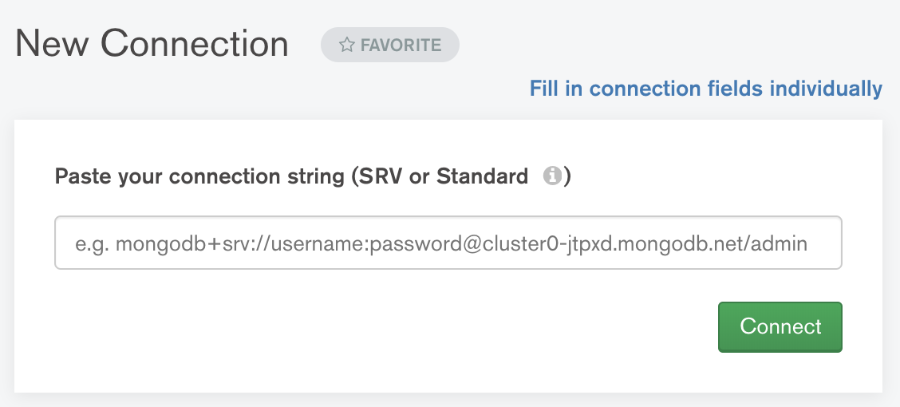

On the "Hostname" tab, enter the hostname and port of the proxy you will use (see [Choose a connection mode](#choose-a-connection-mode)). Leave "Authentication" as None.

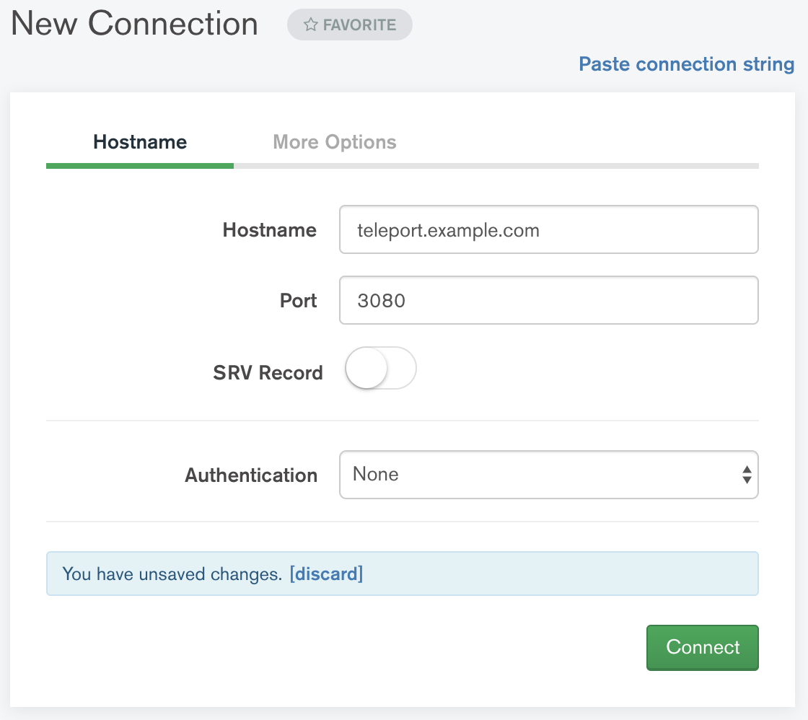

On the "More Options" tab, configure TLS:

- For **Authenticated tunnel**: you typically do **not** need to configure client certificates in Compass. If TLS options cause errors, try disabling TLS for the localhost connection.
- For **Local proxy with mTLS files**: set SSL to "Client and Server Validation" and set the CA, client certificate, and key to the paths printed by `tsh proxy db`.

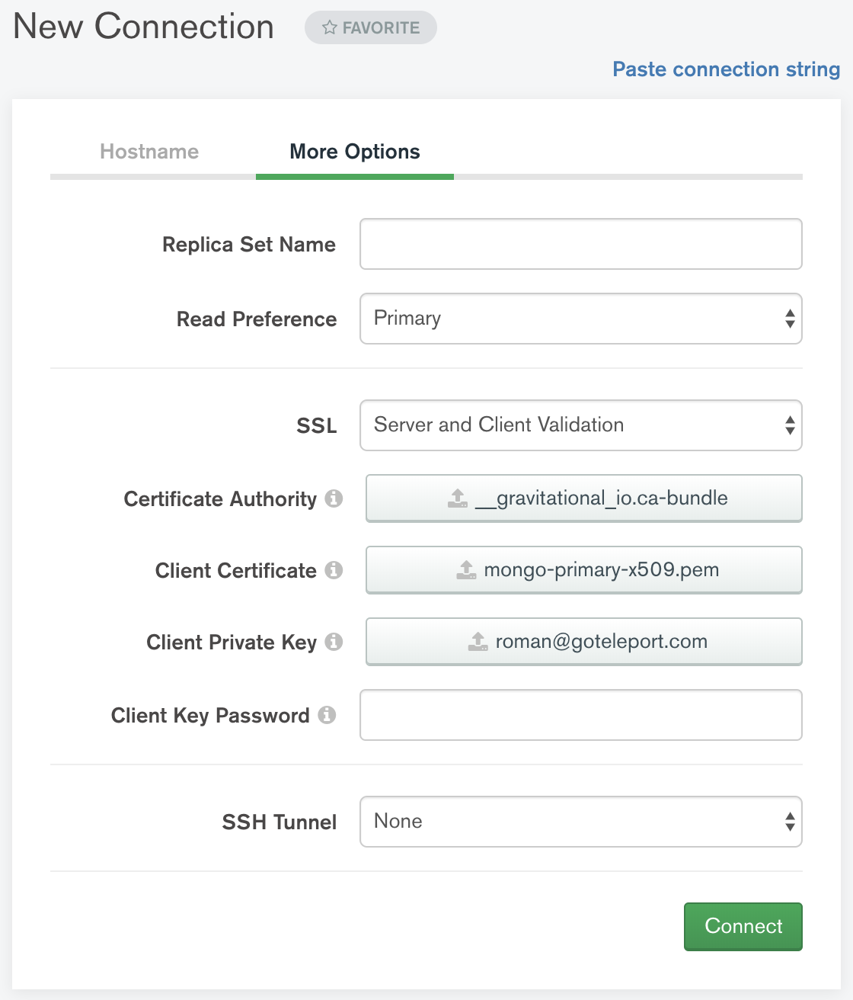

The following fields must correspond to paths printed by `tsh proxy db`:

|Field|Path|
|---|---|
|Certificate Authority|`ca_file`|
|Client Certificate|`cert_file`|
|Client Private Key|`key_file`|

Click "Connect".

## MySQL

### DBeaver

Right-click in the "Database Navigator" menu and select Create > Connection:

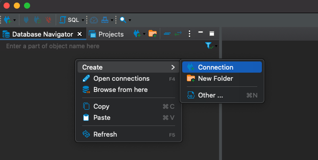

Select the MySQL driver and click "Next":

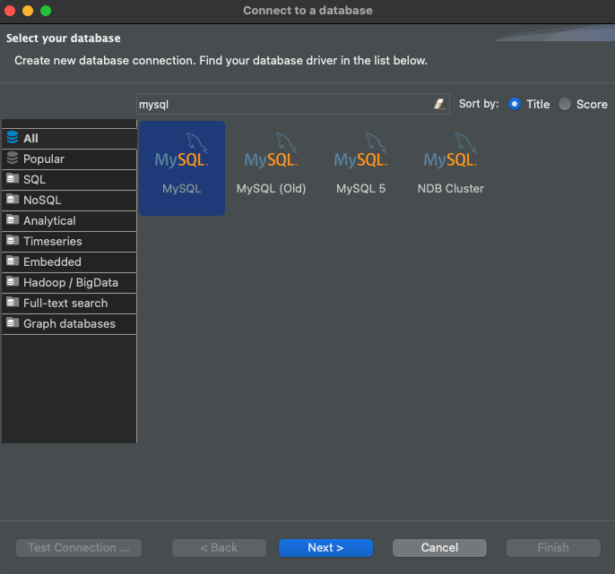

In "Connection Settings", set Host to `localhost` and Port to the one returned by the tunnel/proxy command:

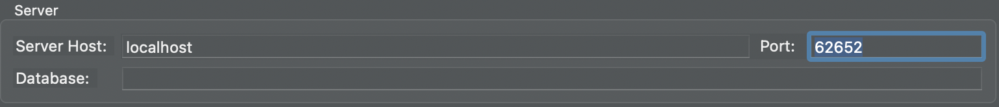

Set the username to your database user (must be permitted by your Teleport role). If DBeaver requires a password, use an empty or placeholder value.

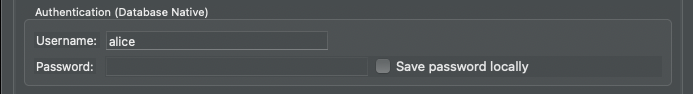

If using the **Authenticated tunnel**, configure the driver to avoid local auth where possible (behavior varies by driver version).

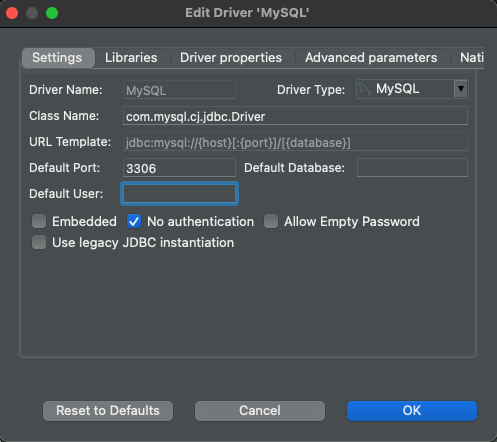

### Workbench

[MySQL Workbench](https://www.mysql.com/products/workbench/) is a GUI application for MySQL administration and SQL development.

In "Setup New Connection", fill out connection name, hostname, port, and username.

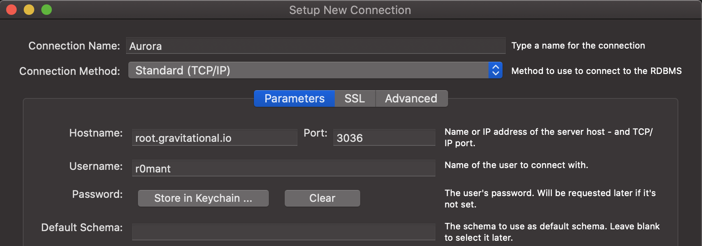

If you are using **Local proxy with mTLS files**, configure the "SSL" tab with CA, certificate, and key paths printed by `tsh proxy db`.

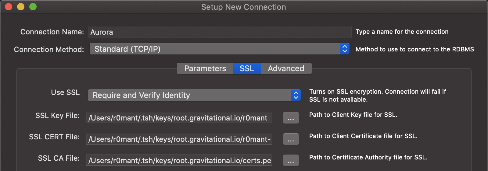

Optionally, click "Test Connection".

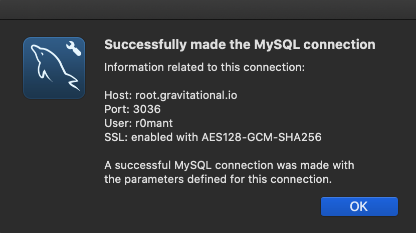

## DynamoDB

### NoSQL Workbench

From the NoSQL Workbench launch screen, click **Launch** next to **Amazon DynamoDB**.
From the left menu select **Operation builder**, then **+ Add connection**.
Choose the **DynamoDB local** tab, and point to your proxy endpoint (for example `localhost:62652`).

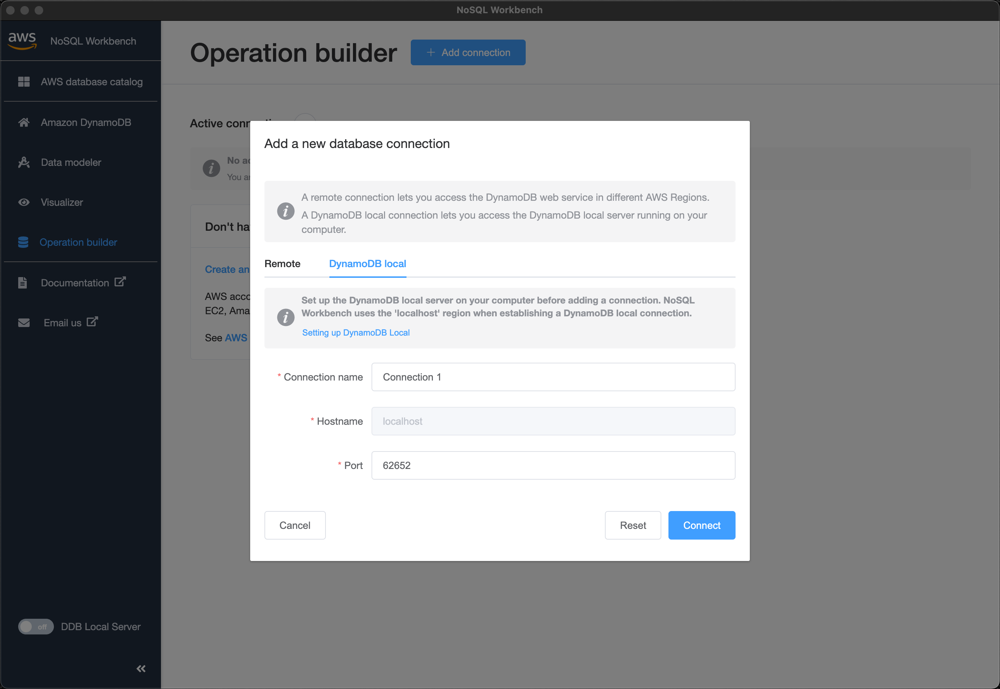

## SQL Server

### Azure Data Studio

In Azure Data Studio, create a connection using your proxy endpoint, for example `localhost,62652`.
On Windows, `127.0.0.1,62652` may work better than `localhost,62652` if `localhost` resolves to IPv6.

Create a connection with these settings:

|Connection Detail|Value|
|---|---|
|Server|`host`,`port` of proxy endpoint|
|Authentication Type|SQL Login|
|Password|empty (or placeholder if required)|
|Encrypt|`False`|

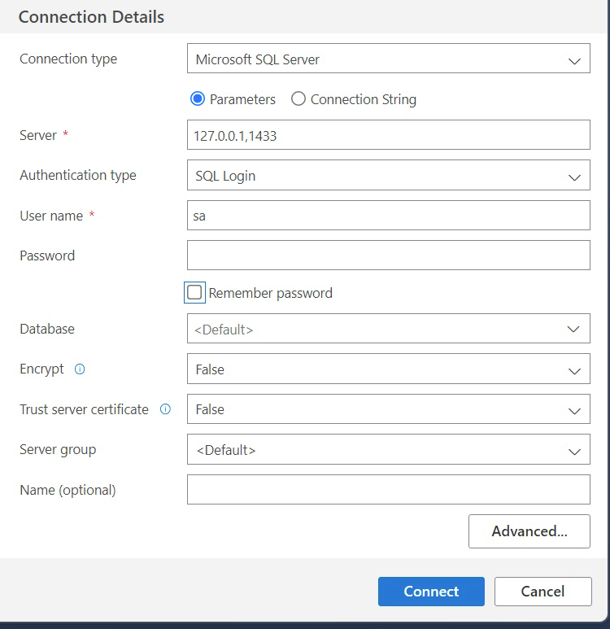

### Management Studio

Connect using your proxy endpoint, e.g. `localhost,62652`. On Windows, `127.0.0.1,62652` may work better.

Use:

|Connection Detail|Value|
|---|---|
|Server type|Database Engine|
|Server name|`host`,`port` of proxy endpoint|
|Authentication|SQL Server Authentication|
|Password|empty (or placeholder if required)|
|Encryption|do not enable for localhost tunnel|

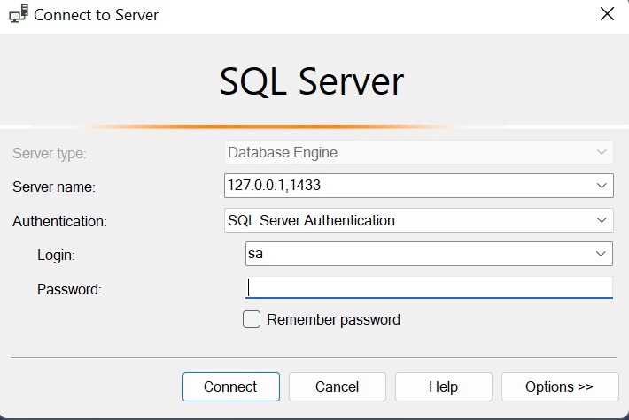

### DataGrip

Use your proxy endpoint (for example `localhost:4242` in your environment). Choose "User & Password" and keep Password empty.

### DBeaver

Use your proxy endpoint (for example `localhost:62652`). Use SQL Server Authentication and keep Password empty (or placeholder if required).

## PostgreSQL

### DBeaver

Connect using your tunnel endpoint (for example `127.0.0.1:62652`).

Use "Database native" authentication with an empty password:

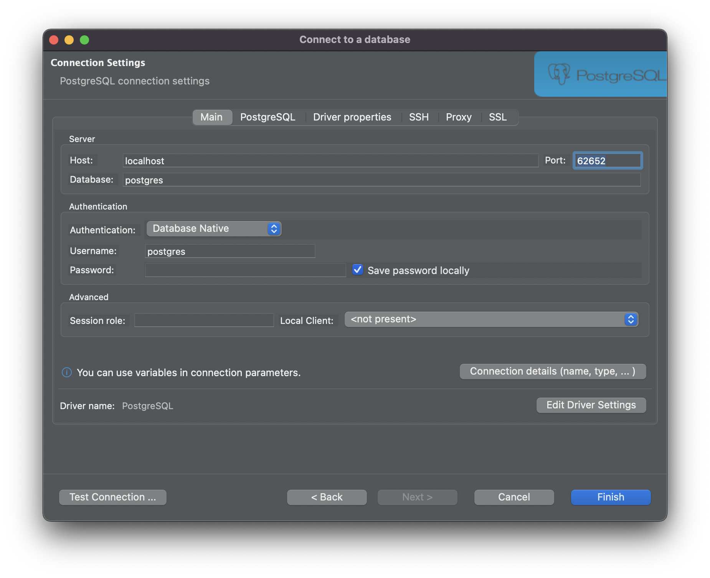

### pgAdmin 4

[pgAdmin 4](https://www.pgadmin.org/) is a popular graphical client for PostgreSQL.

Create a new server and fill in host/port/user/database from your proxy/tunnel info.

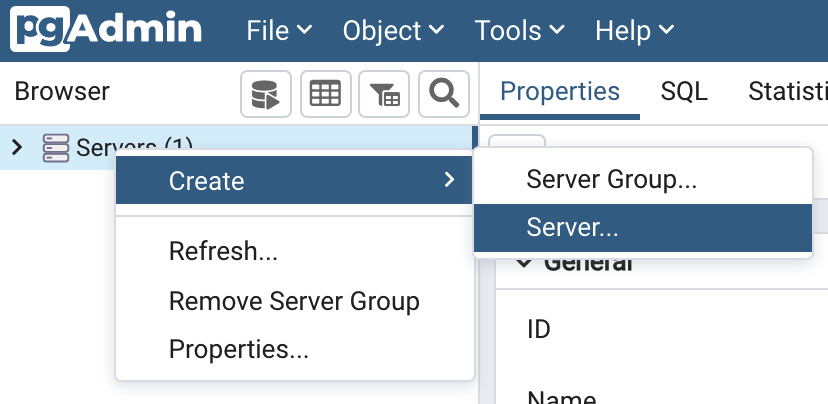
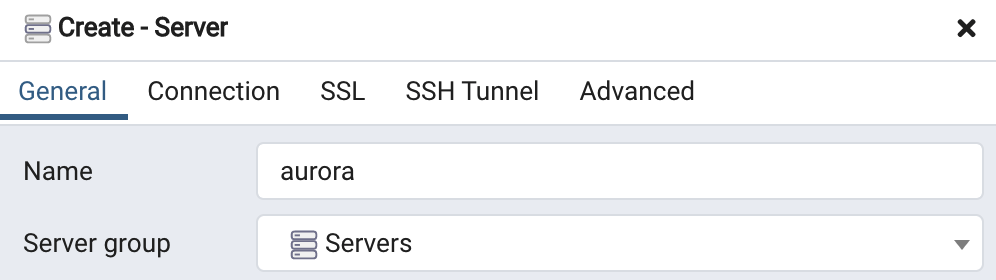
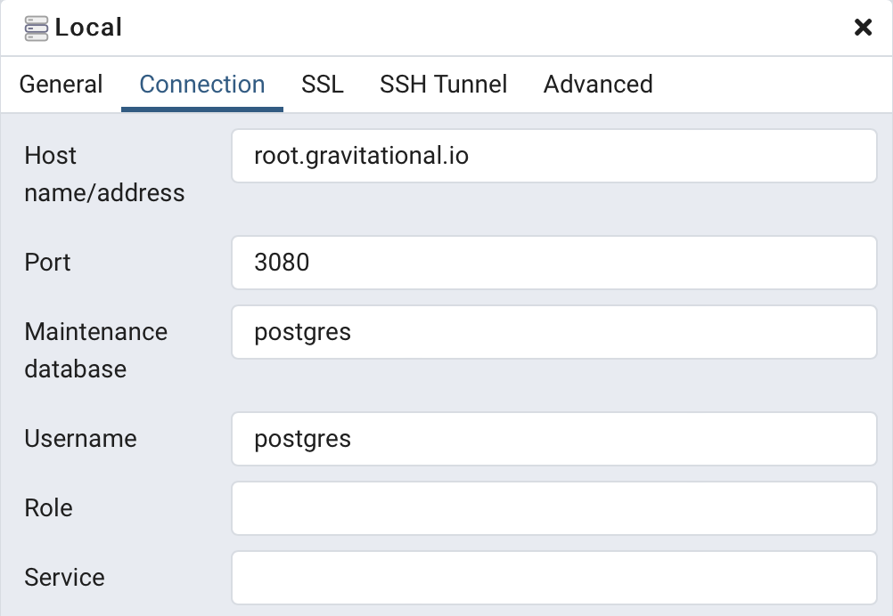

If using **Local proxy with mTLS files**, set SSL Mode and provide CA/cert/key paths.

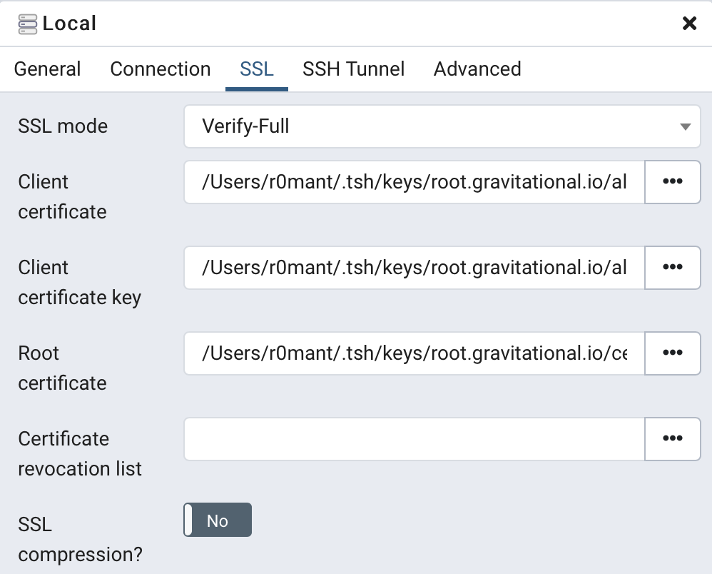

|Field|Path|
|---|---|
|Client certificate|`cert_file`|
|Client certificate key|`key_file`|
|Root certificate|`ca_file`|

## Redshift

<Admonition type="note">
You can also use the [PostgreSQL DBeaver setup](#postgresql) to connect to Redshift, but using the native Redshift driver additionally provides support for Redshift-specific datatypes and external schemas.
</Admonition>

### DBeaver

To connect to your Redshift instance, use the authenticated tunnel address (for example, `127.0.0.1:62652` — see [Authenticated tunnel](#authenticated-tunnel-recommended)).

Use "Username/password" authentication. Set the username to match the database user passed to `--db-user` and leave the password empty:


Go to **Driver Properties** and set `ssl=false`. This disables encryption on the local connection only — the connection to Redshift is encrypted by Teleport.


Click "Test connection" to verify connectivity, then "Finish" to save the configuration.

## Redis

### Redis Insight

<Admonition type="note">
Teleport's Redis Insight integration only supports Redis standalone instances.
</Admonition>

Start a local proxy to your Redis instance:

```code
$ tsh proxy db <Var name="database-name" /> --db-user=<Var name="redis-username" />
```

Replace <Var name="database-name" /> with the name of your Redis database and <Var name="redis-username" /> with the Redis username permitted by your Teleport role.

In Redis Insight click `ADD REDIS DATABASE` → `Add Database Manually`. Use `127.0.0.1` as the Host and the port printed by `tsh`.

Check `Use TLS` and `Verify TLS Certificates`. Copy/paste the contents of the files returned by `tsh proxy db` into their corresponding fields:

|Field|Path|
|---|---|
|CA Certificate|`ca_file`|
|Client Certificate|`cert_file`|
|Private Key|`key_file`|

## Snowflake

Snowflake works only in authenticated tunnel mode. Start a tunnel:

```code
$ tsh proxy db --tunnel --port 2000 snowflake
```

<Admonition type="important" title="Required Snowflake driver settings">
Snowflake drivers require two non-obvious properties for the localhost connection to work:

- Set `account` to any non-empty value (required by the driver UI).
- Set `ssl` to `off` — this disables TLS only for the localhost hop; Teleport still encrypts the remote connection to Snowflake.

The driver also requires a password field even though Teleport ignores it. Use any placeholder value.
</Admonition>

### DBeaver

Configure DBeaver with Host `localhost`, Port `2000`, Username matching `--db-user`, and any placeholder Password.

Set the `account` and `ssl` properties under driver properties.

### JetBrains (IntelliJ, GoLand, DataGrip, PyCharm)

Configure Host `localhost`, Port `2000`, Username matching `--db-user`, and any placeholder Password.

Set the `account` and `ssl` properties under Advanced properties.

## Cloud Spanner

### DataGrip

(!docs/pages/includes/database-access/gui-clients/spanner-local-proxy.mdx!)

Create a datasource from the JDBC URL output by `tsh proxy db`.

(!docs/pages/includes/database-access/gui-clients/spanner-reuse-port-note.mdx!)

### DBeaver

(!docs/pages/includes/database-access/gui-clients/spanner-local-proxy.mdx!)

Follow the steps to configure a custom driver and paste the JDBC URL from `tsh proxy db`.

(!docs/pages/includes/database-access/gui-clients/spanner-reuse-port-note.mdx!)

## Oracle

Oracle works only in authenticated tunnel mode. Start a tunnel:

```code
$ tsh proxy db --tunnel --port 11555 --db-user=<user> --db-name=<db-name> oracle
```

<Admonition type="tip">
You can choose any available local port. Leaving `--port` empty lets `tsh` pick a random one.
</Admonition>

Teleport supports TCP and TCPS modes. Different clients prefer different modes.

<Admonition type="warning">
Teleport versions earlier than 17.2.0 support only a limited range of clients and only offer TCPS mode. `tsh` will detect this and warn you. We recommend updating Teleport to access full client support and additional connection options.
</Admonition>

### SQL Developer (standalone)

Configure a connection using "Custom JDBC" and paste the JDBC URL output by `tsh proxy db`.

### SQL Developer (VS Code extension)

Install the extension from [VS Code Marketplace](https://marketplace.visualstudio.com/items?itemName=Oracle.sql-developer).

<Tabs>
<TabItem label="TCP">

Use Basic connection details for localhost + port, and set service name to `--db-name`.

</TabItem>

<TabItem label="TCPS">

Use "Custom JDBC" and paste the JDBC URL from `tsh proxy db` output.

</TabItem>
</Tabs>

### Toad

<Admonition type="important" title="Toad requires the EXTERNAL username">
Toad authenticates with Teleport-provided certificates, but the UI requires you to enter a username. Use exactly `EXTERNAL` (all caps) with an empty password. Any other username will produce **ORA-01017**.
</Admonition>

Add a new login record in the logins dialog.

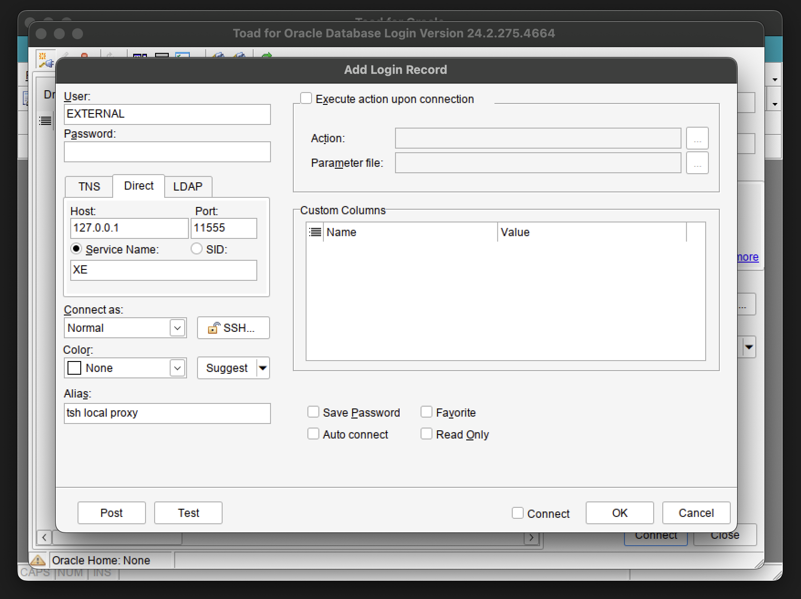

Enter the connection details on the "Direct" tab:

| Field           | Value                        |
|-----------------|------------------------------|
| Host name       | `127.0.0.1`                  |
| Port number     | `--port` flag value          |
| Service name    | `--db-name` flag value       |
| User name       | `EXTERNAL`                   |
| Password        | (leave empty)                |
| Connection name | (choose per your preference) |

Test the connection to verify the setup.

### DBeaver

Select Oracle driver, choose Custom connection type, and paste the JDBC string from `tsh proxy db`.

<Checkpoint
  title="Verify your GUI client connection"
  description="Success looks like: your GUI client connects, authenticates, and shows your schemas, tables, or keys."
>
- If you see **authentication failed / login failed / Access denied**:
  - Confirm the username is a permitted database user (Teleport role `db_users`).
  - For most GUI clients leave the password field empty or use a placeholder; Teleport authenticates via certificates, not passwords.
  - For SQL Server, use SQL Login / SQL Server Authentication (not Windows Authentication).
- If you see **certificate verify failed / TLS errors**:
  - For Authenticated tunnel mode, do not configure client certificates in the GUI — the tunnel handles TLS.
  - For Local proxy with mTLS files, confirm the CA, certificate, and key paths exactly match what `tsh proxy db` printed and include the `-----BEGIN` / `-----END` lines when pasted.
  - For SQL Server / Azure Data Studio, set Encrypt to `False` on the localhost connection.
- If you see **connection refused / cannot connect to localhost**:
  - Confirm `tsh proxy db` is still running and the port matches.
  - Try both `localhost` and `127.0.0.1` — some clients prefer one or the other.
  - On Windows for SQL Server clients, use `127.0.0.1,PORT` (comma separator, not colon).
- If the GUI app cannot read certificate files:
  - On macOS, sandboxed apps may not see files under `~/.tsh/`. Copy them to a user-accessible location (for example `/tmp/teleport-db/`) and update paths in the GUI.

</Checkpoint>

## Troubleshooting

Use these steps for errors not covered above.

### General connection issues

- If the tunnel/proxy terminates unexpectedly:
  - Check credentials:
    ```code
    $ tsh status
    ```
  - Refresh login and restart the tunnel/proxy:
    ```code
    $ tsh login --proxy=... --user=...
    $ tsh proxy db --tunnel <database-name>
    ```
  - Keep tunnels running in `tmux` or `screen` to avoid terminal-close interruptions.
- If connections break after sleep/wake:
  - Restart the tunnel/proxy and re-check the port (or pin a fixed port with `--port`).
- If you see certificate errors after changes/upgrades:
  - Prefer `tsh logout` and re-login:
    ```code
    $ tsh logout
    $ tsh login --proxy=... --user=...
    ```
  - If needed, remove only the profile directory for the affected cluster under `~/.tsh/` (safer than deleting everything).
- To access multiple databases simultaneously:
  - Run multiple tunnels/proxies with different ports:
    ```code
    $ tsh proxy db --tunnel --port 54321 db1
    $ tsh proxy db --tunnel --port 54322 db2
    ```

### Database-specific issues

- **DynamoDB:** if you see credential or signature errors in NoSQL Workbench, do not enter AWS credentials for the localhost connection — Teleport provides auth via the tunnel. If your environment requires AWS credentials regardless, confirm the Teleport DynamoDB integration mode in your cluster configuration.
- **Redis:** if you see **NOAUTH Authentication required**, your Redis deployment requires Redis credentials or ACLs separately from Teleport. Provide the Redis username and password if your Redis server enforces them.
- **Cloud Spanner:** if you see **PERMISSION_DENIED**, confirm the Database Service's GCP identity has Spanner IAM permissions.
- **Oracle:** if you see **ORA-12505**, ensure you're using service name format (not SID). For the SQL Developer VS Code extension in TCP mode, use `/` for username and password if required by the extension UI. For DBeaver, accept Oracle license prompts and configure proxy settings if driver download fails.
- **MySQL Workbench on macOS:** if Workbench can't read certificate files, copy certs to a location the app can read (for example `/tmp/teleport-db/`) and update paths.

For a graphical alternative to managing tunnels manually, see [Using Teleport Connect](../teleport-clients/teleport-connect.mdx#connecting-to-a-database).

## Next steps

- See the [Database Access guides](../../enroll-resources/database-access/guides/guides.mdx) for setting up the Teleport Database Service for specific database engines.
- Learn about [role-based access controls for databases](../../enroll-resources/database-access/rbac.mdx) including `db_users`, `db_names`, and `db_labels`.
- Review the [`tsh` reference](../reference/cli/tsh.mdx) for additional `tsh proxy db` flags and options.
