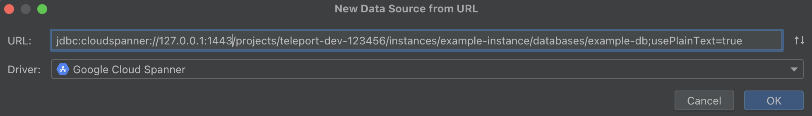
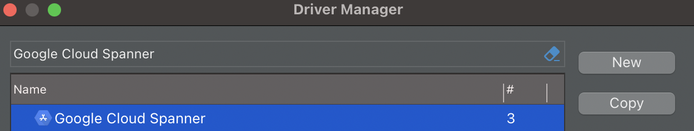
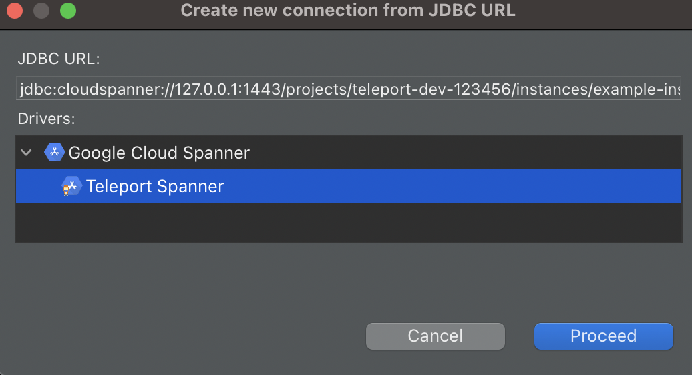

This guide describes how to configure popular graphical database clients to
work with Teleport.

If you are using Teleport Connect to access your database, you can follow the
instructions in the app to connect your GUI client. See [Using Teleport
Connect](../teleport-clients/teleport-connect.mdx#connecting-to-a-database).

## Prerequisites

- A running Teleport cluster. If you want to get started with Teleport, [sign
  up](https://goteleport.com/signup) for a free trial or [set up a demo
  environment](../../get-started/deploy-community.mdx).

- The `tsh` client tool. Visit [Installation](../../installation/installation.mdx) for instructions on downloading
  `tsh`. See the [Using Teleport Connect](../teleport-clients/teleport-connect.mdx) guide for a graphical desktop client
  that includes `tsh`.

- To check that you can connect to your Teleport cluster, sign in with `tsh login`. For example:

  ```code
  $ tsh login --proxy=teleport.example.com --user=myuser@example.com
  ```

- The Teleport Database Service configured to access a database. See one of our
  [guides](../../enroll-resources/database-access/guides/guides.mdx) for how to set up the Teleport
  Database Service for your database.

<Checkpoint
  title="Verify cluster connection"
  description="Run tsh status to confirm your login succeeded. You should see your logged-in user, cluster name, and valid credentials."
>
- If you see "Access denied" or authentication errors, verify you're using the correct proxy address and username, and that your user account exists in the cluster.
- If you see "Connection refused" or timeout errors, confirm the Teleport Proxy Service is running and your network allows connections on port `443`.
- If you see certificate errors, verify the proxy's TLS certificate is valid. For self-signed certificates, you may need `--insecure` (not recommended for production).

</Checkpoint>

## How GUI clients access Teleport-protected databases

In a typical setup, clients accessing a database protected by Teleport send
traffic to the Teleport Proxy Service in the database's native protocol, and the
Proxy Service forwards the traffic to and from the protected database. End users
use TLS certificates to authenticate with Teleport-protected databases. 

GUI clients need to present a certificate to the Teleport Database Service and
check the database server certificate issued by a Teleport-protected database.
There are three ways to do this:

- **Authenticated tunnel (recommended):** `tsh` or Teleport Connect starts a
  local proxy. A database GUI client establishes an unauthenticated connection
  with the local proxy. Before forwarding the connection to the
  Teleport-protected database, the local proxy automatically secures the
  connection with the Teleport user's client certificate.
- **Unauthenticated local proxy:** `tsh` starts a local proxy that routes
  connections to the Teleport-protected database, but the proxy itself doesn't
  handle authentication. The user configures a database GUI client to provide
  the user certificate, private key, and CA certificate at paths printed by
  `tsh`. (Teleport Connect can start an authenticated tunnel but not an
  unauthenticated local proxy.)
- **Using a remote host and port:** For self-hosted clusters with TLS
  multiplexing disabled on the Teleport Proxy Service, you can configure GUI
  clients to communicate with a port on the Proxy Service reserved for traffic
  in the protected database's protocol. We recommend TLS multiplexing for a
  typical Teleport cluster, and it is enabled by default on Teleport Cloud.

To access a Teleport-protected database with a GUI client, you will need to
retrieve connection information to pass to your client.

Determine the database to access by listing databases you can connect to:

```code
$ tsh db ls
# Name
# -------------------
# database-name
```

Replace <Var name="database-name" /> with the name of the database you want to
connect to.

<Checkpoint
  title="Verify database visibility"
  description="The tsh db ls command should display at least one database. If you don't see the expected database, troubleshoot before continuing."
>
- If no databases are listed, verify the Teleport Database Service is running. Run `tsh db ls --all` to include databases from leaf clusters.
- If no databases are listed, check that your Teleport role includes the database in `db_names` or uses wildcards.
- If the database shows but access is denied, your role may restrict `db_users` or `db_names`. Run `tsh db login <database-name>` for details.
- If you see "Not found" errors, verify the database name matches exactly (names are case-sensitive).

</Checkpoint>

### Authenticated tunnel

To start the local authenticated tunnel, run the following command, 

```code
$ tsh proxy db --tunnel <Var name="database-name" />
Started authenticated tunnel for the <engine> database "<Var name="database-name" />" in cluster "<cluster-name>" on 127.0.0.1:62652.
```

Starting the local database proxy with the `--tunnel` flag will create an
authenticated tunnel that you can use to connect to your database instances.

You can optionally specify the database name and the user to use by default
when connecting to the database:

```code
$ tsh proxy db --db-user=my-database-user --db-name=my-schema --tunnel <Var name="database-name" />
```

Now, you can connect to the address the proxy command returns. In our example it
is `127.0.0.1:62652`.

<Checkpoint
  title="Verify tunnel is running"
  description="The tunnel command should display a message confirming the local address and port. Keep this terminal window open—closing it terminates the tunnel."
>
- If you see "Access denied", your role may not permit the specified `--db-user` or `--db-name`. Run `tsh db login <database-name>` to see permitted values.
- If you see "Port already in use", run the command again for a different port, or specify one with `--port 54321`.
- If the tunnel starts but the GUI client can't connect, verify you're using `127.0.0.1` or `localhost` with the exact port shown.
- If you see "Certificate expired", run `tsh login` to refresh credentials, then restart the tunnel.

</Checkpoint>

### Local proxy server

Use the `tsh proxy db` command to start a local TLS proxy your GUI database
client will be connecting to.

Run a command similar to the following::

```code
$ tsh proxy db <Var name="database-name" />
Started DB proxy on 127.0.0.1:61740

Use following credentials to connect to the <Var name="database-name" /> proxy:
  ca_file=/Users/r0mant/.tsh/keys/root.gravitational.io/certs.pem
  cert_file=/Users/r0mant/.tsh/keys/root.gravitational.io/alice-db/root/<Var name="database-name" />-x509.pem
  key_file=/Users/r0mant/.tsh/keys/root.gravitational.io/alice
```

Use the displayed local proxy host/port and credentials paths when configuring
your GUI client below. When entering the hostname, use `localhost` rather than
`127.0.0.1`.

<Checkpoint
  title="Verify proxy and credentials"
  description="The command output should display three file paths (ca_file, cert_file, key_file). Verify these files exist by running ls -la on each path."
>
- If credential files don't exist, run `tsh db login <database-name>` to generate them, then restart the proxy.
- If the GUI client reports "Permission denied" reading files, copy them to a location the client can access (some macOS apps have sandbox restrictions).
- If the GUI client reports "certificate verify failed", ensure you're using the correct `ca_file` path.
- If the GUI client reports "private key mismatch", the cert and key must be from the same session—restart the proxy for fresh paths.

</Checkpoint>

### Remote host and port

If you are self-hosting Teleport and not using [TLS
routing](../../zero-trust-access/deploy-a-cluster/tls-routing.mdx), run the
following command to see the database connection information:

```code
# View configuration for the database you're logged in to.
$ tsh db config
# View configuration for the specific database when you're logged into multiple.
$ tsh db config example
```

It will display the path to your locally cached certificate and key files:

```
Name:      example
Host:      teleport.example.com
Port:      3080
User:      postgres
Database:  postgres
CA:        /Users/alice/.tsh/keys/teleport.example.com/certs.pem
Cert:      /Users/alice/.tsh/keys/teleport.example.com/alice-db/root/example-x509.pem
Key:       /Users/alice/.tsh/keys/teleport.example.com/alice
```

The displayed `CA`, `Cert`, and `Key` files are used to connect through pgAdmin
4, MySQL Workbench, and other graphical database clients that support mutual
TLS authentication.

<Checkpoint
  title="Verify remote configuration"
  description="The tsh db config command should display connection details including Host, Port, and file paths."
>
- If you see "Not logged into database", run `tsh db login <database-name>` first.
- If Host shows as the proxy address instead of a database-specific port, this method only works with TLS routing disabled. Use the authenticated tunnel or local proxy instead.
- If connections time out, verify your network allows direct connections to the Proxy Service on the database-specific port.

</Checkpoint>

## MongoDB Compass

[Compass](https://www.mongodb.com/products/compass) is the official MongoDB
graphical client.

On the "New Connection" panel, click on "Fill in connection fields individually".


On the "Hostname" tab, enter the hostname and port of the proxy you will use to
access the database (see
[Get connection information](./gui-clients.mdx#how-gui-clients-access-teleport-protected-databases)).
Leave "Authentication" as None.


On the "More Options" tab, set SSL to "Client and Server Validation" and set the
CA as well as the client key and certificate. Note that a CA path must be
provided and be able to validate the certificate presented by your Teleport
Proxy Service's web endpoint.


The following fields in the More Options tab must correspond to paths printed by
the `tsh proxy db` command you ran earlier:

|Field|Path|
|---|---|
|Certificate Authority|`ca_file`|
|Client Certificate|`cert_file`|
|Client Private Key|`key_file`|

Click on the "Connect" button.

<Checkpoint
  title="Troubleshoot MongoDB Compass connection"
  description="After clicking Connect, you should see your MongoDB databases and collections. If the connection fails, try these steps."
>
- If you see "Certificate verify failed" or SSL errors, ensure SSL is set to "Client and Server Validation" and all certificate paths are correct.
- If using the authenticated tunnel (`--tunnel` flag), you don't need certificates—set SSL to disabled instead.
- If you see "Authentication failed", leave Authentication as "None" when using the local proxy—certificates handle authentication.
- If the connection hangs or times out, confirm `tsh proxy db` is still running and you're using the correct port.

</Checkpoint>

## MySQL DBeaver

Right-click in the "Database Navigator" menu in the main view and select Create > Connection:


In the search bar of the "Connect to a database" window that opens up, type "mysql", select the MySQL driver, and click "Next":


In the newly-opened "Connection Settings" tab, use the Host as `localhost` and
Port as the one returned by the proxy command (`62652` in the example above):


In that same tab, set the username to match the one that you are connecting to
using Teleport and uncheck the "Save password locally" box:


Click the "Edit Driver Settings" button on the "Main" tab, check the "No
Authentication" box, and click "Ok" to save:


Once you are back in the "Connection Settings" window, click "Ok" to finish and
DBeaver should connect to the remote MySQL server automatically.

<Checkpoint
  title="Troubleshoot MySQL DBeaver connection"
  description="DBeaver should connect automatically and display your database schema. If the connection fails, try these steps."
>
- If you see "Access denied for user", verify "No authentication" is checked in Driver Settings and the username matches a permitted database user.
- If you see "Connection refused", ensure `tsh proxy db --tunnel` is still running and try using `localhost` instead of `127.0.0.1`.
- If you see SSL/TLS errors with the authenticated tunnel, don't configure additional SSL settings—the tunnel handles encryption.

</Checkpoint>

## MySQL Workbench

[MySQL Workbench](https://www.mysql.com/products/workbench/) is a GUI
application that provides comprehensive MySQL administration and SQL development
tools.

In the MySQL Workbench "Setup New Connection" dialog, fill out "Connection
Name", "Hostname", "Port", and "Username":


In the "SSL" tab, set "Use SSL" to `Require and Verify Identity` and enter the
paths to your CA, certificate, and private key files (see
[Get connection information](./gui-clients.mdx#how-gui-clients-access-teleport-protected-databases)):


The following fields in the SSL tab must correspond to paths printed by the `tsh
proxy db` command you ran earlier:

|Field|Path|
|---|---|
|SSL Key File|`key_file`|
|SSL CERT File|`cert_file`|
|SSL CA File|`ca_file`|

Optionally, click "Test Connection" to verify connectivity:


Save the connection and connect to the database.

<Checkpoint
  title="Troubleshoot MySQL Workbench connection"
  description="The Test Connection button should show a success message. If the connection fails, try these steps."
>
- If you see "SSL connection error", ensure "Use SSL" is set to "Require and Verify Identity" and all file paths are correct.
- On macOS, MySQL Workbench may have sandbox restrictions—try copying certificates to `/tmp/`.
- If you see "Authentication plugin" errors, ensure you're using certificate-based authentication, not password authentication.
- If the connection succeeds but no databases are visible, check your role's `db_names` field or specify `--db-name` when starting the tunnel.

</Checkpoint>

## NoSQL Workbench

From the NoSQL Workbench launch screen, click **Launch** next to **Amazon DynamoDB**.
From the left-side menu select **Operation builder**, then **+ Add connection**.
Choose the **DynamoDB local** tab, and point to your proxy's endpoint. This is
`localhost:62652` in the example above. (See
[Get connection information](./gui-clients.mdx#how-gui-clients-access-teleport-protected-databases) for
more information.)


<Checkpoint
  title="Troubleshoot NoSQL Workbench connection"
  description="After adding the connection, you should be able to browse tables and run operations. If the connection fails, try these steps."
>
- If you see "Unable to connect", ensure the proxy is running with `tsh proxy db --tunnel` and you're using the "DynamoDB local" connection type.
- If you see credential or signature errors, don't provide AWS credentials—the authenticated tunnel handles authentication automatically.

</Checkpoint>

## SQL Server with Azure Data Studio

In Azure Data Studio create a connection using your proxy's endpoint. This is
`localhost,62652` in the example above. On a Windows machine, using an address in
 the format `127.0.0.1,62652` could be required instead of `localhost`. (See
[Get connection information](./gui-clients.mdx#how-gui-clients-access-teleport-protected-databases) for
more information.)

Create a connection with Microsoft SQL Server with these settings:

|Connection Detail|Value|
|---|---|
|Server|`host`,`port` of proxy endpoint|
|Authentication Type|SQL Login|
|Password|empty|
|Encrypt|`False`|

Example:


Click **Connect** to connect.

<Checkpoint
  title="Troubleshoot Azure Data Studio connection"
  description="After clicking Connect, you should see your databases in the Object Explorer. If the connection fails, try these steps."
>
- If you see "Login failed", ensure Authentication Type is "SQL Login" with an empty password and Encrypt is "False".
- On Windows, try `127.0.0.1,62652` instead of `localhost,62652`—Windows may resolve localhost to IPv6.
- If you see certificate or trust errors, set Encrypt to "False"—the Teleport tunnel handles encryption.

</Checkpoint>

## PostgreSQL DBeaver

To connect to your PostgreSQL instance, use the authenticated proxy address.
This is `127.0.0.1:62652` in the example above (see the "Authenticated Proxy"
section on [Get connection information](./gui-clients.mdx#how-gui-clients-access-teleport-protected-databases)
for more information).

Use the "Database native" authentication with an empty password:


Clicking on "Test connection" should return a connection success message. Then,
click on "Finish" to save the configuration.

<Checkpoint
  title="Troubleshoot PostgreSQL DBeaver connection"
  description="The Test connection button should show a success message. If the connection fails, try these steps."
>
- If you see "FATAL: password authentication failed", ensure you're using "Database native" authentication with an empty password.
- If you see "Connection refused", verify `tsh proxy db --tunnel` is running and the port matches.
- "SSL off" warnings can be ignored when using the authenticated tunnel—Teleport handles encryption.

</Checkpoint>

## PostgreSQL pgAdmin 4

[pgAdmin 4](https://www.pgadmin.org/) is a popular graphical client for
PostgreSQL servers.

To configure a new connection, right-click on "Servers" in the main browser view
and create a new server:


In the "General" tab of the new server dialog, enter the server connection name:


In the "Connection" tab, fill in the hostname, port, user and database name from
the configuration above:


In the "SSL" tab, set "SSL Mode" to `Verify-Full` and fill in paths for client
certificate, key and root certificate from the configuration above:


The following fields in the SSL tab must correspond to paths printed by the `tsh
proxy db` command you ran earlier:

|Field|Path|
|---|---|
|Client certificate|`cert_file`|
|Client certificate key|`key_file`|
|Root certificate|`ca_file`|

Click "Save", and pgAdmin should immediately connect. If pgAdmin prompts you
for password, leave the password field empty and click OK.

<Checkpoint
  title="Troubleshoot pgAdmin 4 connection"
  description="After saving, pgAdmin should connect and display your database under Servers. If the connection fails, try these steps."
>
- If you see "Certificate verify failed", ensure SSL Mode is "Verify-Full" and all certificate paths are correct.
- On macOS, pgAdmin may have file access restrictions—check System Preferences > Security & Privacy > Files and Folders.
- If a password prompt appears, click OK with the field empty—pgAdmin sometimes prompts even when not needed.
- If you see "Connection refused", the `tsh proxy db` command may have terminated—restart it and update the port if changed.

</Checkpoint>

## Microsoft SQL Server Management Studio

In Microsoft SQL Server Management Studio connect to a database engine using
your proxy's endpoint. This is `localhost,62652` in the example above. Using
the IP `127.0.0.1,62652` connection could be required on a Windows machine
instead of `localhost`. (See [Get connection information](./gui-clients.mdx#how-gui-clients-access-teleport-protected-databases) for
more information.)

Create a connection with Microsoft SQL Server with these settings:

|Connection Detail|Value|
|---|---|
|Server type|Database Engine|
|Server name|`host`,`port` of proxy endpoint|
|Authentication|SQL Server Authentication|
|Password|empty|
|Encryption|do not enable|

Example:

  
Click Connect to connect.

<Checkpoint
  title="Troubleshoot SQL Server Management Studio connection"
  description="After clicking Connect, the Object Explorer should display your server and databases. If the connection fails, try these steps."
>
- If you see "Login failed for user", ensure Authentication is "SQL Server Authentication" with an empty password.
- If you see "A connection was successfully established...but then an error occurred", disable encryption—the Teleport tunnel handles it.
- If you can't connect to localhost, try `127.0.0.1,62652` instead. Ensure the port uses a comma separator, not a colon.

</Checkpoint>

## Redis Insight

<Admonition type="note">
  Teleport's Redis Insight integration only supports Redis standalone instances.
</Admonition>

After opening Redis Insight click `ADD REDIS DATABASE`.


Now start a local proxy to your Redis instance:

`tsh proxy db --db-user=alice redis-db-name`.

Click `Add Database Manually`. Use `127.0.0.1` as the `Host`. Use the port printed by
the `tsh` command you ran in [Get connection information](./gui-clients.mdx#how-gui-clients-access-teleport-protected-databases).

Provide your Redis username as `Username` and password as `Password`.


Next, check the `Use TLS` and `Verify TLS Certificates` boxes. Copy the contents
of the files at the paths returned by the `tsh proxy db` command you ran earlier
and paste them into their corresponding fields. See the table below for the
Redis Insight fields that correspond to each path:

|Field|Path|
|---|---|
|CA Certificate|`ca_file`|
|Client Certificate|`cert_file`|
|Private Key|`key_file`|

Click `Add Redis Database`.


Congratulations! You have just connected to your Redis instance.


<Checkpoint
  title="Troubleshoot Redis Insight connection"
  description="After adding the database, you should see your Redis instance and be able to browse keys. If the connection fails, try these steps."
>
- If you see `Certificate verify failed`, ensure "Use TLS" and "Verify TLS Certificates" are checked and certificate contents include the `-----BEGIN` and `-----END` lines.
- If you see `NOAUTH` Authentication required", provide the Redis username and password (separate from Teleport authentication).
- If the connection times out, verify `tsh proxy db` is running and use `127.0.0.1` (not `localhost`) with the correct port.

</Checkpoint>

## Snowflake: DBeaver

The Snowflake integration works only in the authenticated proxy mode. Start a local proxy for connections to your Snowflake database by using the command below:
```
tsh proxy db --tunnel --port 2000 snowflake
```

Add a new database by clicking the "add" icon in the top-left corner:


In the search bar of the "Connect to a database" window that opens up, type "snowflake", select the Snowflake driver, and click "Next":


Set "Host" to `localhost` and "Port" to the port returned by the `tsh proxy db` command you ran earlier (`2000` in the example above).
In the "Authentication" section set the "Username" to match the database username passed to Teleport with `--db-user`
and enter any value (e.g., "teleport") in the "Password" field (the value of
 "Password" will be ignored when establishing a connection but is required by DBeaver to register your database):


Next, click the "Driver properties" tab and set "account" to any value (e.g., "teleport"; as with "Password", the value of
 "account" will be ignored when establishing a connection but is required by DBeaver to register your database). In "User properties", set "ssl" to `off`:


Teleport ignores the provided password and the account name as internally it uses values from the Database Agent configuration.
SSL set to `off` disables only encryption on local machine. Connection to Snowflake is encrypted by Teleport.

Now you can click on "Test Connection..." in the bottom-left corner:


Congratulations! You have just connected to your Snowflake instance.

<Checkpoint
  title="Troubleshoot Snowflake DBeaver connection"
  description="The Test Connection button should show a success message. If the connection fails, try these steps."
>
- If you see "Account must be specified", set the "account" driver property to any value (e.g., "teleport")—it's ignored but required.
- If you see SSL/TLS errors, ensure "ssl" is set to `off` in driver properties—Teleport handles encryption.
- If the Password field shows an error, enter any placeholder value—Teleport ignores it but DBeaver requires it.

</Checkpoint>

## Snowflake: JetBrains (IntelliJ, Goland, DataGrip, PyCharm, etc.)

The Snowflake integration works only in the authenticated proxy mode. Start a local proxy for connections to your Snowflake database by using the command below:
```
tsh proxy db --tunnel --port 2000 snowflake
```

In "Database Explorer" click the "add" button, pick "Data Source", and then pick "Snowflake":


Next, set "Host" to `localhost` and "Port" to the port returned by the `tsh proxy db` command you ran earlier (`2000` in the example above).
Set the "Username" to match the one that you are assuming when you connect to Snowflake
 via Teleport and enter any value (e.g., "teleport") in the "Password" field (the value of
 "Password" will be ignored but is required to create a data source in your IDE):


Switch to the "Advanced" tab, set any value (e.g., "teleport") for "account", and add a new record named `ssl` with value `off` (as with "Password", "account" is ignored while establishing the connection but required by your IDE):


Teleport ignores the provided password and the account name as internally it uses values from the Database Agent configuration.
Setting "SSL" to `off` only disables encryption on your local machine. The connection to Snowflake is encrypted by Teleport.

Now you can click "Test Connection" to check your configuration.


Congratulations! You have just connected to your Snowflake instance.

<Checkpoint
  title="Troubleshoot Snowflake JetBrains connection"
  description="The Test Connection button should show a success message. If the connection fails, try these steps."
>
- If prompted to download drivers, allow the IDE to download the Snowflake JDBC driver. Configure proxy settings if behind a firewall.
- If you see "account" property errors, set "account" to any non-empty value in the Advanced tab.
- If you see "SSL handshake" errors, add an `ssl` property with value `off` in the Advanced tab.

</Checkpoint>

## SQL Server DataGrip

In the DataGrip connection configuration menu, use your proxy's endpoint. This
is `localhost:4242` in the example below. (See
[Get connection information](./gui-clients.mdx#how-gui-clients-access-teleport-protected-databases) for
more information.)

Select the "User & Password" authentication option and keep the "Password" field
empty:


Click "OK" to connect.

<Checkpoint
  title="Troubleshoot SQL Server DataGrip connection"
  description="After clicking OK, your database should appear in the Database Explorer. If the connection fails, try these steps."
>
- If you see "Login failed", ensure "User & Password" authentication is selected with an empty password.
- If you see "TCP/IP connection to the host failed", verify `tsh proxy db --tunnel` is running and the port matches.
- If you see SSL or encryption errors, disable SSL in driver properties—Teleport handles encryption.

</Checkpoint>

## SQL Server DBeaver

In the DBeaver connection configuration menu, use your proxy's endpoint. This is
`localhost:62652` in the example above. (See
[Get connection information](./gui-clients.mdx#how-gui-clients-access-teleport-protected-databases) for
more information.)

Use the SQL Server Authentication option and keep the Password field empty:


Click OK to connect.

<Checkpoint
  title="Troubleshoot SQL Server DBeaver connection"
  description="After clicking OK, your database should appear in the Database Navigator. If the connection fails, try these steps."
>
- If you see "Login failed for user", use SQL Server Authentication with an empty password.
- If you see driver errors, allow DBeaver to download the SQL Server JDBC driver. Consider the Microsoft driver over jTDS.
- If you see "Connection refused", ensure the tunnel is running and try `127.0.0.1` instead of `localhost`.

</Checkpoint>

## Cloud Spanner DataGrip

(!docs/pages/includes/database-access/gui-clients/spanner-local-proxy.mdx!)

From the DataGrip menu, click "File > New > Data Source from URL", then copy and
paste the JDBC URL that was output by `tsh proxy db`:



The "Google Cloud Spanner" driver should be automatically selected.
Click "Ok".

DataGrip does not need GCP credentials - those are already provided by Teleport.
On the "General" tab of the new data source, select the "Authentication"
dropdown setting and choose "No auth":


Click "Test connection" to ensure the connection is configured correctly, then
click "Ok" to create the data source.

(!docs/pages/includes/database-access/gui-clients/spanner-reuse-port-note.mdx!)

<Checkpoint
  title="Troubleshoot Cloud Spanner DataGrip connection"
  description="The Test connection button should show a success message. If the connection fails, try these steps."
>
- If "No auth" isn't available, ensure you selected the "Google Cloud Spanner" driver. Update DataGrip for full Spanner support.
- If you see "PERMISSION_DENIED", verify the Database Service's service account has Spanner IAM permissions.
- If the JDBC URL causes errors, copy it exactly from `tsh proxy db` output without modifications.

</Checkpoint>

## Cloud Spanner DBeaver

(!docs/pages/includes/database-access/gui-clients/spanner-local-proxy.mdx!)

From the menu, click "Database > Driver Manager":


Search for the "Google Cloud Spanner" driver, select it, and click the "Copy"
button to make a custom driver configuration:



Give the custom driver a name, e.g. "Teleport Spanner", then set "URL Template"
to this pattern string:

```code
jdbc:cloudspanner://127.0.0.1:{port}/projects/{server}/instances/{host}/databases/{database};usePlainText=true
```


Click "Ok", then click "Close"

From the menu, click "Database > New Connection from JDBC URL":

Now copy the JDBC URL that was output by `tsh proxy db` and paste it:



Click "Proceed", then click "Finish".

(!docs/pages/includes/database-access/gui-clients/spanner-reuse-port-note.mdx!)

<Checkpoint
  title="Troubleshoot Cloud Spanner DBeaver connection"
  description="After clicking Finish, your Spanner database should appear in the Database Navigator. If the connection fails, try these steps."
>
- If the custom driver doesn't appear, close and reopen the Driver Manager. Verify the URL Template includes `usePlainText=true`.
- If you see "Driver class not found", allow DBeaver to download Spanner JDBC dependencies.
- If you see "Invalid database" or project errors, ensure `tsh proxy db` specifies the correct database.

</Checkpoint>

## Oracle graphical clients

The Oracle integration works only in the authenticated proxy mode. Start a local proxy for connections to your Oracle database by using the command below:

```
> tsh proxy db --tunnel --port 11555 --db-user=<user> --db-name=<db-name> oracle

Started authenticated tunnel for the Oracle database "oracle" in cluster "teleport.example.com" on 127.0.0.1:11555.
```

<Admonition type="tip">
The command above uses the local port 11555, but you can choose any available port. Leaving `--port` empty will cause `tsh` to pick a random one.
</Admonition>

The local proxy supports TCP and TCPS modes. Different clients prefer different modes.

TCP:
- requires no username or password
- generally easier to configure

TCPS:
- requires no username or password
- depends on automatically created wallet
- uses JDBC URL for configuration

<Admonition type="warning">
Teleport versions earlier than 17.2.0 support only a limited range of clients and only offer TCPS mode. `tsh` will automatically detect this situation and warn the user. We recommend updating to the latest version of Teleport to access full client support and additional connection options.
</Admonition>

### Oracle SQL Developer (standalone)

In "Connections" click the "+" button for a new database connection:


Next, set the name and username from the `--db-user` parameter. Set connection type to "Custom JDBC" and 
set the "Custom JDBC URL" from the `tsh proxy db` command.


Now you can click "Test" to check your configuration.


<Checkpoint
  title="Troubleshoot Oracle SQL Developer connection"
  description="The Test button should show Status: Success. If the connection fails, try these steps."
>
- If you see "Invalid username/password", leave the password field empty. The username should match `--db-user`.
- If you see "IO Error: Unknown host specified", verify the JDBC URL was copied exactly from `tsh proxy db` output.
- If you see "The Network Adapter could not establish the connection", check that the tunnel is running and the port matches.

</Checkpoint>

### Oracle SQL Developer (VS Code extension)

Install the extension from [VS Code Marketplace](https://marketplace.visualstudio.com/items?itemName=Oracle.sql-developer).

Both TCP and TCPS modes can be used.

<Tabs>
<TabItem label="TCP">

Open the extension toolbar and click on "Create Connection" button.


Enter the following connection details:

| Field           | Value                  |
|-----------------|------------------------|
| Connection name | Choose unique name     |
| User name       | `/`                    |
| Password        | `/`                    |
| Save Password   | Mark checkbox          |
| Connection type | Basic                  |
| Host name       | `localhost`            |
| Port number     | `--port` flag value    |
| Type            | Service Name           |
| Service name    | `--db-name` flag value |

Test and create the connection.


The new connection should appear on the list.


</TabItem>

<TabItem label="TCPS">

Open the extension toolbar and click on "Create Connection" button.


Enter the following connection details:

| Field            | Value                           |
|------------------|---------------------------------|
| Connection name  | (choose per your preference)    |
| User name        | `/`                             |
| Password         | `/`                             |
| Save Password    | Mark the checkbox               |
| Connection type  | "Custom JDBC"                   |
| Custom JDBC URL  | Copy from `tsh proxy db` output |

Test and create the connection.


The new connection should appear on the list.


</TabItem>
</Tabs>

<Checkpoint
  title="Troubleshoot Oracle SQL Developer (VS Code) connection"
  description="The connection should appear with a green status indicator. If the connection fails, try these steps."
>
- For TCP mode: if you see "ORA-01017: invalid username/password", use `/` for both username and password fields and check "Save Password".
- For TCPS mode: if "Custom JDBC" isn't available, update the SQL Developer extension and restart VS Code.
- If you see service name errors, ensure the service name matches `--db-name` exactly (may be case-sensitive).

</Checkpoint>

### Toad

Add new login record in the logins dialog.


Enter the connection details in "Direct" tab:

| Field           | Value                        |
|-----------------|------------------------------|
| Host name       | `127.0.0.1`                  |
| Port number     | `--port` flag value          |
| Service name    | `--db-name` flag value       |
| User name       | `EXTERNAL`                   |
| Password        | (leave empty)                |
| Connection name | (choose per your preference) |

Test the connection to verify the setup.


The newly added login should appear on the login list.


<Admonition type="tip">
You can also configure Toad to use an external Oracle client. Both native and external clients are supported.
</Admonition>

<Checkpoint
  title="Troubleshoot Toad connection"
  description="The test should show a success message. If the connection fails, try these steps."
>
- If you see "ORA-01017" or authentication errors, username must be exactly `EXTERNAL` (all caps) with an empty password.
- If you see "TNS: could not resolve the connect identifier", use the "Direct" tab and verify the service name matches `--db-name`.

</Checkpoint>

### DBeaver

Click on the "New Database Connection" button.


Select "Oracle" from the driver list. You may use the search toolbar to narrow down the list.


Choose "Custom" connection type and paste the JDBC connection string printed by `tsh proxy db`.


Test the connection to verify the setup. Finalize by clicking "Finish".

<Checkpoint
  title="Troubleshoot Oracle DBeaver connection"
  description="The Test Connection button should show a success message. If the connection fails, try these steps."
>
- If "Custom" connection type isn't available, ensure you selected the Oracle driver (not generic JDBC). Update DBeaver if needed.
- If you see driver download errors, accept the Oracle license agreement when prompted. Configure proxy settings if behind a firewall.
- If you see "ORA-12505: TNS: listener does not currently know of SID", verify DBeaver is using service name format, not SID.

</Checkpoint>

## General troubleshooting

<Checkpoint
  title="Troubleshoot common issues across all clients"
  description="If you encounter issues not covered in the client-specific sections, try these steps."
>
- If the tunnel terminates unexpectedly, check if credentials expired with `tsh status` and refresh with `tsh login`. The tunnel also closes when the terminal closes—consider `tmux` or `screen`.
- If you see "Connection refused" after sleep/wake, the tunnel may have terminated. Restart it with `tsh proxy db`.
- If you see certificate errors after a Teleport upgrade, clear local state with `rm -rf ~/.tsh` and log in again.
- If the GUI client works intermittently, the port may have changed. Use `--port` to specify a consistent port number.
- To access multiple databases simultaneously, run multiple `tsh proxy db` commands with different `--port` values.
- If you see "Access denied" despite a successful tunnel, your Teleport role may restrict specific database users or names—check with your administrator.

</Checkpoint>
