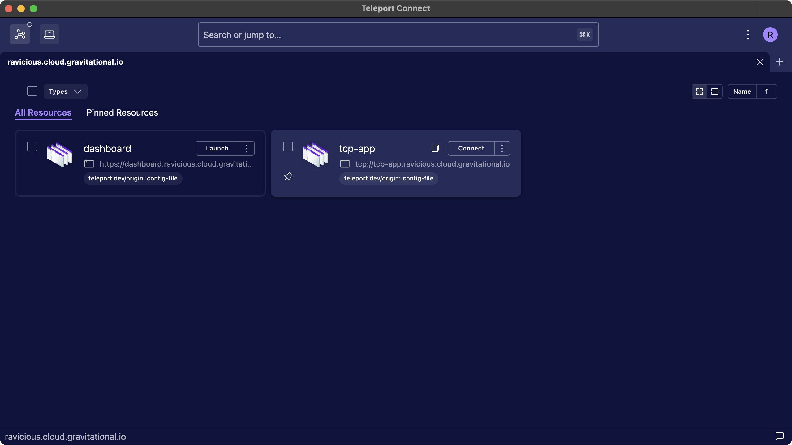
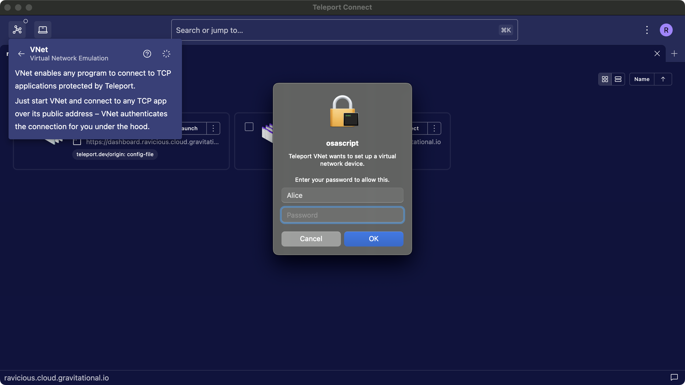

This guide explains how to use VNet to connect to TCP applications available through Teleport.

## How it works

VNet automatically proxies connections from your computer to TCP apps available through Teleport. A
program on your device can connect to `tcp-app.teleport.example.com`, without having to know about
Teleport. Underneath, VNet authenticates the connection with your credentials, using [the same TLS
routing technology](../reference/architecture/tls-routing.mdx) as `tsh proxy app`. This is all done
client-side – VNet sets up a local DNS name server and a virtual network device.

VNet is available on macOS in Teleport Connect and tsh, with plans for future Windows and Linux
versions.

## Prerequisites

- A client machine running macOS Ventura (13.0) or higher.
- [Teleport Connect](teleport-connect.mdx), version 16.0.0 or higher.

## Step 1/3. Start Teleport Connect

Open Teleport Connect and log in to the cluster. Find the TCP app you want to connect to. TCP apps
have `tcp://` as the protocol in their addresses.



## Step 2/3. Start VNet

Click "Connect" next to the TCP app. This starts VNet if it's not already running. Alternatively,
you can start VNet through the connection list in the top left.

During the first launch, macOS will prompt you to enable a background item for tsh.app. VNet needs
this background item in order to configure DNS on your device. To enable the background item, either
interact with the system notification or go to System Settings > General > Login Items and look for
tsh.app under "Allow in the Background".



## Step 3/3. Connect

Once VNet is running, you can connect to the application using the application client you would
normally use to connect to it. The port number is inconsequential. VNet forwards connections over
any port number under the public address of the app to the app itself.

```code
$ psql postgres://postgres@tcp-app.teleport.example.com/postgres
```

VNet is going to automatically start on the next Teleport Connect launch, unless you stop VNet
before closing Teleport Connect.

## `tsh` support

VNet is available in `tsh` as well. Using it involves logging into the cluster and executing the
command `tsh vnet`.

```code
$ tsh login --proxy=teleport.example.com
$ tsh vnet
```

## Troubleshooting

### Conflicting IPv4 ranges

On the client computer, VNet uses IPv4 addresses from the CGNAT IP range `100.64.0.0/10` by
default, and needs to configure addresses and routes for this range.
This can conflict with other VPN-like applications, notably Tailscale also uses
this range.

If you are experiencing connectivity problems with VNet, check if you are
running Tailscale or another VPN client, and try disabling it to see if the
issue persists.
To avoid the conflict and run VNet alongside Tailscale or another VPN client you
can configure VNet to use a different IPv4 range, see our VNet configuration
[guide](../enroll-resources/application-access/guides/vnet.mdx#configuring-ipv4-cidr-range).

### Connecting to the app without VNet

Sometimes connectivity issues are not related to VNet, and you can narrow that down by trying to
connect to your app without VNet. Make sure your app appears in the Connect resources view, or the
output of `tsh apps ls`. Turn off VNet and try creating a local proxy to your app (with debug
logging enabled) with `tsh proxy app -d <app-name>`.

### Timeouts when trying to reach a Teleport cluster

If VNet doesn't have a chance to clean up before stopping, such as during sudden device shut down,
it may leave leftover DNS configuration files in `/etc/resolver`. Those files tell your computer to
talk to a DNS server operated by VNet when connecting to your cluster. But since VNet is no longer
running, there's no DNS server to answer those calls.

To clean up those files, simply start VNet again. Alternatively, you can remove the leftover files
manually.

### Verifying that VNet receives DNS queries

Start VNet with `tsh vnet -d`. Look at `/var/log/vnet.log` and note the IPv6 and IPv4 CIDR range used by VNet.

```code
From tsh vnet -d:
INFO [VNET]      Running Teleport VNet. ipv6_prefix:fd60:67ec:4325:: vnet/vnet.go:317

From /var/log/vnet.log:
INFO  Setting an IP route for the VNet. netmask:100.64.0.0/10 vnet/osconfig_darwin.go:47
```

Send a query for a TCP app available in your cluster, replacing <Var
name="tcp-app.teleport.example.com" /> with the name of your app:

```code
$ dscacheutil -q host -a name <Var name="tcp-app.teleport.example.com" />
name: tcp-app.teleport.example.com
ipv6_address: fd60:67ec:4325::647a:547d

name: tcp-app.teleport.example.com
ip_address: 100.68.51.151
```

The addresses reported by `dscacheutil` should belong to ranges reported by VNet above.

Querying for anything other than an address of a TCP app should return the address belonging to the
Proxy Service.

```code
$ dscacheutil -q host -a name dashboard.teleport.example.com
name: dashboard.teleport.example.com
ipv6_address: 2606:2800:21f:cb07:6820:80da:af6b:8b2c

name: dashboard.teleport.example.com
ip_address: 93.184.215.14
```

Querying for both addresses should result in some output being emitted by `tsh vnet -d`.

### Submitting an issue

When [submitting an
issue](https://github.com/gravitational/teleport/issues/new?assignees=&labels=bug,vnet&template=bug_report.md),
make sure to include logs from `/var/log/vnet.log`, as well as [Teleport Connect
logs](teleport-connect.mdx#submitting-an-issue) or the output of `tsh vnet -d`, depending on which
client you use.

## Next steps

- Read our VNet configuration [guide](../enroll-resources/application-access/guides/vnet.mdx)
  to learn how to configure VNet access to your applications.
- Read [RFD 163](https://github.com/gravitational/teleport/blob/master/rfd/0163-vnet.md) to learn how VNet works on a technical level.
