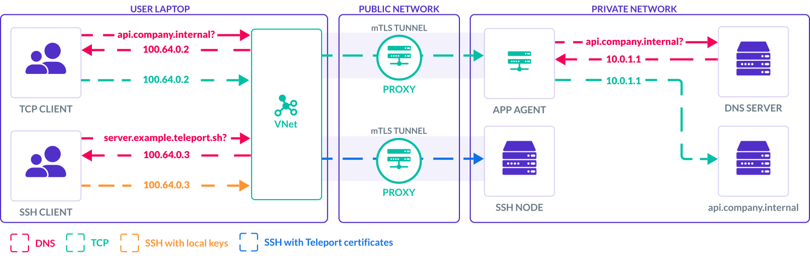

This guide explains how to use VNet to connect to TCP applications available through Teleport.

## How it works

VNet automatically proxies connections from your computer to TCP apps available
through Teleport.
A program on your device can securely connect to internal applications protected
by Teleport without having to know about Teleport authentication details.
Underneath, VNet authenticates the connection with your Teleport credentials and
securely tunnels the TCP connection to your application.
This is all done client-side – VNet sets up a local DNS name server that
intercepts DNS requests for your internal apps and responds with a virtual IP
address managed by VNet that will forward the connection to your application.



VNet delivers an experience like a VPN for your TCP applications through this local virtual network, while maintaining all of Teleport's identity verification and zero trust features that traditional VPNs cannot provide.

VNet is available on macOS and Windows in Teleport Connect and tsh, with plans
for Linux support in a future version.

<Admonition type="warning">
VNet's VPN-like experience for app access means that any software running on
the client machine can access Teleport apps at local DNS or IP addresses.

**Avoid running VNet on shared or multi-user machines.**
If multiple OS users share the same machine, any user could access Teleport TCP
apps at their local VNet DNS or IP address.

**Protect HTTP services behind VNet.**
Untrusted websites can potentially use DNS rebinding attacks to bypass the
browser’s Same-Origin Policy and issue plain HTTP requests to VNet IP addresses.
If your Teleport cluster contains TCP apps serving plain HTTP APIs, it is
strongly recommended to either avoid VNet or implement one or more of the
following mitigations for DNS rebinding attacks:
- upgrade these APIs to HTTPS or another protocol
- enforce a Host header allowlist at the HTTP server
- block browser access to HTTP websites
</Admonition>

## Prerequisites

<Tabs>
<TabItem label="macOS">
- A client machine running macOS Ventura (13.0) or higher.
- [Teleport Connect](teleport-connect.mdx), version 16.0.0 or higher.
</TabItem>
<TabItem label="Windows">
- A client machine running Windows 10 or higher.
- [Teleport Connect](teleport-connect.mdx), version 17.3.0 or higher.
</TabItem>
</Tabs>

## Step 1/3. Start Teleport Connect

Open Teleport Connect and log in to the cluster. Find the TCP app you want to connect to. TCP apps
have `tcp://` as the protocol in their addresses.


## Step 2/3. Start VNet

Click "Connect" next to the TCP app. This starts VNet if it's not already running. Alternatively,
you can start VNet through the connection list in the top left.

<details>
<summary>First launch on macOS</summary>
During the first launch, macOS will prompt you to enable a background item for tsh.app. VNet needs
this background item in order to configure DNS on your device. To enable the background item, either
interact with the system notification or go to System Settings > General > Login Items and look for
tsh.app under "Allow in the Background".


</details>

## Step 3/3. Connect

Once VNet is running, you can connect to the application using the application client you would
normally use to connect to it.

```code
$ psql postgres://postgres@tcp-app.teleport.example.com/postgres
```

<Admonition type="note" title="Support for multiple ports">
Unless the application specifies [multiple
ports](../enroll-resources/application-access/guides/tcp.mdx#configuring-access-to-multiple-ports),
VNet proxies connections over any port used by the application client. For multi-port apps, the port
number must match one of the target ports of the app. To see a list of target ports, click the
three dot menu next to an application in Teleport Connect or execute `tsh apps ls`.

If [per-session MFA](../admin-guides/access-controls/guides/per-session-mfa.mdx) is enabled, the
first connection over each port triggers an MFA check.
</Admonition>

VNet is going to automatically start on the next Teleport Connect launch, unless you stop VNet
before closing Teleport Connect.

## `tsh` support

VNet is available in `tsh` as well. Using it involves logging into the cluster and executing the
command `tsh vnet`.

```code
$ tsh login --proxy=teleport.example.com
$ tsh vnet
```

## Troubleshooting

### Conflicting IPv4 ranges

On the client computer, VNet uses IPv4 addresses from the CGNAT IP range `100.64.0.0/10` by
default, and needs to configure addresses and routes for this range.
This can conflict with other VPN-like applications, notably Tailscale also uses
this range.

If you are experiencing connectivity problems with VNet, check if you are
running Tailscale or another VPN client, and try disabling it to see if the
issue persists.
To avoid the conflict and run VNet alongside Tailscale or another VPN client you
can configure VNet to use a different IPv4 range, see our VNet configuration
[guide](../enroll-resources/application-access/guides/vnet.mdx#configuring-ipv4-cidr-range).

### Connecting to the app without VNet

Sometimes connectivity issues are not related to VNet, and you can narrow that down by trying to
connect to your app without VNet. Make sure your app appears in the Connect resources view, or the
output of `tsh apps ls`. Turn off VNet and try creating a local proxy to your app (with debug
logging enabled) with `tsh proxy app -d <app-name>`.

### Timeouts when trying to reach a Teleport cluster

If VNet doesn't have a chance to clean up before stopping, such as during sudden device shut down,
it may leave leftover DNS configuration files in `/etc/resolver`. Those files tell your computer to
talk to a DNS server operated by VNet when connecting to your cluster. But since VNet is no longer
running, there's no DNS server to answer those calls.

To clean up those files, simply start VNet again. Alternatively, you can remove the leftover files
manually.

### Verifying that VNet receives DNS queries

Open Teleport Connect. From the Connections panel in the top left, select VNet. Make sure VNet is
running, then select "Open Diag Report". Note the IPv6 prefix and the IPv4 CIDR range used by VNet.

Send a query for a TCP app available in your cluster, replacing <Var
name="tcp-app.teleport.example.com" /> with the name of your app:

<Tabs>
<TabItem label="macOS">
```code
$ dscacheutil -q host -a name <Var name="tcp-app.teleport.example.com" />
name: tcp-app.teleport.example.com
ipv6_address: fd60:67ec:4325::647a:547d

name: tcp-app.teleport.example.com
ip_address: 100.68.51.151
```
</TabItem>
<TabItem label="Windows">
```code
# In PowerShell.
$ Resolve-DnsName <Var name="tcp-app.teleport.example.com" />

Name                                           Type   TTL   Section    IPAddress
----                                           ----   ---   -------    ---------
tcp-app.teleport.example.com                   AAAA   10    Answer     fd60:67ec:4325::647a:547d
tcp-app.teleport.example.com                   A      10    Answer     100.68.51.151
```
</TabItem>
</Tabs>

The returned addresses should belong to ranges listed in the VNet diag report.

Querying for anything other than an address of a TCP app should return the address belonging to the
Proxy Service. Using macOS as an example:

```code
$ dscacheutil -q host -a name dashboard.teleport.example.com
name: dashboard.teleport.example.com
ipv6_address: 2606:2800:21f:cb07:6820:80da:af6b:8b2c

name: dashboard.teleport.example.com
ip_address: 93.184.215.14
```

Querying for any of those hostnames should result in some output being emitted in the debug logs of
VNet (see [Submitting an issue](#submitting-an-issue) on how to enable debug logs).

### Submitting an issue

When [submitting an
issue](https://github.com/gravitational/teleport/issues/new?assignees=&labels=bug,vnet&template=bug_report.md),
make sure to include a VNet diag report and debug logs from VNet and Teleport Connect.

To save a diag report to a file, open Teleport Connect. From the Connections panel in the top left
select VNet, then "Open Diag Report". In the new tab with the report that was opened click the "Save
Report to File" icon.

To collect VNet and Teleport Connect logs use the instructions below:

<Tabs>
<TabItem label="macOS">
To enable debug logs in VNet, first stop Teleport Connect and then run the following command. It
enables debug logs just for the next invocation of VNet:

```code
$ sudo launchctl debug system/com.gravitational.teleport.tsh.vnetd --environment TELEPORT_DEBUG=1
```

Next, start capturing logs from VNet into a file:

```code
$ log stream --predicate 'subsystem ENDSWITH ".vnetd"' --style syslog --level debug > vnet.log
```

Then start Teleport Connect using the following command to enable debug logs for Teleport Connect:

```code
$ open -a "Teleport Connect" --args --connect-debug
```

Next, attempt to reproduce the issue with VNet.

To gather logs from Teleport Connect, from the app menu select Help → Open Logs Directory which
opens `~/Library/Application Support/Teleport Connect/logs` in Finder. Attach all files together
with `vnet.log` produced in the earlier step.

{/* TODO: DELETE IN 21.0.0 */}
Before version 18.0.0, VNet logs were saved in `/var/log/vnet.log`.

If the error is related to Teleport Connect not being able to start VNet or issues with code
signing, searching through `/var/log/com.apple.xpc.launchd/launchd.log` for `tsh` soon after
attempting to start VNet might also bring up relevant information:

```code
$ grep tsh /var/log/com.apple.xpc.launchd/launchd.log
```
</TabItem>
<TabItem label="Windows">
To enable debug logs in VNet, first stop Teleport Connect. Then in the Start menu look for Command
Prompt and from the right click menu select Run as administrator. The following command enables
debug logs in VNet and immediately closes the admin command prompt to prevent you from starting
Teleport Connect as an admin by mistake.

```code
$ reg.exe ADD HKLM\SYSTEM\CurrentControlSet\Services\TeleportVNet /v Environment /t REG_MULTI_SZ /d TELEPORT_DEBUG=1 /f && exit
```

Next, from the Start menu open the Run app. Execute the following to start Teleport Connect with
debug logs enabled:

```code
$ "%PROGRAMFILES%\Teleport Connect\Teleport Connect.exe" --connect-debug
```

Next, attempt to reproduce the issue with VNet.

Once that's done, execute the following command from the administrator Command Prompt to disable
debug logs in VNet:

```code
$ reg.exe DELETE HKLM\SYSTEM\CurrentControlSet\Services\TeleportVNet /v Environment /f
```

The last step is collecting the logs. Let's start with the VNet logs. From the Start menu, open Event Viewer.
From the sidebar on the left, select Event Viewer (Local) → Applications and Services Logs →
Teleport. From the sidebar on the right, select "Save All Events As…". Save the logs as .evtx file.
If Event Viewer asks about Display Information, choose "No display information".

To gather logs from Teleport Connect, press `Alt` while in the app, then select Help → Open Logs
Directory. This opens `C:\Users\%UserName%\AppData\Roaming\Teleport Connect\logs`. Attach all files
together with the .evtx file from the previous step.

Outside of submitting an issue, VNet logs can be quickly saved to a file with the following
PowerShell command. However, when submitting an issue please attach the .evtx file instead.

```code
$ Get-WinEvent -LogName Teleport -FilterXPath "*[System[Provider[@Name='vnet']]]" -Oldest | Format-Table -Property TimeCreated,LevelDisplayName,Message -Wrap | Out-File vnet.log
```

{/* TODO: DELETE IN 21.0.0 */}
Before version 18.0.0, VNet logs were saved in `C:\Program Files\Teleport Connect\resources\bin\logs.txt`.
</TabItem>
</Tabs>

## Next steps

- Read our VNet configuration [guide](../enroll-resources/application-access/guides/vnet.mdx)
  to learn how to configure VNet access to your applications.
- Read [RFD 163](https://github.com/gravitational/teleport/blob/master/rfd/0163-vnet.md) to learn how VNet works on a technical level.
