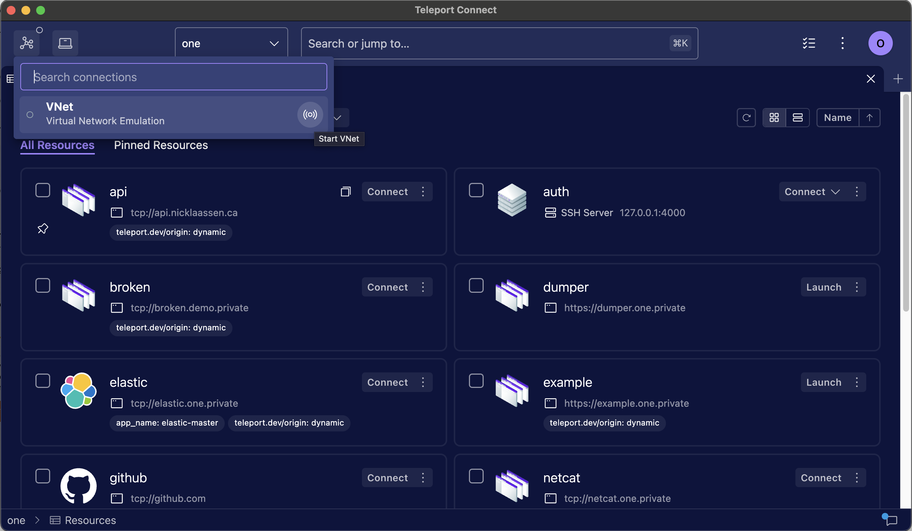
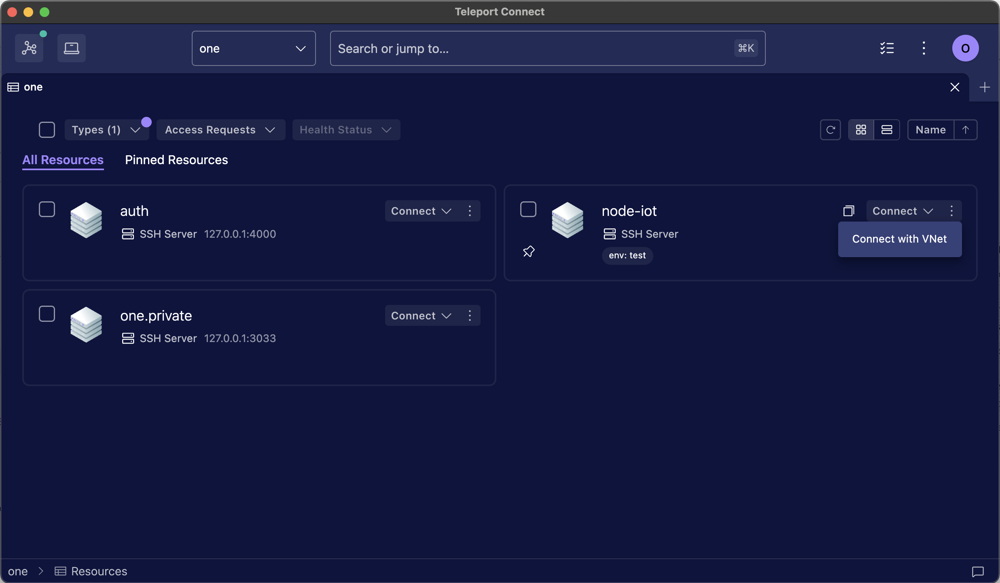
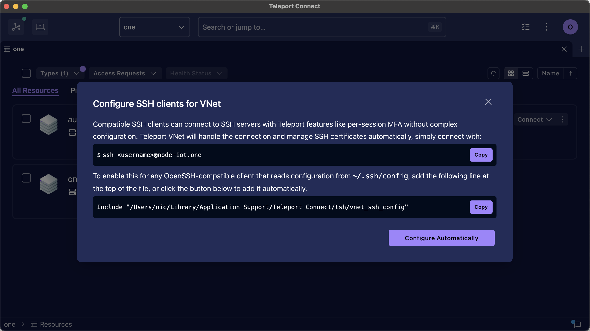

This guide explains how to use VNet to connect to TCP applications and SSH
servers available through Teleport.

## How it works

VNet automatically proxies connections from your computer to TCP apps and SSH
servers available through Teleport.
A program on your device can securely connect to resources protected
by Teleport without having to know about Teleport authentication details.
Underneath, VNet authenticates the connection with your Teleport credentials and
securely tunnels the connection.
This is all done client-side – VNet sets up a local DNS name server that
intercepts DNS requests for your Teleport resources and responds with a virtual IP
address managed by VNet that will handle the connection.

VNet's SSH support enables third-party SSH clients to connect to Teleport SSH
servers with minimal configuration required, while still offering Teleport
access controls and features like [Per-session MFA](../admin-guides/access-controls/guides/per-session-mfa.mdx)
and [Hardware Key Support](../admin-guides/access-controls/guides/hardware-key-support.mdx).


VNet delivers an experience like a VPN through this local virtual network,
while maintaining all of Teleport's identity verification and zero trust
features that traditional VPNs cannot provide.

VNet is available on macOS and Windows in Teleport Connect and tsh, with plans
for Linux support in a future version.

## Prerequisites

<Tabs>
<TabItem label="macOS">
- A client machine running macOS Ventura (13.0) or higher.
- [Teleport Connect](teleport-connect.mdx), version 16.0.0 or higher.
</TabItem>
<TabItem label="Windows">
- A client machine running Windows 10 or higher.
- [Teleport Connect](teleport-connect.mdx), version 17.3.0 or higher.
</TabItem>
</Tabs>

## Step 1/3. Start VNet

Open Teleport Connect and log in to your cluster.
See [Using Teleport Connect](./teleport-connect.mdx) if you haven't used the
Teleport Connect app before.

Open the **connection list** in the top left and click the icon to start VNet.
Or, skip this step and VNet will start automatically when you click "Connect"
on a TCP app or "Connect with VNet" on an SSH server.



After VNet has been started once it will automatically start every time
Teleport Connect is opened, unless you stop VNet before closing Teleport
Connect.

<details>
<summary>First launch on macOS</summary>
During the first launch, macOS will prompt you to enable a background item for tsh.app. VNet needs
this background item in order to configure DNS on your device. To enable the background item, either
interact with the system notification or go to System Settings > General > Login Items and look for
tsh.app under "Allow in the Background".


</details>

## Step 2/3. Connect to a TCP app

Find the TCP app you want to connect to.
TCP apps have `tcp://` as the protocol in their address.


Click "Connect" next to the TCP app.
This will start VNet if it's not already running, and then copy the app's
address to your clipboard.
You can now connect to the application using the application client you would
normally use to connect to it.

```code
$ psql postgres://postgres@tcp-app.teleport.example.com/postgres
```

As long as VNet is running in the background, clicking "Connect" next to each
app is not necessary.
You can directly connect to all of your TCP apps without any actions in
Teleport Connect.

<Admonition type="note" title="Support for multiple ports">
Unless the application specifies [multiple
ports](../enroll-resources/application-access/guides/tcp.mdx#configuring-access-to-multiple-ports),
VNet proxies connections over any port used by the application client. For multi-port apps, the port
number must match one of the target ports of the app. To see a list of target ports, click the
three dot menu next to an application in Teleport Connect or execute `tsh apps ls`.

If [per-session MFA](../admin-guides/access-controls/guides/per-session-mfa.mdx) is enabled, the
first connection over each port triggers an MFA check.
</Admonition>

## Step 3/3. Connect to an SSH server

Find the SSH server you want to connect to, open the menu next to the "Connect"
dropdown, and click "Connect with VNet".
This will start VNet if it's not already running, and then copy the VNet
address for the server to your clipboard.



There is a one-time configuration step required before SSH clients will be able
to connect to Teleport SSH servers through VNet.
When you click "Connect with VNet" on an SSH server, Teleport Connect will
automatically check if this configuration is present and walk you through it if
necessary.



Once the configuration step is complete, any OpenSSH-compatible client that
reads configuration options from `~/.ssh/config` should be able to connect to
Teleport SSH servers.
Try connecting with the standard `ssh` client or the Remote Development feature
in editors like Visual Studio Code or Zed.

```code
$ ssh <username>@<hostname>.<clustername>
```

As long as VNet is running in the background, clicking "Connect with VNet" next
to each SSH server is not necessary, you can directly connect to all of your
Teleport SSH servers without any actions in Teleport Connect.

## `tsh` support

VNet is also available in `tsh` without running Teleport Connect.
To use it, log in and then run `tsh vnet`.

```code
$ tsh login --proxy=teleport.example.com
$ tsh vnet
```

While `tsh` support is available, Teleport Connect is the preferred application
for running VNet.
Teleport Connect offers better visibility for MFA prompts and cluster logins, and
automatically runs diagnostics that are useful for troubleshooting.

## Troubleshooting

### Conflicting IPv4 ranges

On the client computer, VNet uses IPv4 addresses from the CGNAT IP range `100.64.0.0/10` by
default, and needs to configure addresses and routes for this range.
This can conflict with other VPN-like applications, notably Tailscale also uses
this range.

If you are experiencing connectivity problems with VNet, check if you are
running Tailscale or another VPN client, and try disabling it to see if the
issue persists.
To avoid the conflict and run VNet alongside Tailscale or another VPN client you
can configure VNet to use a different IPv4 range, see our VNet configuration
[guide](../enroll-resources/application-access/guides/vnet.mdx#configuring-ipv4-cidr-range).

### Connecting to the app without VNet

Sometimes connectivity issues are not related to VNet, and you can narrow that down by trying to
connect to your app without VNet. Make sure your app appears in the Connect resources view, or the
output of `tsh apps ls`. Turn off VNet and try creating a local proxy to your app (with debug
logging enabled) with `tsh proxy app -d <app-name>`.

### Timeouts when trying to reach a Teleport cluster

If VNet doesn't have a chance to clean up before stopping, such as during sudden device shut down,
it may leave leftover DNS configuration files in `/etc/resolver`. Those files tell your computer to
talk to a DNS server operated by VNet when connecting to your cluster. But since VNet is no longer
running, there's no DNS server to answer those calls.

To clean up those files, simply start VNet again. Alternatively, you can remove the leftover files
manually.

### Verifying that VNet receives DNS queries

Start VNet with `tsh vnet -d`. Look at `/var/log/vnet.log` and note the IPv6 and IPv4 CIDR range used by VNet.

```code
From tsh vnet -d:
INFO [VNET]      Running Teleport VNet. ipv6_prefix:fd60:67ec:4325:: vnet/vnet.go:317

From /var/log/vnet.log:
INFO  Setting an IP route for the VNet. netmask:100.64.0.0/10 vnet/osconfig_darwin.go:47
```

Send a query for a TCP app available in your cluster, replacing <Var
name="tcp-app.teleport.example.com" /> with the name of your app:

```code
$ dscacheutil -q host -a name <Var name="tcp-app.teleport.example.com" />
name: tcp-app.teleport.example.com
ipv6_address: fd60:67ec:4325::647a:547d

name: tcp-app.teleport.example.com
ip_address: 100.68.51.151
```

The addresses reported by `dscacheutil` should belong to ranges reported by VNet above.

Querying for anything other than an address of a TCP app should return the address belonging to the
Proxy Service.

```code
$ dscacheutil -q host -a name dashboard.teleport.example.com
name: dashboard.teleport.example.com
ipv6_address: 2606:2800:21f:cb07:6820:80da:af6b:8b2c

name: dashboard.teleport.example.com
ip_address: 93.184.215.14
```

Querying for both addresses should result in some output being emitted by `tsh vnet -d`.

### Submitting an issue

When [submitting an
issue](https://github.com/gravitational/teleport/issues/new?assignees=&labels=bug,vnet&template=bug_report.md),
make sure to include VNet logs as well as [Teleport Connect
logs](teleport-connect.mdx#submitting-an-issue).

You can collect VNet logs using the instructions below:

<Tabs>
<TabItem label="macOS">
Logs from the VNet daemon are sent to [the unified logging system](https://support.apple.com/en-gb/guide/console/welcome/mac).

To stream logs:

```code
$ log stream --predicate 'subsystem ENDSWITH ".vnetd"' --style syslog --level info
```

To dump logs captured so far to a file:

```code
$ log show --predicate 'subsystem ENDSWITH ".vnetd"' --style syslog --info > vnet.log
```

The logs can also be inspected in [the Console
app](https://support.apple.com/en-gb/guide/console/cnsl1012/1.1/mac/15.0). Info logs are not shown
by default, so make sure to select "Include Info Messages" from the Action menu.

At the moment it's not possible to enable debug logs in the VNet daemon.

{/* TODO: DELETE IN 21.0.0 */}
Before version 18.0.0, VNet logs were saved in `/var/log/vnet.log`.

If the error is related to Teleport Connect not being able to start VNet or issues with code
signing, searching through `/var/log/com.apple.xpc.launchd/launchd.log` for `tsh` soon after
attempting to start VNet might also bring up relevant information:

```code
$ grep tsh /var/log/com.apple.xpc.launchd/launchd.log
```
</TabItem>
<TabItem label="Windows">
Logs are saved to a custom log in Event Log called Teleport. To browse them, open [Event
Viewer](https://learn.microsoft.com/en-us/shows/inside/event-viewer), select "Applications and
Services Logs" in the sidebar on the left and choose "Teleport".

To save them to a file, select "Save All Events As…" from the sidebar on the right.

Alternatively, you can save them to a file with a PowerShell command:

```code
$ Get-WinEvent -LogName Teleport -FilterXPath "*[System[Provider[@Name='vnet']]]" -Oldest | Format-Table -Property TimeCreated,LevelDisplayName,Message -Wrap | Out-File vnet.log
```

To enable debug logs, search for "Edit the system environment variables" in the Start Menu. Select
"Environment Variables…" and then add a new _system_ variable with the name `TELEPORT_DEBUG` and the
value set to `1`, then restart VNet.

{/* TODO: DELETE IN 21.0.0 */}
Before version 18.0.0, VNet logs were saved in `C:\Program Files\Teleport Connect\resources\bin\logs.txt`.
</TabItem>
</Tabs>

## Next steps

- Read our VNet configuration [guide](../enroll-resources/application-access/guides/vnet.mdx)
  to learn how to configure VNet access to your applications.
- Read [RFD 163](https://github.com/gravitational/teleport/blob/master/rfd/0163-vnet.md) to learn how VNet works on a technical level.
- Read [RFD 207](https://github.com/gravitational/teleport/blob/master/rfd/0207-vnet-ssh.md) to learn how VNet SSH access works.
