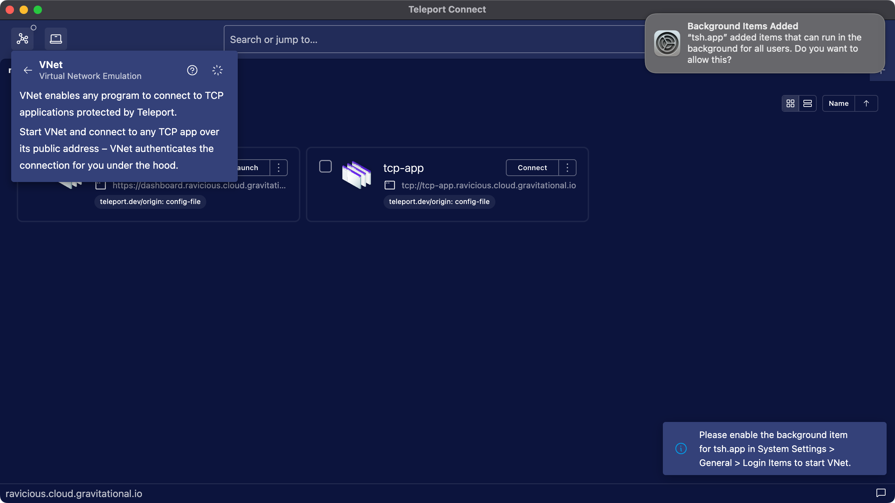

VNet is a virtual network emulation tool which enables any program on your computer to connect to
TCP applications protected by Teleport, with no extra changes required to the program itself. It is
available in Teleport Connect and tsh on macOS, with Windows and Linux version in the works.

Let's say you work on software which needs to connect to a TCP-based application accessible
through a Teleport cluster. Before VNet, you had two options. You could use `tsh app login` to
obtain certs for that TCP app. But this meant that your software had to be aware of those certs and
supply them to the TCP app. To avoid dealing with certs, you could set up an authenticated tunnel
with `tsh proxy app --tunnel`. Your program could then connect to the tunnel, running on a random
port on localhost, without worrying about certs. But now you had to manage the tunnel itself,
remember to start it and remember what its port number is. This was quite inconvenient, especially
when dealing with many TCP apps.

VNet goes one step further. It automatically proxies connections on the fly whenever your
computer wants to reach a TCP app available through Teleport. Your software can talk to
`tcp-app.teleport.example.com` instead of talking to a port on localhost. Underneath, VNet uses [the
same TLS routing technology](../architecture/tls-routing.mdx) as `tsh proxy app`, just with extra
DNS and virtual network setup on the client side.

## Prerequisites

- A client machine running macOS Ventura (13.0) or higher.
- [Teleport Connect](teleport-connect.mdx), version 16.0.0 or higher.

## Step 1/3. Start Teleport Connect

Open Teleport Connect and log in to the cluster. Find the TCP app you want to connect to. TCP apps
have `tcp://` as the protocol in their addresses.


## Step 2/3. Start VNet

Click "Connect" next to the TCP app. This starts VNet if it's not already running. Alternatively,
you can start VNet through the connection list in the top left.

VNet needs to set up a network device and configure DNS on your device, so it'll ask for admin
permissions. For now your password is needed each time you start VNet, but we're working on showing
the prompt only once.



## Step 3/3. Connect

Once VNet is running, you can connect to the application using the application client you would
normally use to connect to it. The port number is inconsequential. VNet forwards connections over
any port number under the public address of the app to the app itself.

```code
$ psql postgres://postgres@tcp-app.teleport.example.com/postgres
```

VNet is going to automatically start on the next Teleport Connect launch, unless you stop VNet
before closing Teleport Connect.

## `tsh` support

VNet is available in `tsh` as well. Using it is as simple as logging in to the cluster and
calling `tsh vnet`.

```code
$ tsh login --proxy=teleport.example.com
$ tsh vnet
```

## Troubleshooting

### Timeouts when trying to reach a Teleport cluster

If VNet doesn't have a chance to clean up before stopping, such as during sudden device shut down,
it may leave leftover DNS configuration files in `/etc/resolver`. Those files tell your computer to
talk to a DNS server operated by VNet when connecting to your cluster. But since VNet is no longer
running, there's no DNS server to answer those calls.

To clean up those files, simply start VNet again. Alternatively, you can remove the leftover files
manually.

### Submitting an issue

When [submitting an
issue](https://github.com/gravitational/teleport/issues/new?assignees=&labels=bug,vnet&template=bug_report.md),
make sure to include logs from `/var/log/vnet.log`, as well as [Teleport Connect
logs](teleport-connect.mdx#submitting-an-issue) or the output of `tsh vnet -d`, depending on which
client you use.

## Next steps

- Read [RFD 163](https://github.com/gravitational/teleport/blob/master/rfd/0163-vnet.md) to learn how VNet works on a technical level.
