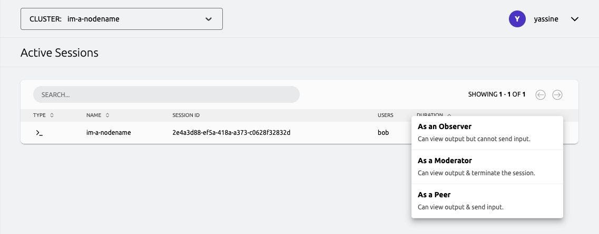
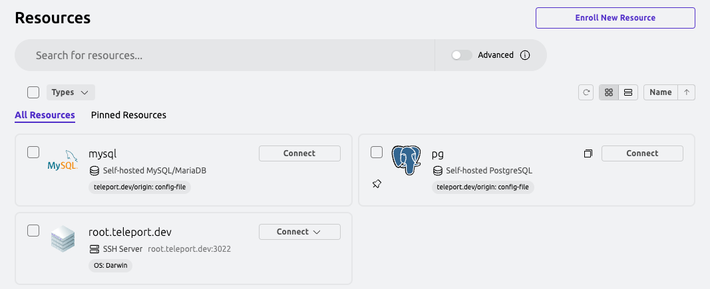
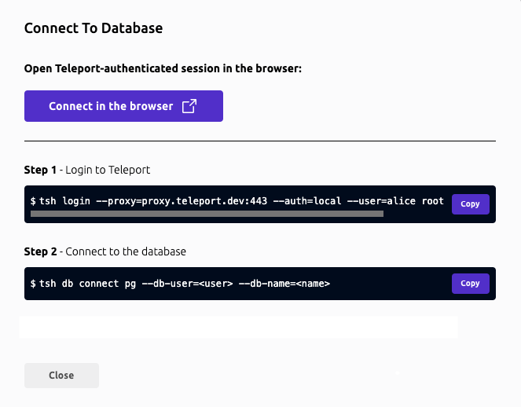
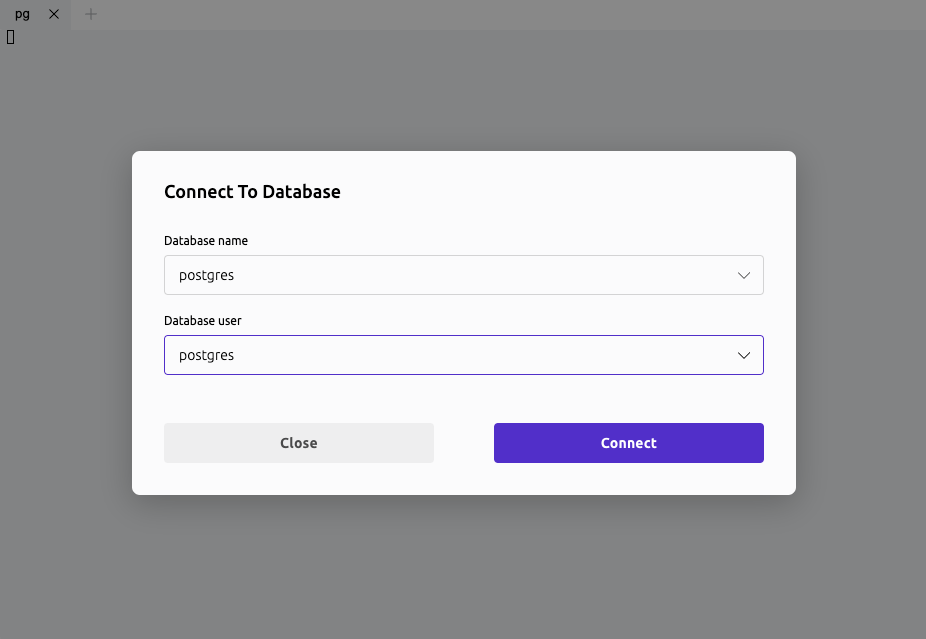
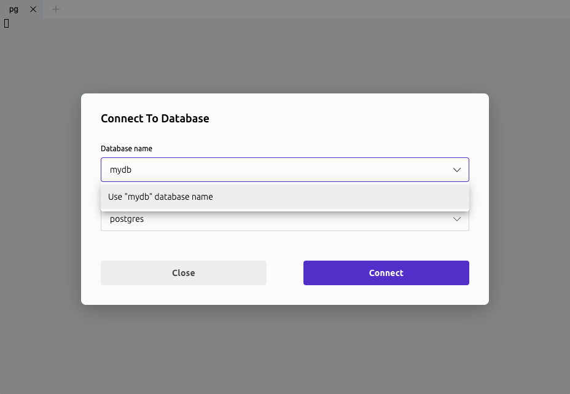
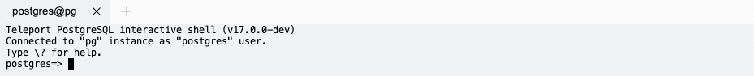

The Teleport Web UI is a web-based visual interface from which you can access resources,
view active sessions and recordings, create and review Access Requests,
manage users and roles, and more.

This page serves a reference on Web UI features and their usage.

## Joining an active session

The Teleport Web UI allows you to list and join active SSH sessions using a web-based terminal.

You can view the active SSH sessions that you are allowed to list by clicking **Active Sessions** in the navigation sidebar.

From the active sessions list, click **Join** and select a participant mode to join the session:

- **As an Observer** with read-only access to the session. You can view output but cannot control the session in any way nor
  send any input.
- **As a Peer** to collaborate in the session. You can view output and send input.
- **As a Moderator** with permission to watch, pause, or terminate the session. You can view output and forcefully terminate
  or pause the session at any time, but can't send input. Moderated sessions are an enterprise-only feature.



You must have the `join_sessions` allow policy in a role you've been assigned to join sessions in any participant mode.
For information about how to configure the `join_sessions` allow policy and participant modes for a role, see
[Configure an allow policy](../admin-guides/access-controls/guides/joining-sessions.mdx).

## Idle timeout

After you log in, the Teleport Web UI checks every 30 seconds if your session is inactive. If so, it
logs you out. A session is considered inactive if more than 10 minutes have passed since you last
interacted with any Web UI browser tab, either through keyboard input or mouse movement and clicks.

To change the default idle timeout of 10 minutes, ask your cluster admin to adjust the
`web_idle_timeout` setting in the Auth Service configuration.

Use `tctl` to edit the `cluster_networking_config` value:

```code
$ tctl edit cluster_networking_config
```

Change the value of `spec.web_idle_timeout`:

```yaml
kind: cluster_networking_config
metadata:
  ...
spec:
  ...
  web_idle_timeout: 10m0s
  ...
version: v2
```

After you save and exit the editor, `tctl` will update the resource:

```text
cluster networking configuration has been updated
```

## Starting a database session

Starting from version `17.1`, users can establish database sessions using the
Teleport Web UI. Currently, it is supported in PostgreSQL databases.

To start a new session, locate your database in the resources list and click
"Connect".



For supported databases, the dialog will present the option to start
the session in your browser.



After clicking on the "Connect in the browser" button, a new tab will open with
a form. Teleport will pre-fill this form based on your permissions, but you can
adjust the options as needed.



If your user has wildcard permissions (*), you can type custom values into the
form fields. This allows flexibility in selecting specific databases or
credentials.



Once you've filled in the session details, click the "Connect" button. Your
session will start, and a terminal interface will appear in the browser.

The browser-based terminal allows you to execute queries and interact with your
database. Follow the on-screen instructions to see available commands and
limitations.



<Admonition type="note" title="Database CLI compatibility">
  While the terminal interface provided in the Teleport Web UI is designed to
  resemble popular database CLIs such as `psql`, it is a custom implementation
  with some differences and limitations:
  - **Feature Set:** Not all features available in `psql` are implemented.
    For instance, scripting capabilities, query cancellation, or informational
    commands like `\d` or `\dt` are currently unsupported.
  - **Error Handling:** Error messages and diagnostics might differ from what
    users are accustomed to in `psql`.

  These distinctions are designed to maintain a lightweight and secure interface
  directly in your browser. For more complex operations, you may prefer
  accessing your database from your terminal using `tsh` and your preferred
  tool.

  Future updates may expand functionality or address feedback based on user
  needs and supported databases.
</Admonition>
