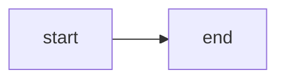

Teleport uses Next.js to generate its static documentation site. Next.js uses Markdown with React, hence the `.mdx` filename suffix.

This section briefly describes some of the features that are most relevant when writing documentation.

## Admonitions

<Admonition
  title="Admonition title"
  type="tip"
>
  Admonition content.
</Admonition>

Admonitions are similar to notices, but are intended for longer content that looks better against a white background. Use this syntax:

```jsx
<Admonition title="Admonition title" type="tip">
 Admonition content.
</Admonition>
```

`type` can be one of the following values: `warning`, `tip`, `note`, `danger`.
Different types will result in different colors for the header. Omitting the type
or using some other value will result in resetting it to the `tip`.

If `title` is omitted, `type` will be used instead as the title value.

`scope` is an optional property that specifies the component's
[scope](./reference.mdx#scopes). If the `scopeOnly` property is provided and the
user-selected scope is not included in `scope`, the `Admonition` will be hidden.


## Code blocks

You will often need to illustrate documentation with examples of commands, code,
or configuration files. You can do this by adding a code block. Code blocks
begin and end with three backticks. A label after the first row of backticks
configures the way the block will be rendered:

   ````md
   ```yaml
   key: value
   array:
   - val1
   - val2
   - val3
   ```
   ````

If a code block's label is `code` or `bash`, the block will be optimized for
example commands. Readers will be able to copy individual lines that begin with
`$`. Comments and output will be highlighted differently than commands.

Here is an example of a `code` block:

   ````md
   ```code
   # Comment
   $ tsh login
   Output
   ```
   ````

Here is the same block after rendering:

   ```code
   # Comment
   $ tsh login
   Output
   ```

## Details

<Details title="Details title" min="7.0" opened>
  Details content
</Details>

To insert a details block like the one above, use this syntax:

```
<Details title="Details title" min="7.0" opened>
  Details content
</Details>
```

`scope` is an optional property that specifies the component's [scope](./reference.mdx#scopes).

If `scopeOnly` is assigned to `{true}`, the component will only be visible
in the provided scope and invisible in all other scopes.

## Figures

{/* TODO: Document all props*/}

The `Figure` component can help with using images, figures, and diagrams:

<Figure
  align="center"
  bordered
  caption="Example"
>
  
</Figure>

```jsx
<Figure
  align="center"
  bordered
  caption="Example"
>
  
</Figure>
```

## Icons

The `Icon` component lets you insert icons into documentation text. This is
useful when referencing a UI element with an icon. For example:

```md
In the main menu, click on <Icon name="desktop" inline size="sm"/> **Desktops**
to view desktops available to your Teleport user.
```

Which renders as:

In the main menu, click on <Icon name="desktop" inline size="sm"/> **Desktops**
to view desktops available to your Teleport user.

<Details title="Available icons">

(!docs/pages/includes/icons-table.mdx!)

</Details>

## Image pixel density markers

Browsers can't distinguish between images that are suitable for Apple's Retina display and images that are not. Because of this, screenshots taken on Retina screens may look large on the page.

To hint to browsers that an image is meant for a Retina display, we can add the
suffix `@Nx` to the image's file name. For example, screenshots made on MacOS
should have the suffix `filename@2x.png`. This will tell the browser to scale
images down twice to show them in their actual size.

## In-page edits

Teleport deeply integrates with a user's infrastructure, so configuration
options, URLs, and other values often vary from setup to setup. Docs pages can
define variables that users can edit, allowing them to tailor their
documentation experience to their own environment.

### The Var component

To declare a variable, use the `Var` component, as shown in the two `code`
snippets below:

````markdown
<Details title="Getting cluster information" opened>
Log in to your Teleport cluster using the following command:

```code
$ tsh login --user=<Var name="user"/> --proxy=<Var name="proxy" description="Domain name of your Teleport Web UI" />
```

Get information about your Teleport cluster:

```code
$ curl https://<Var name="proxy"/>/webapi/ping
```

</Details>
````

Here is the result:

<Details title="Getting cluster information" opened>
Log in to your Teleport cluster using the following command:

```code
$ tsh login --user=<Var name="user"/> --proxy=<Var name="proxy" description="Domain name of your Teleport Web UI" />
```

Get information about your Teleport cluster:

```code
$ curl https://<Var name="proxy"/>/webapi/ping
```

</Details>

<Admonition type="tip">

The `Var` component only works in [code blocks](#code-blocks) using the `code`
syntax (e.g. <code>```code</code>), and only for "command" lines (beginning
with `$`). The component will work without caveats outside of code blocks.

</Admonition>

When a user updates the value of an in-page variable, the values of any `Var`
components with the same `name` property update automatically. When you copy a
`code` snippet using the copy button, the values of any in-page variables within
the `code` snippet are added to the clipboard.

The `description` field is used in the `VarList` component, which we explain in
the next section. You only need to specify the `description` once.

<Admonition type="tip" title="Global variables">

Variables are scoped to a single page by default. You can make a variable
preserve its value across all of the pages a user visits by adding the
`isGlobal` property to the `<Var/>` tag. Variable values are not preserved
between browser sessions.

</Admonition>

`Var` tags must be self closing (ending in `/>`).

### The VarList component

To provide a key for all of the global and page-local variables the docs have
defined, use the `VarList` component:

```markdown
<Details title="Page variables" opened>
<VarList/>
</Details>
```

This results in the following:

<Details title="Page variables" opened>
<VarList/>
</Details>

The description we added to the `proxy` variable appears here. Since the `user`
variable does not have a description, the `VarList` shows its name instead.

## MermaidJS diagrams

You can declare a MermaidJS diagram by adding a code snippet to a docs page with
the `mermaid` label. See the [MermaidJS
documentation](https://mermaid.js.org/intro/) for an introduction to the diagram
syntax.

For example, you can declare a flowchart using this diagram definition:

````markdown

````

This will render as a diagram:


The advantage of MermaidJS diagrams over static images is that MermaidJS
diagrams are easy to edit once they are added to the codebase, since there is no
need to find an original image file. Docs authors can edit the information
within a MermaidJS diagram without needing to worry about adjusting lines in a
graphical editor. It's also possible to apply standard stylesheets to MermaidJS
diagrams and perform static text analysis (e.g., spell checking and linting).

The disadvantage of MermaidJS diagrams is that the Teleport documentation
engine's implementation does not currently support images, so diagrams that
require more than lines, coloring, and text must use another solution.

## Notices

<Notice type="tip">Notice content.</Notice>

If you want to add notice like the one above to the page, use this syntax:

```
<Notice type="tip">
  Notice content.
</Notice>
```

`type` can be one of the following values: `warning`, `tip`, `note`, `danger`. The default is `tip`.
Different types will result in different background colors and icons.

`scope` is an optional property that specifies the component's [scope](./reference.mdx#scopes).

## Partials

To prevent content duplication, it's useful to include code examples or Markdown
content from a partial file into the current page. This allows our documentation
to reduce maintenance overhead so we can focus on writing new articles.

### Including partials

To include a partial, use the following syntax, removing the `\` character
before each `!`:

```markdown
(\!path-to-file.mdx\!) 
```

<Notice type="tip"> 

In the rest of this section, we will include examples of partial inclusion
expressions that use `(\!` and `\!)` instead of `(!` and `!)`.  This is to
prevent the docs engine from evaluating these expressions as partials.

</Notice>

When a page includes a partial, our docs engine resolves the partial's path from
the root of the `gravitational/teleport` repository.

Partials will be linted when a PR is created as part of our CI/CD process. If a
partial does not exist in the repository, our system will throw an error.
Incorrect placement of include statements will also throw errors.

Partials will only be included in these two cases:

#### Surrounded by newlines

   ```md
   Some text.

   (\! include.mdx \!)

   Some other text.
   ```

If the partial is an `.mdx` file, it will be parsed and rendered as Markdown. In
other cases it will be included as-is.

#### Inside code blocks

   ````md
   ```code
   # Code example below

   (\!include.sh\!)

   ```
   ````

These will be inserted as-is, even in the case of `.mdx` files.

### Partial parameters

A partial can define parameters, which allow multiple docs pages to include the
same partial but with slightly different content.

Inside a partial, a parameter uses the `{{ }}` syntax. For example, the partial
`mypartial.mdx` below uses the `{{ action }}` parameter.

```markdown
This is an example of a partial.

A partial makes it possible to {{ action }}.
```

To provide a value for a partial, the page that includes it can use the
following syntax:

```text
(\!mypartial.mdx param1="val" param2="val"\!)
```

For example, a page could supply a value to the `action` parameter in the
`mypartial.mdx` partial above using this expression:

```text
(\!mypartial.mdx action="reuse content in docs pages."\!)
```

This partial would render as:

```markdown
This is an example of a partial.

A partial makes it possible to reuse content in docs pages.
```

When including a partial, parameter definitions must be separated by single
spaces. Values must be enclosed in double quotes. Parameter names and values
must be separated by a `=` character, and the `=` character must not be
surrounded by spaces. 

If a partial defines parameters but a page does not assign them when including
the partial, the docs engine will render the literal `{{ }}` expressions for
those parameters within the content of the included partial. The exception to
this is when the partial defines default parameter values, as described in the
next section.

### Default parameter values

When defining parameters in a partial, you can instruct the docs engine to
supply a value for those parameters if a page that includes the partial does
not.

To define default parameter values, add an expression with the following format
to the top line of a partial:

```markdown
{{ param1="val1" param2="val2" param3="val3" }}
```

For example, let's say the `mypartial.mdx` partial we introduced earlier begins
with the following expression:

```markdown
{{ action="write docs pages more easily." }}
This is an example of a partial.

A partial makes it possible to {{ action }}.
```

If a page includes the partial with this expression...

```markdown
(\!mypartial.mdx\!)
```

...then the partial will render as follows:

```markdown
This is an example of a partial.

A partial makes it possible to write docs pages more easily.
```

Default parameter assignments follow the same rules as parameter value
assignments. Default parameter assignments must be separated by single spaces.
Values must be enclosed in double quotes. Parameter names and values must be
separated by a `=` character, and the `=` character must not be surrounded by
spaces. 

### Relative link paths in partials

When a partial contains a link with a relative path, the docs engine
evaluates the path relative to the partial, not the including file.

For example, let's say you have a file called `docs/pages/page.mdx` with the
following content:

{/*lint ignore includes*/} 
```markdown
This is a page.

(!docs/pages/includes/include.mdx!)
```

The partial in `docs/pages/includes/include.mdx` looks like this:

```markdown
Here is an image:


```

When including the partial, the docs engine will rewrite the link path to load
the image in `docs/img/screenshot.png`.

## ScopedBlock

Use the `ScopedBlock` component if you want to render some Markdown only for
users of open source Teleport, Teleport Cloud, or Teleport Enterprise.

`ScopedBlock` has a single property, `scope`, that works the same as it does for
other components we use in the documentation. See our
[explanation](./reference.mdx#scopes) of how to use the `scope` property.

Use this instead of the `Tabs` component when:

- You want to conceal details that aren't relevant to the reader's scope.
- The components you use don't look presentable within a `TabItem`, e.g., you're
  including a separate `Tabs` component for each scope.

<Notice type="warning">

Readers may not notice that it is possible to adjust the scope of a docs page,
so only use this component if there is no risk of a reader losing important
information by not seeing a `ScopedBlock`. Otherwise, consider a `Details` block
with `scope` set and `scopeOnly={false}`.

</Notice>

Any Markdown and MDX components can be included within a `ScopedBlock`.

```jsx
<ScopedBlock scope={["oss", "enterprise"]}>

  Here are some options for installing the Teleport Auth and Proxy Services on
  your own infrastructure.

  <Tabs>
  {/* TabItems that vary between scopes */}
  </Tabs>

</ScopedBlock>
```

## Scopes

There are three versions of Teleport: `oss`, `enterprise`, and `cloud`. Readers can switch the scope of the documentation using a dropdown menu at the top of the page.

Based on the selector's value, some `.mdx` components can hide or show different content sections. Check the components' descriptions below to see which component can be affected by this selector. These components will include the `scope` property.

If `scope` is set, the component will be only shown if the scope is selected via
the dropdown menu. `scope` can be either a single string or an array of strings.
Possible values are `oss`, `enterprise`, and `cloud`. For an array of strings,
use this syntax: `scope={["oss", "cloud"]}`.

## Tabs

<Tabs>
  <TabItem label="First label">
    First tab.
  </TabItem>

  <TabItem label="Second label">
    Second tab.
  </TabItem>
</Tabs>

To insert a tabs block like the one above, use this syntax:

```jsx
<Tabs>
  <TabItem label="First label">
    First tab.
  </TabItem>
  <TabItem label="Second label">
    Second tab.
  </TabItem>
</Tabs>
```

### Tabs scopes

`scope` is an optional property that specifies the component's
[scope](./reference.mdx#scopes). Selecting a scope via the menu at the top of
the page switches the `Tabs` component to the tab associated with that scope. 

For example, a page will display the "Teleport Cloud" label in this `Tabs`
component if the user selects the appropriate scope:

```jsx
<Tabs>
  <TabItem label="Self-Hosted" scope={["oss", "enterprise"]}>

  Here are instructions for users of open source Teleport and Teleport
  Enterprise.

  </TabItem>
  <TabItem label="Teleport Cloud" scope="cloud">

  Here are instructions for Teleport Cloud users.

  </TabItem>
</Tabs>
```

Here is the result:

<Tabs>
  <TabItem label="Self-Hosted" scope={["oss", "enterprise"]}>

  Here are instructions for users of open source Teleport and Teleport
  Enterprise.

  </TabItem>
  <TabItem label="Teleport Cloud" scope="cloud">

  Here are instructions for Teleport Cloud users.

  </TabItem>
</Tabs>

### Two-dimensional Tabs components

You can add a second dimension of categories to a `Tabs` component by including
the `dropdownCaption` and `dropdownSelected` options, as shown below:

```jsx
<Tabs dropdownCaption="Choose an environment" dropdownSelected="Helm">
  <TabItem options="Helm" label="From Source">
    Instructions for building from source using a Helm chart.
  </TabItem>
  <TabItem options="Executable" label="From Source">
    Instructions for building from source using shell commands.
  </TabItem>
  <TabItem options="Helm" label="Latest Release">
    Instructions for installing the latest release using a Helm chart.
  </TabItem>
  <TabItem options="Executable" label="Latest Release">
    Instructions for installing the latest release using shell commands.
  </TabItem>
</Tabs>
```

Here is the result:

<Tabs dropdownCaption="Choose an environment" dropdownSelected="Helm">
  <TabItem options="Helm" label="From Source">
    Instructions for building from source using a Helm chart.
  </TabItem>
  <TabItem options="Executable" label="From Source ">
    Instructions for building from source using shell commands.
  </TabItem>
  <TabItem options="Helm" label="Latest Release ">
    Instructions for installing the latest release using a Helm chart.
  </TabItem>
  <TabItem options="Executable" label="Latest Release">
    Instructions for installing the latest release using shell commands.
  </TabItem>
</Tabs>

The `options` attribute indicates which dropdown menu option will render a
`TabItem` visible.

### Dropdown-only Tabs components

For `Tabs` components with long lists of tabs, it often makes sense to display
all tabs via a single dropdown menu. You can do this using the `dropdownView`
option of the `Tabs` component:

```jsx
<Tabs dropdownView dropdownCaption="Teleport Component">
  <TabItem label="Database Service">
  More information about the Database Service.
  </TabItem>
  <TabItem label="Application Service">
  More information about the Application Service.
  </TabItem>
  <TabItem label="Desktop Service">
  More information about the Desktop Service.
  </TabItem>
  <TabItem label="SSH Service">
  More information about the SSH Service.
  </TabItem>
  <TabItem label="Kubernetes Service">
  More information about the Kubernetes Service.
  </TabItem>
  <TabItem label="Machine ID">
  More information about the Machine ID.
  </TabItem>
  <TabItem label="Auth Service">
  More information about the Auth Service.
  </TabItem>
  <TabItem label="Proxy Service">
  More information about the Proxy Service.
  </TabItem>
</Tabs>
```

Here is the result:

<Tabs dropdownView dropdownCaption="Teleport Component" >
  <TabItem label="Database Service" >
  More information about the Database Service.
  </TabItem>
  <TabItem label="Application Service" >
  More information about the Application Service.
  </TabItem>
  <TabItem label="Desktop Service" >
  More information about the Desktop Service.
  </TabItem>
  <TabItem label="SSH Service" >
  More information about the SSH Service.
  </TabItem>
  <TabItem label="Kubernetes Service" >
  More information about the Kubernetes Service.
  </TabItem>
  <TabItem label="Machine ID" >
  More information about the Machine ID.
  </TabItem>
  <TabItem label="Auth Service" >
  More information about the Auth Service.
  </TabItem>
  <TabItem label="Proxy Service" >
  More information about the Proxy Service.
  </TabItem>
</Tabs>

When defining a `Tabs` component with the `dropdownView` option enabled, you
must declare dropdown options using the `label` attribute of `TabItem`, not the
`options` attribute. 

## Variables, templating, and interpolation

Many documentation teams struggle with maintaining the vast number of articles
and resources that are eventually created and consumed. Links and images have to
be rechecked for accuracy and relevance.

To ease this burden, we can replace links and code examples with *variables* so we don't have to constantly update everything after each release.

Variables are stored in the `docs/config.json` file under the key `variables`.

To insert a variable into a page, use the `(\= path.to.variable \=)` syntax (remove backslashes in the actual Markdown).

Variables will be linted when a PR is created as part of our CI/CD process. If a variable does not exist in the config, you will see an error that you must remedy in order to merge your PR.

## Videos

To embed a video in a docs page, use the `video` tag:
```html
<video autoPlay loop muted playsInline>
  <source src="../../img/database-access/dbaccessdemo.mp4" type="video/mp4" />
  <source src="../../img/database-access/dbaccessdemo.webm" type="video/webm" />
Your browser does not support the video tag.
</video>
```
