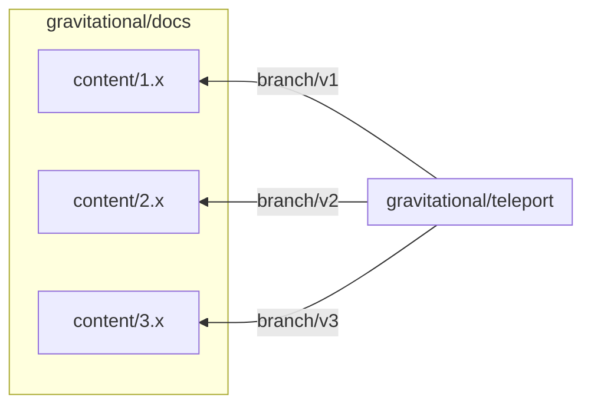

Teleport uses GitHub pull requests to manage documentation changes. You can set
up your environment to preview docs changes on a local development server, then
leave a review on the pull request.

## Step 1/2 Set up a docs site clone

The Teleport documentation site is based on the GitHub repository
`gravitational/docs`, and includes documentation for all supported versions of
Teleport. To achieve this, the `gravitational/docs` repo includes git submodules
for different branches of the Teleport source repository,
`gravitational/teleport`, which also includes the documentation for a particular
version of Teleport:



Clone the `gravitational/docs` repository:

```code
$ git clone https://github.com/gravitational/docs
```

Navigate to the root of your local clone of the `gravitational/docs` repository
and run the following command to populate the `content` directory:

```code
$ yarn git-update
```

## Step 2/2 Visit preview pages on the development server

Navigate to the directory under `content` that corresponds to the latest
released version of Teleport.

```code
$ cd content/(=teleport.major_version=).x
```

Docs PRs fall within `gravitational/teleport`. Check out the branch associated
with the PR:

```code
$ git switch <Var name="branch-name" />
```

Navigate to the root of your `gravitational/docs` clone and run the following
command to start the development server:

```code
$ yarn dev
```

The development server listens on port `3000` by default. (It increments the
port if you have other development server instances running.)

On GitHub, see which docs pages the pull request has changed and navigate to
them within the development server. 

On the docs site, files within `docs/pages` of `gravitational/teleport`
correspond to pages within `localhost:3000/docs`. 

When assigning URL paths to docs pages, the docs site strips the `/pages/`
segment and the `.mdx` extension. For example, `docs/pages/get-started.mdx`
corresponds to `docs/get-started/`. `docs/pages/index.mdx` corresponds to the
root of `localhost:3000/docs`.

## Next steps

- While reviewing documentation changes, you will often run into partials,
  admonitions, and other elements in the docs engine's library of UI components.
  Read about these in the [UI Reference](./reference.mdx).
- To make sure that docs pages make consistent use of language and structure,
  you  should get familiar with the Teleport documentation [style
  guide](./style-guide.mdx).
