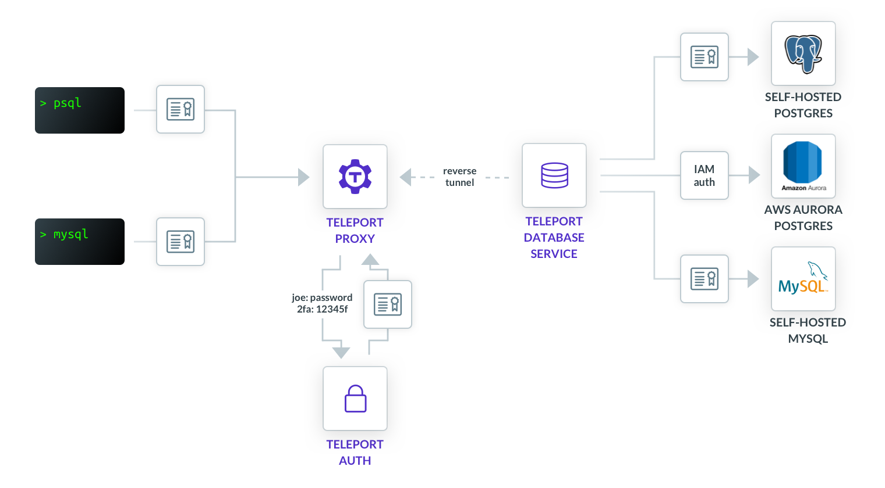

This section provides an overview of how Teleport enables secure access to
databases.

## How it works

Let's take a look at a sample Teleport deployment that enables access to
databases:

In it, we have the following Teleport components:

<ScopedBlock scope={["oss", "enterprise"]}>

- [Teleport Proxy](../architecture/proxy.mdx). A stateless service
  that performs a function of an authentication gateway, serves the Web UI, and
  accepts database (and other) client connections.
  
</ScopedBlock>
<ScopedBlock scope={["cloud"]}>

- [Teleport Proxy](../architecture/proxy.mdx). A stateless service that performs
  a function of an authentication gateway, serves the Web UI, and accepts
  database (and other) client connections. This service is accessible at your
  Teleport Cloud tenant URL, e.g., `mytenant.teleport.sh`.

</ScopedBlock>

- [Teleport Auth Service](../architecture/authentication.mdx). Serves as
  cluster's certificate authority, handles user authentication/authorization
  and issues short-lived client certificates.
- Teleport Database Service. The "brain" that connects to the databases,
  performs database authentication and protocol parsing.

Database Service establishes an SSH reverse tunnel to the Proxy. As such, users
do not need to have direct connectivity to the Database Service, or the databases
it's connected to. As long as it can dial back to the cluster's Proxy server, it
can be located behind a firewall.

<Admonition
  type="tip"
  title="Tip"
>
  You can have multiple Database Services connected to the cluster. Each
  Database Service can be also connected to multiple databases.
</Admonition>

Let's take a look at the typical flow that Teleport users go through to
connect to a database.

1. A user logs into the cluster with `tsh login` command and retrieves
   a client certificate. See [Issuing User Certificates](../architecture/authentication.mdx)
   for more details on how it works.
2. The user picks the database they want to connect to from the list of available
   databases shown in `tsh db ls` command.
3. The user connects to the database with the `tsh db connect` command, which
   first retrieves a short-lived X.509 certificate and then launches the
   standard database client (e.g. `psql`) with this client certificate to
   authenticate with the Teleport Proxy service.
4. The Proxy authenticates the connection and dispatches it to the appropriate
   Database Service based on the routing information encoded in the client
   certificate, over the reverse tunnel.
5. The Database Service authenticates the connection, performs an authorization
   check, and then establishes the connection to the database.
6. The Database Service begins proxying traffic between the user's database
   client and the database. Additionally, it interprets the database wire
   protocol messages and submits events to the Teleport audit log.

## Authentication

Teleport relies on short-lived X.509 certificates for user authentication, as
well as authentication between internal components.

Authentication happens in 3 places:

- Database client connecting to Proxy
- Proxy connecting to Database Service
- Database Service connecting database.

Let's take a detailed look at each authentication point.

### Database client to Proxy

When running the `tsh db connect` command, the command first retrieves a
short-lived X.509 certificate for the selected database. Then the command
provides the database client with this client certificate to authenticate with
the Proxy.

<Admonition
  type="note"
  title="SSL"
>
  Many database clients/servers refer to these certificates as SSL which is
  legacy terminology. In Teleport documentation we most often refer to them as
  TLS or x509 certificates.
</Admonition>

For configuring graphical clients, use the `tsh proxy db` command, which prints
detailed information about the connection such as the host, port, and location
of the secrets. See [GUI Clients](../connect-your-client/gui-clients.mdx) for details.

### Proxy to the Database Service

The connection between the Proxy and the Database Service is also authenticated
with mutual TLS.

The Proxy generates a short-lived X.509 certificate signed by the
cluster's host authority, with the client's identity and database routing
information encoded in it, and uses it to authenticate with the Database Service.

### Database Service to database

Database authentication is handled differently for self-hosted databases and
databases hosted by AWS.

#### Self-hosted

Teleport Database Service uses client certificate authentication with self-hosted
database servers.

See respective configuration guides for [PostgreSQL](./guides/postgres-self-hosted.mdx)
and [MySQL](./guides/mysql-self-hosted.mdx) for details on configuring client certificate
authentication.

#### AWS RDS / Aurora

With RDS and Aurora database instances, the Database Service authenticates using
[IAM Authentication](https://docs.aws.amazon.com/AmazonRDS/latest/UserGuide/UsingWithRDS.IAMDBAuth.html).

The Database Service automatically generates an IAM token for each connection
and uses the token as a password.

See [RDS](./guides/rds.mdx) configuration guide for details on configuring IAM
authentication.

## Next steps

Please refer to the [RFD #11](https://github.com/gravitational/teleport/blob/master/rfd/0011-database-access.md)
for a more in-depth description of the feature scope and design.

See [Core Concepts](../core-concepts.mdx) for general Teleport
architecture principles.
