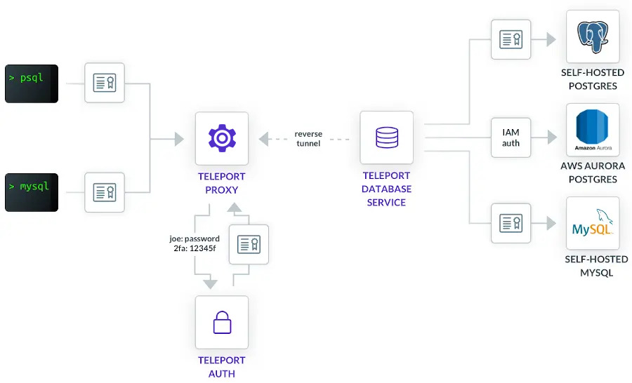

This section provides an overview of how Teleport enables secure access to
databases.

## How it works

Let's take a look at a sample Teleport deployment that enables access to
databases:

In it, we have the following Teleport components:

<Tabs>
<TabItem scope={["oss", "enterprise"]} label="Self-Hosted">

- [Teleport Proxy Service](../architecture/proxy.mdx). A stateless service
  that performs a function of an authentication gateway, serves the Web UI, and
  accepts database (and other) client connections.
  
</TabItem>
<TabItem scope={["cloud"]} label="Teleport Enterprise Cloud">

- [Teleport Proxy Service](../architecture/proxy.mdx). A stateless service that performs
  a function of an authentication gateway, serves the Web UI, and accepts
  database (and other) client connections. This service is accessible at your
  Teleport Cloud tenant URL, e.g., `mytenant.teleport.sh`.

</TabItem>

</Tabs>

- [Teleport Auth Service](../architecture/authentication.mdx). Serves as
  cluster's certificate authority, handles user authentication/authorization
  and issues short-lived client certificates.
- Teleport Database Service. The "brain" that connects to the databases,
  performs database authentication and protocol parsing.
- [Teleport Discovery Service](#discovery). Automatically discovers
  cloud-hosted databases and enrolls them in the Teleport cluster.

The Database Service establishes an SSH reverse tunnel to the Proxy Service. As
such, users do not need to have direct connectivity to the Database Service or
the databases it's connected to. As long as it can dial back to the cluster's
Proxy Service, it can be located behind a firewall.

<Admonition
  type="tip"
  title="Tip"
>
  You can have multiple Database Services connected to the cluster. Each
  Database Service can be also connected to multiple databases.
</Admonition>

Let's take a look at the typical flow that Teleport users go through to
connect to a database.

1. A user logs into the cluster with `tsh login` command and retrieves
   a client certificate. See [Issuing User Certificates](../architecture/authentication.mdx)
   for more details on how it works.
1. The user picks the database they want to connect to from the list of available
   databases shown in `tsh db ls` command.
1. The user connects to the database with the `tsh db connect` command, which
   first retrieves a short-lived X.509 certificate and then launches the
   standard database client (e.g. `psql`) with this client certificate to
   authenticate with the Teleport Proxy Service.
1. The Proxy Service authenticates the connection and dispatches it to the
   appropriate Database Service instance based on the routing information
   encoded in the client certificate, over the reverse tunnel.
1. The Database Service authenticates the connection, performs an authorization
   check, and then establishes the connection to the database.
1. The Database Service begins proxying traffic between the user's database
   client and the database. Additionally, it interprets the database wire
   protocol messages and submits events to the Teleport audit log.

## Authentication

Teleport relies on short-lived X.509 certificates for user authentication, as
well as authentication between internal components.

Authentication happens in 3 places:

- Database client connecting to the Proxy Service
- Proxy Service connecting to Database Service
- Database Service connecting database.

Let's take a detailed look at each authentication point.

### Database client to the Proxy Service

When running the `tsh db connect` command, the command first retrieves a
short-lived X.509 certificate for the selected database. Then the command
provides the database client with this client certificate to authenticate with
the Proxy Service.

<Admonition
  type="note"
  title="SSL"
>
  Many database clients/servers refer to these certificates as SSL which is
  legacy terminology. In Teleport documentation we most often refer to them as
  TLS or x509 certificates.
</Admonition>

For configuring graphical clients, use the `tsh proxy db` command, which prints
detailed information about the connection such as the host, port, and location
of the secrets. See [GUI Clients](../connect-your-client/gui-clients.mdx) for details.

### Proxy Service to the Database Service

The connection between the Proxy Service and the Database Service is also
authenticated with mutual TLS.

The Proxy Service generates a short-lived X.509 certificate signed by the
cluster's host authority, with the client's identity and database routing
information encoded in it, and uses it to authenticate with the Database Service.

### Database Service to database

The Database Service needs to authenticate to databases protected by Teleport.
The authentication method depends on the database. For self-hosted databases,
the Database Service usually uses certificate-based authentication with mutual
TLS. For managed databases running on AWS, Google Cloud, and Azure, the Database
Service uses IAM authentication.

Read the guides to [connecting databases](./guides.mdx) for details on how the
Database Service authenticates with your database.

## Discovery

Teleport Discovery Service can automatically discover and enroll database
servers hosted by cloud providers.

For each configured database type, the Discovery Service scans cloud providers
using corresponding "read" APIs and filters them with configured labels. Then
the discovered databases are enrolled in the Teleport Cluster.

The Database Service is responsible for monitoring the dynamic database
resources including those enrolled by the Discovery Service. Once a dynamic
database resource is added, the Database Service will start proxying it.

These clouds are currently supported:
- AWS Databases Discovery
- Azure Databases Discovery

## Next steps

Please refer to the [RFD #11](https://github.com/gravitational/teleport/blob/master/rfd/0011-database-access.md)
for a more in-depth description of the feature scope and design.

See [Core Concepts](../core-concepts.mdx) for general Teleport
architecture principles.

