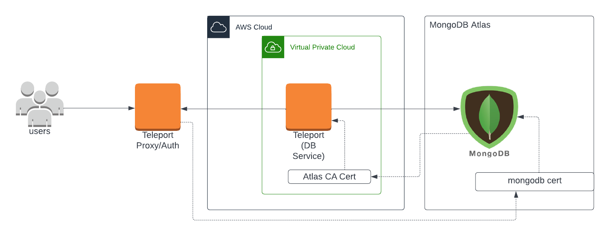
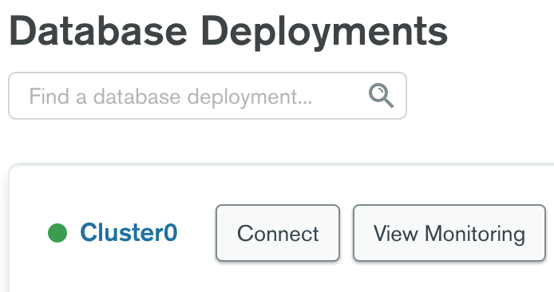
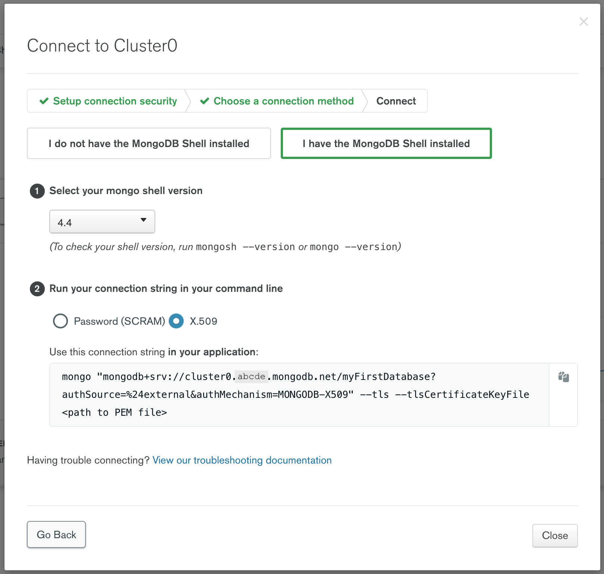
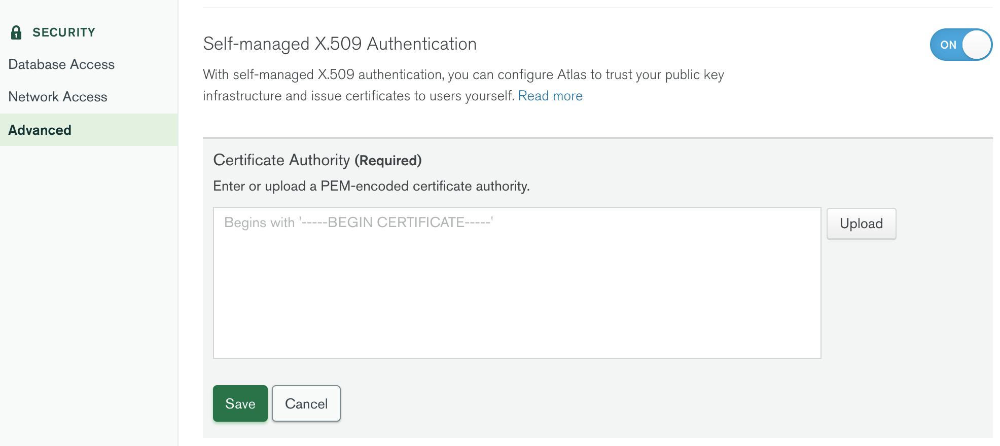
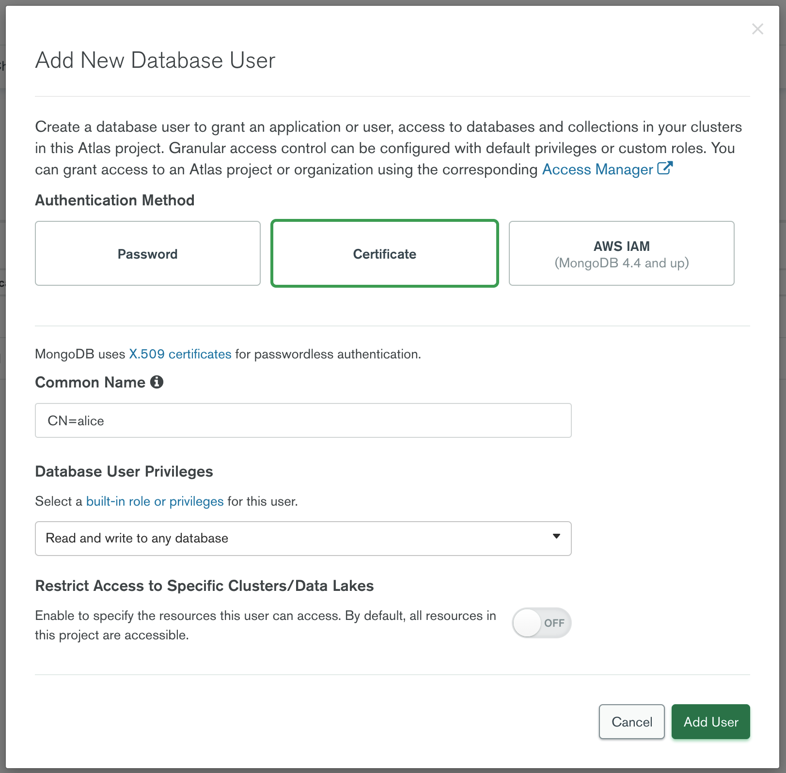
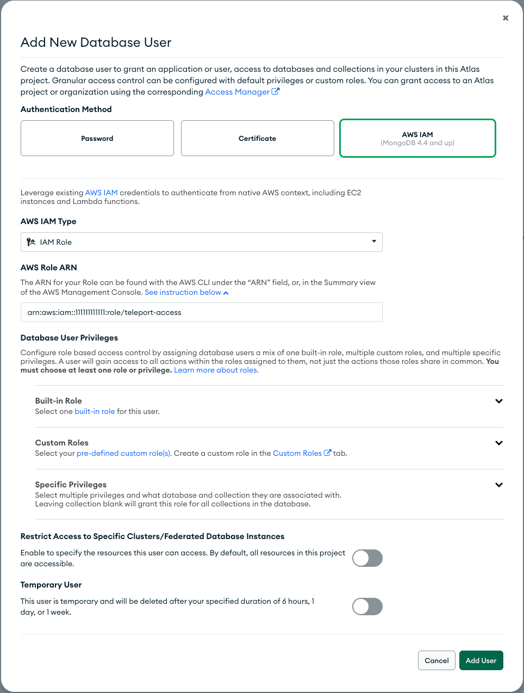

(!docs/pages/includes/database-access/db-introduction.mdx dbType="MongoDB Atlas" dbConfigure="with either IAM or mutual TLS authentication"!)

## How it works

The Teleport Database Service communicates with MongoDB Atlas using mutual TLS.
You configure MongoDB Atlas to trust the Teleport certificate authority for
database clients, and Teleport to trust the Let's Encrypt CA, which signs
certificates for MongoDB Atlas. When a user connects to MongoDB Atlas via
Teleport, the Teleport Database Service authenticates using a certificate and
forwards user traffic to MongoDB Atlas.

<Tabs>
<TabItem scope={["oss", "enterprise"]} label="Self-Hosted">

</TabItem>
<TabItem scope={["cloud"]} label="Teleport Enterprise Cloud">

</TabItem>

</Tabs>

## Prerequisites

(!docs/pages/includes/edition-prereqs-tabs.mdx!)

- [MongoDB Atlas](https://www.mongodb.com/cloud/atlas) cluster.
- A host, e.g., an Amazon EC2 instance, where you will run the Teleport Database
  Service.
- (!docs/pages/includes/tctl.mdx!)

## Step 1/4. Set up the Teleport Database Service

(!docs/pages/includes/database-access/token.mdx!)

Install Teleport on the host where you will run the Teleport Database Service:

(!docs/pages/includes/install-linux.mdx!)

Next, start the Database Service.

<Tabs>
<TabItem label="Teleport CLI">

On the node where you will run the Database Service, start Teleport, pointing
the `--auth-server` flag at the address of your Teleport Proxy Service:

```code
$ sudo teleport db start \
  --token=/tmp/token \
  --auth-server=<Var name="example.teleport.sh:443" /> \
  --name=mongodb-atlas \
  --protocol=mongodb \
  --uri=mongodb+srv://cluster0.abcde.mongodb.net \
  --ca-cert=/path/to/letsencrypt/isrgrootx1.pem \
  --labels=env=dev
```

<Admonition type="note">
  The `--auth-server` flag must point to the Teleport cluster's Proxy Service endpoint
  because the Database Service always connects back to the cluster over a reverse
  tunnel.
</Admonition>

</TabItem>
<TabItem label="Configuration file">

On the node where you will run the Teleport Database Service, add the following
in `/etc/teleport.yaml`:

```yaml
version: v3
teleport:
  auth_token: "/tmp/token"
  proxy_server: <Var name="example.teleport.sh:443" />

# disable services that are on by default
ssh_service: { enabled: no }
proxy_service: { enabled: no }
auth_service: { enabled: no }

db_service:
  enabled: "yes"
  databases:
  - name: "mongodb-atlas"
    protocol: "mongodb"
    uri: "mongodb+srv://cluster0.abcde.mongodb.net"
    tls:
      ca_cert_file: "/path/to/letsencrypt/isrgrootx1.pem"
    static_labels:
      env: "dev"
```

(!docs/pages/includes/start-teleport.mdx service="the Teleport Database Service"!)

See the full [YAML reference](../reference/configuration.mdx) for details.

</TabItem>
</Tabs>

See below for details on how to configure the Teleport Database Service.

### Connection endpoint

You will need to provide your Atlas cluster's connection endpoint for the `db_service.databases[*].uri` configuration option or `--uri` CLI flag. You can find this via the Connect dialog on the Database Deployments overview page:



Go through the "Setup connection security" step and select "Connect with the
MongoDB shell" to view the connection string:



Use only the scheme and hostname parts of the connection string in the URI:

```code
$ --uri=mongodb+srv://cluster0.abcde.mongodb.net
```

### Atlas CA certificate

MongoDB Atlas uses certificates signed by Let's Encrypt.

Download the Let's Encrypt root certificate and use it as a CA in the Database
Service configuration:

```code
$ curl -o /tmp/isrgrootx1.pem https://letsencrypt.org/certs/isrgrootx1.pem.txt
```

You can then use `/tmp/isrgrootx1.pem` as the value of the `db_service.databases[*].ca_cert_file` configuration option or `--ca-cert` CLI flag.

## Step 2/4. Create a Teleport user

(!docs/pages/includes/database-access/create-user.mdx!)

(!docs/pages/includes/database-access/mongodb-required-database-access.mdx!)

## Step 3/4. Configure Atlas

Teleport MongoDB Atlas integration supports two methods of authentication:
- Self-managed X.509: This method relies on certificates for authentication,
  with MongoDB Atlas trusting the Teleport certificates.
- AWS IAM: The authentication is done using AWS credentials fetched by Teleport.

<Tabs>
<TabItem label="Self-managed X.509">
First, obtain Teleport CA certificate by running the following `tctl auth sign`
command against your Teleport cluster:

```code
$ tctl auth sign --format=mongodb --host=mongo --out=mongo
```

The `--host` and `--ttl` flag value doesn't matter in this case since you'll
only use the CA certificate which this command will output to `mongo.cas` file.
You can discard the other `mongo.crt` file.

Go to the Security / Advanced configuration section of your Atlas cluster and
toggle "Self-managed X.509 Authentication" on:



Paste the contents of `mongo.cas` file in the Certificate Authority edit box and
click Save.

### Create a MongoDB user

{/*lint ignore messaging*/}
On the Security / Database Access page add a new database user with Certificate
authentication method:



Make sure to specify the user as `CN=<user>` as shown above since MongoDB
treats the entire certificate subject as a username. When connecting to a
MongoDB cluster, say, as a user `alice`, Teleport will sign an ephemeral
certificate with `CN=alice` subject.

<Admonition type="note">
  Case matters so make sure to specify Common Name in the username with capital
  letters `CN=`.
</Admonition>
</TabItem>

<TabItem label="AWS IAM">

You must provide the Teleport Database Service access to AWS credentials.

(!docs/pages/includes/aws-credentials.mdx service="the Database Service"!)

### Create a MongoDB IAM role

Navigate to the [AWS IAM console](https://console.aws.amazon.com/iam/). In the
navigation pane, choose **Roles** and then choose **Create role**. Next, select
the "Custom trust policy" type. Edit the trust policy to allow the Teleport
Database service IAM role to assume this role so that the Teleport can fetch the
necessary credentials to authenticate to MongoDB:

```json
{
    "Version": "2012-10-17",
    "Statement": [
        {
            "Sid": "Statement1",
            "Effect": "Allow",
            "Principal": {
                "AWS": "arn:aws:iam::111111111111:role/teleport-database-access",
                "Service": "ec2.amazonaws.com"
            },
            "Action": "sts:AssumeRole"
        }
    ]
}
```

Your role won’t require any permission, so you can leave it empty on the
**Add Permissions** step. Then, choose a name for it and create it. In this
guide, we will the name `teleport-access`.

### Create a MongoDB User

{/*lint ignore messaging*/}
On the Security / Database Access page add a new database user with **AWS IAM**
authentication method, and choose "IAM Role" as the **IAM User type**. Then, fill in
the AWS ARN field with the ARN of the newly created IAM role. In the **Database
User Privileges** section, give the user sufficient privileges to access the
desired database data.



Please note that Teleport does not support authentication using AWS IAM users;
it exclusively supports authentication using AWS IAM roles.
</TabItem>
</Tabs>

## Step 4/4. Connect

Log into your Teleport cluster and see available databases:

<Tabs>
<TabItem scope={["enterprise", "oss"]} label="Self-Hosted">

```code
$ tsh login --proxy=teleport.example.com --user=alice
$ tsh db ls
# Name          Description Labels
# ------------- ----------- --------
# mongodb-atlas             env=dev
```

</TabItem>
<TabItem scope={["cloud", "team"]} label="Cloud-Hosted">
```code
$ tsh login --proxy=mytenant.teleport.sh --user=alice
$ tsh db ls
# Name          Description Labels
# ------------- ----------- --------
# mongodb-atlas             env=dev
```
</TabItem>
</Tabs>

<Tabs>
<TabItem label="Self-managed X.509 authentication">
To retrieve credentials for a database and connect to it:

```code
$ tsh db connect --db-user=alice --db-name dev mongodb-atlas
```
</TabItem>
<TabItem label="AWS IAM authentication">
To retrieve credentials for a database and connect to it, you must provide the
database username in the `role/<role-name>` format:

```code
$ tsh db connect --db-user=role/teleport-access --db-name dev mongodb-atlas
```

Alternatively, you provide the full ARN as the database username when connecting
to the database instance:

```code
$ tsh db connect --db-user=arn:aws:iam::111111111111:role/teleport-access --db-name dev mongodb-atlas
```
</TabItem>
</Tabs>

Either the `mongosh` or `mongo` command-line clients should be available in `PATH` in order to be
able to connect. The Database Service attempts to run `mongosh` first and, if `mongosh` is not in `PATH`, runs `mongo`.

To log out of the database and remove credentials:

```code
# Remove credentials for a particular database instance.
$ tsh db logout mongodb-atlas
# Remove credentials for all database instances.
$ tsh db logout
```

## Next steps

(!docs/pages/includes/database-access/guides-next-steps.mdx!)

## Further reading
- [Which certificate authority signs MongoDB Atlas cluster TLS certificates?](https://docs.atlas.mongodb.com/reference/faq/security/#which-certificate-authority-signs-mongodb-atlas-cluster-tls-certificates-)
- [Self-managed X.509 authentication](https://docs.atlas.mongodb.com/security-self-managed-x509/)
- [AWS IAM authentication](https://www.mongodb.com/docs/atlas/security/passwordless-authentication/)

