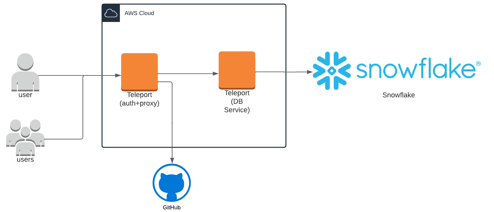
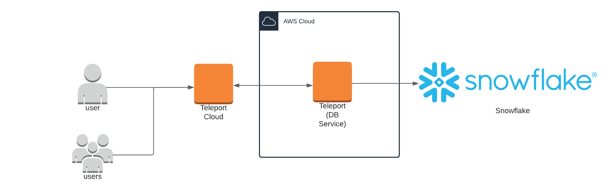

(!docs/pages/includes/database-access/db-introduction.mdx dbType="Snowflake" dbConfigure="with key pair authentication"!)

## How it works

The Teleport Database Service communicates with Snowflake using HTTP messages
that contain JSON web tokens signed by the Teleport certificate authority for
database clients. Snowflake is configured to trust the Teleport database client
CA. When a user connects to Snowflake via Teleport, the Database Service
forwards the user's requests to Snowflake as Teleport-authenticated messages.

<Tabs>
<TabItem scope={["oss", "enterprise"]} label="Self-Hosted">
  
</TabItem>
<TabItem scope={["cloud"]} label="Teleport Enterprise Cloud">
  
</TabItem>

</Tabs>

## Prerequisites

(!docs/pages/includes/edition-prereqs-tabs.mdx!)

- Snowflake account with `SECURITYADMIN` role or higher.

- `snowsql` installed and added to your system's `PATH` environment variable.

- A host where you will run the Teleport Database Service.

  See [Installation](../../installation.mdx) for details.

- (!docs/pages/includes/tctl.mdx!)

## Step 1/5. Set up the Teleport Database Service

(!docs/pages/includes/database-access/token.mdx!)

Install and configure Teleport where you will run the Teleport Database Service:

<Tabs>
<TabItem label="Linux Server">

(!docs/pages/includes/install-linux.mdx!)

(!docs/pages/includes/database-access/db-configure-start.mdx dbName="example-snowflake" dbProtocol="snowflake" databaseAddress="abc12345.snowflakecomputing.com" !)

</TabItem>
<TabItem label="Kubernetes Cluster">
  Teleport provides Helm charts for installing the Teleport Database Service in Kubernetes Clusters.

  (!docs/pages/kubernetes-access/helm/includes/helm-repo-add.mdx!)

  (!docs/pages/includes/database-access/db-helm-install.mdx dbName="example-snowflake" dbProtocol="snowflake" databaseAddress="abc12345.snowflakecomputing.com" !)
</TabItem>
</Tabs>

(!docs/pages/includes/database-access/multiple-instances-tip.mdx !)

## Step 2/5. Create a Teleport user

(!docs/pages/includes/database-access/create-user.mdx!)

## Step 3/5. Export a public key

Use the `tctl auth sign` command below to export a public key for your Snowflake user:

```code
$ tctl auth sign --format=snowflake --out=server
```

The command will create a `server.pub` file with Teleport's public key. Teleport will use the corresponding private key to
generate a JWT (JSON Web Token) that will be used to authenticate to Snowflake.


## Step 4/5. Add the public key to your Snowflake user

Use the public key you generated earlier to enable key pair authentication.

Log in to your Snowflake instance and execute the SQL statement below:

```sql
alter user alice set rsa_public_key='MIIBIjANBgkqhkiG9w0BAQEFAAOCAQ8AMIIBCgKCAQEAv3dHYw4LJCcZzdbhb3hV...LwIDAQAB';
```

In this statement, `alice` is the name of the Snowflake user and the `rsa_public_key` is the key generated earlier without
the PEM header/footer (first and the last line).

You can use the `describe user` command to verify the user's public key:

```sql
desc user alice;
```

See the [Snowflake documentation](https://docs.snowflake.com/en/user-guide/key-pair-auth.html#step-4-assign-the-public-key-to-a-snowflake-user)
for more details.

## Step 5/5. Connect

Log in to your Teleport cluster and see the available databases:

<Tabs>
  <TabItem scope={["enterprise", "oss"]} label="Self-Hosted">
    ```code
    $ tsh login --proxy=teleport.example.com --user=alice
    $ tsh db ls
    # Name              Description         Labels
    # ----------------- ------------------- --------
    # example-snowflake Example Snowflake ❄ env=dev
    ```
  </TabItem>
  <TabItem scope={["cloud","team"]} label="Cloud-Hosted">
    ```code
    $ tsh login --proxy=mytenant.teleport.sh --user=alice
    $ tsh db ls
    # Name              Description         Labels
    # ----------------- ------------------- --------
    # example-snowflake Example Snowflake ❄ env=dev
    ```
  </TabItem>
</Tabs>

To retrieve credentials for a database and connect to it:

```code
$ tsh db connect --db-user=alice --db-name=SNOWFLAKE_SAMPLE_DATA example-snowflake
```

The `snowsql` command-line client should be available in the system `PATH` in order to be
able to connect.

To log out of the database and remove credentials:

```code
# Remove credentials for a particular database instance.
$ tsh db logout example-snowflake
# Remove credentials for all database instances.
$ tsh db logout
```

## Next steps

(!docs/pages/includes/database-access/guides-next-steps.mdx!)

