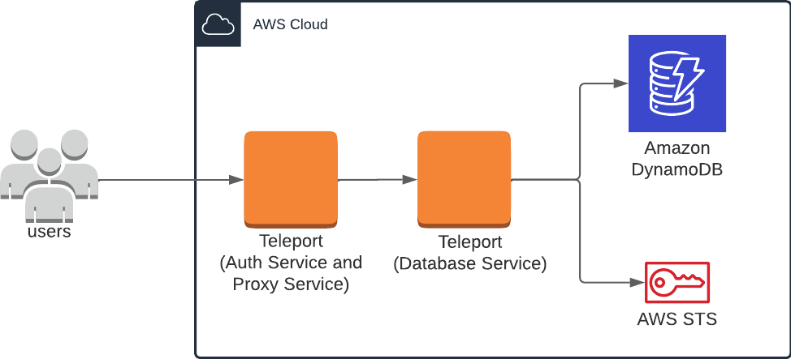
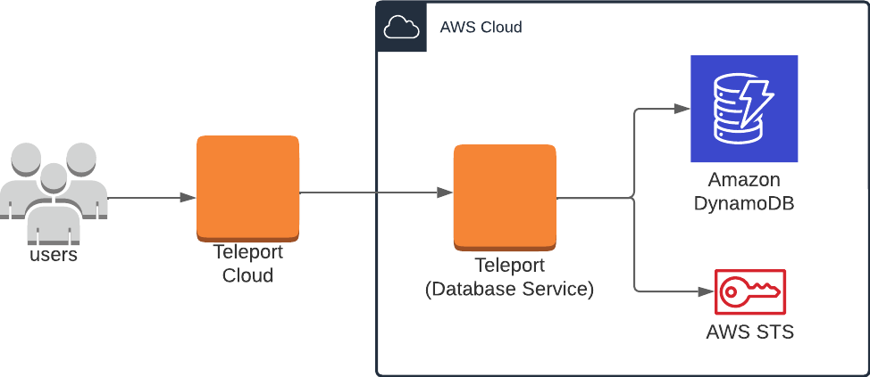
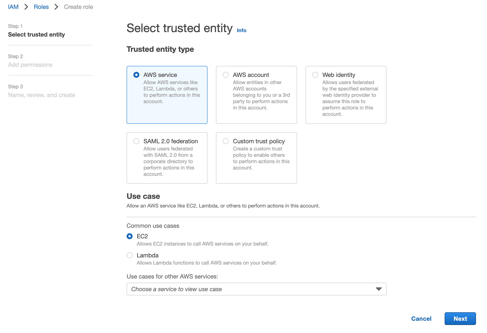
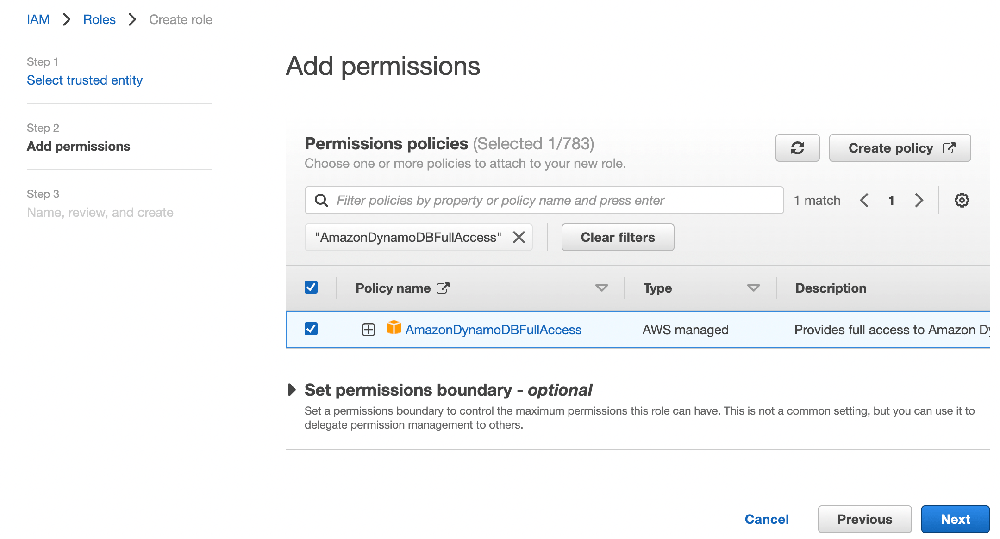

(!docs/pages/includes/database-access/db-introduction.mdx  dbType="AWS DynamoDB" dbConfigure="AWS DynamoDB database with IAM authentication" dbName="AWS DynamoDB" !)

<Tabs>
<TabItem scope={["oss", "enterprise"]} label="Self-Hosted">

</TabItem>
<TabItem scope={["cloud"]} label="Teleport Enterprise Cloud">

</TabItem>

</Tabs>

## Prerequisites

- AWS account with DynamoDB databases.
- IAM permissions to create IAM roles.
- `aws` Command Line Interface (CLI) tool installed in `$PATH`.

(!docs/pages/includes/edition-prereqs-tabs.mdx!)

- A host, e.g., an EC2 instance, where you will run the Teleport Database Service.
  This guide assumes an EC2 instance when creating and applying IAM roles, and
  must be adjusted accordingly for custom configurations.
- (!docs/pages/includes/tctl.mdx!)

This guide provides an example configuration of IAM access roles as a model,
and uses an EC2 instance to serve the Teleport Database Service.
The level of access provided may not suit your needs, or may not fit your
organization's access conventions. You should adjust the AWS IAM permissions to fit your needs.

## Step 1/4. Create IAM roles for DynamoDB access

The setup described in this guide requires two IAM roles:
- One associated with the EC2 instance running the Teleport Database Service,
  which lets it assume additional roles granted to the user.
- One that can be assumed by the EC2 instance role and grants access to DynamoDB
  services to users.

### EC2 instance role

Visit the [IAM > Roles page](https://console.aws.amazon.com/iamv2/home#/roles) of
the AWS Console, then press "Create Role". Under **Trusted entity type** select
"AWS service". Under **Use case** select "EC2", then click **Next**.



On the "Add Permissions" page, you can simply click **Next** since this role does not require any permissions. In this guide, we will use the example name `TeleportDatabaseService` for this role. Once you have chosen a name, click **Create Role** to complete the process.

### DynamoDB access role

Navigate back to the Roles page and create a new role. Select the "AWS account"
option, which creates a default trust policy to allow other entities in this
account to assume this role:


Click **Next**. Find the AWS-managed policy `AmazonDynamoDBFullAccess` and then select the policy:



<Admonition type="note" title="Apply least-privilege permissions">
The `AmazonDynamoDBFullAccess` policy may grant more permissions than desired.
If you want to use a different IAM policy to reduce permissions, refer to
[Managing access permissions to your Amazon DynamoDB
Resources](https://docs.aws.amazon.com/amazondynamodb/latest/developerguide/access-control-overview.html)
for more information.
</Admonition>

Click **Next**. On the next page, enter a role name. In this guide we'll use
the example name `ExampleTeleportDynamoDBRole` for this role.

Under "Select trusted entities", update the JSON to allow the `TeleportDatabaseService`
role to assume this role:

```json
{
    "Version": "2012-10-17",
    "Statement": [
        {
            "Effect": "Allow",
            "Principal": {
                "AWS": [
                    "arn:aws:iam::(=aws.aws_access_key=):role/TeleportDatabaseService"
                ]
            },
            "Action": "sts:AssumeRole",
            "Condition": {}
        }
    ]
}
```

Finally, click **Create Role**.

## Step 2/4. Configure the Teleport IAM role mapping

The next step is to give your Teleport users permissions to assume AWS IAM roles
when accessing AWS resources through your Teleport cluster.

You can do this by creating a Teleport role with the `db_users` field
listing the IAM role ARN created in the previous step. Create a file called
`aws-dynamodb-access.yaml` with the following content:

```yaml
kind: role
version: v7
metadata:
  name: aws-dynamodb-access
spec:
  allow:
    db_labels:
      '*': '*'
    db_users:
    - 'ExampleTeleportDynamoDBRole'
```

Create the new role:

```code
$ tctl create -f aws-dynamodb-access.yaml
```

(!docs/pages/includes/add-role-to-user.mdx role="aws-dynamodb-access"!)

## Step 3/4. Install the Teleport Database Service

Create an EC2 instance to host the Teleport Database Service, and attach the
`TeleportDatabaseService` AWS IAM role to it. If you're hosting the service another
way, you must provide AWS credentials to the service - see [AWS credentials
configuration](https://docs.aws.amazon.com/sdkref/latest/guide/creds-config-files.html)
for more details.

<Admonition type="warning" title="non-standard AWS regions">
For non-standard AWS regions such as AWS GovCloud (US) regions and AWS China
regions, please set the corresponding region in the `AWS_REGION` environment
variable or in the AWS credentials file so that the Database Service can use
the correct STS endpoint.
</Admonition>

### Generate a token

(!docs/pages/includes/database-access/alternative-methods-join.mdx!)

(!docs/pages/includes/database-access/token.mdx!)

### Install and start Teleport

Install Teleport on the host where you will run the Teleport Database
Service. See our [Installation](../../installation.mdx) page for options
besides Linux servers.

(!docs/pages/includes/install-linux.mdx!)

Create a file called `/etc/teleport.yaml` with the following content:

```yaml
version: v3
teleport:
  nodename: CHANGEME
  data_dir: /var/lib/teleport
  proxy_server: teleport.example.com:443
  auth_token: /tmp/token
db_service:
  enabled: "yes"
  # Lists statically registered databases proxied by this agent.
  databases:
    - name: "example-dynamodb"
      protocol: "dynamodb"
      # optional uri, if uri is set then AWS region can be extracted from it
      # or if AWS region is already set then the regions must match.
      # uri: "dynamodb.us-east-1.amazonaws.com:443"
      static_labels:
        env: "dev"
      aws:
        region: "us-east-1"
        account_id: "(=aws.aws_access_key=)"
```

Substitute `teleport.example.com` with the address of your Teleport Proxy Service.
(For Teleport Cloud customers, this will be similar to `mytenant.teleport.sh`.)
The token generated should have been placed in the file `/tmp/token`.

(!docs/pages/includes/start-teleport.mdx service="the Teleport Database Service"!)

## Step 4/4 Connect

Once the Database Service has started and joined the cluster, you can start
connecting to your DynamoDB database.

Create a proxy tunnel:

```code
$ tsh proxy db --tunnel --port 8000 --db-user=ExampleTeleportDynamoDBRole example-dynamodb
```

You can test the connection to the database through the `aws` CLI:

```code
$ aws dynamodb list-tables --endpoint-url=http://localhost:8000
{
    "TableNames": [
        "table1",
        "table2",
        "table3"
    ]
}
```

You can also connect to this database from the AWS NoSQL Workbench, as documented in our [Database Access GUI Clients](../../connect-your-client/gui-clients.mdx#nosql-workbench) guide.

You can also use this tunnel for programmatic access. The example below uses the `boto3` SDK from AWS:

```python
$ python3
Python 3.10.4 (main, Mar 31 2022, 03:37:37) [Clang 12.0.0 ] on darwin
Type "help", "copyright", "credits" or "license" for more information.
>>> import boto3
>>> clt = boto3.client('dynamodb', endpoint_url='http://localhost:8000')
>>> res = clt.list_tables()
>>> print(res)
{'TableNames': *snip output*}
>>>
```

## Next Steps

- See [Dynamic Database Registration](./dynamic-registration.mdx) to learn how
  to use resource labels to keep Teleport up to date with accessible databases in
  your infrastructure.

