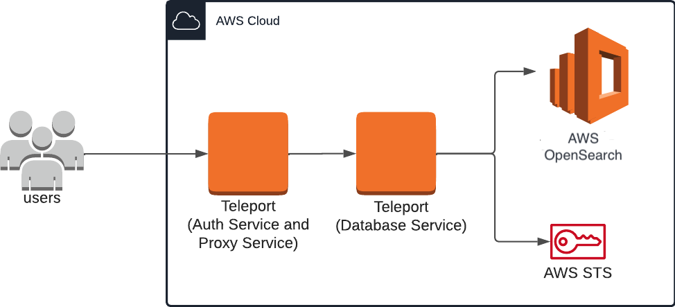
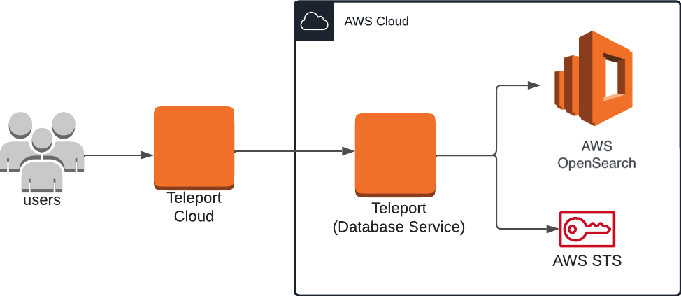
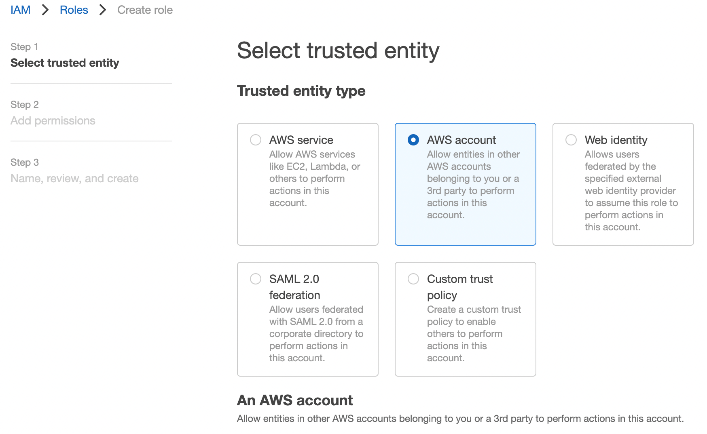
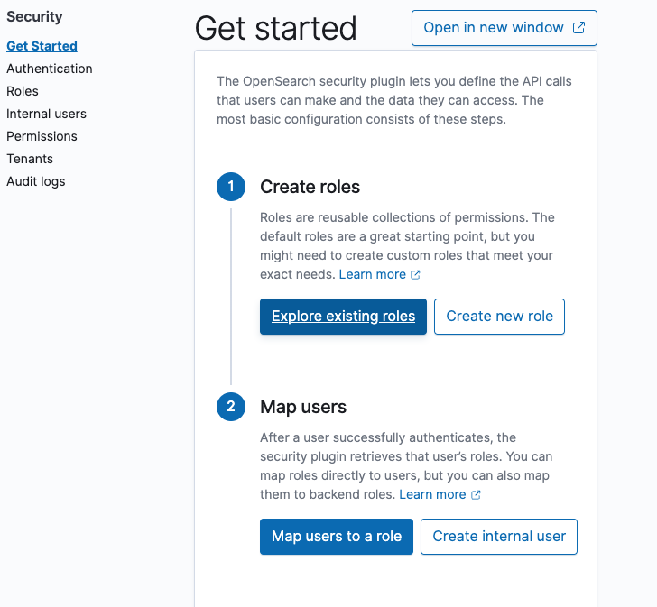
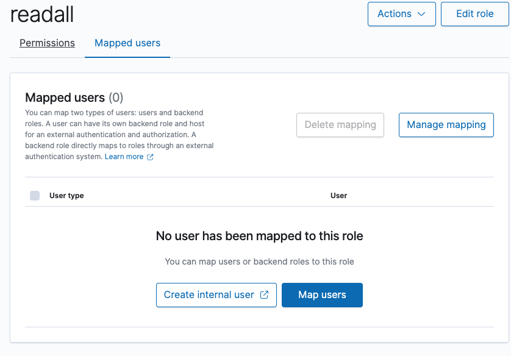
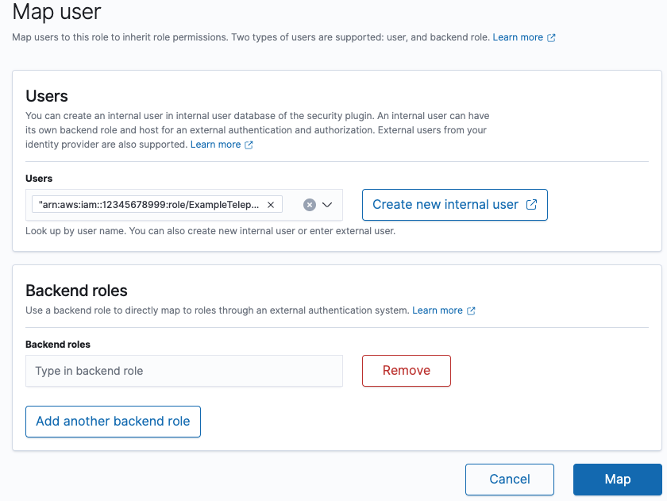

(!docs/pages/includes/database-access/db-introduction.mdx dbType="Amazon OpenSearch" dbConfigure="via REST API with IAM Authentication"!)

## How it works

The Teleport Database Service makes use of [fine-grained access
control](https://docs.aws.amazon.com/opensearch-service/latest/developerguide/fgac.html),
which maps an IAM role to a backend OpenSearch role. Teleport users choose an
IAM role and connect to OpenSearch via a local proxy server. The local proxy
server forwards requests to the Teleport Database Service via the Teleport Proxy
Service. The Database Service assumes the user's chosen IAM role, rewrites
requests with AWS credentials, and forwards them to the OpenSearch API.

<Tabs>
<TabItem scope={["oss", "enterprise"]} label="Self-Hosted">

</TabItem>
<TabItem scope={["cloud"]} label="Teleport Enterprise Cloud">

</TabItem>

</Tabs>

This guide shows how to enroll databases through the Teleport Database Service.
For a more scalable approach, learn how to [configure the Teleport Discovery
Service](../../auto-discovery/databases.mdx) to automatically enroll all AWS
databases in your infrastructure.

## Prerequisites

- AWS OpenSearch domain.
- [Enabled AWS OpenSearch Service fine-grained access
  control](https://docs.aws.amazon.com/opensearch-service/latest/developerguide/fgac.html#fgac-enabling)
- IAM permissions to create IAM roles.
- [opensearchsql](https://github.com/opensearch-project/sql-cli)  Command Line
  Interface (CLI) tool installed in `$PATH`.

(!docs/pages/includes/edition-prereqs-tabs.mdx!)

- A host, e.g., an EC2 instance, where you will run the Teleport Database Service.
  This guide assumes an EC2 instance when creating and applying IAM roles, and
  must be adjusted accordingly for custom configurations.
- (!docs/pages/includes/tctl.mdx!)

This guide provides an example configuration of IAM access roles as a model,
and uses an EC2 instance to serve the Teleport Database Service. The level of
access provided may not suit your needs, or may not fit your organization's
access conventions. You should adjust the AWS IAM permissions to fit your needs.

## Step 1/4. Create IAM roles for OpenSearch Managed Cluster access

The setup described in this guide requires two IAM roles:
- One associated with the EC2 instance running the Teleport Database Service,
  which lets it assume additional roles granted to the user.
- One that can be assumed by the EC2 instance role and grants access to OpenSearch
  manage cluster to users.

### EC2 instance role

Visit the [IAM > Roles page](https://console.aws.amazon.com/iamv2/home#/roles) of
the AWS Console, then press "Create Role". Under **Trusted entity type** select
"AWS service". Under **Use case** select "EC2", then click **Next**.


On the "Add Permissions" page, you can simply click **Next** since this role
does not require any permissions. In this guide, we will use the example name
`TeleportDatabaseService` for this role. Once you have chosen a name, click
**Create Role** to complete the process.

### OpenSearch Service cluster access role

Navigate back to the Roles page and create a new role. Select the "AWS account"
option, which creates a default trust policy to allow other entities in this
account to assume this role:



Click **Next**. On the next page, enter a role name. In this guide we'll use
the example name `ExampleTeleportOpenSearchRole` for this role.

Under "Select trusted entities", update the JSON to allow the `TeleportDatabaseService`
role to assume this role:

```json
{
    "Version": "2012-10-17",
    "Statement": [
        {
            "Effect": "Allow",
            "Principal": {
                "AWS": [
                    "arn:aws:iam::(=aws.aws_access_key=):role/TeleportDatabaseService"
                ]
            },
            "Action": "sts:AssumeRole",
            "Condition": {}
        }
    ]
}
```

Finally, click **Create Role**.

### Configure Cluster Fine-grained access control IAM Role mapping in Amazon OpenSearch Managed Custer

Teleport AWS OpenSearch service integration leverages the OpenSearch Fine-grained
access control
where the IAM role or user is mapped to the OpenSearch role.

In order to configure Role Mapping log into OpenSearch Domain Dashboard using
the master user and go to the `Security` settings:



Create a new role with least privilege permissions, or select an existing one.
For the purpose of this example the `readall` OpenSearch role will be used.
Select the OpenSearch role and go to the `Mapped users` tab:



Add mapping between the OpenSearch role and AWS IAM `ExampleTeleportOpenSearchRole`
role created in the previous step.



Finally, click the **Map** button to apply the settings.

## Step 2/4. Configure the Teleport IAM role mapping

The next step is to give your Teleport users permissions to assume AWS IAM roles
when accessing AWS resources through your Teleport cluster.

You can do this by creating a Teleport role with the `db_users` field
listing the IAM role ARN created in the previous step. Create a file called
`aws-opensearch-access.yaml` with the following content:

```yaml
kind: role
version: v7
metadata:
  name: aws-opensearch-access
spec:
  allow:
    db_labels:
      'env': 'dev'
    db_users:
    - 'ExampleTeleportOpenSearchRole'
```

Create the new role:

```code
$ tctl create -f aws-opensearch-access.yaml
```

(!docs/pages/includes/add-role-to-user.mdx role="aws-opensearch-access"!)

## Step 3/4. Install the Teleport Database Service

Create an EC2 instance to host the Teleport Database Service, and attach the
`TeleportDatabaseService` AWS IAM role to it. If you're hosting the service another
way, you must provide AWS credentials to the service - see [AWS credentials
configuration](https://docs.aws.amazon.com/sdkref/latest/guide/creds-config-files.html)
for more details.

<Admonition type="warning" title="non-standard AWS regions">
For non-standard AWS regions such as AWS GovCloud (US) regions and AWS China
regions, please set the corresponding region in the `AWS_REGION` environment
variable or in the AWS credentials file so that the Database Service can use
the correct STS endpoint.
</Admonition>

### Generate a token

<Details title="Alterative methods">

For users with a lot of infrastructure in AWS, or who might create or recreate
many instances, consider alternative methods for joining new EC2 instances running
Teleport:

- [Configure Teleport to Automatically Enroll EC2 instances (Preview)](../../auto-discovery/servers/ec2-discovery.mdx)
- [Joining Nodes via AWS IAM
  Role](../../agents/join-services-to-your-cluster/aws-iam.mdx)
- [Joining Nodes via AWS EC2 Identity Document](../../agents/join-services-to-your-cluster/aws-ec2.mdx)

</Details>

(!docs/pages/includes/database-access/token.mdx!)

Use the token provided by the output of this command in the next step.

### Install and start Teleport

Install Teleport on the host where you will run the Teleport Database
Service. See our [Installation](../../installation.mdx) page for options
besides Linux servers.

(!docs/pages/includes/install-linux.mdx!)

<Tabs>
<TabItem label="Generating a new Teleport Config file">

On the host where you will run the Teleport Database Service, start Teleport
with the appropriate configuration.

Note that a single Teleport process can run multiple different services, for
example multiple Database Service agents as well as the SSH Service or Application
Service. The step below will overwrite an existing configuration file, so if
you're running multiple services add `--output=stdout` to print the config in
your terminal, and manually adjust `/etc/teleport.yaml`.

Generate a configuration file at `/etc/teleport.yaml` for the Database Service.
Set the `--proxy` command-line option to the address for your Teleport cluster
and database parameters to your AWS environment.

```code
$ sudo teleport db configure create \
   -o file \
   --token=/tmp/token \
   --proxy=<Var name="teleport.example.com" />:443 \
   --name=example-opensearch \
   --protocol=opensearch \
   --uri=<Var name="opensearch-uri" />:443 \
   --aws-account-id=(=aws.aws_access_key=)  \
   --labels=env=dev
```

(!docs/pages/includes/start-teleport.mdx service="the Teleport Database Service"!)

</TabItem>

<TabItem label="Modifying the existing Database Service Config">
Modify your Teleport Database Service static configuration file:

```yaml
db_service:
  enabled: "yes"
  databases:
  - name: example-opensearch
    aws:
      account_id: "(=aws.aws_access_key=)"
    protocol: opensearch
    uri: <Var name="opensearch-uri" />:443
    static_labels:
      env: dev
```

Restart the Teleport Database Service for the configuration file changes to take
effect.

</TabItem>
<TabItem label="Dynamic Config">
Create a dynamic database resource to dynamically register an AWS database
in an external account and proxy connections to it.

```yaml
kind: db
version: v3
metadata:
  name: "example-opensearch"
  description: "Example dynamic database resource"
  labels:
    env: "dev"
spec:
  protocol: "opensearch"
  uri: <Var name="opensearch-uri" />:443
  aws:
    account_id: "(=aws.aws_access_key=)"
```

Save the configuration to a file like `database.yaml` and create it with `tctl`:

```code
$ tctl create database.yaml
```

For more information about database registration using dynamic database
resources, see: [Dynamic Registration](dynamic-registration.mdx).

</TabItem>
</Tabs>

## Step 4/4. Connect

Once the Database Service has started and joined the cluster, you can start accessing AWS OpenSearch API:

Create a proxy tunnel:

```code
$ tsh proxy db --tunnel --port=8000 --db-user=ExampleTeleportOpenSearchRole example-opensearch
Started authenticated tunnel for the OpenSearch database "example-opensearch" in cluster "teleport.example.com" on 127.0.0.1:8000.

Use one of the following commands to connect to the database or to the address above using other database GUI/CLI clients:

  * start interactive session with opensearchsql:

  $ opensearchsql http://localhost:8000

  * run request with opensearch-cli:

  $ opensearch-cli --profile teleport --config /Users/alice/.tsh/teleport.example.dev/example-opensearch/opensearch-cli/8a5ce249.yml curl get --path /

  * run request with curl:

  $ curl http://localhost:8000/
```

You can now interact with AWS OpenSearch API via local tunnel created by the `tsh proxy db` command:

```code
$ curl http://localhost:8000/movies/_search \
   -H 'Content-Type: application/json'  \
   -d '{ "query": { "match_all": {} } }'

{"took":170,"timed_out":false,"_shards":{"total":5,"successful":5,"skipped":0,"failed":0},"hits":{"total":{"value":1,"relation":"eq"},"max_score":1.0,"hits":[{"_index":"movies","_id":"1","_score":1.0,"_source":{"director": "Burton, Tim", "genre": ["Comedy","Sci-Fi"], "year": 1996, "actor": ["Jack Nicholson","Pierce Brosnan","Sarah Jessica Parker"], "title": "Mars Attacks!"}}]}}
```

Interactive session can be started using the `tsh db connect` command, which invokes the `opensearchsql` binary with interactive mode under the hood:

```code
$ tsh db connect example-opensearch --db-user=ExampleTeleportOpenSearchRole
#   ____                  _____                      __
#  / __ \____  ___  ____ / ___/___  ____ ___________/ /_
# / / / / __ \/ _ \/ __ \\__ \/ _ \/ __ `/ ___/ ___/ __ \
#/ /_/ / /_/ /  __/ / / /__/ /  __/ /_/ / /  / /__/ / / /
#\____/ .___/\___/_/ /_/____/\___/\__,_/_/   \___/_/ /_/
#    /_/
#
#Server: OpenSearch 2.5.0
#CLI Version: 1.0.0
#Endpoint: http://localhost:56766
#Query Language: sql
opensearchsql> select * from movies;
#fetched rows / total rows = 1/1
#+----------------+---------+---------------+--------+-------------+
#| actor          | genre   | title         | year   | director    |
#|----------------+---------+---------------+--------+-------------|
#| Jack Nicholson | Comedy  | Mars Attacks! | 1996   | Burton, Tim |
#+----------------+---------+---------------+--------+-------------+
opensearchsql>
```
