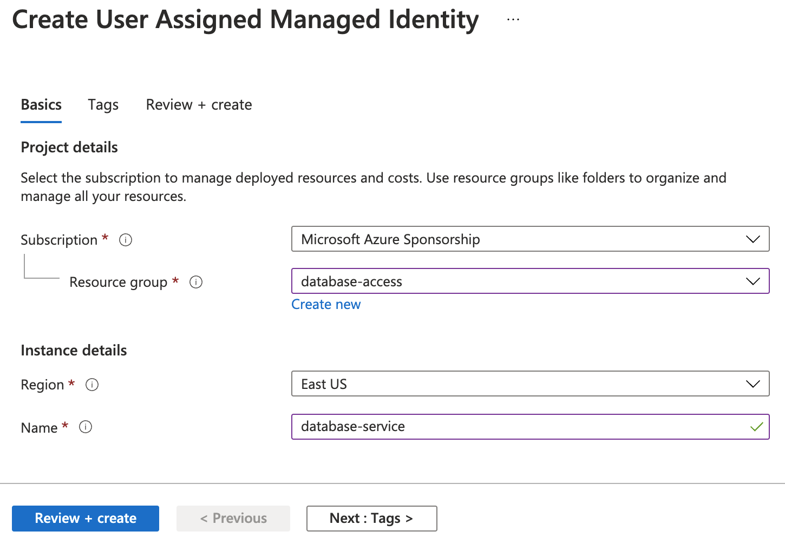
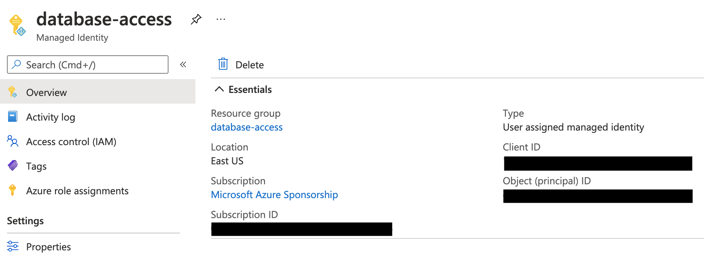
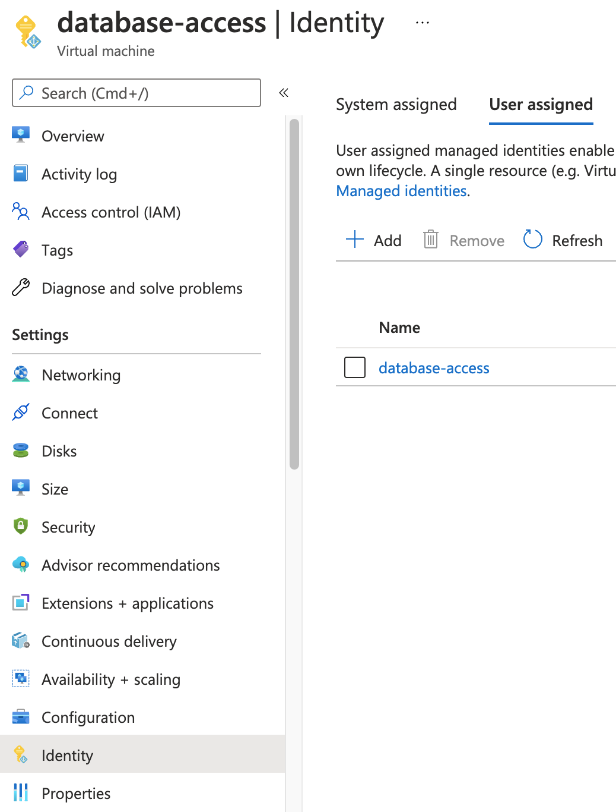
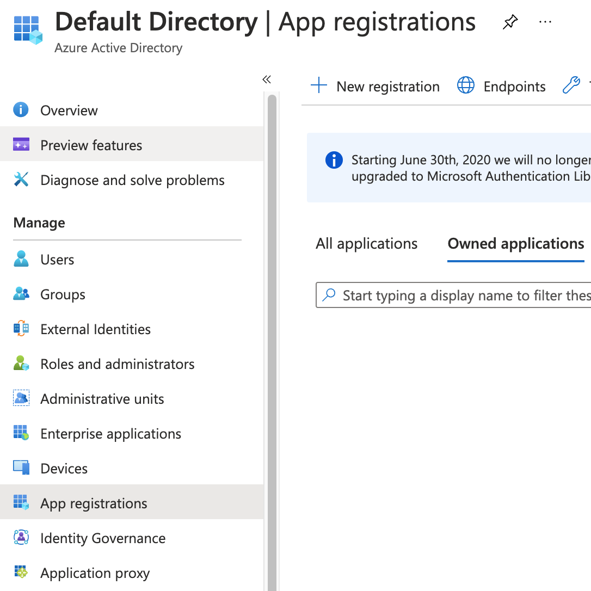
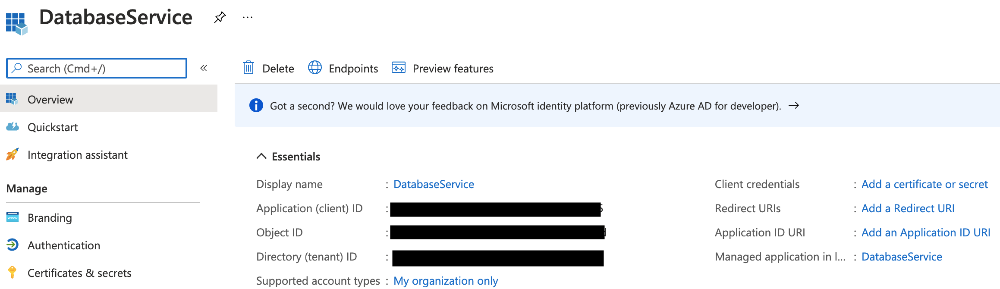
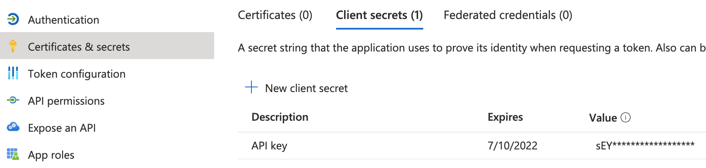

<Details
  title="Version warning"
  opened={true}
  scope={["oss", "enterprise"]}
  scopeOnly={true}
  min="8.1"
>
  Database access for Azure PostgreSQL/MySQL is available starting from Teleport
  `8.1`.
</Details>

This guide will help you to:

- Install and configure Teleport.
- Set up access to Azure Database for PostgreSQL or Azure Database for MySQL.
- Connect to the database server through Teleport.

<Admonition type="note">
    Teleport uses Azure Active Directory authentication with Azure PostgreSQL
    and MySQL databases which at the moment of this writing is only supported
    by Single Server. Flexible Server does not support Azure AD authentication.
</Admonition>

## Prerequisites

- Deployed Azure Database for PostgreSQL or MySQL server.
- Azure Active Directory administrative privileges.
- A host, e.g., an Azure VM instance, where you will run the Teleport Database
  Service.

(!docs/pages/includes/user-client-prereqs.mdx!)

(!docs/pages/includes/tctl.mdx!)

## Step 1/4. Install and configure Teleport

### Set up the Teleport Auth and Proxy Services

(!docs/pages/includes/database-access/start-auth-proxy.mdx!)

### Set up the Teleport Database Service

(!docs/pages/includes/database-access/token.mdx!)

<ScopedBlock scope={["oss", "enterprise"]}>

Start the Teleport Database Service. Make sure to update `--auth-server` to point to
your Teleport Proxy Service address and `--uri` to the Azure database server
endpoint.

<Tabs>
<TabItem label="PostgreSQL">

  ```bash
  $ teleport db start \
    --token=/tmp/token \
    --auth-server=teleport.example.com:3080 \
    --name=azure-db \
    --protocol=postgres \
    --uri=example.postgres.database.azure.com:5321 \
    --labels=env=dev
  ```

</TabItem>
<TabItem label="MySQL">

  ```bash
  $ teleport db start \
    --token=/tmp/token \
    --auth-server=teleport.example.com:3080 \
    --name=azure-db \
    --protocol=mysql \
    --uri=example.mysql.database.azure.com:3306 \
    --labels=env=dev
  ```

</TabItem>
</Tabs>

</ScopedBlock>
<ScopedBlock scope={["cloud"]}>

Start the Teleport Database Service. Make sure to update `--auth-server` to point to
your Teleport Cloud tenant address and `--uri` to the Azure database server
endpoint.

<Tabs>
<TabItem label="PostgreSQL">

  ```bash
  $ teleport db start \
    --token=/tmp/token \
    --auth-server=mytenant.teleport.sh \
    --name=azure-db \
    --protocol=postgres \
    --uri=example.postgres.database.azure.com:5321 \
    --labels=env=dev
  ```

</TabItem>
<TabItem label="MySQL">

  ```bash
  $ teleport db start \
    --token=/tmp/token \
    --auth-server=mytenant.teleport.sh \
    --name=azure-db \
    --protocol=mysql \
    --uri=example.mysql.database.azure.com:3306 \
    --labels=env=dev
  ```

</TabItem>
</Tabs>

</ScopedBlock>

<Admonition type="tip">
  You can start the Teleport Database Service using a configuration file instead of
  CLI flags. See the [YAML reference](../reference/configuration.mdx).
</Admonition>

### Create a Teleport user

(!docs/pages/includes/database-access/create-user.mdx!)

## Step 2/4. Configure Azure service principal

To authenticate with PostgreSQL or MySQL databases, Teleport Database Service
needs to obtain access tokens from Azure AD. There are a couple of ways to
achieve that:

- The Database Service can be registered as an Azure AD application (via AD's "App
  registrations") and configured with its credentials. This is only recommended
  for development and testing purposes since it requires Azure credentials to
  be present in the Database Service's environment.
- The Database Service can run on an Azure VM with attached managed identity. This
  is the recommended way of deploying the Database Service in production since
  it eliminates the need to manage Azure credentials.

<Tabs>
<TabItem label="Using managed identity">
  Go to the [Managed Identities](https://portal.azure.com/#blade/HubsExtension/BrowseResource/resourceType/Microsoft.ManagedIdentity%2FuserAssignedIdentities)
  page in your Azure portal and click *Create* to create a new user-assigned
  managed identity:

  

  Pick a name and resource group for the new identity and create it:

  

  Take note of the created identity's *Client ID*:

  

  Next, navigate to the Azure VM that will run your Database Service agent and
  add the identity you've just created to it:

  

  Attach this identity to all Azure VMs that will be running the Database
  Service.
</TabItem>
<TabItem label="Using app registrations">
  <Admonition type="note">
    Registering the Database Service as Azure AD application is suitable for
    test and development scenarios, or if your Database Service does not run on
    an Azure VM. For production scenarios prefer to use the managed identity
    approach.
  </Admonition>

  Go the the [App registrations](https://portal.azure.com/#blade/Microsoft_AAD_IAM/ActiveDirectoryMenuBlade/RegisteredApps)
  page of your Azure Active Directory and click on *New registration*:

  

  Pick a name (e.g. *DatabaseService*) and register a new application. Once the
  app has been created, take note of its *Application (client) ID* and click on
  *Add a certificate or secret*:

  

  Create a new client secret that the Database Service agent will use to
  authenticate with the Azure API:

  

  The Teleport Database Service uses Azure SDK's default credential provider chain to
  look for credentials. Refer to [Authentication methods](https://docs.microsoft.com/en-us/azure/developer/go/azure-sdk-authorization)
  to pick a method suitable for your use-case. For example, to use
  environment-based authentication with a client secret, the Database Service should
  have the following environment variables set:

  ```bash
  export AZURE_TENANT_ID=
  export AZURE_CLIENT_ID=
  export AZURE_CLIENT_SECRET=
  ```
</TabItem>
</Tabs>

## Step 3/4. Create Azure database users

To let Teleport connect to your Azure database authenticating as a service
principal, you need to create Azure AD users for that principal in the database.

### Assign Azure AD administrator

Only the Azure AD administrator for the database can connect to it and create
Azure AD users. Go to your database's *Active Directory admin* page
and set the AD admin using the *Set admin* button:


Note that only one AD user can be set as an admin for the database.

### Connect to the database as an AD admin

Next, you need to connect to your database as the AD admin user.

Use the Azure `az` CLI utility to log in as the user that you set as the AD admin,
fetch the access token and use it as a password when connecting to the database:

<Tabs>
<TabItem label="PostgreSQL">
  ```bash
  $ az login -u ad@example.com
  $ export PGPASSWORD=`az account get-access-token --resource-type oss-rdbms --output tsv --query accessToken`
  $ psql "host=example.postgres.database.azure.com user=ad@example.com@instance-name sslmode=require dbname=postgres"
  ```
</TabItem>
<TabItem label="MySQL">
  ```bash
  $ az login -u ad-admin@example.com
  $ export TOKEN=`az account get-access-token --resource-type oss-rdbms --output tsv --query accessToken`
  $ mysql -h example.mysql.database.azure.com -P 3306 -u ad@example.com@instance-name --enable-cleartext-plugin --password=$TOKEN
  ```
</TabItem>
</Tabs>

Note that the database username must include `@instance-name` suffix with the
name of the Azure database instance you're connecting to.

### Create AD users

Once connected to the database as AD admin, create database users for the
service principal that Teleport Database Service will be using. Use `Client ID`
when using managed identities and `Application (client) ID` when using app
registrations:

<Tabs>
<TabItem label="PostgreSQL">
  ```
  postgres=> SET aad_validate_oids_in_tenant = off;
  SET
  postgres=> CREATE ROLE teleport WITH LOGIN PASSWORD '11111111-2222-3333-4444-555555555555' IN ROLE azure_ad_user;
  CREATE ROLE
  ```
</TabItem>
<TabItem label="MySQL">
  ```
  mysql> SET aad_auth_validate_oids_in_tenant = OFF;
  mysql> CREATE AADUSER 'teleport' IDENTIFIED BY '11111111-2222-3333-4444-555555555555';
  Query OK, 0 rows affected (0.92 sec)
  ```
</TabItem>
</Tabs>

You can create multiple database users for the same service principal.

## Step 4/4. Connect

Log in to your Teleport cluster. Your Azure database should appear in the list of
available databases:

<ScopedBlock scope={["oss", "enterprise"]}>

```code
$ tsh login --proxy=teleport.example.com --user=alice
$ tsh db ls
# Name     Description         Labels
# -------- ------------------- -------
# azure-db                     env=dev
```

</ScopedBlock>
<ScopedBlock scope={["cloud"]}>

```code
$ tsh login --proxy=mytenant.teleport.sh --user=alice
$ tsh db ls
# Name     Description         Labels
# -------- ------------------- -------
# azure-db                     env=dev
```

</ScopedBlock>

Fetch short-lived client certificate for your Azure database using the
`tsh db login` command:

```code
$ tsh db login --db-user=teleport azure-db
```

<Admonition type="tip">
  You can be logged in to multiple databases simultaneously.
</Admonition>

Now connect to the database:

```code
$ tsh db connect azure-db
```

<Admonition type="note">
  The appropriate database command-line client (`psql`, `mysql`) should be
  available in `PATH` of the machine you're running `tsh db connect` from.
</Admonition>

To log out of the database and remove credentials:

```code
$ tsh db logout azure-db
```

## Next steps

(!docs/pages/includes/database-access/guides-next-steps.mdx!)
