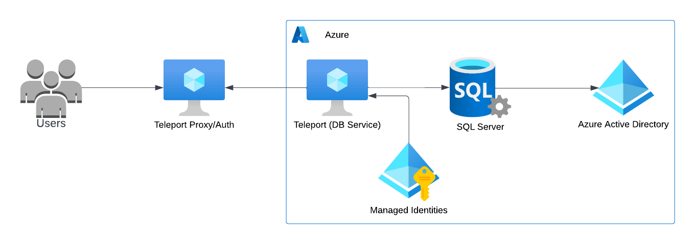
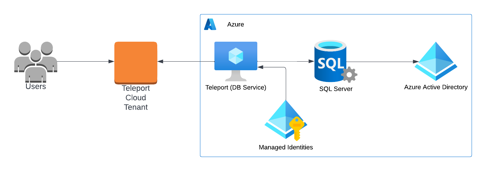
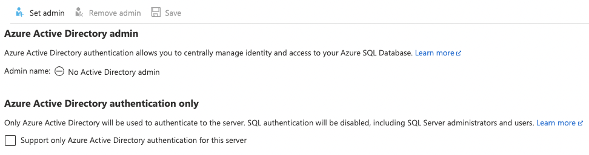

<Details
  title="Version warning"
  opened={true}
  scope={["oss", "enterprise"]}
  scopeOnly={true}
  min="11.0"
>
  Database access for Azure SQL Server with Azure Active Directory authentication
  is available starting from Teleport `11.0`.
</Details>

<Admonition type="warning" title="Preview">
  Database access for Azure SQL Server with Azure Active Directory authentication is
  currently in Preview mode.
</Admonition>

This guide will help you to:

- Install and configure Teleport.
- Set up access to Azure SQL Server using Azure Active Directory authentication.
- Connect to Azure SQL Server through Teleport.

<ScopedBlock scope={["oss", "enterprise"]}>

</ScopedBlock>
<ScopedBlock scope={["cloud"]}>

</ScopedBlock>

## Prerequisites

(!docs/pages/includes/edition-prereqs-tabs.mdx!)

- SQL Server running on Azure.
- The Teleport Database Service running on an Azure virtual instance.

(!docs/pages/includes/tctl.mdx!)

## Step 1/6. Create a Teleport user

(!docs/pages/includes/database-access/create-user.mdx!)

## Step 2/6. Enable the SQL Server Azure Active Directory integration

If you have it enabled, you can go to the next step.

Go to the [Azure Portal](https://portal.azure.com/), select **Database
servers**, and select the database you wish to enable the Azure Active Directory
integration.

Select **Azure Active Directory** in the left-hand column.

Select **Set Admin**, and choose an account that will be added as an admin
login to SQL Server.



## Step 3/6. Configure Azure Managed Identities

The Teleport Database Service needs access tokens from Azure AD to authenticate with
SQL Server databases.

It uses the managed identities attached to its Virtual Machine to fetch the
authentication token.

To create a new user-assigned managed identity, go to the **Managed Identities**
page in your [Azure Portal](https://portal.azure.com/#view/HubsExtension/BrowseResource/resourceType/Microsoft.ManagedIdentity%2FuserAssignedIdentities)
and click on *Create*. Choose a name and resource group for it and create:


Next, go to the **Teleport Database Service virtual machine instance**,
**Identity** section, select **User assigned**, and add the identity we just
created:


## Step 4/6. Enable managed identities login on SQL Server

Azure AD SQL Server integration uses database-level authentication (contained
users), meaning we must create a user for our identities on each database we
want to access.

To create contained users for the identities, connect to your SQL server using
its Activity Directory Admin and execute the query:
```sql
USE MyDatabase;
CREATE USER [sqlserver-identity] FROM EXTERNAL PROVIDER;
```

The newly created user will be attached to the public role, which might not
have enough permissions to perform queries. Consider granting individual
permissions to the user or assigning it to an existing role. For example, add
the user as a member of the `db_datareader` role:
```sql
ALTER ROLE db_datareader ADD MEMBER [sqlserver-identity];
```

## Step 5/6. Start Teleport Database Service

Generate a configuration file at `/etc/teleport.yaml` for the Database Service:

<ScopedBlock scope={["oss", "enterprise"]}>
```code
$ teleport db configure create \
   -o file \
   --token=/tmp/token \
   --proxy=teleport.example.com:3080 \
   --name=sqlserver \
   --protocol=sqlserver \
   --uri=my-server.database.windows.net:1433 \
   --labels=env=dev
```
</ScopedBlock>
<ScopedBlock scope={["cloud"]}>
```code
$ teleport db configure create \
   -o file \
   --token=/tmp/token \
   --proxy=mytenant.teleport.sh:443 \
   --name=sqlserver \
   --protocol=sqlserver \
   --uri=my-server.database.windows.net:1433 \
   --labels=env=dev
   --azure-sqlserver-discovery=eastus
```
</ScopedBlock>

<Admonition
  type="tip"
  title="Tip"
>
  A single Teleport process can run multiple different services, for example
  multiple Database Service agents as well as the SSH Service or Application
  Service.
  
</Admonition>

(!docs/pages/includes/start-teleport.mdx service="the Teleport Database Service"!)

## Step 6/6. Connect

Log in to your Teleport cluster. Your database should appear in the list of
available databases:

<ScopedBlock scope={["oss", "enterprise"]}>
```code
$ tsh login --proxy=teleport.example.com --user=alice
$ tsh db ls
# Name      Description         Labels
# --------- ------------------- -------
# sqlserver                     env=dev
```
</ScopedBlock>
<ScopedBlock scope={["cloud"]}>
```code
$ tsh login --proxy=mytenant.teleport.sh --user=alice
$ tsh db ls
# Name      Description         Labels
# --------- ------------------- -------
# sqlserver                     env=dev
```
</ScopedBlock>

To retrieve credentials for a database and connect to it:

```code
$ tsh db connect --db-user=sqlserver-identity --db-name=master sqlserver
```

Where `--db-user` is the managed identity name.

<Admonition type="note">
  The `mssql-cli` command-line client should be available in `PATH` of the machine
  you're running `tsh db connect` from.
</Admonition>

## Troubleshooting

### Could not find identity

If you see the error `could not find identity "my-identity" attached to the
instance` when connecting to your database, then the identity you’re trying to
connect with is not attached to the Teleport Database Service virtual machine.
You can navigate to the [Virtual Machines](https://portal.azure.com/#view/HubsExtension/BrowseResource/resourceType/Microsoft.Compute%2FVirtualMachines) page within Azure Portal,
open the **Teleport instance**, **Identity** section, and choose **User
assigned** to see all identities you can connect with. If you don’t see your
identity check [Step 4](#step-36-configure-azure-managed-identities) to see how
to add it.

### Login failed for the user

When connecting to your database, and you see the error `mssql: login error: Login
failed for user '<token-identified principal>'`, it means your managed identity
login is not present on the SQL database. You’ll need to create their users as
described in [Step 5](#step-46-enable-managed-identities-login-on-sql-server).
Remember: you must create the users on all databases you want to connect.

## Next steps

(!docs/pages/includes/database-access/guides-next-steps.mdx!)
