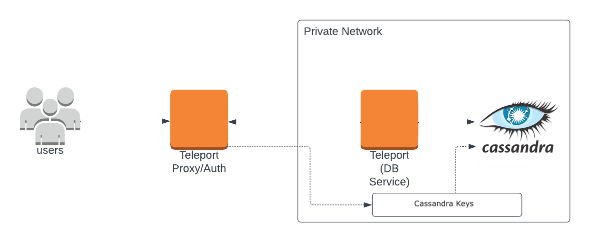
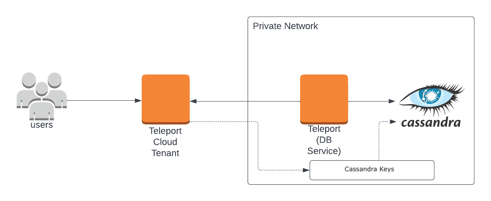

<Details
  title="Version warning"
  opened={true}
  scope={["oss", "enterprise"]}
  scopeOnly={true}
  min="11.0"
>
  Database access for Cassandra & ScyllaDB is available starting from Teleport `v11.0`.
</Details>

This guide will help you to:

- Install and configure Teleport.
- Set up Teleport to access your self-hosted Cassandra or ScyllaDB.
- Connect to your database through Teleport.

<ScopedBlock scope={["oss", "enterprise"]}>

</ScopedBlock>
<ScopedBlock scope={["cloud"]}>

</ScopedBlock>

## Prerequisites

(!docs/pages/includes/edition-prereqs-tabs.mdx!)

- Self-hosted Cassandra or ScyllaDB instance.
- The `cqlsh` Cassandra client installed and added to your system's `PATH` environment variable.
- (!docs/pages/includes/tctl.mdx!)

## Step 1/5. Set up the Teleport Database Service

(!docs/pages/includes/database-access/token.mdx!)

Install and configure Teleport where you will run the Teleport Database Service:

<Tabs>
<TabItem label="Linux Server">

(!docs/pages/includes/install-linux.mdx!)

(!docs/pages/includes/database-access/db-configure-start.mdx dbName="cassandra" dbProtocol="cassandra" databaseAddress="cassandra.example.com:9042" !)

</TabItem>
<TabItem label="Kubernetes Cluster">
  Teleport provides Helm charts for installing the Teleport Database Service in Kubernetes Clusters.

  (!docs/pages/kubernetes-access/helm/includes/helm-repo-add.mdx!)

  (!docs/pages/includes/database-access/db-helm-install.mdx dbName="cassandra" dbProtocol="cassandra" databaseAddress="cassandra.example.com:9042" !)
</TabItem>
</Tabs>

(!docs/pages/includes/database-access/multiple-instances-tip.mdx !)

## Step 2/5. Create a Teleport user

(!docs/pages/includes/database-access/create-user.mdx!)

## Step 3/5. Set up mutual TLS

(!docs/pages/includes/database-access/tctl-auth-sign.mdx!)

Follow the instructions below to generate TLS credentials for your database.

<Tabs>
  <TabItem label="Cassandra">
    When connecting to Cassandra, sign the certificate for the hostname over which Teleport will be connecting to it.

    ```code
    $ tctl auth sign --format=cassandra --host=cassandra.example.com --out=server --ttl=2190h
    ```

    (!docs/pages/includes/database-access/ttl-note.mdx!)

    The command will create two files:
    - `server.keystore` with  generated private key and user certificate in JKS format.
    - `server.truststore` with Teleport's certificate authority in JKS format.
  </TabItem>
  <TabItem label="Scylla">
    When connecting to Scylla, sign the certificate for the hostname over which Teleport will be connecting to it.

    ```code
    $ tctl auth sign --format=scylla --host=scylla.example.com --out=server --ttl=2190h
    ```

    (!docs/pages/includes/database-access/ttl-note.mdx!)

    The command will create three files:
    - `server.cas` with Teleport's certificate authority
    - `server.key` with a generated private key
    - `server.crt` with a generated user certificate
  </TabItem>
</Tabs>

## Step 4/5. Configure Cassandra/Scylla

Follow the instructions for your database to enable TLS communication with your Teleport cluster:

<Tabs>
  <TabItem label="Cassandra">
    To configure Cassandra to accept TLS connections, add the following to your
    Cassandra configuration file, `cassandra.yaml`:
    ```conf
    client_encryption_options:
      enabled: true
      optional: false
      keystore: /path/to/server.keystore
      keystore_password: "password"
      require_client_auth: true
      truststore: /path/to/server.truststore
      truststore_password: "password"
      protocol: TLS
      algorithm: SunX509
      store_type: JKS
      cipher_suites: [TLS_RSA_WITH_AES_256_CBC_SHA]
    ```
    In the configuration above, replace `"password"` with the value generated in the previous step by the `tctl auth sign` command.

  </TabItem>
  <TabItem label="Scylla">
    To configure Scylla to accept TLS connections, add the following to your Scylla configuration file, `scylla.yaml`:
    ```conf
    client_encryption_options:
      enabled: true
      certificate: /path/to/server.crt
      keyfile: /path/to/server.key
      truststore:  /path/to/server.cas
      require_client_auth: True
    ```
  </TabItem>
</Tabs>

## Step 5/5. Connect

Once the Database Service has joined the cluster, log in to see the available
databases:

<ScopedBlock scope={["oss", "enterprise"]}>

  ```code
  $ tsh login --proxy=teleport.example.com --user=testuser
  $ tsh db ls
  # Name      Description       Allowed Users Labels  Connect
  # --------- ----------------- ------------- ------- -------
  # cassandra Cassandra Example [*]           env=dev
  ```

</ScopedBlock>
<ScopedBlock scope={["cloud"]}>

  ```code
  $ tsh login --proxy=mytenant.teleport.sh --user=testuser
  $ tsh db ls
  # Name      Description       Allowed Users Labels  Connect
  # --------- ----------------- ------------- ------- -------
  # cassandra Cassandra Example [*]           env=dev
  ```

</ScopedBlock>

To connect to a particular database instance :
```code
$ tsh db connect --db-user=cassandra cassandra
# Password:
# Connected to Test Cluster at localhost:49594
# [cqlsh 6.0.0 | Cassandra 4.0.5 | CQL spec 3.4.5 | Native protocol v5]
# Use HELP for help.
# cassandra@cqlsh>
```

To log out of the database and remove credentials:

```code
# Remove credentials for a particular database instance.
$ tsh db logout example
# Remove credentials for all database instances.
$ tsh db logout
```

## Next steps

(!docs/pages/includes/database-access/guides-next-steps.mdx!)
