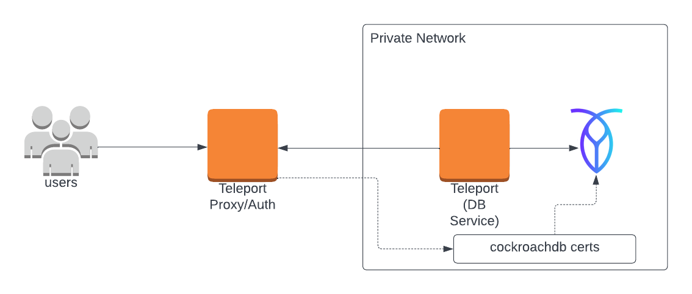

<Details
  title="Version warning"
  opened={true}
  scope={["oss", "enterprise"]}
  scopeOnly={true}
  min="8.0"
>
  CockroachDB support is available starting from Teleport `8.0`.
</Details>

This guide will help you to:

1. Install Teleport and connect it to a CockroachDB cluster.
2. Configure mutual TLS authentication between Teleport and your CockroachDB cluster.
3. Connect to your CockroachDB cluster via Teleport.

<ScopedBlock scope={["oss", "enterprise"]}>

</ScopedBlock>
<ScopedBlock scope={["cloud"]}>

</ScopedBlock>

## Prerequisites

(!docs/pages/includes/edition-prereqs-tabs.mdx!)

- CockroachDB cluster.
- A host, e.g., an Amazon EC2 instance, where you will run the Teleport Database
  Service.
- (!docs/pages/includes/tctl.mdx!)

## Step 1/4. Set up the Teleport Database Service

(!docs/pages/includes/database-access/token.mdx!)

Install and configure Teleport where you will run the Teleport Database Service:

<Tabs>
<TabItem label="Linux Server">

(!docs/pages/includes/install-linux.mdx!)

(!docs/pages/includes/database-access/db-configure-start.mdx dbName="roach" "dbProtocol="cockroachdb"  databaseAddress="roach.example.com:26257" !)

</TabItem>
<TabItem label="Kubernetes Cluster">
  Teleport provides Helm charts for installing the Teleport Database Service in Kubernetes Clusters.

  (!docs/pages/kubernetes-access/helm/includes/helm-repo-add.mdx!)

  (!docs/pages/includes/database-access/db-helm-install.mdx dbName="roach" dbProtocol="cockroachdb" databaseAddress="roach.example.com:26257" !)
</TabItem>
</Tabs>

(!docs/pages/includes/database-access/multiple-instances-tip.mdx !)

## Step 2/4. Create a Teleport user

(!docs/pages/includes/database-access/create-user.mdx!)

## Step 3/4. Configure CockroachDB

### Create a CockroachDB user

Teleport uses mutual TLS authentication with CockroachDB. Client certificate authentication is available to all CockroachDB users. If you
don't have one, connect to your Cockroach cluster and create it:

```sql
CREATE USER alice WITH PASSWORD NULL;
```

The `WITH PASSWORD NULL` clause prevents the user from using password auth and
mandates client certificate auth.

Make sure to assign the user proper permissions within the database cluster.
Refer to [Create User](https://www.cockroachlabs.com/docs/stable/create-user.html)
in the CockroachDB documentation for more information.

### Set up mutual TLS

(!docs/pages/includes/database-access/tctl-auth-sign.mdx!)

To set up mutual TLS authentication, you need to make sure that:

- Teleport trusts certificates presented by CockroachDB nodes.
- CockroachDB trusts client certificates signed by Teleport.

Generate the secrets by running the following `tctl` command against your
Teleport cluster:

```code
$ tctl auth sign \
    --format=cockroachdb \
    --host=roach.example.com \
    --out=/path/to/cockroach/certs/dir/ \
    --ttl=2190h
```

The command will produce 3 files: `ca.crt` with Teleport's certificate authority
and `node.crt` / `node.key` with the node's certificate and key. Do not rename
them as this is how CockroachDB expects them to be named. See [Node key and certificates](https://www.cockroachlabs.com/docs/v21.1/create-security-certificates-custom-ca#node-key-and-certificates)
for details.

Generate the secrets for each cluster node and make sure to use the hostname
Teleport will be using to connect to the nodes in the `--host` flag.

<Admonition type="tip">
  You can specify multiple comma-separated addresses e.g. `--host=roach,node-1,192.168.1.1`.
</Admonition>

Restart your CockroachDB nodes, passing them the directory with generated secrets
via the `--certs-dir` flag:

```code
$ cockroach start \
    --certs-dir=/path/to/cockroachdb/certs/dir/ \
    # other flags...
```

## Step 4/4. Connect

Log in to your Teleport cluster. Your CockroachDB cluster should appear in the
list of available databases:

<Tabs>
<TabItem scope={["enterprise", "oss"]} label="Self-Hosted">
```code
$ tsh login --proxy=teleport.example.com --user=alice
$ tsh db ls
# Name  Description         Labels
# ----- ------------------- -------
# roach Example CockroachDB env=dev
```
</TabItem>
<TabItem scope={["cloud"]} label="Cloud">
```code
$ tsh login --proxy=mytenant.teleport.sh --user=alice
$ tsh db ls
# Name  Description         Labels
# ----- ------------------- -------
# roach Example CockroachDB env=dev
```
</TabItem>
</Tabs>

To retrieve credentials for a database and connect to it:

```code
$ tsh db connect roach
```

You can optionally specify the database name and the user to use by default
when connecting to the database server:

```code
$ tsh db connect --db-user=alice roach
```

<Admonition type="note">
  Either the `cockroach` or `psql` command-line client should be available in `PATH`
  in order to be able to connect.
</Admonition>

To log out of the database and remove credentials:

```code
$ tsh db logout roach
```

## Next steps

(!docs/pages/includes/database-access/guides-next-steps.mdx!)
- [CockroachDB client authentication](https://www.cockroachlabs.com/docs/stable/authentication.html#client-authentication)
