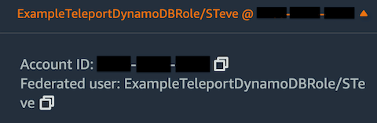

This guide will help you to:
- Install Teleport Application Service.
- Set up Teleport to access AWS Console and API.
- Connect to your DynamoDB through Teleport.

<Admonition type="note">
Access to AWS DynamoDB is provided by [**Teleport Application Access**](../../application-access/introduction.mdx) for AWS Console and API.
</Admonition>

## Prerequisites

- A running Teleport cluster, either self hosted or in Teleport Cloud.
- AWS account with DynamoDB databases.
- IAM permissions to create IAM roles.
- A host, e.g., an EC2 instance, where you will run the Teleport Application
  Service.

(!docs/pages/includes/edition-prereqs-tabs.mdx!)

(!docs/pages/includes/tctl.mdx!)

<Admonition type="tip" title="Not yet a Teleport user?">
If you have not yet deployed the Auth Service and Proxy Service, you should follow one of our [getting started guides](../getting-started.mdx) or try our Teleport Application Access [interactive learning track](https://play.instruqt.com/teleport/invite/rgvuva4gzkon).
</Admonition>

We will assume your Teleport cluster is accessible at `teleport.example.com` and `*.teleport.example.com`. You can substitute the address of your Teleport Proxy Service. (For Teleport Cloud customers, this will be similar to `mytenant.teleport.sh`.)

<Admonition type="note" title="Application Access and DNS">
(!docs/pages/includes/dns-app-access.mdx!)
</Admonition>

## Step 1/5. Create an IAM role for DynamoDB access.

The first step is to create an IAM role with desired IAM permissions that you wish to grant to a Teleport user. In this example, you will create an IAM role with full DynamoDB access. **Skip this step** if you already have the roles you want to provide access to.

Now go to the IAM -> Access Management ->
[Roles](https://console.aws.amazon.com/iamv2/home#/roles), then press Create Role.

Select the "AWS account" option which creates a default [trust
policy](https://aws.amazon.com/blogs/security/how-to-use-trust-policies-with-iam-roles/)
to allow other entities in this account to assume this role.


Press Next. Find the AWS managed policy `AmazonDynamoDBFullAccess` by Filter and then select the policy.


Press Next. Enter a role name and press Create role.


## Step 2/5. Configure Teleport IAM role mapping
The next step is to give your Teleport users permissions to assume IAM roles.

You can do this by creating a role with the `aws_role_arns` field listing all IAM
role ARNs this particular role permits its users to assume:

```yaml
kind: role
version: v5
metadata:
  name: aws-dynamodb-access
spec:
  allow:
    app_labels:
      '*': '*'
    aws_role_arns:
    - arn:aws:iam::123456789000:role/ExampleTeleportDynamoDBRole
```

The `aws_role_arns` field supports template variables so they can be populated
dynamically based on your users' identity provider attributes. See [Role
Templates](../../access-controls/guides/role-templates.mdx) for details.

Now assign this role to the Teleport users you wish to grant the AWS
application access.

## Step 3/5. Install Teleport Application Service

### Generate a token

A join token is required to authorize a Teleport Application Service agent to
join the cluster. Generate a short-lived join token and save the output of the
command:

```code
$ tctl tokens add \
    --type=app \
    --app-name=aws-dynamodb \
    --app-uri=https://console.aws.amazon.com/dynamodbv2/home
```

The output should contain a `teleport app start` command that can be used to
start the Teleport Application Service in the next step.

### Install and Start Teleport
Install Teleport on the host where you will run the Teleport Application Service. See our [Installation](../installation.mdx) page for options besides Linux servers.

(!docs/pages/includes/install-linux.mdx!)

Now start Teleport Application Service using the output from the previous step:

```code
$ teleport app start \
   --token=<token> \
   --ca-pin=<ca-pin> \
   --auth-server=https://teleport.example.com:443 \
   --name=aws-dynamodb \
   --uri=https://console.aws.amazon.com/dynamodbv2/home
```

## Step 4/5. Give Teleport permissions to assume roles

Next, attach the following policy to the IAM role or IAM user the Teleport
Application Service agent is using, which allows the Teleport agent to assume
the IAM roles:

```yaml
{
  "Version": "2012-10-17",
  "Statement": [
    {
      "Effect": "Allow",
      "Action": "sts:AssumeRole",
      "Resource": "*"
    }
  ]
}
```

<Admonition type="note">
You can make the policy more strict by providing specific IAM role resource
ARNs in the Resource field instead of using a wildcard.
</Admonition>

## Step 5/5. Connect

Once the Application Service has started and joined the cluster, you can start
connecting to your DynamoDB database.

### Using AWS Management Console

First log in to the Teleport Web Interface at https://teleport.example.com (replace
with your Proxy Service's public address).

Navigate to the Applications tab in your Teleport cluster's control panel and
click on the Launch button for the AWS DynamoDB application which will bring up
an IAM role selector:


Click on the role you want to assume and you will get redirected to the AWS
management console, signed in with the selected role.

In the console's top-right corner you should see that you're logged in through
federated login and the name of your assumed IAM role:



Note that your federated login session is marked with your Teleport username.

### Using AWS CLI
Before beginning this step, make sure that the `aws` command line interface (CLI) tool is installed in PATH. For more information, read [Installing or updating the latest version of the AWS CLI](https://docs.aws.amazon.com/cli/latest/userguide/cli-chap-install.html).

First, log into the previously configured AWS console app on your desktop:

```code
$ tsh app login --aws-role ExampleTeleportDynamoDBRole aws-dynamodb
Logged into AWS app aws. Example AWS CLI command:

$ tsh aws s3 ls
```

The `--aws-role` flag allows you to specify the AWS IAM role to assume when
accessing AWS API. You can either provide a role name like `--aws-role
ExampleTeleportDynamoDBRole` or a full role ARN
`arn:aws:iam::123456789000:role/ExampleTeleportDynamoDBRole`

Now you can use the `tsh aws` command like the native `aws` command-line tool:

```code
$ tsh aws dynamodb list-tables
```

To log out of the aws application and remove credentials:

```code
$ tsh app logout aws
```

### Using other DynamoDB applications

First, log into the previously configured console app if you haven't already
done so.

```code
$ tsh app login --aws-role ExampleTeleportDynamoDBRole aws-dynamodb
```

To connect your DynamoDB application, you can start either a local HTTPS proxy
or a local AWS Service Endpoint proxy.

<Tabs>
  <TabItem label="HTTPS proxy">
  By default, starting the AWS app proxy creates a local HTTPS proxy server
  that forwards received AWS requests to Teleport backend for AWS application
  access.

  Now, use the following command to start the proxy your applications will be
  connecting to:

  ```code
  $ tsh proxy aws -p 23456
  Started AWS proxy on http://127.0.0.1:23456.

  Use the following credentials and HTTPS proxy setting to connect to the proxy:
    AWS_ACCESS_KEY_ID=8cd7ce58b871425e2e05
    AWS_SECRET_ACCESS_KEY=0e08deb6ceb7538754567286922e7ada75021c40
    AWS_CA_BUNDLE=/Users/sampleuser/.tsh/keys/teleport.example.com/alice-app/teleport.example.com/aws-dynamodb-localca.pem
    HTTPS_PROXY=http://127.0.0.1:23456
  ```

  Use the displayed AWS credentials and HTTPS proxy settings when configuring
  your application.

  For example, you can configure the AWS credentials and the HTTPS proxy as
  environment variables for AWS SDK for Python:
  ```code
  $ export AWS_ACCESS_KEY_ID=8cd7ce58b871425e2e05
  $ export AWS_SECRET_ACCESS_KEY=0e08deb6ceb7538754567286922e7ada75021c40
  $ export AWS_CA_BUNDLE=/Users/sampleuser/.tsh/keys/teleport.example.com/alice-app/teleport.example.com/aws-dynamodb-localca.pem
  $ export HTTPS_PROXY=http://127.0.0.1:23456
  $ python3
  >>> import boto3
  >>> boto3.client('dynamodb').list_tables()
  {'TableNames': ['my-dynamodb-table'], 'ResponseMetadata': {...}}

  ```

  </TabItem>
  <TabItem label="AWS Service Endpoint proxy">
  If your application cannot use a HTTPS proxy, start the AWS app proxy with
  the `--endpoint-url` flag to create a local server that can be used as an [AWS
  Service Endpoint](https://docs.aws.amazon.com/general/latest/gr/rande.html):

  ```code
  $ tsh proxy aws --endpoint-url -p 23457
  Started AWS proxy which serves as an AWS endpoint URL at https://localhost:23457

  In addition to the endpoint URL, use the following credentials to connect to the proxy:
    AWS_ACCESS_KEY_ID=8cd7ce58b871425e2e05
    AWS_SECRET_ACCESS_KEY=0e08deb6ceb7538754567286922e7ada75021c40
    AWS_CA_BUNDLE=/Users/sampleuser/.tsh/keys/teleport.example.com/alice-app/teleport.example.com/aws-dynamodb-localca.pem
  ```

  For example, to connect the GUI tool
  [dynamodb-admin](https://github.com/aaronshaf/dynamodb-admin) to the local
  AWS Service Endpoint proxy:
  ```code
  $ export AWS_ACCESS_KEY_ID=8cd7ce58b871425e2e05
  $ export AWS_SECRET_ACCESS_KEY=0e08deb6ceb7538754567286922e7ada75021c40
  $ export NODE_EXTRA_CA_CERTS=/Users/sampleuser/.tsh/keys/teleport.example.com/alice-app/teleport.example.com/aws-dynamodb-localca.pem
  $ export DYNAMO_ENDPOINT=https://127.0.0.1:23457
  $ dynamodb-admin
  database endpoint:     https://127.0.0.1:23457
  region:                ca-central-1
  accessKey:             8cd7ce58b871425e2e05

  dynamodb-admin listening on http://localhost:8001 (alternatively http://0.0.0.0:8001)
  ```

  </TabItem>
</Tabs>
To log out of the aws application and remove credentials:

```code
$ tsh app logout aws-dynamodb
```

## Next steps
- Take a closer look at [AWS Management and API with Teleport Application Access](../../application-access/guides/aws-console.mdx).
