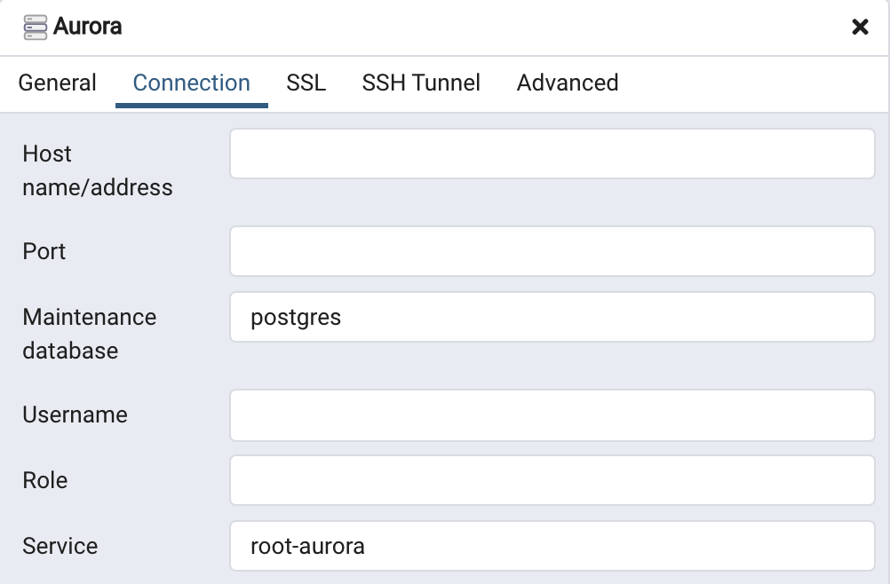
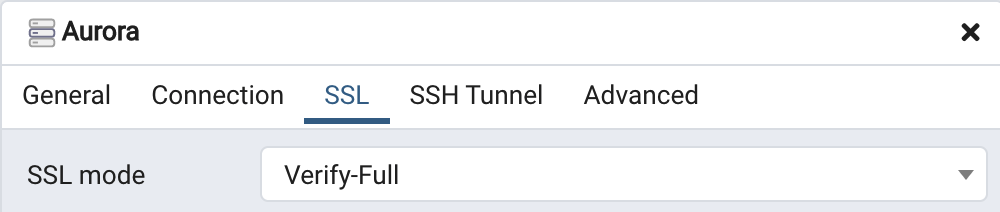
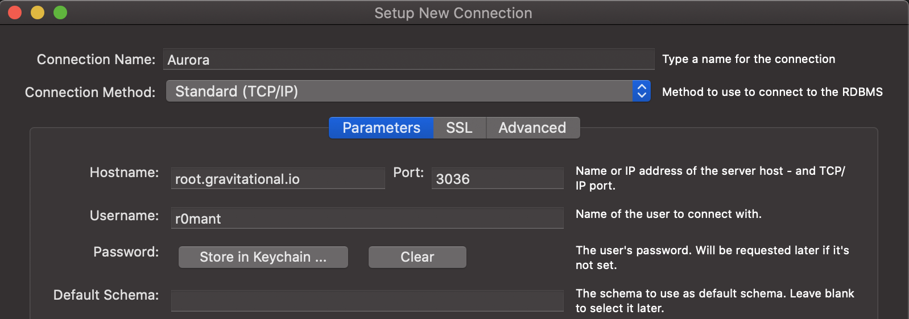
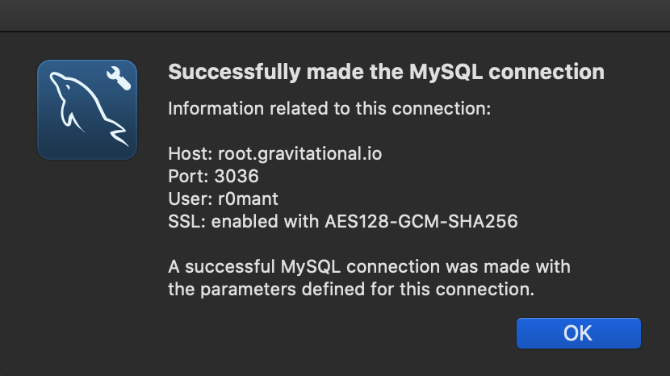

# Graphical Database Clients

This page provides instructions on how to configure various graphical database
clients to work with Teleport Database Access.

Pick the client you're interested in from the table of contents on the right.

## pgAdmin 4

[pgAdmin 4](https://www.pgadmin.org/) is a popular graphical client for
PostgreSQL servers.

pgAdmin runs as a server that stores connection information for databases and
serves a management web UI. As such, pgAdmin server must run on the machine
where `tsh db login` is executed and have access to the certificate authority
and client certificate/key pair produced by that command.

To configure a new connection, right-click on Servers in the main browser view
and create a new server:


On the General tab of the new server dialog, enter the server connection name:


On the Connection tab, enter the default database name (Maintenance database)
and the connection service name, same as when you specify connecting using
`psql`. Leave all the other fields blank:



On the SSL tab, set SSL mode to "full":



Click Save, and pgAdmin should immediately connect.

## MySQL Workbench

[MySQL Workbench](https://www.mysql.com/products/workbench/) is a visual tool
that provides comprehensive MySQL administration and SQL development tools.

To connect to a database using MySQL Workbench, first retrieve the database
credentials using `tsh db login` command. After logging in, take a note of
the database configuration parameters shown by `tsh db config` command:

```bash
$ tsh db config
Name:      aurora
Host:      root.gravitational.io
Port:      3036
User:      r0mant
Database:
CA:        /Users/r0mant/.tsh/keys/root.gravitational.io/certs.pem
Cert:      /Users/r0mant/.tsh/keys/root.gravitational.io/r0mant-db/root/aurora-x509.pem
Key:       /Users/r0mant/.tsh/keys/root.gravitational.io/r0mant
```

In MySQL Workbench Setup New Connection dialog, fill out Connection Name, Hostname,
Port and Username:



On the SSL tab, set SSL mode to "Require and Verify Identity" and enter paths
to CA, certificate and private key files from `tsh db config` command:


Optionally, click Test Connection to verify connectivity:



Save the connection, and connect to the database.
