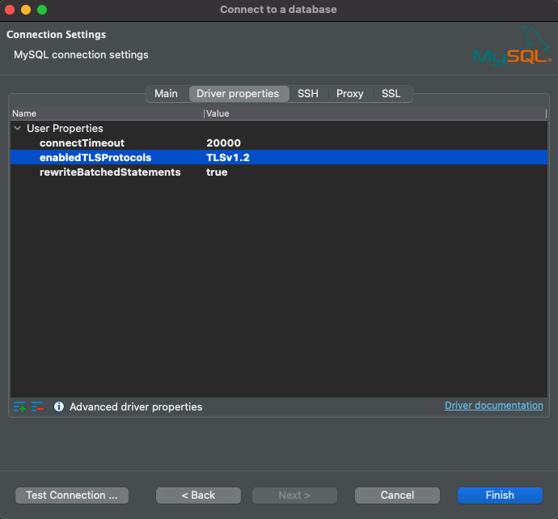
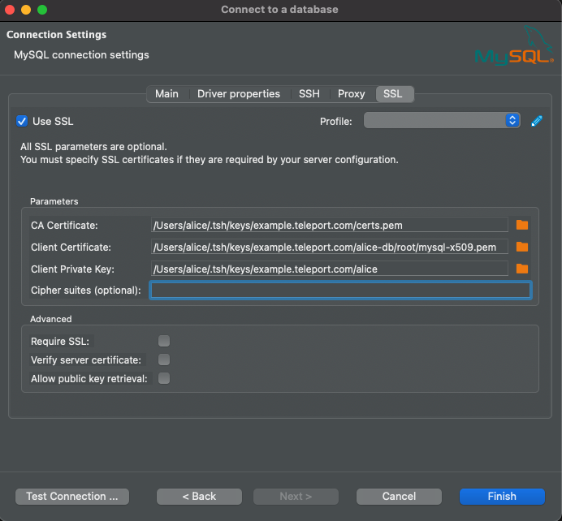

# Graphical Database Clients

This article describes how to configure popular graphical database clients to
work with Teleport Database Access.

## Get connection information

<Tabs>
<TabItem label="TLS routing">
If you're using Teleport in [TLS routing](../../setup/operations/tls-routing.mdx)
mode where each database protocol is multiplexed on the same web proxy port, use
the following command to start a local TLS proxy your GUI database client will
be connecting to:

```code
$ tsh proxy db <database-name>
Started DB proxy on 127.0.0.1:61740

Use following credentials to connect to the <database-name> proxy:
  ca_file=/Users/r0mant/.tsh/keys/root.gravitational.io/certs.pem
  cert_file=/Users/r0mant/.tsh/keys/root.gravitational.io/alice-db/root/<database-name>-x509.pem
  key_file=/Users/r0mant/.tsh/keys/root.gravitational.io/alice
```

Use the displayed local proxy host/port and credentials paths when configuring
your GUI client below. When entering the hostname, use `localhost` rather than
`127.0.0.1`.
</TabItem>
<TabItem label="Separate ports">
If you're not using TLS routing, run the following command to see the database
connection information:

```code
# View configuration for the database you're logged in to.
$ tsh db config
# View configuration for the specific database when you're logged into multiple.
$ tsh db config example
```

It will display the path to your locally cached certificate and key files:

```
Name:      example
Host:      teleport.example.com
Port:      3080
User:      postgres
Database:  postgres
CA:        /Users/alice/.tsh/keys/teleport.example.com/certs.pem
Cert:      /Users/alice/.tsh/keys/teleport.example.com/alice-db/root/example-x509.pem
Key:       /Users/alice/.tsh/keys/teleport.example.com/alice
```

The displayed `CA`, `Cert`, and `Key` files are used to connect through pgAdmin
4, MySQL Workbench, and other graphical database clients that support mutual
TLS authentication.
</TabItem>
</Tabs>

## PostgreSQL pgAdmin 4

[pgAdmin 4](https://www.pgadmin.org/) is a popular graphical client for
PostgreSQL servers.

To configure a new connection, right-click on "Servers" in the main browser view
and create a new server:


In the "General" tab of the new server dialog, enter the server connection name:


In the "Connection" tab, fill in the hostname, port, user and database name from
the configuration above:


In the "SSL" tab, set "SSL Mode" to `Verify-Full` and fill in paths for client
certificate, key and root certificate from the configuration above:


Click "Save", and pgAdmin should immediately connect. If pgAdmin prompts you
for password, leave the password field empty and click OK.

## MySQL Workbench

[MySQL Workbench](https://www.mysql.com/products/workbench/) is a visual tool
that provides comprehensive MySQL administration and SQL development tools.

In MySQL Workbench "Setup New Connection" dialog, fill out "Connection Name",
"Hostname", "Port", and "Username":


In the "SSL" tab, set "Use SSL" to `Require and Verify Identity` and enter paths
to  your CA, certificate, and private key files from `tsh db config` command:


Optionally, click "Test Connection" to verify connectivity:


Save the connection, and connect to the database.

## MySQL DBeaver

<Admonition type="note">
  Teleport's DBeaver MySQL integration only supports MySQL server (=mysql.dbeaver_min_ver=) or older.
</Admonition>

Right-click in the "Database Navigator" menu in the main view and select Create > Connection:


In the search bar of the "Connect to a database" window that opens up type "mysql", select the MySQL driver, and click "Next":


In the newly-opened "Connection Settings" Main tab copy the `Server Host` and `Port` from the `tsh db config` output into the DBeaver config fields:


In that same tab set the username to match the one that you are connecting to using the Teleport db certs and uncheck the 'Save password locally' box:


Click the "Edit Driver Settings" button on the "Main" tab, check the "No Authentication" box, and click "Ok" to save:


Once you are back in the "Connection Settings" window navigate to the "Driver Properties" tab, scroll down to find the `enabledTLSProtocols` field and enter "TLSv1.2" into the `Value` field:



Navigate to the "SSL" tab, check the "Use SSL" box, uncheck the "Verify Server Certificates" box, and copy the `CA Certificate`, `Client Certificate`, and `Client Private Key` paths from the `tsh db config` output:



Click "Ok" to finish and DBeaver should connect to the remote MySQL server automatically.

## MongoDB Compass

[Compass](https://www.mongodb.com/products/compass) is the official MongoDB
graphical client.

On the "New Connection" panel, click on "Fill in connection fields individually".


On the "Hostname" tab, enter your Teleport proxy's hostname and port shown
by `tsh db config`. Leave "Authentication" as None.


On the "More Options" tab set SSL to "Client and Server Validation" and set
CA as well as client key and certificate. Note the CA path must be provided
and be able to validate certificate presented by your Teleport proxy's web
endpoint. Client key and certificate locations are shown by `tsh db config`.


Click on the "Connect" button.

## SQL Server DBeaver

(!docs/pages/includes/database-access/sql-server-local-proxy.mdx!)

In DBeaver connection configuration use the local proxy's endpoint (`localhost:4242`
in the example above) as host/port. Use SQL Server Authentication option and keep
the Password field empty:


Click OK to connect.

## SQL Server DataGrip

(!docs/pages/includes/database-access/sql-server-local-proxy.mdx!)

In DataGrip connection configuration use the local proxy's endpoint (`localhost:4242`
in the example above) as host/port. Use Use & Password authentication option and
keep the Password field empty:


Click OK to connect.
