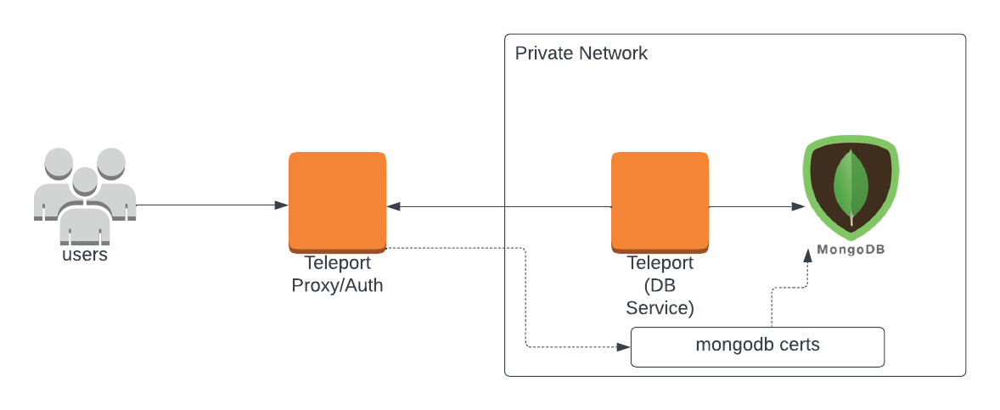
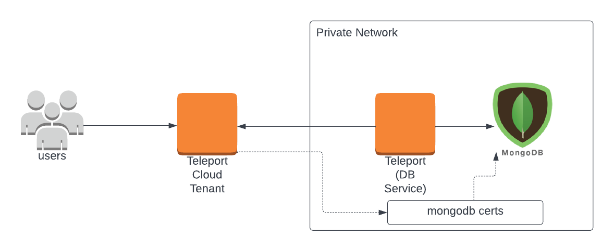

In this guide you will:

1. Install and configure Teleport for database access.
2. Configure mutual TLS authentication between Teleport and your MongoDB cluster.
3. Connect to your MongoDB instance via Teleport.

<ScopedBlock scope={["oss", "enterprise"]}>

</ScopedBlock>
<ScopedBlock scope={["cloud"]}>

</ScopedBlock>

## Prerequisites

(!docs/pages/includes/edition-prereqs-tabs.mdx!)

- MongoDB cluster (standalone or replica set) version `(=mongodb.min_version=)` or newer.

<Admonition type="note">
  Teleport database access supports MongoDB `(=mongodb.min_version=)` and newer.
  Older versions have not been tested and are not guaranteed to work. MongoDB
  `(=mongodb.min_version=)` was released in November 2017 and reached EOL in
  April 2021 so if you're still using an older version, consider upgrading.
</Admonition>

- (!docs/pages/includes/tctl.mdx!)

## Step 1/3. Install and configure Teleport

### Set up the Teleport Database service

(!docs/pages/includes/database-access/token.mdx!)

Install and configure Teleport where you will run the Teleport Database Service:

<Tabs>
<TabItem label="Linux Server">

(!docs/pages/includes/install-linux.mdx!)

(!docs/pages/includes/database-access/db-configure-start.mdx dbName="example-mongo" dbProtocol="mongodb" databaseAddress="mongo.example.com:27017" !)

</TabItem>
<TabItem label="Kubernetes Cluster">
  Teleport provides Helm charts for installing the Teleport Database Service in Kubernetes Clusters.

  (!docs/pages/kubernetes-access/helm/includes/helm-repo-add.mdx!)

  (!docs/pages/includes/database-access/db-helm-install.mdx dbName="example-mongo" dbProtocol="mongodb" databaseAddress="mongo.example.com:27017" !)
</TabItem>
</Tabs>

(!docs/pages/includes/database-access/multiple-instances-tip.mdx !)

You can specify either a single connection address or a MongoDB
[connection string](https://docs.mongodb.com/manual/reference/connection-string/)
as a URI. For example, when connecting to a replica set:

```code
$ --uri="mongodb://mongo1.example.com:27017,mongo2.example.com:27017/?replicaSet=rs0"
```

By default, Teleport will connect to the primary replica set member. If you'd
like to connect to a secondary instead, Teleport will respect `readPreference`
connection string setting:

```code
$ --uri="mongodb://mongo1.example.com:27017,mongo2.example.com:27017/?replicaSet=rs0&readPreference=secondary"
```

### Create a Teleport user

(!docs/pages/includes/database-access/create-user.mdx!)

(!docs/pages/includes/database-access/mongodb-required-database-access.mdx!)

## Step 2/3. Configure MongoDB

### Create a MongoDB user

Teleport will use [X.509 authentication](https://docs.mongodb.com/manual/tutorial/configure-x509-client-authentication/)
when connecting to a MongoDB instance. Users authenticating with client certificates
must be created in the `$external` MongoDB authentication database.

MongoDB treats the entire `Subject` line of the client certificate as a username.
When connecting to a MongoDB server, say as a user `alice`, Teleport will sign
an ephemeral certificate with the `CN=alice` subject.

To create this user in the database, connect to it using the `mongosh` or `mongo` shell and run
the following command:

```js
db.getSiblingDB("$external").runCommand(
  {
    createUser: "CN=alice",
    roles: [
      { role: "readWriteAnyDatabase", db: "admin" }
    ]
  }
)
```

Update the [roles](https://docs.mongodb.com/manual/tutorial/manage-users-and-roles/)
accordingly to grant the user appropriate database permissions.

### Set up mutual TLS

(!docs/pages/includes/database-access/tctl-auth-sign.mdx!)

Create the secrets:

<Tabs>
  <TabItem label="Standalone">
  When connecting to standalone MongoDB, sign the certificate for the hostname over
  which Teleport will be connecting to it.

  For example, if your MongoDB server is accessible at `mongo.example.com`
  hostname, run:

  ```code
  $ tctl auth sign --format=mongodb --host=mongo.example.com --out=mongo --ttl=2190h
  ```

  (!docs/pages/includes/database-access/ttl-note.mdx!)

  The command will create two files: `mongo.cas` with Teleport's certificate
  authority and `mongo.crt` with the generated certificate and key pair. You will
  need these files to enable mutual TLS on your MongoDB server.
  </TabItem>
  <TabItem label="Replica set">
  When connecting to a MongoDB replica set, sign certificates for each member
  using the hostnames they're accessible at.

  For example, if the first member is accessible at `mongo1.example.com` and
  the second at `mongo2.example.com`, run:

  ```code
  $ tctl auth sign --format=mongodb --host=mongo1.example.com --out=mongo1 --ttl=2190h
  $ tctl auth sign --format=mongodb --host=mongo2.example.com --out=mongo2 --ttl=2190h
  ```

  (!docs/pages/includes/database-access/ttl-note.mdx!)

  Each command will create two files: `mongo1.cas`/`mongo2.cas` with Teleport's
  certificate authority and `mongo1.crt`/`mongo2.crt` with the generated certificate
  and key pair. You will need these files to enable mutual TLS on your MongoDB
  servers.
  </TabItem>
</Tabs>

(!docs/pages/includes/database-access/rotation-note.mdx!)

Use the generated secrets to enable mutual TLS in your `mongod.conf` configuration
file and restart the database:

<Tabs>
  <TabItem label="MongoDB 3.6 - 4.2">
  ```yaml
  net:
    ssl:
      mode: requireSSL
      PEMKeyFile: /etc/certs/mongo.crt
      CAFile: /etc/certs/mongo.cas
  ```
  </TabItem>
  <TabItem label="MongoDB 4.2+">
  ```yaml
  net:
    tls:
      mode: requireTLS
      certificateKeyFile: /etc/certs/mongo.crt
      CAFile: /etc/certs/mongo.cas
  ```
  </TabItem>
</Tabs>

When configuring a replica set, make sure to do it for each member and use
secrets generated for the particular server.

Once mutual TLS has been enabled, you will no longer be able to connect to
the cluster without providing a valid client certificate. You can use the
`net.tls.allowConnectionsWithoutCertificates` setting to allow connections
from clients that do not present a certificate.

See [Configure TLS/SSL](https://docs.mongodb.com/manual/tutorial/configure-ssl/)
in the MongoDB documentation for more details.

## Step 3/3. Connect

Log in to your Teleport cluster and see available databases:

<ScopedBlock scope={["oss", "enterprise"]}>

```code
$ tsh login --proxy=teleport.example.com --user=alice
$ tsh db ls
# Name          Description     Labels
# ------------- --------------- --------
# example-mongo Example MongoDB env=dev
```

</ScopedBlock>
<ScopedBlock scope={["cloud"]}>

```code
$ tsh login --proxy=mytenant.teleport.sh --user=alice
$ tsh db ls
# Name          Description     Labels
# ------------- --------------- --------
# example-mongo Example MongoDB env=dev
```

</ScopedBlock>

To retrieve credentials for a database and connect to it:

```code
$ tsh db connect example-mongo
```

You can optionally specify the database name and the user to use by default
when connecting to the database instance:

```code
$ tsh db connect --db-user=alice example-mongo
```

<Admonition type="note" title="Supported MongoDB clients">
  Either the `mongosh` or `mongo` command-line clients should be available in `PATH` in order to be
  able to connect. The Database Service attempts to run `mongosh` first and, if `mongosh` is not in `PATH`, runs `mongo`.

  Teleport 9.0 added support for `mongosh` and made it the default Mongo DB client.
</Admonition>

To log out of the database and remove credentials:

```code
# Remove credentials for a particular database instance.
$ tsh db logout example-mongo
# Remove credentials for all database instances.
$ tsh db logout
```

## Next steps

(!docs/pages/includes/database-access/guides-next-steps.mdx!)
