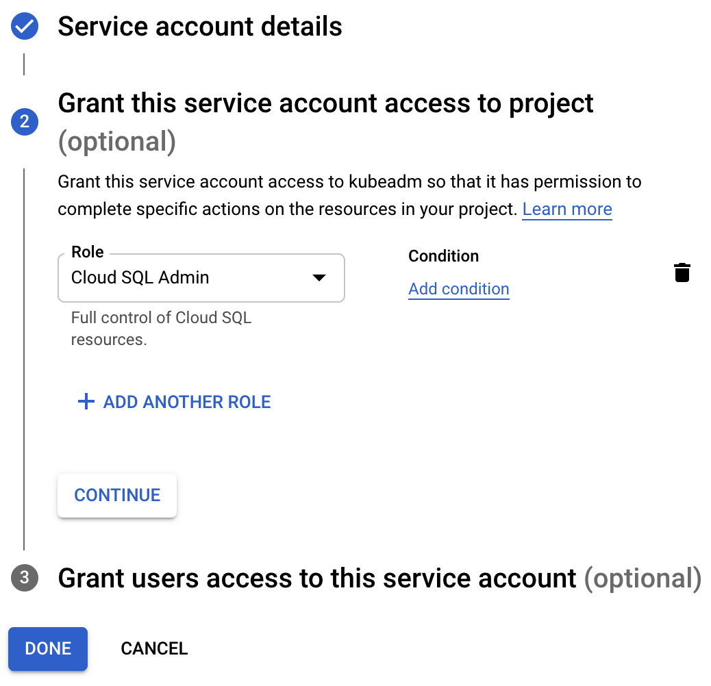

This guide will help you to:

- Install Teleport `(=teleport.version=)`.
- Set up Teleport to access your MySQL on Google Cloud SQL.
- Connect to your databases through Teleport.

<ScopedBlock scope={["oss", "enterprise"]}>

</ScopedBlock>
<ScopedBlock scope={["cloud"]}>

</ScopedBlock>

## Prerequisites

(!docs/pages/includes/edition-prereqs-tabs.mdx!)

- Google Cloud account
- A host, e.g., a Compute Engine instance, where you will run the Teleport Database
  Service
- (!docs/pages/includes/tctl.mdx!)

## Step 1/5. Create a service account for the Teleport Database Service

Teleport uses one-time passwords to authenticate with Cloud SQL MySQL. To be
able to authenticate with a database instance, Teleport must run as a service
account that has a few of the "Cloud SQL Admin" role permissions. You can create
a new service account or modify an existing one to add required permissions.

### Create a service account

If creating a new service account, go to the
[Service Accounts](https://console.cloud.google.com/iam-admin/serviceaccounts)
page and create another service account:


### Grant permissions

Assign the Service Account the "Cloud SQL Admin" role:



<Admonition type="note" title="Service account permissions">
  The default "Cloud SQL Admin" IAM role includes more permissions than the
  Database Service needs to generate one-time user passwords. To further restrict
  the service account, you can create a role that includes only the following
  permissions:
  ```ini
  # Used to download a list of database users.
  cloudsql.users.list
  # Used to update a user with a one-time password.
  cloudsql.users.update
  # Used to auto-download the instance's root CA certificate.
  cloudsql.instances.get
  ```
</Admonition>

### (Optional) Allow only SSL connections

(!docs/pages/includes/database-access/cloudsql-ssl.mdx!)

In addition, when using Cloud SQL MySQL with "Allow only SSL connections"
enabled, Teleport connects to the database's Cloud SQL Proxy port `3307`
instead of the default `3306` as the default Cloud SQL MySQL listener does not
trust generated ephemeral certificates. For this reason, you should make sure
to allow port `3307` when using "Allow only SSL connections" with MySQL.

### Create a key for the service account

Once created, go to that service account's Keys tab and create a new key:


Make sure to choose JSON format:


Save the file. Your Teleport Database Service will need to use it as GCP
application credentials file.

## Step 2/5. Gather Cloud SQL instance information

To connect a Cloud SQL database to Teleport, you'll need to gather a few pieces
of information about the instance.

- GCP Project ID.

You can normally see it in the organization view at the top of the GCP dashboard.

- Cloud SQL instance ID.

The instance ID is the name of your Cloud SQL instance shown at the top of the
Overview page:


- Cloud SQL instance endpoint.

You will use the instance's public IP address to connect to it. It can be viewed
on the "Connect to this instance" panel on the Overview page:


- Cloud SQL instance root certificate.

The instance's root certificate is required so Teleport can validate the
certificate presented by the database instance. You can download `server-ca.pem`
file from the Connections tab under Security section:


## Step 3/5. Set up the Teleport Database Service

(!docs/pages/includes/database-access/token.mdx!)

Install Teleport on the host where you will run the Teleport Database Service:

(!docs/pages/includes/install-linux.mdx!)

### Create a user

(!docs/pages/includes/database-access/create-user.mdx!)

## Step 4/5. Set up the Teleport Database service

Below is an example of a Database Service configuration file that proxies
a single Cloud SQL MySQL database. Save this file as `/etc/teleport.yaml`:

<ScopedBlock scope={["oss", "enterprise"]}>

```yaml
version: v3
teleport:
  data_dir: /var/lib/teleport-db
  nodename: test
  # Proxy address to connect to. Note that it has to be the proxy address
  # because the Database Service always connects to the cluster over a reverse
  # tunnel.
  proxy_server: teleport.example.com:3080
db_service:
  enabled: "yes"
  # This section contains definitions of all databases proxied by this
  # service. Can contain multiple items.
  databases:
    # Name of the database proxy instance. Used to reference in CLI.
  - name: "cloudsql"
    # Free-form description of the database proxy instance.
    description: "GCP Cloud SQL MySQL"
    # Database protocol.
    protocol: "mysql"
    # Database endpoint. For Cloud SQL use instance's public IP address.
    uri: "35.1.2.3:3306"
    # Path to Cloud SQL instance root certificate you downloaded above.
    ca_cert_file: /path/to/cloudsql/instance/root.pem
    # GCP-specific configuration when connecting a Cloud SQL instance.
    gcp:
      # GCP project ID.
      project_id: "<project-id>"
      # Cloud SQL instance ID.
      instance_id: "test"
    # Labels to assign to the database, used in RBAC.
    static_labels:
      env: dev
auth_service:
  enabled: "no"
ssh_service:
  enabled: "no"
proxy_service:
  enabled: "no"
```

</ScopedBlock>
<ScopedBlock scope={["cloud"]}>

```yaml
version: v3
teleport:
  data_dir: /var/lib/teleport-db
  nodename: test
  # Proxy address to connect to. Use your Teleport Cloud tenant address.
  proxy_server: mytenant.teleport.sh:443
db_service:
  enabled: "yes"
  # This section contains definitions of all databases proxied by this
  # service. Can contain multiple items.
  databases:
    # Name of the database proxy instance. Used to reference in CLI.
  - name: "cloudsql"
    # Free-form description of the database proxy instance.
    description: "GCP Cloud SQL MySQL"
    # Database protocol.
    protocol: "mysql"
    # Database endpoint. For Cloud SQL use instance's public IP address.
    uri: "35.1.2.3:3306"
    # Path to Cloud SQL instance root certificate you downloaded above.
    ca_cert_file: /path/to/cloudsql/instance/root.pem
    # GCP-specific configuration when connecting a Cloud SQL instance.
    gcp:
      # GCP project ID.
      project_id: "<project-id>"
      # Cloud SQL instance ID.
      instance_id: "test"
    # Labels to assign to the database, used in RBAC.
    static_labels:
      env: dev
auth_service:
  enabled: "no"
ssh_service:
  enabled: "no"
proxy_service:
  enabled: "no"
```

</ScopedBlock>

<Admonition
  type="tip"
  title="Tip"
>
  A single Teleport process can run multiple different services, for example
  multiple Database Service instances as well as other services such the SSH
  Service or Application Service.
</Admonition>

(!docs/pages/includes/start-teleport.mdx service="the Teleport Database Service"!)

### GCP credentials

The Teleport Database Service must have the credentials of `teleport-db-service` GCP
service account we created
[above](#step-15-create-a-service-account-for-the-teleport-database-service) in order to
be able to log in.

The easiest way to ensure that is to set the `GOOGLE_APPLICATION_CREDENTIALS`
environment variable to point to the JSON credentials file you downloaded
earlier.

See [Authenticating as a service account](https://cloud.google.com/docs/authentication/production)
in the Google Cloud documentation for more details.

## Step 5/5. Connect

Once the Database Service has joined the cluster, log in to see the available
databases:

<ScopedBlock scope={["oss", "enterprise"]}>

```code
$ tsh login --proxy=teleport.example.com --user=alice
$ tsh db ls
# Name     Description         Labels
# -------- ------------------- --------
# cloudsql GCP Cloud SQL MySQL env=dev
```

</ScopedBlock>
<ScopedBlock scope={["cloud"]}>

```code
$ tsh login --proxy=mytenant.teleport.sh --user=alice
$ tsh db ls
# Name     Description         Labels
# -------- ------------------- --------
# cloudsql GCP Cloud SQL MySQL env=dev
```

</ScopedBlock>

Note that you will only be able to see databases your role has access to. See
our [RBAC](../rbac.mdx) guide for more details.

To retrieve credentials for a database and connect to it:

```code
$ tsh db connect cloudsql
```

You can optionally specify the database user and database name to use by default
when connecting to the database instance:

```code
$ tsh db connect --db-user=alice --db-name=mysql cloudsql
```

<Admonition type="note" title="Note">
  The `mysql` command-line client should be available in PATH in order to be
  able to connect.
</Admonition>

To log out of the database and remove credentials:

```code
# Remove credentials for a particular database instance.
$ tsh db logout cloudsql
# Remove credentials for all database instances.
$ tsh db logout
```
