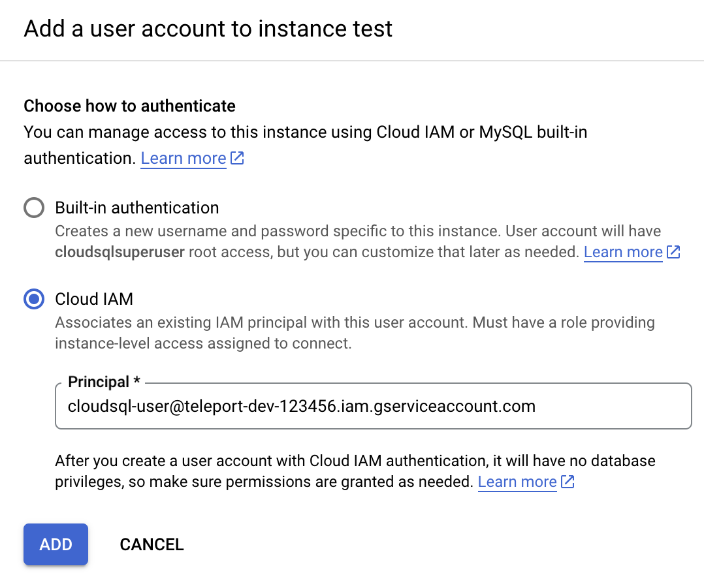

(!docs/pages/includes/database-access/db-introduction.mdx  dbType="MySQL on Google Cloud SQL" dbConfigure="MySQL on Google Cloud SQL with a service account" dbName="MySQL on Google Cloud SQL" !)

## How it works

(!docs/pages/includes/database-access/how-it-works/iam.mdx db="MySQL" cloud="Google Cloud"!)

<Tabs>
<TabItem scope={["oss", "enterprise"]} label="Self-Hosted">

</TabItem>
<TabItem scope={["cloud"]} label="Teleport Enterprise Cloud">

</TabItem>

</Tabs>

## Prerequisites

(!docs/pages/includes/edition-prereqs-tabs.mdx!)

- Google Cloud account
- A host, e.g., a Compute Engine instance, where you will run the Teleport Database
  Service
- (!docs/pages/includes/tctl.mdx!)

## Step 1/7. Enable Cloud SQL IAM authentication

Teleport uses [IAM
authentication](https://cloud.google.com/sql/docs/mysql/iam-authentication)
with Cloud SQL MySQL instances.

(!docs/pages/includes/database-access/cloudsql_enable_iam_auth.mdx type="MySQL" !)

## Step 2/7. Create a service account for a database user

Teleport uses service accounts to connect to Cloud SQL databases.

(!docs/pages/includes/database-access/cloudsql_create_db_user_account.mdx!)

(!docs/pages/includes/database-access/cloudsql_grant_db_user.mdx!)

### Configure authentication for your service account

Now go back to the Users page of your Cloud SQL instance and add a new user
account. In the sidebar, choose "Cloud IAM" authentication type and add the
service account you've just created:



Press "Add". See [Creating and managing IAM
users](https://cloud.google.com/sql/docs/mysql/add-manage-iam-users) in Google
Cloud documentation for more info.

## Step 3/7. Create a service account for the Teleport Database Service

The final part of GCP configuration is to create a service account for the
Teleport Database Service.

### Create a service account

If creating a new service account, go to the
[Service Accounts](https://console.cloud.google.com/iam-admin/serviceaccounts)
page and create another service account:


### Grant permissions

(!docs/pages/includes/database-access/cloudsql_grant_db_service_account.mdx!)

<Admonition type="note" title="Service account permissions">
  "Service Account Token Creator", "Cloud SQL Viewer", and "Cloud SQL Admin"
  IAM roles include more permissions than the Database Service needs. To further
  restrict the service account, you can create a role that includes only the
  following permissions:
  ```ini
  # Used to generate IAM auth tokens when connecting to a database instance.
  iam.serviceAccounts.getAccessToken
  # Used to check database user type.
  cloudsql.users.get
  # Used to auto-download the instance's root CA certificate.
  cloudsql.instances.get
  ```
</Admonition>

### (Optional) Allow only SSL connections

(!docs/pages/includes/database-access/cloudsql-ssl.mdx!)

In addition, when using Cloud SQL MySQL with "Allow only SSL connections"
enabled, Teleport connects to the database's Cloud SQL Proxy port `3307`
instead of the default `3306` as the default Cloud SQL MySQL listener does not
trust generated ephemeral certificates. For this reason, you should make sure
to allow port `3307` when using "Allow only SSL connections" with MySQL.

### (Optional) Create a key for the service account

(!docs/pages/includes/database-access/cloudsql_service_account_key.mdx!)

## Step 4/7. Gather Cloud SQL instance information

To connect a Cloud SQL database to Teleport, you'll need to gather a few pieces
of information about the instance.

- GCP Project ID.

You can normally see it in the organization view at the top of the GCP dashboard.

- Cloud SQL instance ID.

The instance ID is the name of your Cloud SQL instance shown at the top of the
Overview page:


- Cloud SQL instance endpoint.

You will use the instance's public IP address to connect to it. It can be viewed
on the "Connect to this instance" panel on the Overview page:


- (Optional) Cloud SQL instance root certificate.

(!docs/pages/includes/database-access/cloudsql_download_root_ca.mdx!)

## Step 5/7. Create a Teleport user

(!docs/pages/includes/database-access/create-user.mdx!)

## Step 6/7. Set up the Teleport Database service

(!docs/pages/includes/database-access/token.mdx!)

Install Teleport on the host where you will run the Teleport Database Service:

(!docs/pages/includes/install-linux.mdx!)

Below is an example of a Database Service configuration file that proxies
a single Cloud SQL MySQL database. Save this file as `/etc/teleport.yaml`:

<Tabs>
<TabItem scope={["oss", "enterprise"]} label="Self-Hosted">

```yaml
version: v3
teleport:
  data_dir: /var/lib/teleport
  nodename: test
  # Proxy address to connect to. Note that it has to be the proxy address
  # because the Database Service always connects to the cluster over a reverse
  # tunnel.
  proxy_server: teleport.example.com:443
  auth_token: "/tmp/token"
db_service:
  enabled: "yes"
  # This section contains definitions of all databases proxied by this
  # service. Can contain multiple items.
  databases:
    # Name of the database proxy instance. Used to reference in CLI.
  - name: "cloudsql"
    # Free-form description of the database proxy instance.
    description: "GCP Cloud SQL MySQL"
    # Database protocol.
    protocol: "mysql"
    # Database endpoint. For Cloud SQL use instance's public IP address.
    uri: "35.1.2.3:3306"
    # (Optional) path to Cloud SQL instance root certificate you downloaded
    # manually above.
    ca_cert_file: /path/to/cloudsql/instance/root.pem
    # GCP-specific configuration when connecting a Cloud SQL instance.
    gcp:
      # GCP project ID.
      project_id: "<project-id>"
      # Cloud SQL instance ID.
      instance_id: "test"
    # Labels to assign to the database, used in RBAC.
    static_labels:
      env: dev
auth_service:
  enabled: "no"
ssh_service:
  enabled: "no"
proxy_service:
  enabled: "no"
```

</TabItem>
<TabItem scope={["cloud"]} label="Teleport Enterprise Cloud">

```yaml
version: v3
teleport:
  data_dir: /var/lib/teleport
  nodename: test
  # Proxy address to connect to. Use your Teleport Cloud tenant address.
  proxy_server: mytenant.teleport.sh:443
  auth_token: "/tmp/token"
db_service:
  enabled: "yes"
  # This section contains definitions of all databases proxied by this
  # service. Can contain multiple items.
  databases:
    # Name of the database proxy instance. Used to reference in CLI.
  - name: "cloudsql"
    # Free-form description of the database proxy instance.
    description: "GCP Cloud SQL MySQL"
    # Database protocol.
    protocol: "mysql"
    # Database endpoint. For Cloud SQL use instance's public IP address.
    uri: "35.1.2.3:3306"
    # (Optional) path to Cloud SQL instance root certificate you downloaded
    # manually above.
    ca_cert_file: /path/to/cloudsql/instance/root.pem
    # GCP-specific configuration when connecting a Cloud SQL instance.
    gcp:
      # GCP project ID.
      project_id: "<project-id>"
      # Cloud SQL instance ID.
      instance_id: "test"
    # Labels to assign to the database, used in RBAC.
    static_labels:
      env: dev
auth_service:
  enabled: "no"
ssh_service:
  enabled: "no"
proxy_service:
  enabled: "no"
```

</TabItem>

</Tabs>

<Admonition
  type="tip"
  title="Tip"
>
  A single Teleport process can run multiple different services, for example
  multiple Database Service instances as well as other services such the SSH
  Service or Application Service.
</Admonition>

(!docs/pages/includes/start-teleport.mdx service="the Teleport Database Service"!)

### GCP credentials

(!docs/pages/includes/database-access/cloudsql_service_credentials.mdx!)

## Step 7/7. Connect

Once the Database Service has joined the cluster, log in to see the available
databases:

<Tabs>
<TabItem scope={["oss", "enterprise"]} label="Self-Hosted">

```code
$ tsh login --proxy=teleport.example.com --user=alice
$ tsh db ls
# Name     Description         Labels
# -------- ------------------- --------
# cloudsql GCP Cloud SQL MySQL env=dev
```

</TabItem>
<TabItem scope={["cloud"]} label="Teleport Enterprise Cloud">

```code
$ tsh login --proxy=mytenant.teleport.sh --user=alice
$ tsh db ls
# Name     Description         Labels
# -------- ------------------- --------
# cloudsql GCP Cloud SQL MySQL env=dev
```

</TabItem>

</Tabs>

Note that you will only be able to see databases your role has access to. See
our [RBAC](../rbac.mdx) guide for more details.

To retrieve credentials for a database and connect to it:

```code
$ tsh db connect --db-user=teleport --db-name=mysql cloudsql
```

<Admonition
  type="note"
  title="What database user name to use?"
>

When connecting to the database, use either the database user name or the
service account's Email ID. Both the user name and the service account's Email
ID are shown on the Users page of your Cloud SQL instance.

</Admonition>

To log out of the database and remove credentials:

```code
# Remove credentials for a particular database instance.
$ tsh db logout cloudsql
# Remove credentials for all database instances.
$ tsh db logout
```

## Troubleshooting

### Error when connecting to a replica instance

You may encounter the following error when connecting to a replica instance:

```code
$ tsh db connect --db-user root -n test cloudsql-replica 
ERROR 1105 (HY000): Could not update Cloud SQL user "<username>" password:

  The requested operation is not valid for a replica instance.

...
```

Connecting as built-in database users with passwords are not supported for
Cloud SQL replica instances. Please follow this guide to use IAM authentication
instead.

## Next steps

(!docs/pages/includes/database-access/guides-next-steps.mdx!)

- Learn more about [authenticating as a service
  account](https://cloud.google.com/docs/authentication#service-accounts) in
  Google Cloud.
