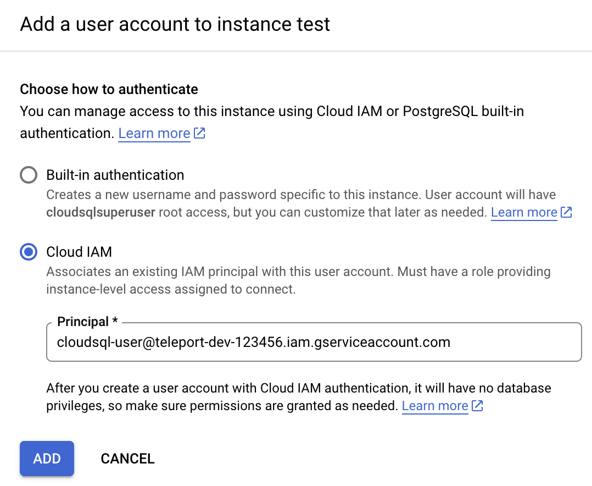

In this guide, we will show you how to use Teleport Database Access with PostgreSQL
on Google Cloud SQL.

## Prerequisites

- Google Cloud account

- A host, e.g., a Compute Engine instance, where you will run the Teleport Database
  Service

(!docs/pages/includes/user-client-prereqs.mdx!)

(!docs/pages/includes/tctl.mdx!)

## Step 1/7. Enable Cloud SQL IAM authentication

Teleport uses [IAM database authentication](https://cloud.google.com/sql/docs/postgres/authentication)
with Cloud SQL PostgreSQL instances.

If you're [creating](https://console.cloud.google.com/sql/choose-instance-engine)
a new PostgreSQL instance, make sure to add the `cloudsql.iam_authentication`
database flag under "Customize your instance / Flags" section:


To check whether IAM authentication is enabled for an existing Cloud SQL instance,
look for the flag on the Configuration panel on the instance's Overview page:


If it isn't enabled, you can add this flag using the "Edit configuration" dialog
at the bottom of the Configuration panel. Note, changing this setting may
require a database instance reboot.

## Step 2/7. Create a service account for the database

Teleport uses service accounts to connect to Cloud SQL databases.

### Create a service account

Go to the IAM & Admin [Service Accounts](https://console.cloud.google.com/iam-admin/serviceaccounts)
page and create a new service account:


Press "Create".

### Grant permissions

On the second step grant this service account the "Cloud SQL Instance User" role
which will allow it to connect to Cloud SQL instances using IAM token for
authentication:


Press "Done".

### Configure authentication for your service account

Now go back to the Users page of your Cloud SQL instance and add a new user
account. In the sidebar, choose "Cloud IAM" authentication type and add the
service account you've just created:



Press "Add" and your Users table should look similar to this:


See [Creating and managing IAM users](https://cloud.google.com/sql/docs/postgres/create-manage-iam-users)
in Google Cloud documentation for more info.

## Step 3/7. Create a service account for Teleport Database Service

The final part of GCP configuration is to create a service account for the
Teleport Database Service.


### Create a service account

Go to the [Service Accounts](https://console.cloud.google.com/iam-admin/serviceaccounts)
page and create a service account:


### Grant permissions

Assign the Service Account the following IAM roles:

- "Service Account Token Creator" will allow the Database Service to generate
  IAM authentication tokens when connecting to the database as the service account user
  we created above.
- Either "Cloud SQL Viewer" or "Cloud SQL Admin":
  - "Cloud SQL Viewer" will allow the Database Service to automatically download
    your Cloud SQL instance's root CA certificate, but does not support client
    certificate authentication.
  - "Cloud SQL Admin" will allow the Database Service to automatically download
    your Cloud SQL instance's root CA certificate and generate an
    ephemeral client certificate when the GCP instance is configured to
    "Allow only SSL connections."

Assign it the "Service Account Token Creator" role:


<Admonition type="note" title="Service account permissions">
  "Service Account Token Creator", "Cloud SQL Viewer", and "Cloud SQL Admin"
  IAM roles include more permissions than the database agent needs. To further
  restrict the service account, you can create a role that includes only the
  following permissions:
  ```ini
  # Used to generate IAM auth tokens when connecting to a database instance.
  iam.serviceAccounts.getAccessToken
  # Used to auto-download the instance's root CA certificate.
  cloudsql.instances.get
  # Used to generate an ephemeral client certificate when the GCP instance
  # is configured to "Allow only SSL connections." (optional)
  cloudsql.sslCerts.createEphemeral
  ```

</Admonition>

### Create a key for the service account

Once created, go to that service account's Keys tab and create a new key:


Make sure to choose JSON format:


Save the file. The Teleport Database Service will need it to be able to generate
IAM auth tokens.

## Step 4/7. Gather Cloud SQL instance information

To connect a Cloud SQL database to Teleport, you'll need to gather a few pieces
of information about the instance.

- GCP Project ID.

You can normally see it in the organization view at the top of the GCP dashboard.

- Cloud SQL instance ID.

The instance ID is the name of your Cloud SQL instance shown at the top of the
Overview page:


- Cloud SQL instance endpoint.

You will use the instance's public IP address to connect to it. It can be viewed
on the "Connect to this instance" panel on the Overview page:


- Cloud SQL instance root certificate.

The instance's root certificate is required so Teleport can validate the
certificate presented by the database instance. You can download `server-ca.pem`
file from the Connections tab under Security section:


## Step 5/7. Set up the Teleport Auth and Proxy services

Teleport Database Access for Cloud SQL PostgreSQL is available starting from
the `6.2` Teleport release.

(!docs/pages/includes/database-access/start-auth-proxy.mdx!)

(!docs/pages/includes/database-access/token.mdx!)

### Create a user

Create local Teleport user with the built-in `access` role:

```code
$ tctl users add --roles=access alice
```

The `access` role allows users to see all connected database servers, but
database names and accounts are restricted to the user's `db_names` and
`db_users` traits. Normally, these traits come from the identity provider. For
the local user you've just created you can update them manually to allow it to
connect to the `postgres` database as a `teleport@<project-id>.iam` database
service account.

First, export the user resource:

```code
$ tctl get users/alice > alice.yaml
```

Update the resource to include the following traits:

```yaml
traits:
  # Database account names the user will be allowed to use.
  # Note: replace <project-id> with your GCP project ID.
  db_users:
  - teleport@<project-id>.iam
  # Database names the user will be allowed to connect to.
  db_names:
  - postgres
```

Update the user:

```code
$ tctl create alice.yaml -f
```

For more detailed information about database access controls see [RBAC](../rbac.mdx)
documentation.

## Step 6/7. Set up the Teleport Database service

Below is an example of a Database Service configuration file that proxies
a single Cloud SQL PostgreSQL database:

<ScopedBlock scope={["oss", "enterprise"]}>

```yaml
teleport:
  data_dir: /var/lib/teleport-db
  nodename: test
  # Proxy address to connect to. Note that it has to be the proxy address
  # because the Database Service always connects to the cluster over a reverse
  # tunnel.
  auth_servers:
  - teleport.example.com:3080
db_service:
  enabled: "yes"
  # This section contains definitions of all databases proxied by this
  # service, can contain multiple items.
  databases:
    # Name of the database proxy instance, used to reference in CLI.
  - name: "cloudsql"
    # Free-form description of the database proxy instance.
    description: "GCP Cloud SQL PostgreSQL"
    # Database protocol.
    protocol: "postgres"
    # Database endpoint. For Cloud SQL use instance's public IP address.
    uri: "35.1.2.3:5432"
    # Path to Cloud SQL instance root certificate you downloaded above.
    ca_cert_file: /path/to/cloudsql/instance/root.pem
    # GCP specific configuration when connecting Cloud SQL instance.
    gcp:
      # GCP project ID.
      project_id: "<project-id>"
      # Cloud SQL instance ID.
      instance_id: "test"
    # Labels to assign to the database, used in RBAC.
    static_labels:
      env: dev
auth_service:
  enabled: "no"
ssh_service:
  enabled: "no"
proxy_service:
  enabled: "no"
```

</ScopedBlock>
<ScopedBlock scope={["cloud"]}>

```yaml
teleport:
  data_dir: /var/lib/teleport-db
  nodename: test
  # Proxy address to connect to. Use your Teleport Cloud tenant address here.
  auth_servers:
  - mytenant.teleport.sh
db_service:
  enabled: "yes"
  # This section contains definitions of all databases proxied by this
  # service, can contain multiple items.
  databases:
    # Name of the database proxy instance, used to reference in CLI.
  - name: "cloudsql"
    # Free-form description of the database proxy instance.
    description: "GCP Cloud SQL PostgreSQL"
    # Database protocol.
    protocol: "postgres"
    # Database endpoint. For Cloud SQL use instance's public IP address.
    uri: "35.1.2.3:5432"
    # Path to Cloud SQL instance root certificate you downloaded above.
    ca_cert_file: /path/to/cloudsql/instance/root.pem
    # GCP specific configuration when connecting Cloud SQL instance.
    gcp:
      # GCP project ID.
      project_id: "<project-id>"
      # Cloud SQL instance ID.
      instance_id: "test"
    # Labels to assign to the database, used in RBAC.
    static_labels:
      env: dev
auth_service:
  enabled: "no"
ssh_service:
  enabled: "no"
proxy_service:
  enabled: "no"
```

</ScopedBlock>

<Notice
  type="tip"
>

  A single Teleport process can run multiple different services, for example
  multiple Database Access instances as well as other services such the SSH
  Service or Application Service.

</Notice>

Start the Database Service:

```code
$ teleport start --config=/path/to/teleport-db.yaml --token=/tmp/token
```

### GCP credentials

The Teleport Database Service must have credentials of `teleport-db-service` GCP
service account we created
[above](#create-a-service-account-for-teleport-database-service) in order to be
able to generate IAM auth tokens.

The easiest way to ensure that is to set the `GOOGLE_APPLICATION_CREDENTIALS`
environment variable to point to the JSON credentials file you downloaded
earlier.

See [Authenticating as a service account](https://cloud.google.com/docs/authentication/production)
in the Google Cloud documentation for more details.

## Step 7/7. Connect

Once the Database Service has joined the cluster, log in to see the available
databases:

<ScopedBlock scope={["oss", "enterprise"]}>

```code
$ tsh login --proxy=teleport.example.com --user=alice
$ tsh db ls
# Name     Description              Labels
# -------- ------------------------ --------
# cloudsql GCP Cloud SQL PostgreSQL env=dev
```

</ScopedBlock>
<ScopedBlock scope={["cloud"]}>

```code
$ tsh login --proxy=mytenant.teleport.sh --user=alice
$ tsh db ls
# Name     Description              Labels
# -------- ------------------------ --------
# cloudsql GCP Cloud SQL PostgreSQL env=dev
```

</ScopedBlock>

Note that you will only be able to see databases your role has access to. See
our [RBAC](../rbac.mdx) guide for more details.

To connect to a particular database server, first retrieve credentials from
Teleport using the `tsh db login` command:

```sh
$ tsh db login cloudsql
```

<Admonition
  type="tip"
  title="Tip"
>
  You can be logged in to multiple databases simultaneously.
</Admonition>

You can optionally specify the database name and the user to use by default
when connecting to the database instance:

```code
$ tsh db login --db-user=teleport@<project-id>.iam --db-name=postgres cloudsql
```

<Admonition
  type="note"
  title="What database user name to use?"
>

  When connecting to the database, use the name of the database service account
  that you added as an IAM database user
  [above](#create-a-service-account-for-the-database), minus the
  `.gserviceaccount.com` suffix. The database user name is shown on the Users
  page of your Cloud SQL instance.

</Admonition>

Once logged in, connect to the database:

```code
$ tsh db connect aurora
```

<Admonition type="note" title="Note">
  The `psql` command-line client should be available in PATH in order to be
  able to connect.
</Admonition>

To log out of the database and remove credentials:

```code
# Remove credentials for a particular database instance.
$ tsh db logout cloudsql
# Remove credentials for all database instances.
$ tsh db logout
```
