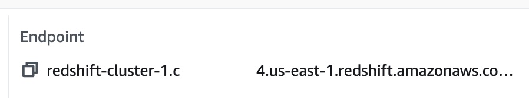
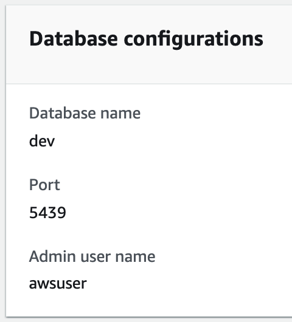

# AWS Redshift PostgreSQL

## Prerequisites

Collect a few pieces of information about your Redshift cluster which you'll
need to configure access.

**Get cluster identifier from the `General information` panel:**

<Figure align="center" bordered caption="Redshift cluster ID">

</Figure>

**Copy cluster endpoint from the `General information` panel:**

<Figure align="center" bordered caption="Redshift cluster endpoint">

</Figure>

You'll only need the `host:port` portion of the endpoint.

**Take note of database user name and database name you will use to connect.**

If you haven't created any database users, default database admin user name and
maintenance database are displayed on the `Database configurations` panel of the
`Properties` tab:

<Figure align="center" bordered caption="Redshift cluster user/database">

</Figure>

## Create IAM policy

Teleport uses [IAM tokens](https://docs.aws.amazon.com/redshift/latest/mgmt/generating-user-credentials.html)
to authenticate with Redshift databases. IAM authentication is enabled by default
for all Redshift databases.

In order to authorize Teleport to generate temporary IAM tokens, create an IAM
role with the following permissions:

```json
{
    "Version": "2012-10-17",
    "Statement": [
        {
            "Effect": "Allow",
            "Action": "redshift:GetClusterCredentials",
            "Resource": [
                "arn:aws:redshift:*:1234567890:dbuser:*/*",
                "arn:aws:redshift:*:1234567890:dbname:*/*",
                "arn:aws:redshift:*:1234567890:dbgroup:*/*"
            ]
        },
        {
            "Effect": "Allow",
            "Action": "redshift:DescribeClusters",
            "Resource": "*"
        }
    ]
}
```

The `DescribeClusters` permission is required to allow Teleport to retrieve
cluster ID, region and port.

The `GetClusterCredentials` permission controls access to generating IAM tokens.
The resource ARN string has the following format:

```
arn:aws:redshift:<region>:<account-id>:<resource>:<cluster-id>/<name>
```

Parameters:

- `region`: AWS region where Redshift cluster is deployed, or a wildcard.
- `account-id`: AWS account ID the Redshift cluster is deployed in.
- `resource`: One of `dbuser`, `dbname` or `dbgroup` to restrict access to
  database accounts, names or groups respectively.
- `cluster-id`: Redshift cluster identifier, or a wildcard.
- `name`: Name of a particular database account, name or group (depending
  on the `resource`), or a wildcard.

<Admonition type="note" title="Users auto-create">
  Teleport does not currently use auto-create option when generating tokens so
  users must exist in the database.
</Admonition>

See [AWS documentation](https://docs.aws.amazon.com/redshift/latest/mgmt/generating-iam-credentials-role-permissions.html)
for more information about setting up an IAM role.

## Setup Teleport Auth and Proxy services

Teleport Database Access for Redshift is available starting from `6.2` release.

(!docs/pages/includes/database-access/start-auth-proxy.mdx!)

(!docs/pages/includes/database-access/token.mdx!)

### Create user

Create a local Teleport user with the built-in `access` role:

```code
$ tctl users add --roles=access alice
```

The `access` role allows users to see all connected database servers, but
database names and accounts are restricted to the user's `db_names` and
`db_users` traits. Normally, these traits come from the identity provider. For
the local user you've just created you can update them manually to allow it to
connect to the `dev` database as a `awsuser` database user.

First, export the user resource:

```code
$ tctl get users/alice > alice.yaml
```

Update the resource to include the following traits:

```yaml
traits:
  # Database account names the user will be allowed to use.
  db_users:
  - awsuser
  # Database names the user will be allowed to connect to.
  db_names:
  - dev
```

Update the user:

```code
$ tctl create alice.yaml -f
```

For more detailed information about database access controls see [RBAC](../rbac.mdx)
documentation.

## Setup Teleport Database service

Below is an example of a database service configuration file that proxies
a single Redshift database:

```yaml
teleport:
  data_dir: /var/lib/teleport-db
  nodename: test
  # Proxy address to connect to. Note that it has to be the proxy address
  # because database service always connects to the cluster over reverse
  # tunnel.
  auth_servers:
  - teleport.example.com:3080
db_service:
  enabled: "yes"
  # This section contains definitions of all databases proxied by this
  # service, can contain multiple items.
  databases:
    # Name of the database proxy instance, used to reference in CLI.
  - name: "redshift"
    # Free-form description of the database proxy instance.
    description: "AWS Redshift PostgreSQL"
    # Database protocol.
    protocol: "postgres"
    # Database endpoint.
    uri: "redshift-cluster-1.abcdefg.us-east-1.redshift.amazonaws.com:5439"
    # AWS specific configuration.
    aws:
      # Region the database is deployed in.
      region: "us-east-1"
      # Redshift specific configuration.
      redshift:
        # Redshift cluster identifier.
        cluster_id: "redshift-cluster-1"
    # Labels to assign to the database, used in RBAC.
    static_labels:
      env: dev
auth_service:
  enabled: "no"
ssh_service:
  enabled: "no"
proxy_service:
  enabled: "no"
```

<Admonition
  type="tip"
  title="Tip"
>
  A single Teleport process can run multiple different services, for example
  multiple database access proxies as well as running other services such an
  SSH service or an application access proxy.
</Admonition>

Start the database service:

```code
$ teleport start --config=/path/to/teleport-db.yaml --token=/tmp/token
```

### AWS credentials

Teleport Database Service must have an IAM role allowing it to generate IAM
auth tokens which we created in the [Create IAM Policy](#create-iam-policy)
section above.

Teleport uses the default credential provider chain to find AWS credentials.
See [Specifying Credentials](https://docs.aws.amazon.com/sdk-for-go/v1/developer-guide/configuring-sdk.html#specifying-credentials)
for more information.

## Connect

Once the database service has joined the cluster, login to see the available
databases:

```code
$ tsh login --proxy=teleport.example.com --user=alice
$ tsh db ls
# Name     Description             Labels
# -------- ----------------------- --------
# redshift AWS Redshift PostgreSQL env=dev
```

Note that you will only be able to see databases your role has access to. See
[RBAC](../rbac.mdx) section for more details.

To connect to a particular database server, first retrieve credentials from
Teleport using `tsh db login` command:

```code
$ tsh db login redshift
```

<Admonition
  type="tip"
  title="Tip"
>
  You can be logged into multiple databases simultaneously.
</Admonition>

You can optionally specify the database name and the user to use by default
when connecting to the database instance:

```code
$ tsh db login --db-user=awsuser --db-name=dev redshift
```

Once logged in, connect to the database:

```code
$ tsh db connect aurora
```

<Admonition type="note" title="Note">
  The `psql` command-line client should be available in PATH in order to be
  able to connect.
</Admonition>

If you would like to see the native `psql` shell connect command, run:

```code
$ tsh db config --format=cmd aurora
```

To log out of the database and remove credentials:

```code
# Remove credentials for a particular database instance.
$ tsh db logout redshift
# Remove credentials for all database instances.
$ tsh db logout
```
