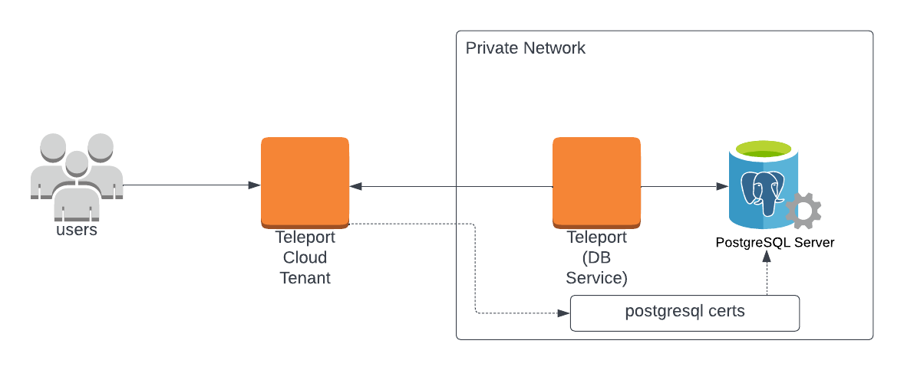

(!docs/pages/includes/database-access/db-introduction.mdx  dbType="PostgreSQL" dbConfigure="PostgreSQL database with mutual TLS authentication" dbName="PostgreSQL" !)

<Tabs>
<TabItem scope={["oss", "enterprise"]} label="Self-Hosted">

</TabItem>
<TabItem scope={["cloud"]} label="Teleport Enterprise Cloud">

</TabItem>

</Tabs>

## Prerequisites

(!docs/pages/includes/edition-prereqs-tabs.mdx!)

- A self-hosted PostgreSQL instance.
- Command-line client `psql` installed and added to your system's `PATH` environment variable.
- A host, e.g., an Amazon EC2 instance, where you will run the Teleport Database
  Service.
- (!docs/pages/includes/tctl.mdx!)

## Step 1/5. Create a Teleport token and user

(!docs/pages/includes/database-access/token.mdx!)

### Create a Teleport user

(!docs/pages/includes/database-access/create-user.mdx!)

## Step 2/5. Create a certificate/key pair

(!docs/pages/includes/database-access/tctl-auth-sign.mdx!)

Create the secrets:

```code
# Export Teleport's certificate authority and a generate certificate/key pair
# for host db.example.com with a 1-year validity period.
$ tctl auth sign --format=db --host=db.example.com --out=server --ttl=2190h
```

In this example, `db.example.com` is the hostname where the Teleport Database
Service can reach the PostgreSQL server.

(!docs/pages/includes/database-access/ttl-note.mdx!)

The command will create 3 files: `server.cas`, `server.crt` and `server.key`
which you'll need to enable mutual TLS on your PostgreSQL server.

## Step 3/5. Configure your PostgreSQL server

To configure your PostgreSQL server to accept TLS connections, add the following
to the PostgreSQL configuration file, `postgresql.conf`:

```conf
ssl = on
ssl_cert_file = '/path/to/server.crt'
ssl_key_file = '/path/to/server.key'
ssl_ca_file = '/path/to/server.cas'
```

See [Secure TCP/IP Connections with SSL](https://www.postgresql.org/docs/current/ssl-tcp.html)
in the PostgreSQL documentation for more details.

Additionally, PostgreSQL should be configured to require client certificate
authentication from clients connecting over TLS. This can be done by adding
the following entries to PostgreSQL's host-based authentication file `pg_hba.conf`:

```conf
hostssl all             all             ::/0                    cert
hostssl all             all             0.0.0.0/0               cert
```

You should also ensure that you have no higher-priority `md5` authentication
rules that will match, otherwise PostgreSQL will offer them first, and the
certificate-based Teleport login will fail.

See [The pg_hba.conf File](https://www.postgresql.org/docs/current/auth-pg-hba-conf.html)
in the PostgreSQL documentation for more details.

## Step 4/5. Configure and Start the Database Service

Install and configure Teleport where you will run the Teleport Database Service:

<Tabs>
<TabItem label="Linux Server">

(!docs/pages/includes/install-linux.mdx!)

(!docs/pages/includes/database-access/db-configure-start.mdx dbName="example-postgres" dbProtocol="postgres" databaseAddress="postgres.example.com:5432" !)

</TabItem>
<TabItem label="Kubernetes Cluster">
  Teleport provides Helm charts for installing the Teleport Database Service in Kubernetes Clusters.

  (!docs/pages/kubernetes-access/helm/includes/helm-repo-add.mdx!)

  (!docs/pages/includes/database-access/db-helm-install.mdx dbName="example-postgres" dbProtocol="postgres" databaseAddress="postgres.example.com:5432" !)
</TabItem>
</Tabs>

(!docs/pages/includes/database-access/multiple-instances-tip.mdx !)

## Step 5/5. Connect

Once the Database Service has joined the cluster, log in to see the available
databases:

<Tabs>
<TabItem scope={["oss", "enterprise"]} label="Self-Hosted">

```code
$ tsh login --proxy=teleport.example.com --user=alice
$ tsh db ls
# Name             Description        Labels
# ---------------- ------------------ --------
# example-postgres Example PostgreSQL env=dev
```

</TabItem>
<TabItem scope={["cloud"]} label="Teleport Enterprise Cloud">

```code
$ tsh login --proxy=mytenant.teleport.sh --user=alice
$ tsh db ls
# Name             Description        Labels
# ---------------- ------------------ --------
# example-postgres Example PostgreSQL env=dev
```

</TabItem>

</Tabs>

Note that you will only be able to see databases your role has access to. See
[RBAC](../rbac.mdx) section for more details.

To retrieve credentials for a database and connect to it:

```code
$ tsh db connect --db-user=postgres --db-name=postgres example-postgres
```

To log out of the database and remove credentials:

```code
# Remove credentials for a particular database instance.
$ tsh db logout example-postgres
# Remove credentials for all database instances.
$ tsh db logout
```

## Troubleshooting

(!docs/pages/includes/database-access/pg-cancel-request-limitation.mdx!)

(!docs/pages/includes/database-access/psql-ssl-syscall-error.mdx!)

## Next steps

- Set up [automatic database user provisioning](../auto-user-provisioning/postgres.mdx).

(!docs/pages/includes/database-access/guides-next-steps.mdx!)
