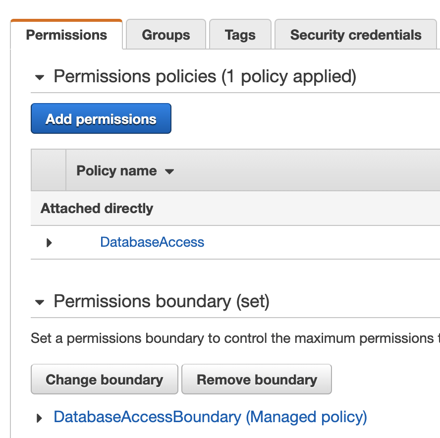

This guide will help you to:

- Install Teleport `(=teleport.version=)`.
- Set up Teleport to access your RDS instances and Aurora clusters.
- Connect to your databases through Teleport.

<Admonition type="note" title="Aurora Serverless">
  Aurora Serverless does not support IAM authentication at the time of this
  writing so it can't be used with Database Access.
</Admonition>

## Prerequisites

- Teleport version `(=teleport.version=)`.
- AWS account with RDS and Aurora databases and permissions to create and attach
  IAM policies.

## Step 1/6. Install Teleport

(!docs/pages/includes/database-access/start-auth-proxy.mdx!)

## Step 2/6. Create Teleport user

(!docs/pages/includes/database-access/create-user.mdx!)

## Step 3/6. Configure IAM

### Create IAM policy for Teleport

Teleport needs AWS IAM permissions to be able to:

- Discover and register RDS instances and Aurora clusters.
- Configure IAM authentication for them.

Go to the [Policies](https://console.aws.amazon.com/iamv2/home#/policies) page
and create a managed IAM policy for the database agent.

The exact set of required permissions depends on whether you're connecting to
RDS instances or Aurora clusters (or both), as well as the IAM identity your
Teleport database agent will be using (user or role).

<Tabs>
  <TabItem label="RDS / IAM user">
  Use this policy if you're connecting to RDS instances and your Teleport
  database agent runs as IAM user (for example, uses AWS credentials file).
  ```json
  {
      "Version": "2012-10-17",
      "Statement": [
          {
              "Effect": "Allow",
              "Action": [
                  "rds:DescribeDBInstances",
                  "rds:ModifyDBInstance",
                  "iam:GetUserPolicy",
                  "iam:PutUserPolicy",
                  "iam:DeleteUserPolicy"
              ],
              "Resource": "*"
          }
      ]
  }
  ```
  </TabItem>
  <TabItem label="RDS / IAM role">
  Use this policy if you're connecting to RDS instances and your Teleport
  database agent runs as IAM role (for example, on an EC2 instance with
  attached IAM role).
  ```json
  {
      "Version": "2012-10-17",
      "Statement": [
          {
              "Effect": "Allow",
              "Action": [
                  "rds:DescribeDBInstances",
                  "rds:ModifyDBInstance",
                  "iam:GetRolePolicy",
                  "iam:PutRolePolicy",
                  "iam:DeleteRolePolicy"
              ],
              "Resource": "*"
          }
      ]
  }
  ```
  </TabItem>
  <TabItem label="Aurora / IAM user">
  Use this policy if you're connecting to Aurora clusters and your Teleport
  database agent runs as IAM user (for example, uses AWS credentials file).
  ```json
  {
      "Version": "2012-10-17",
      "Statement": [
          {
              "Effect": "Allow",
              "Action": [
                  "rds:DescribeDBClusters",
                  "rds:ModifyDBCluster",
                  "iam:GetUserPolicy",
                  "iam:PutUserPolicy",
                  "iam:DeleteUserPolicy"
              ],
              "Resource": "*"
          }
      ]
  }
  ```
  </TabItem>
  <TabItem label="Aurora / IAM role">
  Use this policy if you're connecting to Aurora clusters and your Teleport
  database agent runs as IAM role (for example, on an EC2 instance with
  attached IAM role).
  ```json
  {
      "Version": "2012-10-17",
      "Statement": [
          {
              "Effect": "Allow",
              "Action": [
                  "rds:DescribeDBClusters",
                  "rds:ModifyDBCluster",
                  "iam:GetRolePolicy",
                  "iam:PutRolePolicy",
                  "iam:DeleteRolePolicy"
              ],
              "Resource": "*"
          }
      ]
  }
  ```
  </TabItem>
</Tabs>

### Create IAM permission boundary for Teleport

Since Teleport will be managing its own IAM policies for access to RDS and
Aurora databases, you need to create a permission boundary to limit its
effective range of permissions.

Create another managed policy that will serve as a permission boundary on the
same [Policies](https://console.aws.amazon.com/iamv2/home#/policies) page.

The boundary should have the same set of permissions as the IAM policy you
created above, plus `rds-db:connect`.

<Tabs>
  <TabItem label="RDS / IAM user">
  Use this permission boundary policy if you're connecting to RDS instances and
  your Teleport database agent runs as IAM user (for example, uses AWS
  credentials file).
  ```json
  {
      "Version": "2012-10-17",
      "Statement": [
          {
              "Effect": "Allow",
              "Action": [
                  "rds:DescribeDBInstances",
                  "rds:ModifyDBInstance",
                  "iam:GetUserPolicy",
                  "iam:PutUserPolicy",
                  "iam:DeleteUserPolicy",
                  "rds-db:connect"
              ],
              "Resource": "*"
          }
      ]
  }
  ```
  </TabItem>
  <TabItem label="RDS / IAM role">
  Use this permission boundary policy if you're connecting to RDS instances and
  your Teleport database agent runs as IAM role (for example, on an EC2 instance
  with attached IAM role).
  ```json
  {
      "Version": "2012-10-17",
      "Statement": [
          {
              "Effect": "Allow",
              "Action": [
                  "rds:DescribeDBInstances",
                  "rds:ModifyDBInstance",
                  "iam:GetRolePolicy",
                  "iam:PutRolePolicy",
                  "iam:DeleteRolePolicy",
                  "rds-db:connect"
              ],
              "Resource": "*"
          }
      ]
  }
  ```
  </TabItem>
  <TabItem label="Aurora / IAM user">
  Use this permission boundary policy if you're connecting to Aurora clusters
  and your Teleport database agent runs as IAM user (for example, uses AWS
  credentials file).
  ```json
  {
      "Version": "2012-10-17",
      "Statement": [
          {
              "Effect": "Allow",
              "Action": [
                  "rds:DescribeDBClusters",
                  "rds:ModifyDBCluster",
                  "iam:GetUserPolicy",
                  "iam:PutUserPolicy",
                  "iam:DeleteUserPolicy",
                  "rds-db:connect"
              ],
              "Resource": "*"
          }
      ]
  }
  ```
  </TabItem>
  <TabItem label="Aurora / IAM role">
  Use this permission boundary policy if you're connecting to Aurora clusters
  and your Teleport database agent runs as IAM role (for example, on an EC2
  instance with attached IAM role).
  ```json
  {
      "Version": "2012-10-17",
      "Statement": [
          {
              "Effect": "Allow",
              "Action": [
                  "rds:DescribeDBClusters",
                  "rds:ModifyDBCluster",
                  "iam:GetRolePolicy",
                  "iam:PutRolePolicy",
                  "iam:DeleteRolePolicy",
                  "rds-db:connect"
              ],
              "Resource": "*"
          }
      ]
  }
  ```
  </TabItem>
</Tabs>

### Attach policy and boundary to IAM identity

Attach created policy and permission boundary to the IAM identity your Teleport
database agent will be using. For example, if the agent runs as an IAM user:

<Figure align="left">

</Figure>

<Admonition type="note" title="Self-managed IAM">
  If you prefer to self-manage IAM for your RDS databases, take a look at
  [AWS reference](../reference/aws.mdx) for details.
</Admonition>

## Step 4/6. Start database agent

(!docs/pages/includes/database-access/token.mdx!)

Create the database agent configuration e.g. in `/etc/teleport.yaml`:

```yaml
teleport:
  data_dir: /var/lib/teleport
  auth_token: /tmp/token
  auth_servers:
  - teleport.example.com:3080 # Teleport proxy address to connect to
auth_service:
  enabled: "no"
proxy_service:
  enabled: "no"
db_service:
  enabled: "yes"
  aws:
  - types: ["rds"]
    regions: ["us-west-1"] # AWS regions to fetch databases from
    tags: # AWS database resource tags to match
      "*": "*"
```

Start the database agent:

```code
$ teleport start --config=/etc/teleport.yaml
```

The agent will discover all RDS instances and Aurora clusters according to the
configuration and register them in the cluster. In addition to the primary
endpoints of the discovered Aurora clusters, their reader and custom endpoints
will also be registered.

The agent will also attempt to enable IAM auth and configure IAM access
policies for the discovered databases. Keep in mind that AWS IAM changes may
not propagate immediately and can take a few minutes to come into effect.

<Admonition type="note" title="AWS credentials">
  Teleport database agent uses the default credential provider chain to find AWS
  credentials. See [Specifying Credentials](https://docs.aws.amazon.com/sdk-for-go/v1/developer-guide/configuring-sdk.html#specifying-credentials)
  for more information.
</Admonition>

## Step 5/6. Create database IAM user

Database users must allow IAM authentication in order to be used with Database
Access for RDS. See below how to enable it for your database engine.

<Tabs>
  <TabItem label="PostgreSQL">
  PostgreSQL users must have a `rds_iam` role:

  ```sql
  CREATE USER alice;
  GRANT rds_iam TO alice;
  ```
  </TabItem>
  <TabItem label="MySQL">
  MySQL users must have RDS authentication plugin enabled:

  ```sql
  CREATE USER alice IDENTIFIED WITH AWSAuthenticationPlugin AS 'RDS';
  ```

  Created user may not have access to anything by default so let's grant it
  some permissions:

  ```sql
  GRANT ALL ON `%`.* TO 'alice'@'%';
  ```
  </TabItem>
</Tabs>

See [Creating a database account using IAM authentication](https://docs.aws.amazon.com/AmazonRDS/latest/AuroraUserGuide/UsingWithRDS.IAMDBAuth.DBAccounts.html)
for more information.

## Step 6/6. Connect

Once the database agent has started and joined the cluster, login to see the
registered databases:

```code
$ tsh login --proxy=teleport.example.com --user=alice
$ tsh db ls
# Name                           Description                                   Labels
# ------------------------------ --------------------------------------------- --------
# postgres-rds                   RDS instance in us-west-1                     ...
# aurora-mysql                   Aurora cluster in us-west-1                   ...
# aurora-mysql-custom-myendpoint Aurora cluster in us-west-1 (custom endpoint) ...
# aurora-mysql-reader            Aurora cluster in us-west-1 (reader endpoint) ...
```

<Admonition type="note" title="Note">
  Primary, reader, and custom endpoints of Aurora clusters have names of
  `<cluster-id>`, `<cluster-id>-reader`, and
  `<cluster-id>-custom-<endpoint-name>` respectively.
</Admonition>

Log into particular database using `tsh db login` command:

```code
$ tsh db login postgres-rds
```

<Admonition type="tip" title="Tip">
  You can be logged into multiple databases simultaneously.
</Admonition>

You can optionally specify the database name and the user to use by default
when connecting to the database instance:

```code
$ tsh db login --db-user=postgres --db-name=postgres postgres-rds
```

Now connect to the database:

```code
$ tsh db connect postgres-rds
```

<Admonition type="note" title="Note">
  The appropriate database command-line client (`psql`, `mysql`, `mariadb`) should be
  available in PATH in order to be able to connect.
</Admonition>

To log out of the database and remove credentials:

```code
$ tsh db logout postgres-rds
```

## Next steps

(!docs/pages/includes/database-access/guides-next-steps.mdx!)
