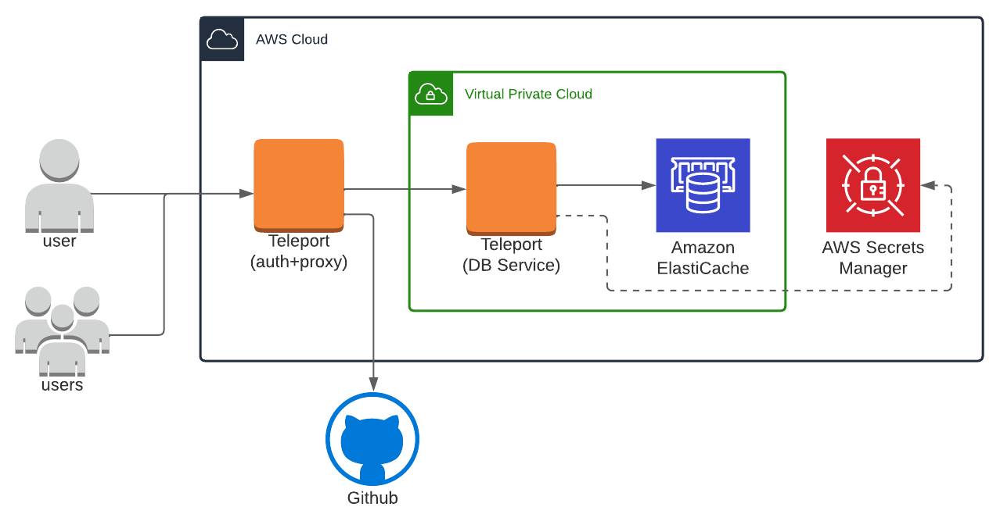
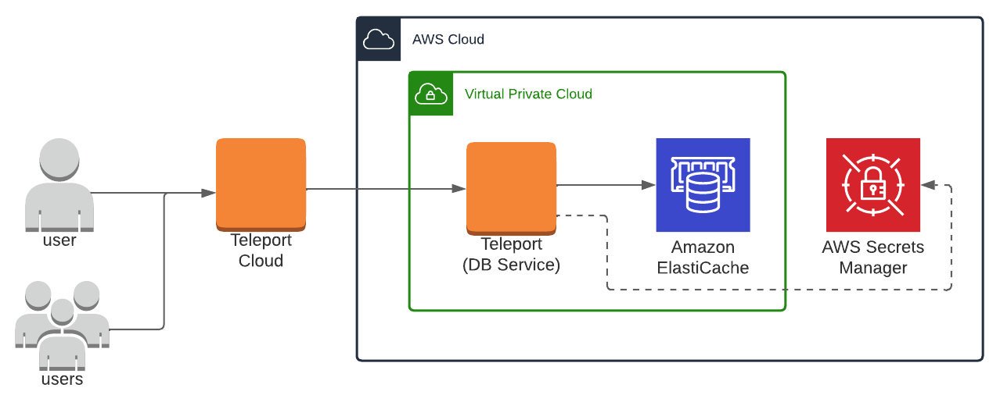
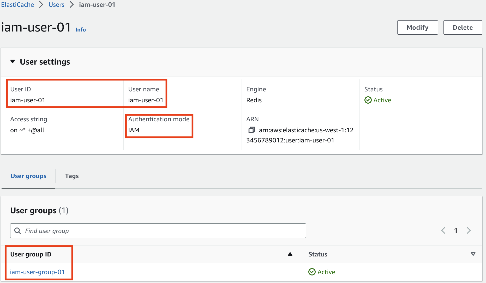
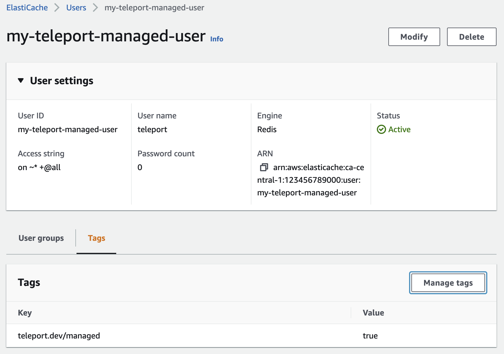

(!docs/pages/includes/database-access/db-introduction.mdx  dbType="AWS ElastiCache and MemoryDB for Redis cluster" dbConfigure="AWS ElastiCache and MemoryDB for Redis cluster database with IAM authentication" dbName="AWS ElastiCache and MemoryDB for Redis" !)

<Tabs>
<TabItem scope={["oss", "enterprise"]} label="Self-Hosted">

</TabItem>
<TabItem scope={["cloud","team"]} label="Teleport Cloud">

</TabItem>

</Tabs>

This guide shows how to enroll a single AWS Elasticache or MemoryDB cluster
through the Teleport Database Service. For a more scalable approach, learn how
to [configure the Teleport Discovery
Service](../../auto-discovery/databases.mdx) to automatically enroll all AWS
databases in your infrastructure.

## Prerequisites

(!docs/pages/includes/edition-prereqs-tabs.mdx!)

- AWS account with at least one ElastiCache or MemoryDB for Redis clusters
  **In-transit encryption via (TLS) must be enabled**.
- Permissions to create and attach IAM policies.
- `redis-cli` version `6.2` or newer installed and added to your system's `PATH` environment variable.
- A host, e.g., an EC2 instance, where you will run the Teleport Database
  Service.
- (!docs/pages/includes/tctl.mdx!)

## Step 1/7. Create a Teleport user

(!docs/pages/includes/database-access/create-user.mdx!)

## Step 2/7. Create a Database Service configuration

(!docs/pages/includes/database-access/token.mdx!)

(!docs/pages/includes/database-access/alternative-methods-join.mdx!)

Install Teleport on the host where you will run the Teleport Database Service:

(!docs/pages/includes/install-linux.mdx!)

Create the Database Service configuration:

<Tabs>
  <TabItem label="ElastiCache">

  Change `example.teleport.sh:443` to the host and port of your Teleport Proxy
  Service. Set `ELASTICACHE_URI` to the domain name and port of your ElastiCache
  database:

  ```code
  $ ELASTICACHE_URI=""
  $ sudo teleport db configure create \
     -o file \
     --name="elasticache" \
     --proxy=example.teleport.sh:443 \
     --protocol="redis" \
     --uri=${ELASTICACHE_URI?} \
     --token=/tmp/token
  ```
  </TabItem>
  <TabItem label="MemoryDB">

  Change `example.teleport.sh:443` to the host and port of your Teleport Proxy
  Service. Set `MEMORYDB_URI` to the domain name and port of your ElastiCache
  database:

  ```code
  $ MEMORYDB_URI=""
  $ sudo teleport db configure create \
     -o file \
     --name="memorydb" \
     --proxy=example.teleport.sh:443 \
     --protocol="redis" \ \
     --uri=${MEMORYDB_URI} \
     --token=/tmp/token
  ```
  </TabItem>
</Tabs>

The command will generate a Database Service configuration and place it at the
`/etc/teleport.yaml` location.

## Step 3/7. Create an IAM policy for Teleport

Teleport needs AWS IAM permissions to be able to:

- Modify ElastiCache and MemoryDB user passwords for Teleport-managed users.
- Save user passwords in AWS Secrets Manager for Teleport-managed users.
- Connect to an ElastiCache or MemoryDB cluster using IAM auth.

Before you can generate IAM permissions, you must provide the Teleport Database
Service access to AWS credentials.

(!docs/pages/includes/aws-credentials.mdx service="the Database Service"!)

(!docs/pages/includes/database-access/aws-bootstrap.mdx!)

## Step 4/7. Start the Database Service

(!docs/pages/includes/start-teleport.mdx service="the Database Service"!)

## Step 5/6. Configure authentication for ElastiCache or MemoryDB users

There are a few authentication options when creating an ElastiCache or MemoryDB
user.

If your ElastiCache or MemoryDB cluster supports IAM authentication, the
Teleport Database Service can connect to your ElastiCache or MemoryDB cluster
using a short-lived AWS IAM authentication token.
AWS IAM authentication is available for ElastiCache and MemoryDB with Redis
version 7.0 or above. [Redis ACL](https://redis.io/docs/manual/security/acl/)
must be enabled as well. IAM authentication is the preferred method for
authentication.

The second option is to allow Teleport to manage ElastiCache or MemoryDB users.
The Teleport Database Service rotates any passwords managed by Teleport every
15 minutes, saves these passwords in AWS Secrets Manager, and automatically
sends an `AUTH` command with the saved password when connecting the client to
the Redis server.

<Tabs>
<TabItem label="ElastiCache IAM user">

To enable Redis ACL, please see [Authenticating users with Role-Based Access
Control for
ElastiCache](https://docs.aws.amazon.com/AmazonElastiCache/latest/red-ug/Clusters.RBAC.html).

Some additional limitations apply when using IAM authentication - for more
information, see:
[ElastiCache Auth IAM Limits](https://docs.aws.amazon.com/AmazonElastiCache/latest/red-ug/auth-iam.html#auth-iam-limits).

There are a few requirements for configuring an ElastiCache IAM-enabled user:
- the user must have identical username and user id properties.
- the user must have authentication mode set to "IAM".
- the user must be attached to an ElastiCache user group.

Create an ElastiCache IAM-enabled user.
The following example creates an ElastiCache user with the access string
`on ~* +@all` that represents an active user with access to all available keys
and commands:
```code
$ aws elasticache create-user \
  --user-name iam-user-01 \
  --user-id iam-user-01 \
  --authentication-mode Type=iam \
  --engine redis \
  --access-string "on ~* +@all"
```

<Admonition type="note" title="Access Strings">
You may prefer a less permissive access string for your ElastiCache users.
For more information about ElastiCache access strings, please see:
[ElastiCache Cluster RBAC Access String](https://docs.aws.amazon.com/AmazonElastiCache/latest/red-ug/Clusters.RBAC.html#Access-string).
</Admonition>

Create an ElastiCache user group and attach it to your ElastiCache replication
group:
```code
$ aws elasticache create-user-group \
  --user-group-id iam-user-group-01 \
  --engine redis \
  --user-ids default iam-user-01
$ aws elasticache modify-replication-group \
  --replication-group-id replication-group-01 \
  --user-group-ids-to-add iam-user-group-01
```

Once the ElastiCache user has been created, verify that the user is configured
to satisfy the requirements for IAM authentication:



</TabItem>

<TabItem label="MemoryDB IAM user">

It is highly recommended to use a different ACL than the preset `open-access`
ACL which allows all access using the `default` user.

If you do not have another MemoryDB ACL yet, create one:
```code
$ aws memorydb create-acl --acl-name my-acl
```

Make sure the ACL is attached to your MemoryDB cluster:
```code
$ aws memorydb update-cluster --cluster-name my-memorydb --acl-name my-acl
```

Now create an MemoryDB IAM-enabled user:
```code
$ aws memorydb create-user \
  --user-name iam-user-01 \
  --authentication-mode Type=iam \
  --access-string "on ~* +@all"
```

<Admonition type="note" title="Access Strings">
The above example creates a MemoryDB user with the access string `on ~* +@all`
that represents an active user with access to all available keys and commands.

You may prefer a less permissive access string for your MemoryDB users. For
more information about access strings, please see: [Specifying Permissions
Using an Access
String](https://docs.aws.amazon.com/memorydb/latest/devguide/clusters.acls.html#access-string).
</Admonition>

Then add this user to the ACL attached to your MemoryDB cluster:
```code
$ aws memorydb update-acl --user-names-to-add iam-user-01 --acl-name my-acl
```

</TabItem>
<TabItem label="Teleport-managed user">

To enable Redis ACL, please see [Authenticating users with Role-Based Access
Control for
ElastiCache](https://docs.aws.amazon.com/AmazonElastiCache/latest/red-ug/Clusters.RBAC.html)
and [Authenticating users with Access Control Lists for
MemoryDB](https://docs.aws.amazon.com/memorydb/latest/devguide/clusters.acls.html).

Once an ElastiCache or MemoryDB user is created with the desired access, add an
AWS resource tag `teleport.dev/managed` with the value `true` to this user:



The Database Service will automatically discover this user if it is associated
with a registered database. Keep in mind that it may take the Database Service
some time (up to 20 minutes) to discover this user once the tag is added.

</TabItem>
</Tabs>

If you choose not to use the above options, Teleport will not automatically
authenticate with the Redis server.

You can either set up a "no password" configuration for your ElastiCache or
MemoryDB user, or manually enter an `AUTH` command with the password you have
configured after a successful client connection. However, it is strongly
advised to use one of the first two options or a strong password for better
security.

## Step 6/6. Connect

Once the Database Service has started and joined the cluster, log in to see the
registered databases:

<Tabs>
<TabItem scope={["oss", "enterprise"]} label="Self-Hosted">
```code
$ tsh login --proxy=teleport.example.com --user=alice
$ tsh db ls
# Name                        Description                                               Labels
# --------------------------- --------------------------------------------------------- --------
# my-cluster-mode-elasticache                                                           ...
# my-elasticache                                                                        ...
# my-elasticache-reader                                                                 ...
# my-memorydb                                                                           ...
```

</TabItem>
<TabItem scope={["cloud"]} label="Teleport Enterprise Cloud">

```code
$ tsh login --proxy=mytenant.teleport.sh --user=alice
$ tsh db ls
# Name                        Description                                               Labels
# --------------------------- --------------------------------------------------------- --------
# my-cluster-mode-elasticache                                                           ...
# my-elasticache                                                                        ...
# my-elasticache-reader                                                                 ...
# my-memorydb                                                                           ...
```

</TabItem>

</Tabs>

To retrieve credentials for a database and connect to it:

```code
$ tsh db connect --db-user=my-database-user my-elasticache
```

If flag `--db-user` is not provided, Teleport logs in as the `default` user.

Now, depending on the authentication configurations, you may need to send an
`AUTH` command to authenticate with the Redis server:

<Tabs>
  <TabItem label="Redis with ACL">
    The Database Service automatically authenticates Teleport-managed and
    IAM-enabled users with the Redis server. No `AUTH` command is required
    after successful connection.

    If you are connecting as a user that is not managed by Teleport and is not
    IAM-enabled, the connection normally starts as the `default` user.
    Now you can authenticate the database user with its password:

    ```
    AUTH my-database-user <USER_PASSWORD>
    ```
  </TabItem>

  <TabItem label="Redis with AUTH token">
    Now you can authenticate with the shared AUTH token:

    ```
    AUTH <SHARED_AUTH_TOKEN>
    ```
  </TabItem>

  <TabItem label="Redis without AUTH">
    For Redis deployments without the ACL system or legacy `requirepass`
    directive enabled, no `AUTH` command is required.
  </TabItem>

</Tabs>

To log out of the database and remove credentials:

```code
# Remove credentials for a particular database instance.
$ tsh db logout my-elasticache
# Remove credentials for all database instances.
$ tsh db logout
```

## Troubleshooting

(!docs/pages/includes/database-access/aws-troubleshooting.mdx!)

## Next steps

(!docs/pages/includes/database-access/guides-next-steps.mdx!)

