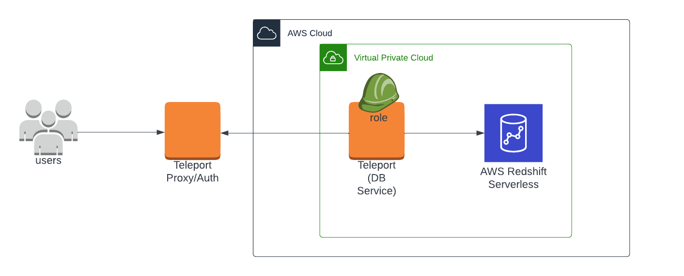

(!docs/pages/includes/database-access/db-introduction.mdx  dbType="Amazon Redshift Serverless" dbConfigure="Amazon Redshift Serverless database with IAM authentication" dbName="Amazon Redshift Serverless" !)

This guide will help you to:

- Set up Teleport to access your Amazon Redshift Serverless workgroups.
- Connect to your databases through Teleport.

## How it works

(!docs/pages/includes/database-access/how-it-works/iam.mdx db="Redshift Serverless" cloud="AWS"!)

<Tabs>
<TabItem scope={["oss", "enterprise"]} label="Self-Hosted">

</TabItem>
<TabItem scope={["cloud"]} label="Teleport Enterprise Cloud">

</TabItem>

</Tabs>

This guide shows how to enroll a single Amazon Redshift Serverless database
through the Teleport Database Service. For a more scalable approach, learn how
to [configure the Teleport Discovery
Service](../../auto-discovery/databases.mdx) to automatically enroll all AWS
databases in your infrastructure.

## Prerequisites

(!docs/pages/includes/edition-prereqs-tabs.mdx!)

- AWS account with a Redshift Serverless configuration and permissions to create
  and attach IAM policies.
- Command-line client `psql` installed and added to your system's `PATH` environment variable.
- A host where you will run the Teleport Database Service. This guide assumes an
  EC2 instance, and provides a corresponding example of access control.
- (!docs/pages/includes/tctl.mdx!)

## Step 1/4. Create an IAM Role for user access

Create an AWS IAM role to provide user access to Redshift Serverless. This role
will be granted to Teleport users via a corresponding Teleport role. In this guide
we will use the example name `teleport-redshift-serverless-access`.

Under **Trusted entity type** choose "Custom trust policy". Edit the trust policy
to allow the IAM role generated in the previous step to assume this role, so that
the Teleport node can use the permissions granted by this role to access databases:

```json
{
    "Version": "2012-10-17",
    "Statement": [
        {
            "Sid": "Statement1",
            "Effect": "Allow",
            "Principal": {
                "AWS": "arn:aws:iam::(=aws.aws_access_key=):role/teleport-redshift-serverless-node",
                "Service": "ec2.amazonaws.com"
            },
            "Action": "sts:AssumeRole"
        }
    ]
}
```

Remember to replace the example AWS account ID.

Create and apply a permission policy to allow access to Redshift Serverless.
This policy can allow access to all instances:

```json
{
    "Version": "2012-10-17",
    "Statement": [
        {
            "Effect": "Allow",
            "Action": "redshift-serverless:GetCredentials",
            "Resource": "*"
        }
    ]
}
```

Or you can restrict the `Resource` line to a specific Redshift Serverless workgroup:

```json
{
...
      "Resource": "arn:aws:redshift-serverless:us-west-2:1234567890:workgroup/some-workgroup-id"
...
}
```

## Step 2/4. Create a Teleport role for Redshift Serverless access

On your workstation logged in to your Teleport cluster with `tsh`, define a new
role to provide access to Redshift Serverless. Our example file is
`redshift-role.yaml`:

```yaml
version: v5
kind: role
metadata:
  name: redshift-serverless-access
spec:
  allow:
    db_labels:
      '*': '*'
    db_names:
    - dev
    db_users:
    - 'teleport-redshift-serverless-access'
```

- The value of `db_users` corresponds to the IAM role created in the previous step.
  You can provide either the role name or the full AWS ARN of the IAM role.
- The value(s) for `db_names` will depend on your Redshift Serverless configuration,
  but `dev` is the default name applied by AWS. You can also provide `*` to grant
  access to all instances.

Save this file and apply it to your Teleport cluster:

```code
$ tctl create -f redshift-role.yaml
role 'redshift-serverless-access' has been created
```

(\!docs/pages/includes/add-role-to-user.mdx role="redshift-serverless-access" \!)

## Step 3/4. Install and start the Teleport Database Service

(!docs/pages/includes/database-access/token.mdx!)

(!docs/pages/includes/database-access/alternative-methods-join.mdx!)

Install Teleport on the host where you will run the Teleport Database Service:

(!docs/pages/includes/install-linux.mdx!)

On the same host, run the following command:

```code
$ sudo teleport db configure create \
   -o file \
   --name="redshift-serverless" \
   --proxy=<Var name="example.teleport.sh:443" />  \
   --protocol=postgres \
   --uri=<Var name="REDSHIFT_SERVERLESS_URI" /> \
   --token=/tmp/token
```

Replace `example.teleport.sh:443` with the host and port of your Teleport Proxy
Service. Replace `REDSHIFT_SERVERLESS_URI` with the domain name and port of your
Redshift Serverless database.

### Bootstrap access to Redshift Serverless

(!docs/pages/includes/aws-credentials.mdx service="the Database Service"!)

(!docs/pages/includes/database-access/aws-bootstrap.mdx attachToRole="teleport-redshift-serverless-node" attachToUser="teleport-redshift-serverless-access" !)

### Start the Database service

(!docs/pages/includes/start-teleport.mdx service="the Teleport Database Service"!)

## Step 4/4. Connect

Once the Database Service has started and joined the cluster, log in to see the
registered databases. Replace `--proxy` with the address of your Teleport Proxy
Service or cloud tenant:

```code
$ tsh login --proxy=mytenant.teleport.sh --user=alice
$ tsh db ls
Name        Description                    Labels
----------- ------------------------------ --------
my-redshift                                ...
```

To connect to the Redshift Serverless instance:

```code
$ tsh db connect my-redshift --db-user=teleport-redshift-serverless-access --db-name=dev
psql (15.1, server 8.0.2)
WARNING: psql major version 15, server major version 8.0.
         Some psql features might not work.
SSL connection (protocol: TLSv1.3, cipher: TLS_CHACHA20_POLY1305_SHA256, compression: off)
Type "help" for help.

dev=>
```

To log out of the database and remove credentials:

```code
$ tsh db logout my-redshift
```

## Troubleshooting

### User permission errors

The IAM role `teleport-redshift-serverless-access` will be automatically mapped
as `IAMR:teleport-redshift-serverless-access` inside the Redshift Serverless database.

Users (database admins) can optionally set up this database user's permissions
prior to logging in as this new IAM role to avoid or resolve user permission issues:

1. Connect to the Redshift Serverless workgroup as the admin user, and execute:

   ```sql
   CREATE USER "IAMR:teleport-redshift-serverless-access" WITH PASSWORD DISABLE;
   ```

1. Grant this user appropriate in-database permissions. For example:

   ```sql
   GRANT SELECT ON TABLE users  TO "IAMR:teleport-redshift-serverless-access";
   ```

(!docs/pages/includes/database-access/aws-troubleshooting.mdx!)

(!docs/pages/includes/database-access/pg-cancel-request-limitation.mdx PIDQuery="SELECT session_id AS pid, database_name,start_time,trim(query_text) AS query FROM SYS_QUERY_HISTORY WHERE status = 'running';"!)

## Next steps

- Learn more about [using IAM authentication to generate database user
  credentials](https://docs.aws.amazon.com/redshift/latest/mgmt/generating-user-credentials.html) for Amazon Redshift.
- Learn how to [restrict access](../rbac.mdx) to certain users and databases.
- View the [High Availability (HA)](../guides/ha.mdx) guide.
- Take a look at the YAML configuration [reference](../reference/configuration.mdx).

