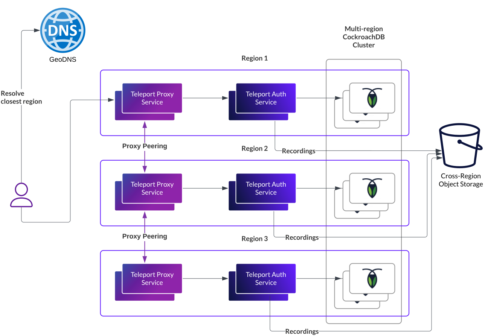

## Introduction

This page describes how to deploy a Teleport cluster in multiple regions to
improve resiliency and sustain regional failure. This page is not a step-by-step
guide but a blueprint on how to build a multi-region Teleport cluster. This
blueprint must be adapted to work with your specific infrastructure and network
constraints.

## Important considerations

Before continuing, you must acknowledge the following warnings:

- This setup is not required for most Teleport users and customers.
  Single-region multi-zone deployments provide the best availability/cost ratio.
  For example, AWS SLAs are 99.99% for both dynamoDB and EC2.
- This blueprint relies on many complex components. If you don't have the team
  capacity and expertise to deploy and maintain such components, you might end
  up with a lower availability than a single-region multi-zone setup.
- You are responsible for deploying and maintaining the Teleport dependencies
  including the database, object storage, container runtime, network plugins, ...

<Admonition type="tip">

For teams with limited bandwidth who need multi-region clusters, Teleport Cloud
offers cross-region clusters so you can benefit from the setup described in this
document without the operational costs and complexity.

</Admonition>

## Architecture overview

A multi-region Teleport deployment is composed of several regional Teleport
deployments using a multi-region backend, with Proxy Peering to allow users to
access resources from a different region. The recommended multi-region backend
is the CockroachDB backend available in Teleport Enterprise.



To run a multi-region Teleport deployment, you must have:

- **3 regions**. Teleport only needs 2, but CockroachDB needs 3 for its quorum mechanism.
- Teleport Proxy Service instances which are able to dial each other by IP address.
  This means you have **cross-region Pod/Instance connectivity**. This is typically
  achieved with VPC peering and/or service mesh.
- A **multi-region object storage** for session recordings.
- **GeoDNS** to route users and Teleport agents to the closest Teleport cluster.
- A **multi-region CockroachDB cluster**. You can use the CockroachDB core
  features but optimal performance and fault-tolerance is achieved by using the
  multi-region features from CockroachDB Enterprise.

## Implementing multi-region Teleport on Kubernetes

Teams with Kubernetes infrastructure will want to host Teleport in Kubernetes.
This section presents a more detailed setup description.

### Teleport Dependencies

- Create 3 peered regional VPCs (on AWS) or 1 global VPC (on GKE).
- Create 1 Kubernetes cluster in each region, **Pod CIDRs must not overlap**.
- Ensure pod mesh connectivity. The setup will vary based on your network and
  CNI plugin configuration:
    - If pods are using the native network layer (GKE, AWS vpc-cni addon, ...)
      you can rely on pure VPC peering, routing and firewall capabilities to
      connect pods from each Kubernetes clusters.
    - If pods are given non-native IP addresses, you can use the Cilium
      cluster-mesh capabilities to connect your pods. They
      provide [a step-by-step guide on how to mesh clusters](https://docs.cilium.io/en/stable/network/clustermesh/clustermesh/).
- Set up a multi region object storage:
    - on GCP, GCS has a multi-region location
    - on-prem, MinIO supports [multi-site bucket replication](https://min.io/docs/minio/linux/administration/bucket-replication/enable-server-side-multi-site-bucket-replication.html)
    - on AWS, you can [set up two-way-replication](https://docs.aws.amazon.com/AmazonS3/latest/userguide/mrap-create-two-way-replication-rules.html)
      between S3 buckets.
- Setup a CockroachDB multi-region cluster
  - On EKS and GKE you can follow [the CockroachDB documentation](https://www.cockroachlabs.com/blog/secure-multi-cluster-cockroachdb-calico-clustermesh/)
  - For other Kubernetes variants, you can adapt the instructions from [the CockroachDB EKS guide](https://www.cockroachlabs.com/docs/stable/orchestrate-cockroachdb-with-kubernetes-multi-cluster?filters=eks).

### Teleport backend configuration

Create Teleport databases and user in CockroachDB:
  ```sql
  CREATE DATABASE teleport_backend;
  CREATE DATABASE teleport_audit;
  CREATE USER teleport;
  GRANT CREATE ON DATABASE teleport_backend TO teleport;
  GRANT CREATE ON DATABASE teleport_audit TO teleport;
  SET CLUSTER SETTING kv.rangefeed.enabled = true;
  ```

Then sign a certificate for the `telpeort` user
with [the `cockroach certs` command](https://www.cockroachlabs.com/docs/stable/cockroach-cert).

You must end up with 3 files:
- `client.teleport.crt`
- `client.teleport.key`
- `ca.crt`

<Tabs>
<TabItem label="CockroachDB core">
On CockroachDB core you must declare the physical regions as CockraochDB
zones and configure zonal fault tolerance on the Teleport databases.

```sql
ALTER DATABASE teleport_backend SURVIVE ZONE FAILURE;
ALTER DATABASE teleport_audit SURVIVE ZONE FAILURE;
```

</TabItem>
<TabItem label="CockroachDB enterprise">
For CockroachDB enterprise you must declare both zones and regions to
CockroachDB and configure regional fault tolerance on the database.

```sql
ALTER DATABASE teleport_backend SET PRIMARY REGION <region1>;
ALTER DATABASE teleport_backend ADD REGION IF NOT EXISTS <region2>;
ALTER DATABASE teleport_backend SET SECONDARY REGION <region2>;
ALTER DATABASE teleport_backend SURVIVE REGION FAILURE;

ALTER DATABASE teleport_audit SET PRIMARY REGION <region1>;
ALTER DATABASE teleport_audit ADD REGION IF NOT EXISTS <region2>;
ALTER DATABASE teleport_audit SET SECONDARY REGION <region2>;
ALTER DATABASE teleport_audit SURVIVE REGION FAILURE;
```
</TabItem>
</Tabs>


### Deploying Teleport

Once all Teleport dependencies are set up, you can deploy Teleport via the
`teleport-cluster` Helm chart. You need to create one release per Kubernetes cluster.
The values for a specific region look like:

```yaml
chartMode: standalone
clusterName: teleport-multi-region.example.org
persistence:
  enabled: false
enterprise: true

auth:
  teleportConfig:
    # Configure CockroachDB
    teleport:
      storage:
        type: cockroachdb
        # regional CockraochDB URL, if you followed the Cockroach docs it looks like
        # cockroachdb-public.<region>.svc.cluster.local
        conn_string: postgres://teleport@cockroachdb-public.<region>.svc.cluster.local:26257/teleport_backend?sslmode=verify-full&pool_max_conns=20
        audit_events_uri:
          - "postgres://teleport@cockroachdb-public.<region>.svc.cluster.local:26257/teleport_audit?sslmode=verify-full"
        # replace this with the URI of your regional object storage (S3, GCS, MinIO)
        audit_sessions_uri: "uri://to-your-regional-bucket"
        ttl_job_cron: '*/20 * * * *'
    
    # Configure proxy peering
    auth_service:
      tunnel_strategy:
        type: proxy_peering
        agent_connection_count: 2

  # Mount the CockroachDB certs and have Teleport use them (via default env vars)
  extraVolumes:
    - name: db-certs
      secret:
        secretName: cockroach-certs
  extraVolumeMounts:
    - name: db-certs
      mountPath: /var/lib/db-certs
      readOnly: true
  extraEnv:
    - name: PGSSLROOTCERT
      value: /var/lib/db-certs/ca.crt
    - name: PGSSLCERT
      value: /var/lib/db-certs/client.teleport.crt
    - name: PGSSLKEY
      value: /var/lib/db-certs/client.teleport.key

# Pass the TLS certificate use by the proxy
# This can be omitted if you use cert-manager and set `highAvailability.certManager`
tls:
  existingSecretName: proxy-cert

highAvailability:
  replicaCount: 2
```

### GeoDNS Setup

Finalize the deployment by setting up GeoDNS to route the users to the closest
Teleport deployment. The setup will differ from one DNS provider to another. Use
short TTLs to ensure you can quickly steer traffic off a region if needed.

When possible, configure healthchecks on `/v1/webapi/ping` so a broken/faulty
Teleport region is automatically removed from the DNS records and users are
routed to the closest working Teleport deployment.

## Update strategy

Updating Teleport on multi-region setups poses several challenges.
Strictly following Teleport compatibility guarantees requires downscaling to a
single auth before updating. In a multi region setup, this requires:

- relying on a single region for auth during the udpate
- suspending two regions, ot allowing proxies to connect to auths from a
  different region (this is not the case by default and requires a Cilium
  cross-cluster service and a custom join token for the Proxy Service).

<Admonition type="note">

    It's possible to do Auth rolling updates. In such case, multiple auth
    versions might be running concurrently. Newly introduced resource fields
    might not be properly set until all auth are rolled out.

    This consistency/usability tradeoff can be acceptable if the rollout period
    is short and the version difference is minimal.

</Admonition>
