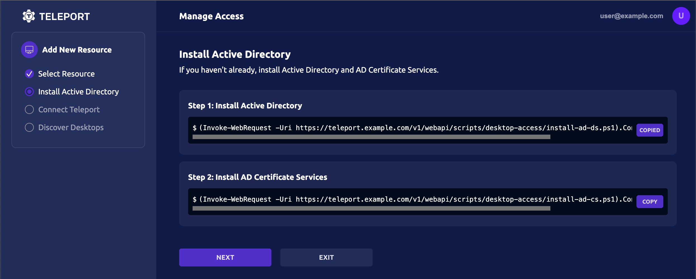

This guide demonstrates how to use scripts available in the Teleport Web UI to configure 
Teleport and Active Directory for passwordless access to Windows computers.

You should note that Teleport requires the Kerberos authentication protocol to support 
certificate-based authentication for Active Directory. Because Azure Active Directory
doesn't use Kerberos, you can't use the Teleport Windows Desktop Service for 
Azure Active Directory.

## Prerequisites

- Access to a running Teleport cluster, `tctl` admin tool, and `tsh` client tool 
  version >= (=teleport.version=). 
  
  You can verify the tools you have installed by running the following commands:

  ```code
  $ tctl version
  # Teleport Enterprise v(=teleport.version=) go(=teleport.golang=)
  
  $ tsh version
  # Teleport v(=teleport.version=) go(=teleport.golang=)
  ```

  You can download these tools by following the appropriate [Installation 
  instructions](../installation.mdx#linux) for your environment 
  and Teleport edition.

- A server or virtual machine running the Windows Server operating system on which you can
  install Active Directory services.

- A Linux host to run the Teleport Windows Desktop Service.
  You can use an existing server that runs the Teleport agent for other resources.

## Step 1/3. Install and configure Active Directory

The Teleport Web UI provides scripts to automate the configuration of Active Directory
for the Teleport Windows Desktop Service. From the Teleport Web UI, you can 
download the following scripts to convert a Windows Server into an Active Directory
domain controller:

- The Active Directory installation script adds basic Active Directory services and tools to the 
  Windows Server.
- The Active Directory Certificate Services installation script adds a certificate authority and 
  certificate management services to the domain controller.
- The Active Directory configuration script generates Teleport configuration settings for your specific
  cluster.

Installing Active Directory Certificate Services is optional. However, Teleport requires secure LDAP 
connections for certificate-based authentication, and LDAP traffic is not encrypted by default. 
To provide secure LDAP connections (LDAPS), you must have a certificate authority that issues properly 
formatted and encrypted certificates. You can install Active Directory Certificate Services on the 
domain controller to ensure that the domain issues certificates configured for LDAPS. 

If you already have Active Directory installed and the domain is configured for encrypted LDAPS
communication, you can skip running the first two scripts.

To install Active Directory services:

1. Sign in to the Teleport Web UI using your Teleport cluster address.

1. Select **Resources**.

1. Click **Enroll New Resource**.

1. Click **Active Directory** to start the guided enrollment.

1. Copy the first command from the Teleport Web UI and paste it into the Windows PowerShell 
   console on your Windows Server host.

   

   Follow the prompts displayed to set the domain name and password for the administrative account.
   Wait for the script to complete and the Windows computer to restart before continuing.

1. Copy the second command from the Teleport Web UI and paste it into the Windows PowerShell 
   console on your Windows Server host.
   
   Wait for the script to complete and the Windows computer to restart before continuing.

1. Click **Next**, then click **Copy** to copy the Active Directory configuration script from 
   the Teleport Web UI and paste it into the Windows PowerShell console on your Windows Server host.

   The script generates Teleport configuration settings, including an authentication token for
   joining the Teleport cluster.
   
1. Click **Next** in the Teleport Web UI to view the Teleport configuration settings.

1. Copy the PowerShell script output from the PowerShell console to a temporary file, and save the
   file in a location you can access from your administrative workstation.
   
   After you have saved the configuration settings, click **Next** in the Teleport Web UI.

## Step 2/3. Install the Teleport Windows Desktop Service

To install the Windows Desktop Service:

1. Open a terminal shell on the Linux host where you want to run the Windows Desktop Service.

1. Create a file called `/etc/teleport.yaml` and paste the configuration output generated by the
   PowerShell script you ran previously.
   
   If you would like to run the Windows Desktop Service from a Teleport instance
   that is already running other services, copy and paste only the `windows_desktop_service` section.
   
   You should have a configuration file similar to the following:
   
   ```yaml
   version: v3
   teleport:
     auth_token: (=presets.tokens.first=)
     proxy_server: teleport.example.com:443
   
   auth_service:
     enabled: no
   ssh_service:
     enabled: no
   proxy_service:
     enabled: no
   
   windows_desktop_service:
     enabled: yes
     ldap:
       addr: '10.10.1.50:636'
       domain: 'windows.teleport.example.com'
       username: 'WIN\svc-teleport'
       sid:  'S-1-5-21-1234567890-1234567890-1234567890-1111'
       server_name: 'windows-server-hostname'
       # insecure_skip_verify prevents Teleport from authenticating the LDAP CA
       # against the systems trust store.
       insecure_skip_verify: false
       ldap_ca_cert: |
         -----BEGIN CERTIFICATE-----
         MIIDnzCCAoegAwIBAgIQT/UIn+MT4aZC9ix/QuiV9zANBgkqhkiG9w0BAQsFADBi
         ...
         31qA4dO3if7RdikD9hVbiIF9jQ==
         -----END CERTIFICATE-----
   
     discovery:
       base_dn: '*'
     labels:
       teleport.internal/resource-id: 42d8859c-60d0-4d7f-9767-bdd66b63fce6
   ```

1. Install the Teleport Windows Desktop Service on your Linux host.

   (!docs/pages/includes/install-linux.mdx!)

## Step 3/3. Start Teleport

After you've saved the `/etc/teleport.yaml` configuration file, you can start Teleport 
on the Linux host.

To start Teleport:

1. (!docs/pages/includes/start-teleport.mdx service="the Teleport Desktop Service"!)
1. Wait for Teleport to discover the new instance and enroll it in the cluster, 
   then click **Next** in the Teleport Web UI.
1. Click **Finish**, then click **Resources** to see your domain computers.

## Next steps

If you encounter any issues, see [Troubleshooting](./troubleshooting.mdx) for common problems and
solutions.
For information about configuring Windows-specific role permissions, see 
[Role-Based Access Control for Desktops](./rbac.mdx).
