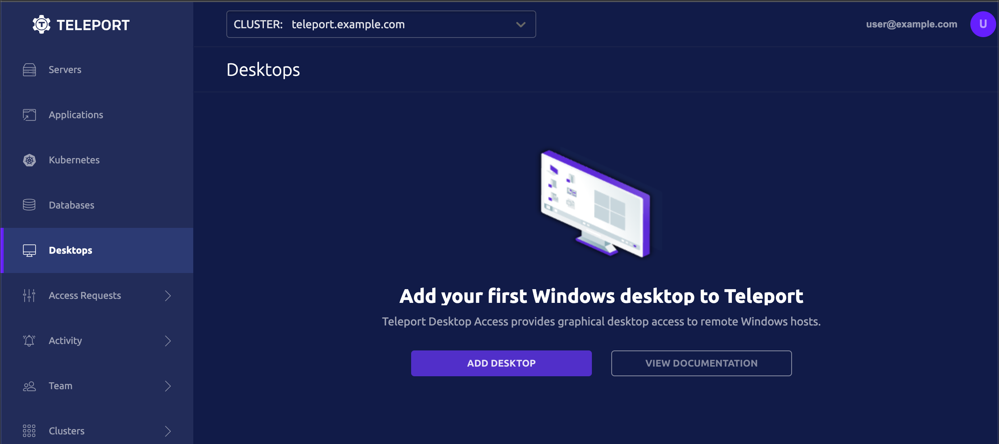

<Details
  title="Version warning"
  opened={true}
  scope={["oss", "enterprise"]}
  scopeOnly={true}
  min="11"
>

The features documented on this page are available in Teleport `11` and higher.

</Details>

This page docments the Teleport Desktop Access Discovery wizard. This feature, available through the Web UI, makes it easy to create a Windows Active Directory and configure it to accept Desktop Access connections from Teleport.

## Prerequisites

- A server or virtual machine running a Windows Server operating system.
- A host where you will run the Teleport Desktop Service.
- <ScopedBlock scope={["oss", "enterprise"]}> This **can not** be the same instance
  of Teleport running your Auth and/or Proxy service(s). To install Desktop Access into an existing Teleport instance running other services, see the [Getting Started](getting-started.mdx) guide for Desktop Access.</ScopedBlock>

  See [Installation](../../installation.mdx) for details.

## Step 1/2. Install Teleport

### Set up the Teleport Auth and Proxy Services

(!docs/pages/includes/database-access/start-auth-proxy.mdx!)

## Step 2/2. Run the discovery wizard

In your web browser, access the teleport Web UI at <ScopedBlock scope={["oss", "enterprise"]}>`teleport.example.com`</ScopedBlock><ScopedBlock scope={["cloud"]}>`mytennant.teleport.sh`</ScopedBlock>. Select "Desktops" from the main menu, then **ADD DESKTOP**:



This will bring you to the "Add New Resorces" menu. "Desktop" will already be selected. Click **NEXT**.

Teleport provides three commands that you can run to perform starts of the set up process. Which commands you need to run depends on what is already configured.

1. Install Active Directory. Skip this step if Active Directory is already running.
2. Install AD Certificate Services. Skip this step if AD CS is already running.
3. Configure AD for Teleport. This step should always be run.


Once the server is restarted from one or both command executions, click **NEXT**.

Copy and paste the provided command into a Windows Powershell window to download and run the 'configure Active Directory' script:


Click **NEXT**.

The Powershell script will output a Teleport configuration block. Copy this block to a temporary location. Click **Next**.

On the Linux host where you intend to run the Teleport Windows Desktop Service, paste the configuration provided by the output of the previous step in a file called `/etc/teleport.yaml`.

```yaml
version: v3
teleport:
  auth_token: 2239...c5b21
  proxy_server: teleport.example.com:443

auth_service:
  enabled: no
ssh_service:
  enabled: no
proxy_service:
  enabled: no

windows_desktop_service:
  enabled: yes
  ldap:
    addr:     'System.Object&, mscorlib, Version=4.0.0.0, Culture=neutral, PublicKeyToken=b77a5c561934e089 Address(int ):636'
    domain:   'windows.teleport.example.com'
    username: 'WIN\svc-teleport'
    server_name: 'System.Object[]'
    insecure_skip_verify: false
    ldap_ca_cert: |
        -----BEGIN CERTIFICATE-----
        MIIDnzCCAoegAwIBAgIQT/UIn+MT4aZC9ix/QuiV9zANBgkqhkiG9w0BAQsFADBi
        ...
        31qA4dO3if7RdikD9hVbiIF9jQ==
        -----END CERTIFICATE-----

  discovery:
    base_dn: '*'
  labels:
    teleport.internal/resource-id: 42d8859c-60d0-4d7f-9767-bdd66b63fce6
```

Click **Next**.

Once you've saved `/etc/teleport.yaml`, start Teleport:

<Tabs>
<TabItem label="System Service">

This command assumes the `root` user. Prepend `sudo` otherwise.

```code
$ systemctl start teleport.service
```

</TabItem>
<TabItem label="Standalone Binary">

From the directory containing the Teleport binary:

```code
$ ./teleport start --config=/etc/teleport.yaml
```

</TabItem>
</Tabs>

The access wizard will detect when the new Teleport instance has joined the cluster, and you can then click **Next**.

Teleport will discover available Windows desktops in the domain, and list them under **Desktops**. Click **Finish** then **BROWSE EXISTING RESOURCES** to see them:


## Troubleshooting

If you hit any issues, check out the
[Troubleshooting documentation](./troubleshooting.mdx) for common problems and
solutions.
