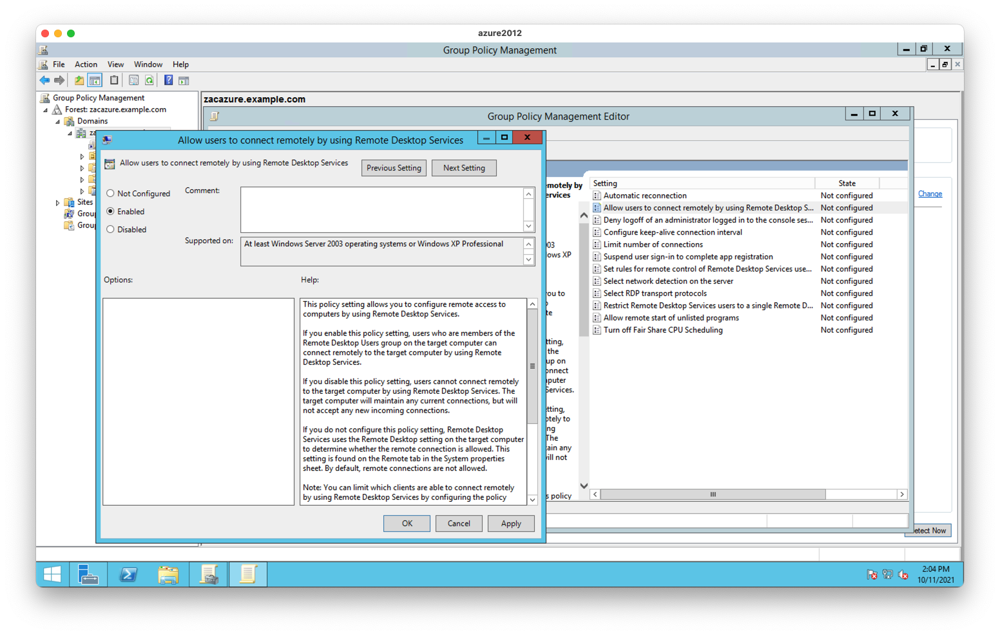

<Admonition
  type="warning"
  title="Warning"
>
  Desktop Access is currently in Preview. Do not use this feature for any critical
  infrastructure and keep a backup option for accessing your desktop hosts.
</Admonition>

# Getting Started

In this guide we will connect an Active Directory domain to Teleport using
Desktop Access and log into a Windows desktop from that domain.

## Prerequisites

This guide requires you to have:

- An Active Directory domain, configured for LDAPS (Teleport requires an encrypted LDAP connection)
- Access to a Domain Controller
- LDAP credentials for Active Directory (usually the same credentials you use
  to log into the Domain Controller)
- An existing Teleport cluster and user, version 8.0 or newer
  - see [Teleport Getting Started](../getting-started.mdx) if you're new to Teleport
- A Linux server to run the Teleport Desktop Access service on
  - you can reuse an existing server running any other Teleport instance

## Step 1/3. Configure Teleport

<Admonition
  type="note"
  title="Teleport CA"
>
  Prior to v8.0, the Teleport CA was not compatible with Windows logins. If
  you're setting up Desktop Access in an existing cluster created before v8.0,
  you must first perform a [CA rotation](../setup/operations/ca-rotation.mdx)
  in order to resolve this.
</Admonition>

First, we need to enable Desktop Access in Teleport. To do this, add the
following section in `teleport.yaml` on your Linux server:

```yaml
windows_desktop_service:
  enabled: yes
  # This is the address that windows_desktop_service will listen on.
  listen_addr: "0.0.0.0:3028"
  # (optional) This is the address that windows_desktop_service will advertise
  # to the rest of Teleport for incoming connections. Only proxy_service should
  # connect to windows_desktop_service, users connect to the proxy's web UI
  # instead.
  public_addr: "desktop-access.example.com:3028"
  ldap:
    # Address of the Domain Controller for LDAP connections. Usually, this
    # address will use port 389, like: domain-controller.example.com:389.
    addr:     '$LDAP_SERVER_ADDRESS'
    # Active Directory domain name you are connecting to.
    domain:   '$LDAP_DOMAIN_NAME'
    # LDAP username for authentication. This username must include the domain
    # NetBIOS name.
    #
    # For example, if your domain is "example.com", the NetBIOS name for it is
    # likely "EXAMPLE". When connecting as the "Administrator" user, you should
    # use the format: "EXAMPLE\Administrator".
    username: '$LDAP_USERNAME'
    # Plain text file containing the LDAP password for authentication.
    # This is usually the same password you use to login to the Domain Controller.
    password_file: /var/lib/ldap-pass
```

After updating `teleport.yaml`, start Teleport as usual using `teleport start`.

## Step 2/3. Configure Group Policy to allow Teleport connections

{/* TODO: script this using PowerShell */}

Next, we need to configure Active Directory to trust Teleport for user
authentication and allow the certificate-based mechanism that Teleport uses under the hood
(smart cards).

Get the Teleport user CA certificate:

```
$ tctl auth export --type=windows > user-ca.cer
```

Transfer the `user-ca.cer` file to your Domain Controller.

Log into your Domain Controller open "Start" menu and run "Group Policy
Management". On the left pane, navigate to `$FOREST > Domains > $DOMAIN`,
selecting your forest and domain names respectively. Right click on "Default
Domain Policy" and select "Edit...".

### Import Teleport CA

In the group policy editor, select:

```text
Computer Configuration > Policies > Windows Settings > Security Settings > Public Key Policies
```

Right click on `Trusted Root Certification Authorities` and select `Import`.
Click through the wizard, selecting your CA file.

<Figure align="left" bordered caption="Import Teleport CA">
  
</Figure>

### Allow remote RDP connections

Next, select:

```text
Computer Configuration > Policies > Administrative Templates > Windows Components > Remote Desktop Services > Remote Desktop Session Host > Connections
```

Right click on `Allow users to connect remotely by using Remote Desktop
Services` and select "Edit". Select "Enable" and "OK".

<Figure align="left" bordered caption="Enable Remote Desktop Services">
  
</Figure>


Select:

```text
Computer Configuration > Policies > Administrative Templates > Windows Components > Remote Desktop Services > Remote Desktop Session Host > Security
```

Right click `Require user authentication for remote connections by using
Network Level Authentication`, edit, select **"Disable"** and "OK".

### Enable the Smart Card service

Teleport performs certificate based authentication by emulating a smart card.
To enable the smart card service, select:

```text
Computer Configuration > Policies > Windows Settings > Security Settings > System Services
```

Double click on `Smart Card`, select `Define this policy setting` and switch to
`Automatic`. Click "OK".

<Figure align="left" bordered caption="Enable the Smart Card Service">
  
</Figure>


### Open firewall to inbound RDP connections

Finally, select:

```text
Computer Configuration > Policies > Windows Settings > Security Settings > Windows Firewall and Advanced Security
```

Right click on `Inbound Rules` and select `New Rule...`. Under `Predefined`
select `Remote Desktop`. Only select the rule for `User Mode (TCP-in)`. On the
next screen, select `Allow the connection` and finish.

## Step 3/3. Log in using Teleport

{/* TODO: add screenshots */}

At this point everything should be ready for Desktop Access connections. Open
the Teleport web UI and log in.

On the left pane, select `Desktops`. You should see the list of all computers
and Domain Controllers connected to your domain. Select one and click `CONNECT`
on the right.

A new tab will open and, after a few seconds, you should be logged in to your
target Windows host.

## Troubleshooting

If you hit any issues, check out the [Troubleshooting documentation](./troubleshooting.mdx)
for common problems and solutions.
