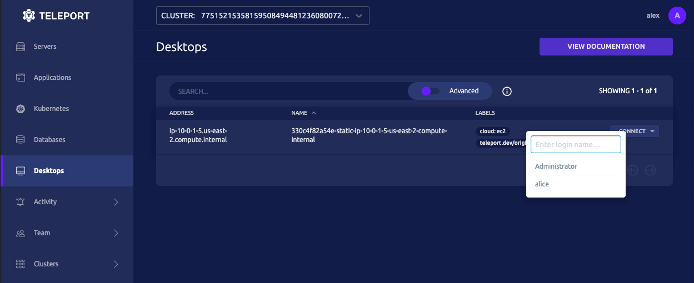

This guide will help you configure Teleport to provide secure, passwordless access
to Windows desktops. This configuration does not require an Active Directory domain.

<Admonition type="note">
Passwordless access for local users is an Enterprise-only feature.

For open source Teleport, consider integrating Teleport with Active Directory
for automatic discovery by reading [Desktop Access with Active Directory](./active-directory.mdx).

Teleport Enterprise users can also mix the Teleport Active Directory integration
with the static host definitions described below.
</Admonition>

<Details
  title="Version warning"
  opened={true}
  scope={["oss", "enterprise"]}
  scopeOnly={true}
  min="12.0"
>
Passwordless access for local users is available starting from Teleport `v12`.
Previous versions of Teleport can implement Windows Access by integrating with
an [Active Directory domain](./active-directory.mdx).
</Details>

## Prerequisites

(!docs/pages/includes/commercial-prereqs-tabs.mdx!)

- A Linux server to run the Teleport Desktop Service on.
  You can reuse an existing server running any other Teleport instance.
- A server or virtual machine running a Windows operating system with
  Remote Desktop enabled and the RDP port available to the Linux server.
- (!docs/pages/includes/tctl.mdx!)

## Step 1/4. Prepare Windows

In this section we'll import the Teleport certificate authority (**CA**) file
to your Windows system, and prepare it for passwordless access through Teleport.

### Import the Teleport root certificate

Export the Teleport user certificate authority by running the following from
`cmd.exe` on your Windows system:

```code
$ curl -o teleport.cer https://teleport-proxy.example.com/webapi/auth/export?type=windows
```

### Install the Teleport service for Windows

From the Windows system, download the [Teleport Windows Auth
Setup](https://cdn.teleport.dev/teleport-windows-auth-setup-v(=teleport.version=)-amd64.exe).
Run the installer. When prompted, select the Teleport certificate file from the previous step.
Once complete, reboot the system.

<Admonition type="tip" title="Headless Installation">
The Teleport Windows Auth Setup can be run in a shell environment with elevated
privileges. You can use this to automate installation, uninstallation, and
certificate updates. The following command will install the Teleport Certificate,
load the required DLL, disable NLA, and reboot the Windows machine:

```code
$ teleport-windows-auth-setup.exe install --cert=teleport.cer -r
Teleport Authentication Package installed
```

Use the `--help` flag to learn more.

</Admonition>

## Step 2/4. Install the Teleport Desktop Service

On your local system, authenticated to your Teleport cluster, generate a
short-lived join token:

```code
$ tctl tokens add --type=windowsdesktop
The invite token: (=presets.tokens.first=)
This token will expire in 60 minutes.

This token enables Desktop Access.  See https://goteleport.com/docs/desktop-access/
for detailed information on configuring Teleport Desktop Access with this token.
```

Copy the token to the Linux host where you will run the Desktop service as `/tmp/token`.

(!docs/pages/includes/install-linux.mdx!)

Create `/etc/teleport.yaml` and configure it for desktop access. Update the `proxy_server`
value to your Teleport proxy service or cloud tenant, and put the Windows machine address
under `non_ad_hosts`:

```yml
version: v3
teleport:
  nodename: windows.teleport.example.com
  proxy_server: teleport-proxy.example.com:443
  auth_token: /tmp/token
windows_desktop_service:
  enabled: yes
  non_ad_hosts:
    - 192.0.2.156
auth_service:
  enabled: no
proxy_service:
  enabled: no
ssh_service:
  enabled: no
```

Note that without Active Directory, Teleport cannot automatically discover your
Desktops. Instead you must define the Windows systems configured for access through
Teleport in your config file, or use Teleport's [API](../api/introduction.mdx)
to build your own integration. An example API integration is available on
[GitHub](https://github.com/gravitational/teleport/tree/master/examples/desktop-registration).

<Details title="Add labels to hosts">
You can attach labels to your Windows hosts by matching to their hostnames.
For example, to add the `cloud: ec2` label to hosts with EC2 private IP DNS names:

```diff
version: v3
teleport:
  nodename: windows.teleport.example.com
  proxy_server: teleport-proxy.example.com:443
windows_desktop_service:
  enabled: yes
  non_ad_hosts:
-    - 192.0.2.156
+    - ip-192-0-2-156.us-east-2.compute.internal
+ host_labels:
+    - match: '.*\.us-east-2.compute.internal'
+      labels:
+        cloud: ec2
auth_service:
  enabled: no
proxy_service:
  enabled: no
ssh_service:
  enabled: no
```

</Details>

(!docs/pages/includes/start-teleport.mdx service="the Teleport Desktop Service"!)

## Step 3/4. Configure Windows access

In order to gain access to a remote desktop, a Teleport user needs to have the
appropriate permissions for that desktop.

Create the file `windows-desktop-admins.yaml`:

```yaml
kind: role
version: v6
metadata:
  name: windows-desktop-admins
spec:
  allow:
    windows_desktop_labels:
      "*": "*"
    windows_desktop_logins: ["Administrator", "alice"]
```

You can restrict access to specific hosts by defining values for
`windows_desktop_labels`, and adjust the array of usernames this role has access
to in `windows_desktop_logins`.

<Admonition type="warning" title="RBAC Configuration">
Ensure that each Teleport user is only assigned Windows logins that they should
be allowed to access.
</Admonition>

Apply the new role to your cluster:

```code
$ tctl create -f windows-desktop-admins.yaml
```

(\!docs/pages/includes/add-role-to-user.mdx role="windows-desktop-admins" \!)

## Step 4/4. Connect

You can now connect to your Windows desktops from the Teleport Web UI:



## Next Steps

- See the [RBAC page](./rbac.mdx) for more information about setting up
Windows desktop access permissions.
- See the [Access Controls Getting Started](../access-controls/getting-started.mdx#step-13-add-local-users-with-preset-roles)
guide for instructions on how to create or update a user with a given role.
