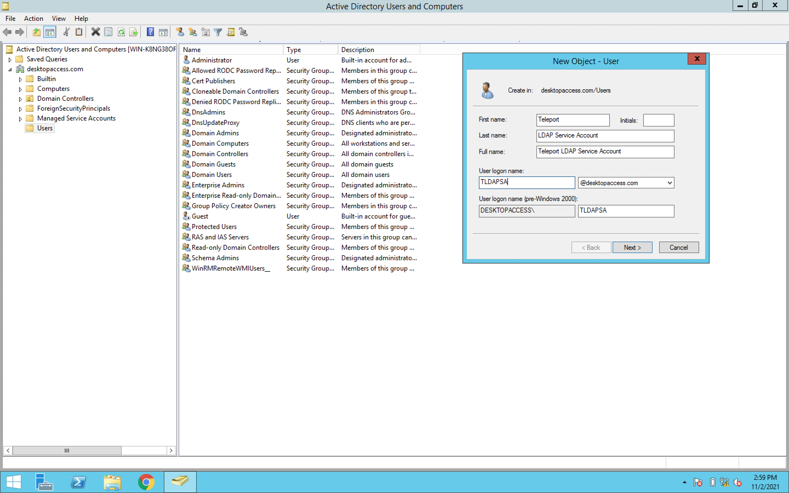
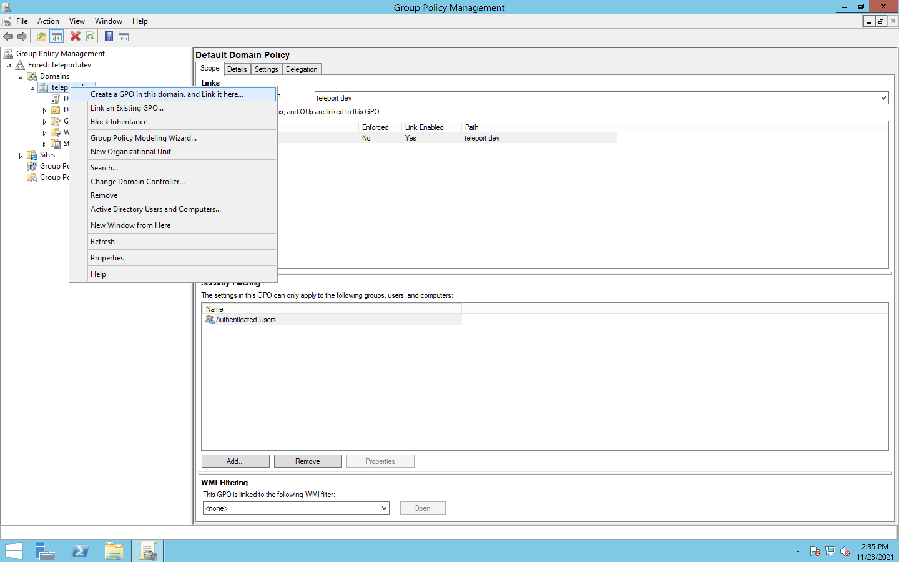
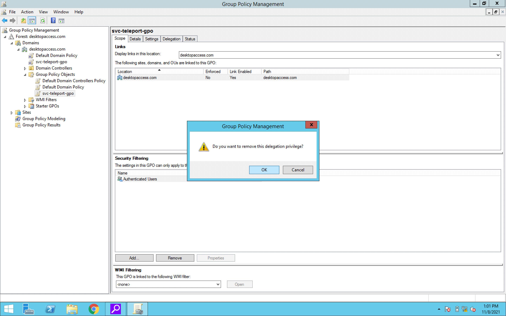
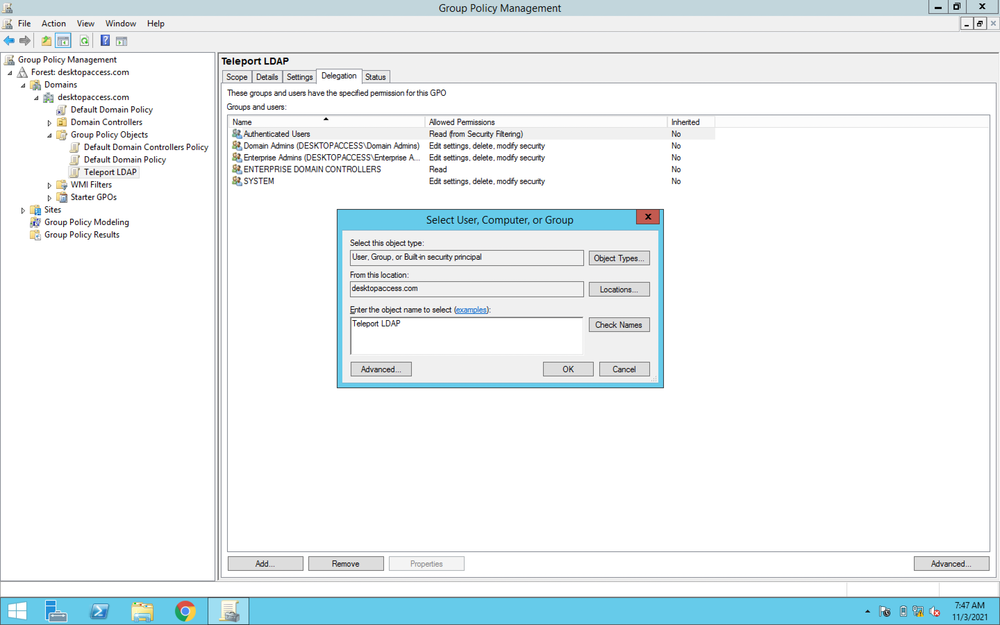

<Admonition
  type="warning"
  title="Warning"
>
  Desktop Access is currently in Preview. Do not use this feature for any critical
  infrastructure and keep a backup option for accessing your desktop hosts.
</Admonition>

# Getting Started

In this guide we will connect an Active Directory domain to Teleport using
Desktop Access and log into a Windows desktop from that domain.

## Prerequisites

This guide requires you to have:

- An Active Directory domain, configured for LDAPS (Teleport requires an encrypted LDAP connection)
- Access to a Domain Controller
- An existing Teleport cluster and user, version 8.0 or newer
  - See [Teleport Getting Started](../getting-started.mdx) if you're new to Teleport
- A Linux server to run the Teleport Desktop Access service on
  - You can reuse an existing server running any other Teleport instance

## Step 1/6: Create a User, Group, and Group Policy Object

Teleport requires a service account to connect to your Active Directory domain. We recommend creating a dedicated service account with restrictive permissions
(described below) for maximal security.

### Create a User and Group

From the start menu of your Domain Controller, search for “Active Directory Users and Computers” and open the corresponding program.

Find your domain in the side menu, and right click the container you want the service account to live in (typically Users). From the context
menu, select `New > User` and fill out the fields for your Teleport LDAP Service Account. For the "User logon name" field, you can use `svc-teleport`
On the password screen, unselect  “User must change password at next login” and select “Password never expires”. Make a note of what values you put
for user logon name and password, which will be used in your `teleport.yaml` configuration file later, and then click through the rest of the wizard.

<Admonition
  type="note"
  title="Default User Permissions"
>
  By default, domain users have Read and List permissions throughout Active Directory. If you have configured
  any restrictions to Domain Users, you may have to adjust which groups this account is a member of.
</Admonition>

<Figure align="left" bordered caption="Create Service Account">
  
</Figure>

Now right click the same container you did before, and select `New > Group`. Choose a Group name like `svc-teleport-group` and ensure that “Global”
is selected for “Group scope”, and “Security” for “Group type”, then hit "OK". Make note of the Group name you chose, as it will
be used later for the PowerShell variable `$TeleportLDAPGroupName`.

Finally, add the User to the Group you just made by right clicking the User and selecting `Add to group`. Type the name of the Group, and confirm correctness
by clicking the “Check Names” button, then click “OK”. You should see a dialog saying “The Add to Group operation was successfully completed.”

### Create and Apply Group Policy Object

Next, open the "Start" menu and run "Group Policy Management". On the left pane, navigate to `$FOREST > Domains > $DOMAIN`,
selecting your forest and domain names respectively. Right click `$DOMAIN` and select `Create a GPO in this domain, and Link it here...` from the context menu.
Give your GPO a name like `svc-teleport-gpo` and ensure "(none)" is selected for "Source Starter GPO", then hit "OK".

<Figure align="left" bordered caption="Create and Link GPO">
  
</Figure>

Now, in the left pane navigate to `$FOREST > Domains > $DOMAIN > Group Policy Objects` and click on the GPO you just created (`svc-teleport-gpo`). In the "Scope" tab
under "Security Filtering", select `Authenticated Users` and then click the "Remove" button and hit "OK".

<Figure align="left" bordered caption="Remove Authenticated">
  
</Figure>

The "Remove" step prevents the GPO from being applied to all authenticated users in this domain, since we only want it to apply to members
of the security Group created above (`svc-teleport-group`), of which only the User created above is a member (`svc-teleport`).

To make that the case, in the same "Security Filtering" pane select "Add...", and enter the name of the Group (`svc-teleport-group`)
in the resultant popup, clicking "Check Names" to confirm the spelling before pressing "OK". After this step, only the `svc-teleport-group`
should be displayed in the "Security Filtering" pane:

<Figure align="left" bordered caption="Apply GPO">
  
</Figure>

## Step 2/6. Configure Group Policy to allow Teleport connections

{/* TODO: script this using PowerShell */}

Next, we need to configure our Group Policy Object to trust Teleport for user
authentication and allow the certificate-based mechanism that Teleport uses under the hood
(smart cards).

<Admonition
  type="note"
  title="Requires Existing Cluster"
>
  The following step requires an existing cluster. If you don't already have a Teleport cluster up and running,
  see our general [Getting Started](https://goteleport.com/docs/getting-started/) guide.
</Admonition>

Get the Teleport user CA certificate by running:

```
$ tctl auth export --type=windows > user-ca.cer
```

Transfer the `user-ca.cer` file to your Domain Controller.

Then, on your Domain Controller, again open the "Group Policy Management" window. On the left pane, navigate to
`$FOREST > Domains > $DOMAIN > Group Policy Objects`, right click on the Group Policy Object you made in step 1 (`svc-teleport-gpo`), and select "Edit...".

### Import Teleport CA

In the group policy editor, select:

```text
Computer Configuration > Policies > Windows Settings > Security Settings > Public Key Policies
```

Right click on `Trusted Root Certification Authorities` and select `Import`.
Click through the wizard, selecting your CA file.

<Figure align="left" bordered caption="Import Teleport CA">
  
</Figure>

### Enable the Smart Card service

Teleport performs certificate based authentication by emulating a smart card.
To enable the smart card service, select:

```text
Computer Configuration > Policies > Windows Settings > Security Settings > System Services
```

Double click on `Smart Card`, select `Define this policy setting` and switch to
`Automatic`. Click "OK".

<Figure align="left" bordered caption="Enable the Smart Card Service">
  
</Figure>

### Open firewall to inbound RDP connections

Select:

```text
Computer Configuration > Policies > Windows Settings > Security Settings > Windows Firewall with Advanced Security (x2)
```

Right click on `Inbound Rules` and select `New Rule...`. Under `Predefined`
select `Remote Desktop`. Only select the rule for `User Mode (TCP-in)`. On the
next screen, select `Allow the connection` and finish.

### Deny interactive login

Select:

```text
Computer Configuration \ Policies \ Windows Settings \ Security Settings \ Local Policies \ User Rights Assignment
```

Double click `Deny log on locally` and in the popup, check "Define these policy settings". Then click "Add User or Group...", "Browse ...", enter the name
of the group you created above (`svc-teleport-group`) and hit "Check Names", select your Group, and then hit "OK" on all the windows. (If the system won't let you hit "OK" after
clicking "Check Names", just hit "Cancel" twice, re-click "Add User or Group", "Browse...", and keep trying again until it does).

Repeat the process from above for `Deny log on through Remote Desktop Services`.

<Figure align="left" bordered caption="Deny Interactive Login">
  
</Figure>


### Allow remote RDP connections

Next, select:

```text
Computer Configuration > Policies > Administrative Templates > Windows Components > Remote Desktop Services > Remote Desktop Session Host > Connections
```

Right click on `Allow users to connect remotely by using Remote Desktop
Services` and select "Edit". Select "Enabled" and "OK".

<Figure align="left" bordered caption="Enable Remote Desktop Services">
  
</Figure>


Select:

```text
Computer Configuration > Policies > Administrative Templates > Windows Components > Remote Desktop Services > Remote Desktop Session Host > Security
```

Right click `Require user authentication for remote connections by using
Network Level Authentication`, edit, select **"Disable"** and "OK".


## Step 3/6. Configure Group to allow Teleport connections

Next, complete the service account's configuration by giving its corresponding Group the minimum necessary permissions for Teleport to work.
First, open a PowerShell terminal and figure out the `$DomainDN` and `$TeleportLDAPGroupName` variables you'll need to use:

`$DomainDN` is the
[distinguished name](https://docs.microsoft.com/en-us/previous-versions/windows/desktop/ldap/distinguished-names) representation of your Domain Controller's
domain name. For example, for the domain name `domain-controller.example.com`, the distinguished name representation is `DC=domain-controller,DC=example,DC=com`.
If you aren't sure, you can get the DN by running `(Get-ADDomain).DistinguishedName` in PowerShell.

`$TeleportLDAPGroupName` is the Group name you defined in step 1.

Run the PowerShell script below, replacing variable values where appropriate.

```powershell
$DomainDN="DC=domain-controller,DC=example,DC=com" # replace this with your Domain Controller's domain
$TeleportLDAPGroupName="svc-teleport-group" # replace this with your Group name if different

# Gives Teleport the ability to create LDAP containers in the CDP container.
dsacls "CN=CDP,CN=Public Key Services,CN=Services,CN=Configuration,$DomainDN" /I:T /G "$($TeleportLDAPGroupName):CC;container;"
# Gives Teleport the ability to create and delete cRLDistributionPoint objects in the CDP/Teleport container.
dsacls "CN=TELEPORT,CN=CDP,CN=Public Key Services,CN=Services,CN=Configuration,$DomainDN" /I:T /G "$($TeleportLDAPGroupName):CCDC;cRLDistributionPoint;"
# Gives Teleport the ability to write the certificateRevocationList property in the CDP/Teleport container.
dsacls "CN=TELEPORT,CN=CDP,CN=Public Key Services,CN=Services,CN=Configuration,$DomainDN " /I:T /G "$($TeleportLDAPGroupName):WP;certificateRevocationList;"
# Gives Teleport the ability to create and delete certificationAuthority objects in the NTAuthCertificates container.
dsacls "CN=NTAuthCertificates,CN=Public Key Services,CN=Services,CN=Configuration,$DomainDN" /I:T /G "$($TeleportLDAPGroupName):CCDC;certificationAuthority;"
# Gives Teleport the ability to write the cACertificate property in the NTAuthCertificates container.
dsacls "CN=NTAuthCertificates,CN=Public Key Services,CN=Services,CN=Configuration,$DomainDN" /I:T /G "$($TeleportLDAPGroupName):WP;cACertificate;"

```

## Step 4/6. Export your Domain Controller's CA Certificate

Teleport connects to your Domain Controller via LDAPS. This means that you must let Teleport know that the certificate sent
by your Domain Controller during the initial SSL connection is trusted. If your Domain Controller's certificate is trusted by
the system repository on the system running Teleport, you can skip this step. Atlernately, if you trust your network, you can
skip LDAPS certificate verification by setting the `insecure_skip_verify` configuration variable to `false`.

### To Export a CA Certificate

{/* Adapted from https://www.ibm.com/docs/it/rds/5.2.1?topic=security-exporting-certificate-from-active-directory-server */}
1. Begin by navigating to `Start > Control Panel > Administrative Tools > Certificate Authority` to open the CA Microsoft Management Console (MMC) GUI.
2. Right click on your CA computer and select "Properties".
3. From "General" tab, click "View Certificate".
4. Select the "Details" view and click "Copy to File".
5. Click "Next" in the Certificate Export Wizard, and ensure that "DER encoded binary X.509 (.CER)" is selected
6. Select a name and location for you certificate and click through the wizard.

Now transfer the exported file to the system where you're running Teleport. You can either add this certificate to your system's
trusted repository or provide the filepath to the `der_ca_file` configuration variable.

## Step 5/6. Configure Teleport

<Admonition
  type="note"
  title="Teleport CA"
>
  Prior to v8.0, the Teleport CA was not compatible with Windows logins. If
  you're setting up Desktop Access in an existing cluster created before v8.0,
  you must first perform a [CA rotation](../setup/operations/ca-rotation.mdx)
  in order to resolve this.
</Admonition>

In order to enable Desktop Access in Teleport, add the
following section in `teleport.yaml` on your Linux server:

```yaml
windows_desktop_service:
  enabled: yes
  # This is the address that windows_desktop_service will listen on.
  listen_addr: "0.0.0.0:3028"
  # (optional) This is the address that windows_desktop_service will advertise
  # to the rest of Teleport for incoming connections. Only proxy_service should
  # connect to windows_desktop_service, users connect to the proxy's web UI
  # instead.
  public_addr: "desktop-access.example.com:3028"
  ldap:
    # Address of the Domain Controller for LDAP connections. Usually, this
    # address will use port 636, like: domain-controller.example.com:636.
    addr:     '$LDAP_SERVER_ADDRESS'
    # Active Directory domain name you are connecting to, like: domain-controller.example.com.
    domain:   '$LDAP_DOMAIN_NAME'
    # LDAP username for authentication. This will be the user logon name you chose for the service
    # account User in step 1 (svc-teleport). This username must include the domain NetBIOS name.
    #
    # For example, if your domain is "example.com", the NetBIOS name for it is
    # likely "EXAMPLE". When connecting as the "svc-teleport" user, you should
    # use the format: "EXAMPLE\svc-teleport".
    #
    # If you are unsure of your NetBIOS name, you can find it by opening a PowerShell command prompt
    # and running:
    # ```
    # (Get-ADDomain).NetBIOSName
    # ```
    username: '$LDAP_USERNAME'
    # Plain text file containing the LDAP password for authentication.
    # This is the same password you chose in step 1.
    password_file: /var/lib/ldap-pass
    # You can skip LDAPS certificate verification by setting
    # this to true. It is recommended that this be set to false
    # and the certificate added your system's trusted repository,
    # or its filepath provided in with the der_ca_file variable below.
    insecure_skip_verify: false
    # DER encoded certificate.
    # This should be the path to the certificate exported in step 4.
    der_ca_file: /path/to/cert
  hosts:
    # DNS entries for any static hosts yRou want to connect to.
    # These are only needed to connect to desktops that aren't covered by the discovery setting below.
    - "100.104.52.89"
    - "example.com"
  discovery:
    # The wildcard '*' character tells Teleport to discover all the hosts in
    # the Active Directory Domain. To refine the search, specify a custom DN.
    base_dn: '*'


```

After updating `teleport.yaml`, start Teleport as usual using `teleport start`.


## Step 6/6. Log in using Teleport

### Create a Teleport User/Role for Desktop Access

{/* TODO: remove the "/ver/8.0/" in the link once these docs are the primary version */}
In order to gain access to a remote desktop, a Teleport user needs to have the appropriate permissions for that desktop.
For example, you can create a role that gives its users access to all windows desktop labels and the `"Administrator"` user:
```yaml
kind: role
version: v4
metadata:
  name: windows-desktop-admins
spec:
  allow:
    windows_desktop_labels:
      "*": "*"
    windows_desktop_logins: ["Administrator"]
```

See the [RBAC section](https://goteleport.com/docs/ver/8.0/desktop-access/reference/#rbac) in the Reference documentation
for more information about setting up windows desktop permissions.

See the Access Controls [Getting Started](https://goteleport.com/docs/access-controls/getting-started/#step-13-add-local-users-with-preset-roles)
guide for instructions on how to create or update a user with a given role.

### Connect to Your Desktop

At this point everything is ready for Desktop Access connections. Open
the Teleport web UI and log in with a user with the role created above.

On the left pane, select `Desktops (preview)`. You should see the list of all computers
and Domain Controllers connected to your domain. Select one and click `CONNECT`
on the right, selecting one of the available logins:

<Figure align="left" bordered caption="Select Desktop">
  
</Figure>

A new tab will open and, after a few seconds, you should be logged in to your
target Windows host.

## Troubleshooting

If you hit any issues, check out the [Troubleshooting documentation](./troubleshooting.mdx)
for common problems and solutions.
