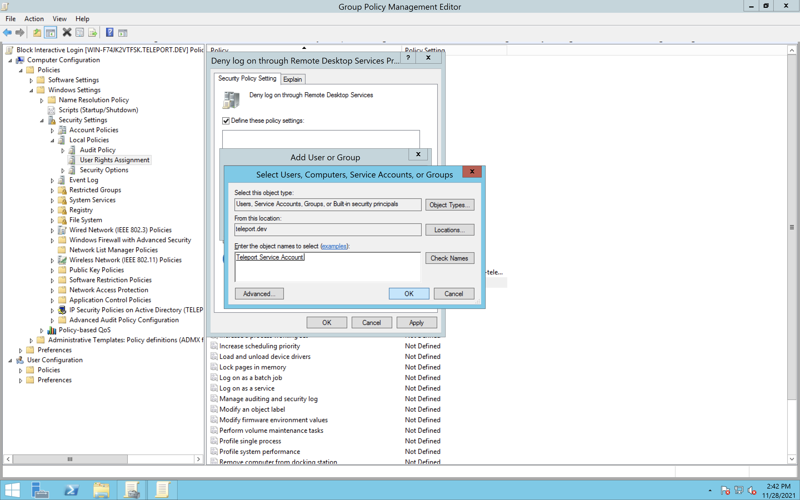
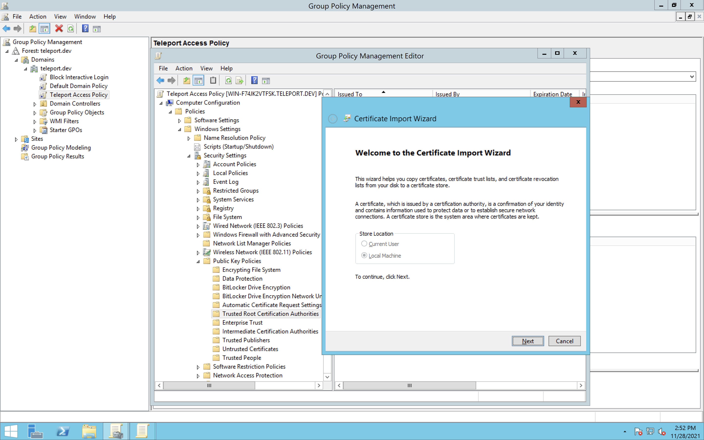
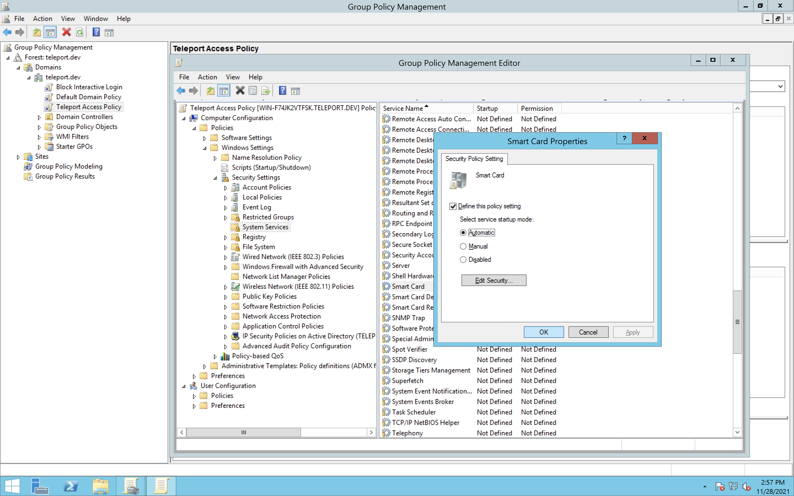
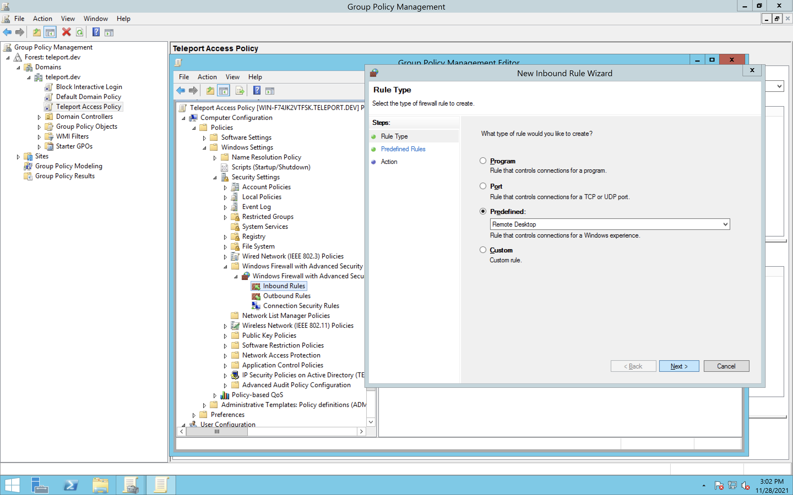
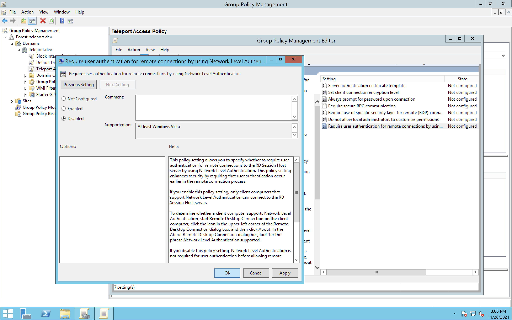
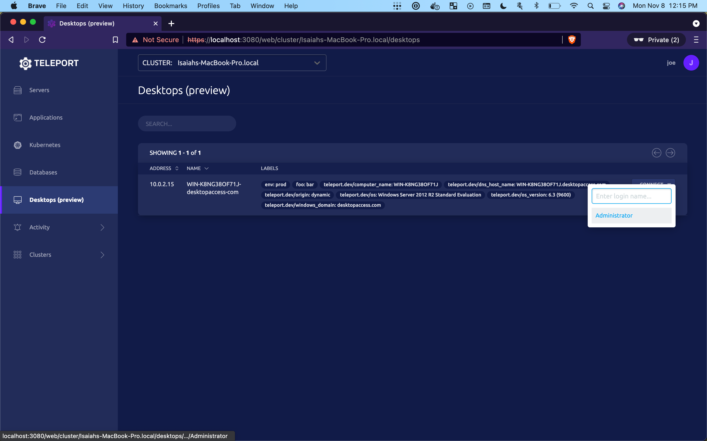

<Admonition type="warning" title="Warning">
  Desktop Access is currently in Preview. Do not use this feature for any
  critical infrastructure and keep a backup option for accessing your desktop
  hosts.
</Admonition>

# Getting Started

In this guide we will connect an Active Directory domain to Teleport using
Desktop Access and log into a Windows desktop from that domain.

## Prerequisites

This guide requires you to have:

- An Active Directory domain, configured for LDAPS (Teleport requires an encrypted LDAP connection)
- Access to a Domain Controller
- An existing Teleport cluster and user, version 8.0 or newer
  - See [Teleport Getting Started](../getting-started.mdx) if you're new to Teleport
- A Linux server to run the Teleport Desktop Access service on
  - You can reuse an existing server running any other Teleport instance

## Step 1/6. Create a restrictive service account

Teleport requires a service account to connect to your Active Directory domain. We recommend creating a dedicated service account with restrictive permissions
for maximal security.

To create the service account, open a PowerShell prompt and copy-paste in the commands below. Note that a password for this service account
will be randomly generated for you, and saved as plaintext in a file (`$OutputFile`) so that you can provide it to the Teleport configuration yaml later.

<Admonition type="warning" title="Warning">
  `$OutputFile` will contain the plaintext password of the service account you
  are about to create. It is best practice to delete this file after you have
  transfered it to your Teleport host machine and confirmed that LDAP
  authentication is working (Steps 5 and 6).
</Admonition>

```powershell
$Name="Teleport Service Account"
$SamAccountName="svc-teleport"
$OutputFile="teleport-svc-pass.txt"

# Generate a random password that meets the "Password must meet complexity requirements" security policy setting.
Add-Type -AssemblyName 'System.Web'
do {
   $Password=[System.Web.Security.Membership]::GeneratePassword(15,1)
} until ($Password -match '\d')
$SecureStringPassword=ConvertTo-SecureString $Password -AsPlainText -Force

# Save the plaintext password to a file for later use in your teleport.yaml.
$Password | Out-File $OutputFile

New-ADUser `
  -Name $Name `
  -SamAccountName $SamAccountName `
  -AccountPassword $SecureStringPassword `
  -Enabled $true
```

Next, in the same PowerShell prompt, enter the following commands to limit your service account's permissions.

```powershell
# Save your domain's distinguished name to a variable.
$DomainDN=$((Get-ADDomain).DistinguishedName)

# Create the CDP/Teleport container.
# If the command fails with "New-ADObject : An attempt was made to add an object to the directory with a name that is already in use",
# it means the object already exists and you can move on to the next step.
New-ADObject -Name "Teleport" -Type "container" -Path "CN=CDP,CN=Public Key Services,CN=Services,CN=Configuration,$DomainDN"

# Gives Teleport the ability to create LDAP containers in the CDP container.
dsacls "CN=CDP,CN=Public Key Services,CN=Services,CN=Configuration,$DomainDN" /I:T /G "$($SamAccountName):CC;container;"
# Gives Teleport the ability to create and delete cRLDistributionPoint objects in the CDP/Teleport container.
dsacls "CN=Teleport,CN=CDP,CN=Public Key Services,CN=Services,CN=Configuration,$DomainDN" /I:T /G "$($SamAccountName):CCDC;cRLDistributionPoint;"
# Gives Teleport the ability to write the certificateRevocationList property in the CDP/Teleport container.
dsacls "CN=Teleport,CN=CDP,CN=Public Key Services,CN=Services,CN=Configuration,$DomainDN " /I:T /G "$($SamAccountName):WP;certificateRevocationList;"
# Gives Teleport the ability to create and delete certificationAuthority objects in the NTAuthCertificates container.
dsacls "CN=NTAuthCertificates,CN=Public Key Services,CN=Services,CN=Configuration,$DomainDN" /I:T /G "$($SamAccountName):CCDC;certificationAuthority;"
# Gives Teleport the ability to write the cACertificate property in the NTAuthCertificates container.
dsacls "CN=NTAuthCertificates,CN=Public Key Services,CN=Services,CN=Configuration,$DomainDN" /I:T /G "$($SamAccountName):WP;cACertificate;"

```

## Step 2/6. Prevent the service account from performing interactive logins

<Admonition type="note" title="gpupdate.exe">
  Throughout this step and the next one, you will be modifying GPOs, and
  sometimes GPO modifications can take some time to propagate to all hosts. You
  can force your changes to take effect immediately on your current host at any
  time by opening a PowerShell prompt and running `gpupdate.exe /force` (though
  their effects may still take time to propagate to other machines on the
  domain).
</Admonition>

The Teleport service account is only needed to authenticate over LDAP, meaning that it needn't be able to login to Windows machines like an ordinary user.
Restrict it from doing so by creating a new Group Policy Object (GPO) linked to your entire domain, and then deny it interactive login.

### Create a GPO

1. Open a PowerShell prompt and change the `$GPOName` variable below to your desired GPO name, or leave the recommended name:

```powershell
$GPOName="Block teleport-svc Interactive Login"
```

2. Create the new GPO by running (from the same prompt):

```powershell
New-GPO -Name $GPOName | New-GPLink -Target $((Get-ADDomain).DistinguishedName)
```

### Deny interactive login

1. From the `Group Policy Management` window, right-click on the GPO you just created (`Block teleport-svc Interactive Login`) and select `Edit...` from the context menu.
2. Select:

```text
Computer Configuration > Policies > Windows Settings > Security Settings > Local Policies > User Rights Assignment
```

3. Double click `Deny log on locally` and in the popup, check `Define these policy settings`.
4. Then click `Add User or Group...`, `Browse ...`, enter the SAM account name of the user you created above (`svc-teleport`) and hit `Check Names` select your Group, and then hit `OK` on all the windows.
5. Repeat steps 3 and 4 for `Deny log on through Remote Desktop Services` (in lieu of `Deny log on locally`).

<Figure align="left" bordered caption="Deny Interactive Login">
  
</Figure>

## Step 3/6: Configure a GPO to allow Teleport connections

Next, we need to configure a GPO to allow Teleport desktop sessions. This includes telling your computers to trust Teleport's CA, allowing the certificate-based smart card authentication, and ensuring RDP is enabled.

### Export the Teleport CA

<Admonition type="note" title="Requires Existing Cluster">
  The following step requires an existing cluster. If you don't already have a
  Teleport cluster up and running, see our general [Getting
  Started](../getting-started.mdx) guide.
</Admonition>

1. Get the Teleport user CA certificate by running:

```
$ tctl auth export --type=windows > user-ca.cer
```

2. Transfer the `user-ca.cer` file to a Windows machine where you can manage your group policy.

### Create another GPO and import the Teleport CA

<Admonition type="note" title="Domain Wide Policy">
  For the purposes of this guide, we apply the GPO we are about to create to our
  entire AD domain. In the case where you wish for only a subset of computers
  within your AD domain to be accessible via Teleport, you should apply the GPO
  to an OU that includes only such computers.
</Admonition>

1. Create a new GPO like you did in Step 2 above, this time giving it a name like `Teleport Access Policy`.
2. Again open the `Group Policy Management` program, and on the left pane, navigate to `$FOREST > Domains > $DOMAIN > Group Policy Objects`.
3. Right click on the GPO you just made (`Teleport Access Policy`), and select `Edit...`.
4. In the group policy editor, select:

```text
Computer Configuration > Policies > Windows Settings > Security Settings > Public Key Policies
```

5. Right click on `Trusted Root Certification Authorities` and select `Import`.
6. Click through the wizard, selecting your CA file.

<Figure align="left" bordered caption="Import Teleport CA">
  
</Figure>

### Enable the Smart Card service

Teleport performs certificate based authentication by emulating a smart card.

1. Still editing your `Teleport Access Policy`, select:

```text
Computer Configuration > Policies > Windows Settings > Security Settings > System Services
```

2. Double click on `Smart Card`, select `Define this policy setting` and switch to `Automatic` then click `OK`.

<Figure align="left" bordered caption="Enable the Smart Card Service">
  
</Figure>

### Open firewall to inbound RDP connections

<Admonition type="warning" title="Warning">
  During testing on a Windows Server 2012 R2 server, we found that the following
  firewall rule would sometimes mysteriously dissapear. If connections through
  Teleport later appear to be hanging for a few seconds and then failing, double
  check that this rule is still in effect.
</Admonition>

1. Select:

```text
Computer Configuration > Policies > Windows Settings > Security Settings > Windows Firewall with Advanced Security (x2)
```

2. Right click on `Inbound Rules` and select `New Rule...`.
3. Under `Predefined` select `Remote Desktop`.
4. Only select the rule for `User Mode (TCP-in)`.
5. On the next screen, select `Allow the connection` and finish.

<Figure align="left" bordered caption="Open the Firewall">
  
</Figure>

### Allow remote RDP connections

1. Next, select:

```text
Computer Configuration > Policies > Administrative Templates > Windows Components > Remote Desktop Services > Remote Desktop Session Host > Connections
```

2. Right click on `Allow users to connect remotely by using Remote Desktop Services` and select `Edit`. Select `Enabled` and `OK`.
3. Select:

```text
Computer Configuration > Policies > Administrative Templates > Windows Components > Remote Desktop Services > Remote Desktop Session Host > Security
```

4. Right click `Require user authentication for remote connections by using Network Level Authentication`, edit, select **`Disable`** and `OK`.

<Figure align="left" bordered caption="Disable Require user authentication...">
  
</Figure>

### Ensure your GPO is updated

If you have not done so already, ensure your GPO is updated by opening a PowerShell prompt and running:

```powershell
gpupdate.exe /force
```

## Step 4/6. Export your LDAP CA certificate

Teleport connects to your Domain Controller via LDAPS. This means that you must let Teleport know that the certificate sent
by your Domain Controller during the initial SSL connection is trusted. If your Domain Controller's certificate is trusted by
the system repository on the system running Teleport, you can skip this step. If you are unable to acquire the LDAP CA certificate,
you can skip TLS verification by setting `insecure_skip_verify: true`. We do not recommend skipping TLS verification in production environments.

### To export a CA certificate

{/* Adapted from https://www.ibm.com/docs/it/rds/5.2.1?topic=security-exporting-certificate-from-active-directory-server */}

1. Begin by navigating to `Start > Control Panel > Administrative Tools > Certificate Authority` to open the CA Microsoft Management Console (MMC) GUI.
2. Right click on your CA computer and select `Properties`.
3. From `General` tab, click `View Certificate`.
4. Select the `Details` view and click `Copy to File`.
5. Click `Next` in the Certificate Export Wizard, and ensure that `DER encoded binary X.509 (.CER)` is selected
6. Select a name and location for you certificate and click through the wizard.

Now transfer the exported file to the system where you're running Teleport. You can either add this certificate to your system's
trusted repository or provide the filepath to the `der_ca_file` configuration variable.

## Step 5/6. Configure Teleport

<Admonition type="note" title="Teleport CA">
  Prior to v8.0, the Teleport CA was not compatible with Windows logins. If
  you're setting up Desktop Access in an existing cluster created before v8.0,
  you must first perform a [CA rotation](../setup/operations/ca-rotation.mdx) in
  order to resolve this.
</Admonition>

In order to enable Desktop Access in Teleport, add the
following section in `teleport.yaml` on your Linux server:

```yaml
windows_desktop_service:
  enabled: yes
  # This is the address that windows_desktop_service will listen on.
  listen_addr: "0.0.0.0:3028"
  # (optional) This is the address that windows_desktop_service will advertise
  # to the rest of Teleport for incoming connections. Only proxy_service should
  # connect to windows_desktop_service, users connect to the proxy's web UI
  # instead.
  public_addr: "desktop-access.example.com:3028"
  ldap:
    # Address of the LDAP server for secure LDAP connections.
    # Usually, this address will use port 636, like: ldap.example.com:636.
    # For best results, this address should point to a highly-available
    # endpoint (a load balancer, VIP, or round-robin DNS) rather than
    # a single domain controller.
    addr: "$LDAP_SERVER_ADDRESS"
    # Active Directory domain name you are connecting to, like: domain-controller.example.com.
    domain: "$LDAP_DOMAIN_NAME"
    # LDAP username for authentication. This will be the user logon name you chose for the service
    # account User in Step 1 (svc-teleport). This username must include the domain NetBIOS name.
    #
    # For example, if your domain is "example.com", the NetBIOS name for it is
    # likely "EXAMPLE". When connecting as the "svc-teleport" user, you should
    # use the format: 'EXAMPLE\svc-teleport'.
    # Note the use of single quotes due to the \ character
    #
    # If you are unsure of your NetBIOS name, you can find it by opening a PowerShell command prompt
    # and running:
    #
    # (Get-ADDomain).NetBIOSName
    #
    username: "$LDAP_USERNAME"
    # Plain text file containing the LDAP password for authentication. This is the password that was
    # randomly generated and saved to $OutputFile in Step 1, which you will need to transfer
    # to this machine.
    #
    # Note that if you transfer the file itself, it will likely be UTF-16LE encoded, and you will need to
    # convert it to UTF-8 Unix format by using a tool such as dos2unix
    # (simply `dos2unix $OutputFile` with no option flags will do the trick).
    # Alternately, you can just create a new file on this machine and copy the characters manually.
    #
    # Remember that it is good practice to delete this file from the Windows host it was created on once
    # it's been successfully saved on this machine and you have verified that LDAP authentication is working properly
    # (after you've successfully connected to a windows desktop in Step 6 below).
    password_file: /var/lib/teleport-svc-pass.txt
    # You can skip LDAPS certificate verification by setting
    # this to true. It is recommended that this be set to false
    # and the certificate added your system's trusted repository,
    # or its filepath provided in with the der_ca_file variable below.
    insecure_skip_verify: false
    # DER encoded certificate.
    # This should be the path to the certificate exported in Step 4.
    der_ca_file: /path/to/cert
  discovery:
    # This setting will tell Teleport to discover all the hosts connected to the LDAP domain
    # controller configured above.
    base_dn: "*"
  hosts:
    # DNS entries for any static hosts you want to connect to.
    # These are only needed to connect to desktops that aren't covered by the discovery setting.
    - "100.104.52.89"
    - "another-example.com"
```

After updating `teleport.yaml`, start Teleport as usual using `teleport start`.

## Step 6/6. Log in using Teleport

### Create a Teleport user/role for Windows Desktop Access

In order to gain access to a remote desktop, a Teleport user needs to have the appropriate permissions for that desktop.
For example, you can create a role that gives its users access to all Windows desktop labels and the `"Administrator"` user:

```yaml
kind: role
version: v4
metadata:
  name: windows-desktop-admins
spec:
  allow:
    windows_desktop_labels:
      "*": "*"
    windows_desktop_logins: ["Administrator"]
```

See the [RBAC section](./reference.mdx#rbac) in the Reference documentation
for more information about setting up Windows Desktop Access permissions.

See the [Access Controls Getting Started](../access-controls/getting-started.mdx#step-13-add-local-users-with-preset-roles)
guide for instructions on how to create or update a user with a given role.

### Connect to your Windows desktop

At this point everything is ready for Desktop Access connections. Open
the Teleport web UI and log in with a user with the role created above.

On the left pane, select `Desktops (preview)`. You should see the list of all computers
and Domain Controllers connected to your domain. Select one and click `CONNECT`
on the right, selecting one of the available logins:

<Figure align="left" bordered caption="Select Desktop">
  
</Figure>

A new tab will open and, after a few seconds, you should be logged in to your
target Windows host.

<Admonition type="warning" title="Warning">
  Remember to delete `$OutputFile` from Step 1 on your Windows host after you've
  successfully completed this step.
</Admonition>

## Troubleshooting

If you hit any issues, check out the [Troubleshooting documentation](./troubleshooting.mdx)
for common problems and solutions.
