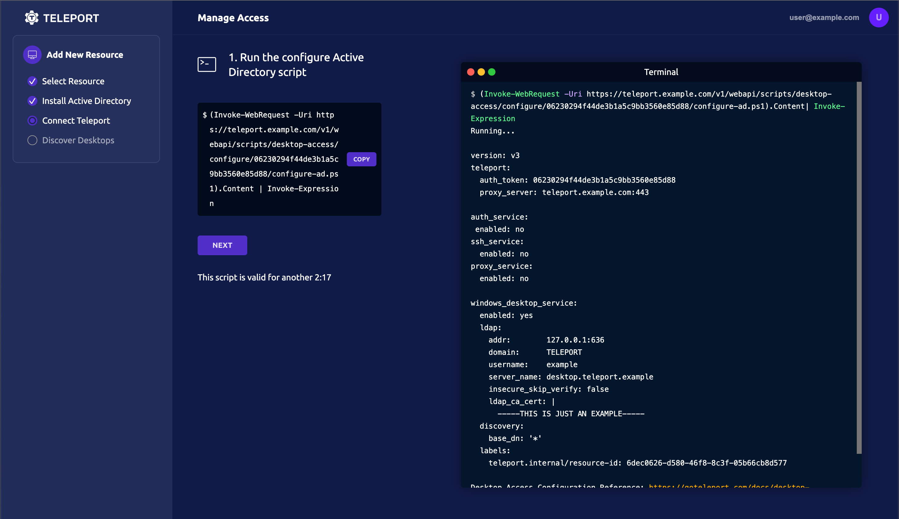
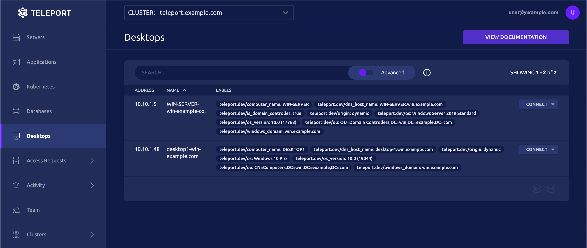

<Details
  title="Version warning"
  opened={true}
  scope={["oss", "enterprise"]}
  scopeOnly={true}
  min="10.2.6"
>

The features documented on this page are available in Teleport `10.2.6` and higher.

</Details>

This guide will help you configure Teleport and Active Directory in order to
provide secure, passwordless access to Windows desktops.

<Details title="Compare Desktop Access to other RDP clients">

The Teleport Desktop Service is designed to be a secure access solution for
Windows environments. Teleport implements a minimal feature set of the RDP
protocol with security as a priority, and may not be as performant as standard
RDP clients. Consider the Desktop Service to manage access to your most sensitive
Windows environments, not as a drop-in replacement for other tools to provide
general access to Windows desktops.

</Details>

## Prerequisites

<ScopedBlock scope={["oss", "enterprise"]}>
- One or more hosts to run the Teleport Auth and Proxy services on.
</ScopedBlock>
- A server or virtual machine running a Windows Server operating system.
  In this guide, we'll install Active Directory on this server in order
  to support passwordless logins with Teleport to the Windows desktops
  in the Active Directory domain.
- A Linux host where you will run the Teleport Desktop Service.
  <ScopedBlock scope={["oss", "enterprise"]}> This guide assumes that you will
  run Teleport's Windows Desktop Service on a dedicated host. To install Desktop
  Access into an existing Teleport instance running other services, see the
  [Manual Setup](manual-setup.mdx) guide for Desktop Access.</ScopedBlock>
- An Active Directory domain, configured for LDAPS (Teleport requires an
  encrypted LDAP connection). Typically this means installing
  [AD CS](https://learn.microsoft.com/en-us/windows-server/identity/ad-cs/)

## Step 1/2. Run the discovery wizard

In your web browser, access the teleport Web UI at <ScopedBlock scope={["oss", "enterprise"]}>
`teleport.example.com`</ScopedBlock><ScopedBlock scope={["cloud"]}>
`mytennant.teleport.sh`</ScopedBlock>. Click on your user name at the top right
and select **Manage Access**, Select "Desktop" from the main menu, then **NEXT**:

If you already have Active Directory installed, skip to the next step. Otherwise,
copy and paste the first command provided into a Windows PowerShell window. If
you aren't already running AD Certificate services, copy and paste the second
command after the first one completes and the server restarts:


Once the server is restarted from one or both command executions, click **NEXT**.

Copy and paste the provided command into a Windows PowerShell window to download
and run the 'configure Active Directory' script:



Click **NEXT**.

The PowerShell script will output a Teleport configuration block. Copy this
block to a temporary location. Click **Next**.

On the Linux host where you installed Teleport to run the Desktop Service, edit
`/etc/teleport.yaml` and paste the configuration provided by the output of the
previous step. Review and edit the addition as necessarily for your environment:

```yaml
version: v3
teleport:
  auth_token: 2239...c5b21
  proxy_server: teleport.example.com:443

auth_service:
  enabled: no
ssh_service:
  enabled: no
proxy_service:
  enabled: no

windows_desktop_service:
  enabled: yes
  ldap:
    addr:     '10.10.1.50:636'
    domain:   'windows.teleport.example.com'
    username: 'WIN\svc-teleport'
    server_name: 'windows-server-hostname'
    insecure_skip_verify: false
    ldap_ca_cert: |
        -----BEGIN CERTIFICATE-----
        MIIDnzCCAoegAwIBAgIQT/UIn+MT4aZC9ix/QuiV9zANBgkqhkiG9w0BAQsFADBi
        ...
        31qA4dO3if7RdikD9hVbiIF9jQ==
        -----END CERTIFICATE-----

  discovery:
    base_dn: '*'
  labels:
    teleport.internal/resource-id: 42d8859c-60d0-4d7f-9767-bdd66b63fce6
```

Click **Next**.

## Step 2/2. Start Teleport

Once you've saved `/etc/teleport.yaml`, start Teleport:

<Tabs>
<TabItem label="System Service">

Copy the join token to a file on the instance where you will run the Windows Desktop
Service, and then use the following configuration:

```yaml
version: v3
teleport:
  auth_token: /path/to/token
  proxy_server: teleport.example.com:443 # replace with your proxy address
windows_desktop_service:
  enabled: yes
  ldap:
    # Port must be included for the addr.
    # LDAPS port is 636 by default,
    # e.g. example.com:636
    addr: "$LDAP_SERVER_ADDRESS"
    domain: "$LDAP_DOMAIN_NAME"
    username: '$LDAP_USERNAME'
    # This should be the path to the certificate exported in Step 4.
    der_ca_file: /path/to/cert
  discovery:
    base_dn: "*"
auth_service:
  enabled: no
proxy_service:
  enabled: no
ssh_service:
  enabled: no    
```

(!docs/pages/includes/start-teleport.mdx service="the Teleport Desktop Service"!)

</TabItem>
<TabItem label="Standalone Binary">

From the directory containing the Teleport binary:

```code
$ ./teleport start --config=/etc/teleport.yaml
```

Copy the join token to a file on the instance where you will run Windows Desktop
Service, and then use the following configuration:

```yaml
version: v3
teleport:
  auth_token: /path/to/token
  proxy_server: mytenant.teleport.sh:443 # replace with your cloud tenant
windows_desktop_service:
  enabled: yes
  ldap:
    # Port must be included for the addr.
    # LDAPS port is 636 by default,
    # e.g. example.com:636
    addr: "$LDAP_SERVER_ADDRESS"
    domain: "$LDAP_DOMAIN_NAME"
    username: '$LDAP_USERNAME'
    # This should be the path to the certificate exported in Step 5.
    der_ca_file: /path/to/cert
  discovery:
    base_dn: "*"
auth_service:
  enabled: no
proxy_service:
  enabled: no
ssh_service:
  enabled: no    
```
</TabItem>
</Tabs>

The access wizard will detect when the new Teleport instance has joined the
cluster, and you can then click **Next**.

Teleport will discover available Windows desktops in the domain, and list them
under **Desktops**. Click **Finish** then **BROWSE EXISTING RESOURCES** to see them:



## Troubleshooting

If you hit any issues, check out the
[Troubleshooting documentation](./troubleshooting.mdx) for common problems and
solutions.

